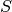
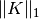

# 2.9\. 稀疏逆协方差

协方差矩阵的逆矩阵，通常称为精度矩阵（precision matrix），它与部分相关矩阵（partial correlation matrix）成正比。 它给出部分独立性关系。换句话说，如果两个特征在其他特征上有条件地独立， 则精度矩阵中的对应系数将为零。这就是为什么估计一个稀疏精度矩阵是有道理的： 通过从数据中学习独立关系，协方差矩阵的估计能更好处理。这被称为协方差选择。

在小样本的情况，即 `n_samples` 是数量级 `n_features` 或更小， 稀疏的逆协方差估计往往比收敛的协方差估计更好。 然而，在相反的情况下，或者对于非常相关的数据，它们可能在数值上不稳定。 此外，与收敛估算不同，稀疏估计器能够恢复非对角线结构 （off-diagonal structure）。

[`GraphLasso`](generated/sklearn.covariance.GraphLasso.html#sklearn.covariance.GraphLasso "sklearn.covariance.GraphLasso") 估计器使用 L1 惩罚执行关于精度矩阵的稀疏性： `alpha` 参数越高，精度矩阵的稀疏性越大。 相应的 [`GraphLassoCV`](generated/sklearn.covariance.GraphLassoCV.html#sklearn.covariance.GraphLassoCV "sklearn.covariance.GraphLassoCV") 对象使用交叉验证来自动设置 `alpha` 参数。

Note

**结构恢复**

从数据中的相关性恢复图形结构是一个具有挑战性的事情。如果您对这种恢复感兴趣，请记住：

*   相关矩阵的恢复比协方差矩阵更容易：在运行 [`GraphLasso`](generated/sklearn.covariance.GraphLasso.html#sklearn.covariance.GraphLasso "sklearn.covariance.GraphLasso") 前先标准化观察值
*   如果底层图具有比平均节点更多的连接节点，则算法将错过其中一些连接。
*   如果您的观察次数与底层图形中的边数相比不大，则不会恢复。
*   即使您具有良好的恢复条件，通过交叉验证（例如使用GraphLassoCV对象）选择的 Alpha 参数将导致选择太多边。 然而，相关边缘将具有比不相关边缘更重的权重。

数学公式如下：

其中： 是要估计的精度矩阵（precision matrix），  是样本的协方差矩阵。  是非对角系数  （off-diagonal coefficients）的绝对值之和。 用于解决这个问题的算法是来自 Friedman 2008 Biostatistics 论文的 GLasso 算法。 它与 R 语言 `glasso` 包中的算法相同。

例子:

*   [Sparse inverse covariance estimation](../auto_examples/covariance/plot_sparse_cov.html#sphx-glr-auto-examples-covariance-plot-sparse-cov-py):

合成数据示例，显示结构的一些恢复，并与其他协方差估计器进行比较。

*   [Visualizing the stock market structure](../auto_examples/applications/plot_stock_market.html#sphx-glr-auto-examples-applications-plot-stock-market-py): 真实股票市场数据示例，查找哪些信号最相关。

参考文献:

*   Friedman et al, [“Sparse inverse covariance estimation with the graphical lasso”](http://biostatistics.oxfordjournals.org/content/9/3/432.short), Biostatistics 9, pp 432, 2008