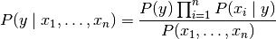
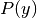
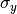
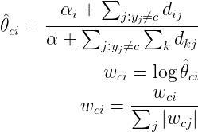
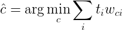

# 1.9. 朴素贝叶斯

校验者:
        [@Kyrie](https://github.com/apachecn/scikit-learn-doc-zh)
        [@Loopy](https://github.com/loopyme)
        [@qinhanmin2014](https://github.com/qinhanmin2014)
翻译者:
        [@TWITCH](https://github.com/apachecn/scikit-learn-doc-zh)

朴素贝叶斯方法是基于贝叶斯定理的一组有监督学习算法，即“简单”地假设每对特征之间相互独立。 给定一个类别  和一个从  到  的相关的特征向量， 贝叶斯定理阐述了以下关系:


使用简单(naive)的假设-每对特征之间都相互独立:


对于所有的 :*i* 都成立，这个关系式可以简化为





由于在给定的输入中  是一个常量，我们使用下面的分类规则:


我们可以使用最大后验概率(Maximum A Posteriori, MAP) 来估计  和  ; 前者是训练集中类别  的相对频率。

各种各样的的朴素贝叶斯分类器的差异大部分来自于处理  分布时的所做的假设不同。

尽管其假设过于简单，在很多实际情况下，朴素贝叶斯工作得很好，特别是文档分类和垃圾邮件过滤。这些工作都要求 一个小的训练集来估计必需参数。(至于为什么朴素贝叶斯表现得好的理论原因和它适用于哪些类型的数据，请参见下面的参考。)

相比于其他更复杂的方法，朴素贝叶斯学习器和分类器非常快。 分类条件分布的解耦意味着可以独立单独地把每个特征视为一维分布来估计。这样反过来有助于缓解维度灾难带来的问题。

另一方面，尽管朴素贝叶斯被认为是一种相当不错的分类器，但却不是好的估计器(estimator)，所以不能太过于重视从 `predict_proba` 输出的概率。

> **参考资料**:
>*   H. Zhang (2004). [The optimality of Naive Bayes.](http://www.cs.unb.ca/~hzhang/publications/FLAIRS04ZhangH.pdf) Proc. FLAIRS.

## 1.9.1. 高斯朴素贝叶斯

[`GaussianNB`](https://scikit-learn.org/stable/modules/generated/sklearn.naive_bayes.GaussianNB.html#sklearn.naive_bayes.GaussianNB "sklearn.naive_bayes.GaussianNB") 实现了运用于分类的高斯朴素贝叶斯算法。特征的可能性(即概率)假设为高斯分布:


参数  和  使用最大似然法估计。

```py
>>> from sklearn import datasets
>>> iris = datasets.load_iris()
>>> from sklearn.naive_bayes import GaussianNB
>>> gnb = GaussianNB()
>>> y_pred = gnb.fit(iris.data, iris.target).predict(iris.data)
>>> print("Number of mislabeled points out of a total %d points : %d"
...       % (iris.data.shape[0],(iris.target != y_pred).sum()))
Number of mislabeled points out of a total 150 points : 6

```

## 1.9.2. 多项分布朴素贝叶斯

[`MultinomialNB`](https://scikit-learn.org/stable/modules/generated/sklearn.naive_bayes.MultinomialNB.html#sklearn.naive_bayes.MultinomialNB "sklearn.naive_bayes.MultinomialNB") 实现了服从多项分布数据的朴素贝叶斯算法，也是用于文本分类(这个领域中数据往往以词向量表示，尽管在实践中 tf-idf 向量在预测时表现良好)的两大经典朴素贝叶斯算法之一。 分布参数由每类  的  向量决定， 式中  是特征的数量(对于文本分类，是词汇量的大小)  是样本中属于类  中特征  概率  。

参数  使用平滑过的最大似然估计法来估计，即相对频率计数:


式中是 训练集T中特征i在类中出现的次数， 是类  中出现所有特征的计数总和。

先验平滑因子  为在学习样本中没有出现的特征而设计，以防在将来的计算中出现0概率输出。 把  被称为拉普拉斯平滑(Lapalce smoothing)，而  被称为Lidstone平滑方法(Lidstone smoothing)。

## 1.9.3. 补充朴素贝叶斯

[`ComplementNB`](https://scikit-learn.org/stable/modules/generated/sklearn.naive_bayes.ComplementNB.html#sklearn.naive_bayes.ComplementNB)实现了补充朴素贝叶斯(CNB)算法。CNB是标准多项式朴素贝叶斯(MNB)算法的一种改进，特别适用于不平衡数据集。具体来说，CNB使用来自每个类的补数的统计数据来计算模型的权重。CNB的发明者的研究表明，CNB的参数估计比MNB的参数估计更稳定。此外，CNB在文本分类任务上通常比MNB表现得更好(通常有相当大的优势)。计算权重的步骤如下:



其中对不在类c中的所有记录j求和，d<sub>ij</sub>可以是文档ｊ中词语i的计数或tf-idf值，α<sub>i</sub>是就像MNB中一样的平滑超参数，同时。第二个归一化解决了长记录主导MNB参数估计的问题。分类规则为:



即将记录分配给补充匹配度最低的类。

## 1.9.4. 伯努利朴素贝叶斯

[`BernoulliNB`](https://scikit-learn.org/stable/modules/generated/sklearn.naive_bayes.BernoulliNB.html#sklearn.naive_bayes.BernoulliNB "sklearn.naive_bayes.BernoulliNB") 实现了用于多重伯努利分布数据的朴素贝叶斯训练和分类算法，即有多个特征，但每个特征 都假设是一个二元 (Bernoulli, boolean) 变量。 因此，这类算法要求样本以二元值特征向量表示；如果样本含有其他类型的数据， 一个 `BernoulliNB` 实例会将其二值化(取决于 `binarize` 参数)。

伯努利朴素贝叶斯的决策规则基于:


与多项分布朴素贝叶斯的规则不同 伯努利朴素贝叶斯明确地惩罚类  中没有出现作为预测因子的特征  ，而多项分布分布朴素贝叶斯只是简单地忽略没出现的特征。

在文本分类的例子中，统计词语是否出现的向量(word occurrence vectors)(而非统计词语出现次数的向量(word count vectors))可以用于训练和使用这个分类器。 `BernoulliNB` 可能在一些数据集上表现得更好，特别是那些更短的文档。 如果时间允许，建议对两个模型都进行评估。

> **参考资料**:
>*   C.D. Manning, P. Raghavan and H. Schütze (2008). Introduction to Information Retrieval. Cambridge University Press, pp. 234-265.
>*   A. McCallum and K. Nigam (1998). [A comparison of event models for Naive Bayes text classification.](http://citeseerx.ist.psu.edu/viewdoc/summary?doi=10.1.1.46.1529) Proc. AAAI/ICML-98 Workshop on Learning for Text Categorization, pp. 41-48.
>*   V. Metsis, I. Androutsopoulos and G. Paliouras (2006). [Spam filtering with Naive Bayes – Which Naive Bayes?](http://citeseerx.ist.psu.edu/viewdoc/summary?doi=10.1.1.61.5542) 3rd Conf. on Email and Anti-Spam (CEAS).

## 1.9.5. 基于外存的朴素贝叶斯模型拟合

朴素贝叶斯模型可以解决整个训练集不能导入内存的大规模分类问题。 为了解决这个问题， [`MultinomialNB`](https://scikit-learn.org/stable/modules/generated/sklearn.naive_bayes.MultinomialNB.html#sklearn.naive_bayes.MultinomialNB "sklearn.naive_bayes.MultinomialNB"), [`BernoulliNB`](https://scikit-learn.org/stable/modules/generated/sklearn.naive_bayes.BernoulliNB.html#sklearn.naive_bayes.BernoulliNB "sklearn.naive_bayes.BernoulliNB"), 和 [`GaussianNB`](https://scikit-learn.org/stable/modules/generated/sklearn.naive_bayes.GaussianNB.html#sklearn.naive_bayes.GaussianNB "sklearn.naive_bayes.GaussianNB") 实现了 `partial_fit` 方法，可以动态的增加数据，使用方法与其他分类器的一样，使用示例见 [Out-of-core classification of text documents](https://scikit-learn.org/stable/auto_examples/applications/plot_out_of_core_classification.html#sphx-glr-auto-examples-applications-plot-out-of-core-classification-py) 。所有的朴素贝叶斯分类器都支持样本权重。

与 `fit` 方法不同，首次调用 `partial_fit` 方法需要传递一个所有期望的类标签的列表。

对于 scikit-learn 中可用方案的概览，另见 [out-of-core learning](66#71-使用外核学习实例进行拓展) 文档。

> 注意：所有朴素贝叶斯模型调用 `partial_fit` 都会引入一些计算开销。推荐让数据块越大越好，其大小与 RAM 中可用内存大小相同。
