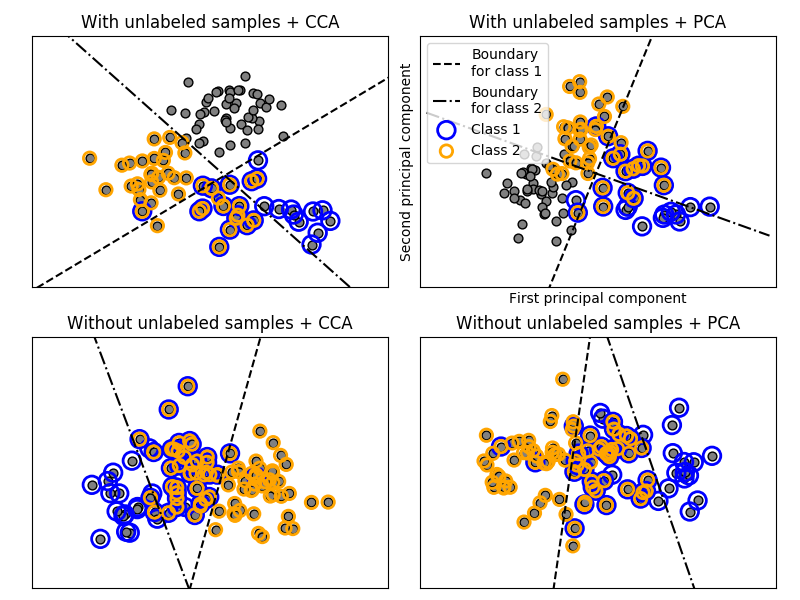

# 1.12. 多类和多标签算法

校验者:
        [@溪流-十四号](https://github.com/apachecn/scikit-learn-doc-zh)
        [@大魔王飞仙](https://github.com/apachecn/scikit-learn-doc-zh)
        [@Loopy](https://github.com/loopyme)
翻译者:
        [@v](https://github.com/apachecn/scikit-learn-doc-zh)

> **警告** scikit-learn中的所有分类器都可以开箱即用进行多类分类。除非您想尝试不同的多类策略，否则无需使用[`sklearn.multiclass`](classes.html#module-sklearn.multiclass "sklearn.multiclass")模块。

[`sklearn.multiclass`](classes.html#module-sklearn.multiclass "sklearn.multiclass") 模块采用了 _元评估器_ ，通过把``多类`` 和 `多标签` 分类问题分解为 二元分类问题去解决。这同样适用于多目标回归问题。

*   **Multiclass classification** **多类分类** 意味着一个分类任务需要对多于两个类的数据进行分类。比如，对一系列的橘子，苹果或者梨的图片进行分类。多类分类假设每一个样本有且仅有一个标签：一个水果可以被归类为苹果，也可以 是梨，但不能同时被归类为两类。

*   **Multilabel classification** **多标签分类** 给每一个样本分配一系列标签。这可以被认为是预测不相互排斥的数据点的属性，例如与文档类型相关的主题。一个文本可以归类为任意类别，例如可以同时为政治、金融、 教育相关或者不属于以上任何类别。

*   **Multioutput regression** **多输出分类** 为每个样本分配一组目标值。这可以认为是预测每一个样本的多个属性，比如说一个具体地点的风的方向和大小。

*   **Multioutput-multiclass classification** and **multi-task classification** **多输出-多类分类和多任务分类** 意味着单个的评估器要解决多个联合的分类任务。这是只考虑二分类的 multi-label classification 和 multi-class classification 任务的推广。 *此类问题输出的格式是一个二维数组或者一个稀疏矩阵*

每个输出变量的标签集合可以是各不相同的。比如说，一个样本可以将“梨”作为一个输出变量的值，这个输出变 量在一个含有“梨”、“苹果”等水果种类的有限集合中取可能的值；将“蓝色”或者“绿色”作为第二个输出变量的值， 这个输出变量在一个含有“绿色”、“红色”、“蓝色”等颜色种类的有限集合中取可能的值…

这意味着任何处理 multi-output multiclass or multi-task classification 任务的分类器，在特殊的 情况下支持 multi-label classification 任务。Multi-task classification 与具有不同模型公式 的 multi-output classification 相似。详细情况请查阅相关的分类器的文档。

所有的 scikit-learn 分类器都能处理 multiclass classification 任务， 但是 [`sklearn.multiclass`](classes.html#module-sklearn.multiclass "sklearn.multiclass") 提供的元评估器允许改变在处理超过两类数据时的方式，因为这会对分类器的性能产生影响 （无论是在泛化误差或者所需要的计算资源方面）

下面是按照 scikit-learn 策略分组的分类器的总结，如果你使用其中的一个，则不需要此类中的元评估器，除非你想要自定义的多分类方式。

*   **固有的多类分类器:**
    *   [`sklearn.naive_bayes.BernoulliNB`](https://scikit-learn.org/stable/modules/generated/sklearn.naive_bayes.BernoulliNB.html#sklearn.naive_bayes.BernoulliNB "sklearn.naive_bayes.BernoulliNB")
    *   [`sklearn.tree.DecisionTreeClassifier`](https://scikit-learn.org/stable/modules/generated/sklearn.tree.DecisionTreeClassifier.html#sklearn.tree.DecisionTreeClassifier "sklearn.tree.DecisionTreeClassifier")
    *   [`sklearn.tree.ExtraTreeClassifier`](https://scikit-learn.org/stable/modules/generated/sklearn.tree.ExtraTreeClassifier.html#sklearn.tree.ExtraTreeClassifier "sklearn.tree.ExtraTreeClassifier")
    *   [`sklearn.ensemble.ExtraTreesClassifier`](https://scikit-learn.org/stable/modules/generated/sklearn.ensemble.ExtraTreesClassifier.html#sklearn.ensemble.ExtraTreesClassifier "sklearn.ensemble.ExtraTreesClassifier")
    *   [`sklearn.naive_bayes.GaussianNB`](https://scikit-learn.org/stable/modules/generated/sklearn.naive_bayes.GaussianNB.html#sklearn.naive_bayes.GaussianNB "sklearn.naive_bayes.GaussianNB")
    *   [`sklearn.neighbors.KNeighborsClassifier`](https://scikit-learn.org/stable/modules/generated/sklearn.neighbors.KNeighborsClassifier.html#sklearn.neighbors.KNeighborsClassifier "sklearn.neighbors.KNeighborsClassifier")
    *   [`sklearn.semi_supervised.LabelPropagation`](https://scikit-learn.org/stable/modules/generated/sklearn.semi_supervised.LabelPropagation.html#sklearn.semi_supervised.LabelPropagation "sklearn.semi_supervised.LabelPropagation")
    *   [`sklearn.semi_supervised.LabelSpreading`](https://scikit-learn.org/stable/modules/generated/sklearn.semi_supervised.LabelSpreading.html#sklearn.semi_supervised.LabelSpreading "sklearn.semi_supervised.LabelSpreading")
    *   [`sklearn.discriminant_analysis.LinearDiscriminantAnalysis`](https://scikit-learn.org/stable/modules/generated/sklearn.discriminant_analysis.LinearDiscriminantAnalysis.html#sklearn.discriminant_analysis.LinearDiscriminantAnalysis "sklearn.discriminant_analysis.LinearDiscriminantAnalysis")
    *   [`sklearn.svm.LinearSVC`](https://scikit-learn.org/stable/modules/generated/sklearn.svm.LinearSVC.html#sklearn.svm.LinearSVC "sklearn.svm.LinearSVC") (setting multi_class=”crammer_singer”)
    *   [`sklearn.linear_model.LogisticRegression`](https://scikit-learn.org/stable/modules/generated/sklearn.linear_model.LogisticRegression.html#sklearn.linear_model.LogisticRegression "sklearn.linear_model.LogisticRegression") (setting multi_class=”multinomial”)
    *   [`sklearn.linear_model.LogisticRegressionCV`](https://scikit-learn.org/stable/modules/generated/sklearn.linear_model.LogisticRegressionCV.html#sklearn.linear_model.LogisticRegressionCV "sklearn.linear_model.LogisticRegressionCV") (setting multi_class=”multinomial”)
    *   [`sklearn.neural_network.MLPClassifier`](https://scikit-learn.org/stable/modules/generated/sklearn.neural_network.MLPClassifier.html#sklearn.neural_network.MLPClassifier "sklearn.neural_network.MLPClassifier")
    *   [`sklearn.neighbors.NearestCentroid`](https://scikit-learn.org/stable/modules/generated/sklearn.neighbors.NearestCentroid.html#sklearn.neighbors.NearestCentroid "sklearn.neighbors.NearestCentroid")
    *   [`sklearn.discriminant_analysis.QuadraticDiscriminantAnalysis`](https://scikit-learn.org/stable/modules/generated/sklearn.discriminant_analysis.QuadraticDiscriminantAnalysis.html#sklearn.discriminant_analysis.QuadraticDiscriminantAnalysis "sklearn.discriminant_analysis.QuadraticDiscriminantAnalysis")
    *   [`sklearn.neighbors.RadiusNeighborsClassifier`](https://scikit-learn.org/stable/modules/generated/sklearn.neighbors.RadiusNeighborsClassifier.html#sklearn.neighbors.RadiusNeighborsClassifier "sklearn.neighbors.RadiusNeighborsClassifier")
    *   [`sklearn.ensemble.RandomForestClassifier`](https://scikit-learn.org/stable/modules/generated/sklearn.ensemble.RandomForestClassifier.html#sklearn.ensemble.RandomForestClassifier "sklearn.ensemble.RandomForestClassifier")
    *   [`sklearn.linear_model.RidgeClassifier`](https://scikit-learn.org/stable/modules/generated/sklearn.linear_model.RidgeClassifier.html#sklearn.linear_model.RidgeClassifier "sklearn.linear_model.RidgeClassifier")
    *   [`sklearn.linear_model.RidgeClassifierCV`](https://scikit-learn.org/stable/modules/generated/sklearn.linear_model.RidgeClassifierCV.html#sklearn.linear_model.RidgeClassifierCV "sklearn.linear_model.RidgeClassifierCV")
*   **1对1的多类分类器:**
    *   [`sklearn.svm.NuSVC`](https://scikit-learn.org/stable/modules/generated/sklearn.svm.NuSVC.html#sklearn.svm.NuSVC "sklearn.svm.NuSVC")
    *   [`sklearn.svm.SVC`](https://scikit-learn.org/stable/modules/generated/sklearn.svm.SVC.html#sklearn.svm.SVC "sklearn.svm.SVC").
    *   [`sklearn.gaussian_process.GaussianProcessClassifier`](https://scikit-learn.org/stable/modules/generated/sklearn.gaussian_process.GaussianProcessClassifier.html#sklearn.gaussian_process.GaussianProcessClassifier "sklearn.gaussian_process.GaussianProcessClassifier") (setting multi_class = “one_vs_one”)
*   **1对多的多类分类器:**
    *   [`sklearn.ensemble.GradientBoostingClassifier`](https://scikit-learn.org/stable/modules/generated/sklearn.ensemble.GradientBoostingClassifier.html#sklearn.ensemble.GradientBoostingClassifier "sklearn.ensemble.GradientBoostingClassifier")
    *   [`sklearn.gaussian_process.GaussianProcessClassifier`](https://scikit-learn.org/stable/modules/generated/sklearn.gaussian_process.GaussianProcessClassifier.html#sklearn.gaussian_process.GaussianProcessClassifier "sklearn.gaussian_process.GaussianProcessClassifier") (setting multi_class = “one_vs_rest”)
    *   [`sklearn.svm.LinearSVC`](https://scikit-learn.org/stable/modules/generated/sklearn.svm.LinearSVC.html#sklearn.svm.LinearSVC "sklearn.svm.LinearSVC") (setting multi_class=”ovr”)
    *   [`sklearn.linear_model.LogisticRegression`](https://scikit-learn.org/stable/modules/generated/sklearn.linear_model.LogisticRegression.html#sklearn.linear_model.LogisticRegression "sklearn.linear_model.LogisticRegression") (setting multi_class=”ovr”)
    *   [`sklearn.linear_model.LogisticRegressionCV`](https://scikit-learn.org/stable/modules/generated/sklearn.linear_model.LogisticRegressionCV.html#sklearn.linear_model.LogisticRegressionCV "sklearn.linear_model.LogisticRegressionCV") (setting multi_class=”ovr”)
    *   [`sklearn.linear_model.SGDClassifier`](https://scikit-learn.org/stable/modules/generated/sklearn.linear_model.SGDClassifier.html#sklearn.linear_model.SGDClassifier "sklearn.linear_model.SGDClassifier")
    *   [`sklearn.linear_model.Perceptron`](https://scikit-learn.org/stable/modules/generated/sklearn.linear_model.Perceptron.html#sklearn.linear_model.Perceptron "sklearn.linear_model.Perceptron")
    *   [`sklearn.linear_model.PassiveAggressiveClassifier`](https://scikit-learn.org/stable/modules/generated/sklearn.linear_model.PassiveAggressiveClassifier.html#sklearn.linear_model.PassiveAggressiveClassifier "sklearn.linear_model.PassiveAggressiveClassifier")
*   **支持多标签分类的分类器:**
    *   [`sklearn.tree.DecisionTreeClassifier`](https://scikit-learn.org/stable/modules/generated/sklearn.tree.DecisionTreeClassifier.html#sklearn.tree.DecisionTreeClassifier "sklearn.tree.DecisionTreeClassifier")
    *   [`sklearn.tree.ExtraTreeClassifier`](https://scikit-learn.org/stable/modules/generated/sklearn.tree.ExtraTreeClassifier.html#sklearn.tree.ExtraTreeClassifier "sklearn.tree.ExtraTreeClassifier")
    *   [`sklearn.ensemble.ExtraTreesClassifier`](https://scikit-learn.org/stable/modules/generated/sklearn.ensemble.ExtraTreesClassifier.html#sklearn.ensemble.ExtraTreesClassifier "sklearn.ensemble.ExtraTreesClassifier")
    *   [`sklearn.neighbors.KNeighborsClassifier`](https://scikit-learn.org/stable/modules/generated/sklearn.neighbors.KNeighborsClassifier.html#sklearn.neighbors.KNeighborsClassifier "sklearn.neighbors.KNeighborsClassifier")
    *   [`sklearn.neural_network.MLPClassifier`](https://scikit-learn.org/stable/modules/generated/sklearn.neural_network.MLPClassifier.html#sklearn.neural_network.MLPClassifier "sklearn.neural_network.MLPClassifier")
    *   [`sklearn.neighbors.RadiusNeighborsClassifier`](https://scikit-learn.org/stable/modules/generated/sklearn.neighbors.RadiusNeighborsClassifier.html#sklearn.neighbors.RadiusNeighborsClassifier "sklearn.neighbors.RadiusNeighborsClassifier")
    *   [`sklearn.ensemble.RandomForestClassifier`](https://scikit-learn.org/stable/modules/generated/sklearn.ensemble.RandomForestClassifier.html#sklearn.ensemble.RandomForestClassifier "sklearn.ensemble.RandomForestClassifier")
    *   [`sklearn.linear_model.RidgeClassifierCV`](https://scikit-learn.org/stable/modules/generated/sklearn.linear_model.RidgeClassifierCV.html#sklearn.linear_model.RidgeClassifierCV "sklearn.linear_model.RidgeClassifierCV")
*   **支持多类-多输出分类的分类器:**
    *   [`sklearn.tree.DecisionTreeClassifier`](https://scikit-learn.org/stable/modules/generated/sklearn.tree.DecisionTreeClassifier.html#sklearn.tree.DecisionTreeClassifier "sklearn.tree.DecisionTreeClassifier")
    *   [`sklearn.tree.ExtraTreeClassifier`](https://scikit-learn.org/stable/modules/generated/sklearn.tree.ExtraTreeClassifier.html#sklearn.tree.ExtraTreeClassifier "sklearn.tree.ExtraTreeClassifier")
    *   [`sklearn.ensemble.ExtraTreesClassifier`](https://scikit-learn.org/stable/modules/generated/sklearn.ensemble.ExtraTreesClassifier.html#sklearn.ensemble.ExtraTreesClassifier "sklearn.ensemble.ExtraTreesClassifier")
    *   [`sklearn.neighbors.KNeighborsClassifier`](https://scikit-learn.org/stable/modules/generated/sklearn.neighbors.KNeighborsClassifier.html#sklearn.neighbors.KNeighborsClassifier "sklearn.neighbors.KNeighborsClassifier")
    *   [`sklearn.neighbors.RadiusNeighborsClassifier`](https://scikit-learn.org/stable/modules/generated/sklearn.neighbors.RadiusNeighborsClassifier.html#sklearn.neighbors.RadiusNeighborsClassifier "sklearn.neighbors.RadiusNeighborsClassifier")
    *   [`sklearn.ensemble.RandomForestClassifier`](https://scikit-learn.org/stable/modules/generated/sklearn.ensemble.RandomForestClassifier.html#sklearn.ensemble.RandomForestClassifier "sklearn.ensemble.RandomForestClassifier")

>**警告**:目前,[`sklearn.metrics`](classes.html#module-sklearn.metrics "sklearn.metrics")中没有评估方法能够支持多输出多类分类任务。

## 1.12.1. 多标签分类格式

在 multilabel learning 中，二元分类任务的合集表示为二进制数组：每一个样本是大小为 (n_samples, n_classes) 的二维数组中的一行二进制值，比如非0元素，表示为对应标签的 子集。 一个数组 `np.array([[1, 0, 0], [0, 1, 1], [0, 0, 0]])` 表示第一个样本属于第 0 个标签，第二个样本属于第一个和第二个标签，第三个样本不属于任何标签。

通过一系列的标签来产生多标签数据可能更为直观。 [`MultiLabelBinarizer`](https://scikit-learn.org/stable/modules/generated/sklearn.preprocessing.MultiLabelBinarizer.html#sklearn.preprocessing.MultiLabelBinarizer "sklearn.preprocessing.MultiLabelBinarizer") 转换器可以用来在标签接口和格式指示器接口之间进行转换。

```py
>>> from sklearn.preprocessing import MultiLabelBinarizer
>>> y = [[2, 3, 4], [2], [0, 1, 3], [0, 1, 2, 3, 4], [0, 1, 2]]
>>> MultiLabelBinarizer().fit_transform(y)
array([[0, 0, 1, 1, 1],
       [0, 0, 1, 0, 0],
       [1, 1, 0, 1, 0],
       [1, 1, 1, 1, 1],
       [1, 1, 1, 0, 0]])

```

## 1.12.2. 1对其余

这个方法也被称为 **1对多**, 在 [`OneVsRestClassifier`](https://scikit-learn.org/stable/modules/generated/sklearn.multiclass.OneVsRestClassifier.html#sklearn.multiclass.OneVsRestClassifier "sklearn.multiclass.OneVsRestClassifier") 模块中执行。 这个方法在于每一个类都将用一个分类器进行拟合。 对于每一个分类器，该类将会和其他所有的类有所区别。除了它的计算效率之外 (只需要 *n_classes* 个分类器), 这种方法的优点是它具有可解释性。 因为每一个类都可以通过有且仅有一个分类器来代表，所以通过检查一个类相关的分类器就可以获得该类的信息。这是最常用的方法，也是一个合理的默认选择。

### 1.12.2.1. 多类学习

下面是一个使用 OvR 的一个例子：

```py
>>> from sklearn import datasets
>>> from sklearn.multiclass import OneVsRestClassifier
>>> from sklearn.svm import LinearSVC
>>> iris = datasets.load_iris()
>>> X, y = iris.data, iris.target
>>> OneVsRestClassifier(LinearSVC(random_state=0)).fit(X, y).predict(X)
array([0, 0, 0, 0, 0, 0, 0, 0, 0, 0, 0, 0, 0, 0, 0, 0, 0, 0, 0, 0, 0, 0, 0,
       0, 0, 0, 0, 0, 0, 0, 0, 0, 0, 0, 0, 0, 0, 0, 0, 0, 0, 0, 0, 0, 0, 0,
       0, 0, 0, 0, 1, 1, 1, 1, 1, 1, 1, 1, 1, 1, 1, 1, 1, 1, 1, 1, 1, 1, 1,
       1, 2, 1, 1, 1, 1, 1, 1, 1, 1, 1, 1, 1, 1, 2, 2, 1, 1, 1, 1, 1, 1, 1,
       1, 1, 1, 1, 1, 1, 1, 1, 2, 2, 2, 2, 2, 2, 2, 2, 2, 2, 2, 2, 2, 2, 2,
       2, 2, 2, 2, 2, 2, 2, 2, 2, 2, 2, 2, 2, 2, 1, 2, 2, 2, 1, 2, 2, 2, 2,
       2, 2, 2, 2, 2, 2, 2, 2, 2, 2, 2, 2])

```

### 1.12.2.2. 多标签学习

[`OneVsRestClassifier`](https://scikit-learn.org/stable/modules/generated/sklearn.multiclass.OneVsRestClassifier.html#sklearn.multiclass.OneVsRestClassifier "sklearn.multiclass.OneVsRestClassifier") 1对其余分类器 也支持 multilabel classification. 要使用该功能，给分类器提供一个指示矩阵，比如 [i,j] 表示第i个样本中的第j个标签。

[](https://scikit-learn.org/stable/auto_examples/plot_multilabel.html)

> **示例**:
>*   [Multilabel classification](https://scikit-learn.org/stable/auto_examples/plot_multilabel.html#sphx-glr-auto-examples-plot-multilabel-py)

## 1.12.3. 1对1

[`OneVsOneClassifier`](https://scikit-learn.org/stable/modules/generated/sklearn.multiclass.OneVsOneClassifier.html#sklearn.multiclass.OneVsOneClassifier "sklearn.multiclass.OneVsOneClassifier") 1对1分类器 将会为每一对类别构造出一个分类器，在预测阶段，收到最多投票的类别将会被挑选出来。 当存在结时（两个类具有同样的票数的时候）， 1对1分类器会选择总分类置信度最高的类，其中总分类置信度是由下层的二元分类器 计算出的成对置信等级累加而成。

因为这需要训练出 `n_classes * (n_classes - 1) / 2` 个分类器, 由于复杂度为 O(n_classes^2)，这个方法通常比 one-vs-the-rest 慢。然而，这个方法也有优点，比如说是在没有很好的缩放 `n_samples` 数据的核方法中。 这是由于每个单独的学习问题只涉及一小部分数据，而 one-vs-the-rest 将会使用 `n_classes` 次完整的数据。

### 1.12.3.1. 多类别学习

下面是一个使用OvO进行多类别学习的例子:

```py
>>> from sklearn import datasets
>>> from sklearn.multiclass import OneVsOneClassifier
>>> from sklearn.svm import LinearSVC
>>> iris = datasets.load_iris()
>>> X, y = iris.data, iris.target
>>> OneVsOneClassifier(LinearSVC(random_state=0)).fit(X, y).predict(X)
array([0, 0, 0, 0, 0, 0, 0, 0, 0, 0, 0, 0, 0, 0, 0, 0, 0, 0, 0, 0, 0, 0, 0,
       0, 0, 0, 0, 0, 0, 0, 0, 0, 0, 0, 0, 0, 0, 0, 0, 0, 0, 0, 0, 0, 0, 0,
       0, 0, 0, 0, 1, 1, 1, 1, 1, 1, 1, 1, 1, 1, 1, 1, 1, 1, 1, 1, 1, 1, 1,
       1, 2, 1, 2, 1, 1, 1, 1, 1, 1, 1, 1, 1, 1, 2, 1, 1, 1, 1, 1, 1, 1, 1,
       1, 1, 1, 1, 1, 1, 1, 1, 2, 2, 2, 2, 2, 2, 2, 2, 2, 2, 2, 2, 2, 2, 2,
       2, 2, 2, 2, 2, 2, 2, 2, 2, 2, 2, 2, 2, 2, 2, 2, 2, 2, 2, 2, 2, 2, 2,
       2, 2, 2, 2, 2, 2, 2, 2, 2, 2, 2, 2])

```

> **参考资料**:
>*   “Pattern Recognition and Machine Learning. Springer”, Christopher M. Bishop, page 183, (First Edition)

## 1.12.4. 误差校正输出代码

基于Output-code的方法不同于 one-vs-the-rest 和 one-vs-one。使用这些方法，每一个类将会被映射到欧几里得空间，每一个维度上的值只能为0或者1。另一种解释它的方法是，每一个类被表示为二进制 码（一个 由0 和 1 组成的数组）。保存 location （位置）/ 每一个类的编码的矩阵被称为 code book。编码的大小是前面提到的欧几里得空间的纬度。直观上来说，每一个类应该使用一个唯一的编码，同时，好的 code book 应该能够优化分类的精度。 在实现上，我们使用随机产生的 code book，正如在 [[3]](#id13) 提倡的方式，即使更加详尽的方法可能会在未来被加入其中。

在训练时，code book 每一位的二分类器将会被训练。在预测时，分类器将映射到类空间中选中的点的附近。

在 [`OutputCodeClassifier`](https://scikit-learn.org/stable/modules/generated/sklearn.multiclass.OutputCodeClassifier.html#sklearn.multiclass.OutputCodeClassifier "sklearn.multiclass.OutputCodeClassifier"), `code_size` 属性允许用户设置将会用到的分类器的数量。 它是类别总数的百分比。

在 0 或 1 之中的一个数字会比 one-vs-the-rest 使用更少的分类器。理论上 `log2(n_classes) / n_classes` 足以明确表示每个类。然而在实际情况中，这也许会导致不太好的精确度，因为 `log2(n_classes)` 小于 n_classes.

比 1 大的数字比 one-vs-the-rest 需要更多的分类器。在这种情况下，一些分类器在理论上会纠正其他分类器的错误，因此命名为 “error-correcting” 。然而在实际上这通常不会发生，因为许多分类器的错误通常意义上来说是相关的。error-correcting output codes 和 bagging 有一个相似的作用效果。

### 1.12.4.1. 多类别学习

下面是一个使用Output-Codes进行多类别学习的例子:

```py
>>> from sklearn import datasets
>>> from sklearn.multiclass import OutputCodeClassifier
>>> from sklearn.svm import LinearSVC
>>> iris = datasets.load_iris()
>>> X, y = iris.data, iris.target
>>> clf = OutputCodeClassifier(LinearSVC(random_state=0),
...                            code_size=2, random_state=0)
>>> clf.fit(X, y).predict(X)
array([0, 0, 0, 0, 0, 0, 0, 0, 0, 0, 0, 0, 0, 0, 0, 0, 0, 0, 0, 0, 0, 0, 0,
 0, 0, 0, 0, 0, 0, 0, 0, 0, 0, 0, 0, 0, 0, 0, 0, 0, 0, 0, 0, 0, 0, 0,
 0, 0, 0, 0, 1, 1, 1, 1, 1, 1, 2, 1, 1, 1, 1, 1, 1, 1, 1, 1, 2, 1, 1,
 1, 2, 1, 1, 1, 1, 1, 1, 2, 1, 1, 1, 1, 1, 2, 2, 2, 1, 1, 1, 1, 1, 1,
 1, 1, 1, 1, 1, 1, 1, 1, 2, 2, 2, 2, 2, 2, 2, 2, 2, 2, 2, 2, 2, 2, 2,
 2, 2, 2, 2, 1, 2, 2, 2, 2, 2, 2, 2, 2, 2, 1, 2, 2, 2, 1, 1, 2, 2, 2,
 2, 2, 2, 2, 2, 2, 2, 2, 2, 2, 2, 2])

```

> **参考资料**:
>*   “Solving multiclass learning problems via error-correcting output codes”, Dietterich T., Bakiri G., Journal of Artificial Intelligence Research 2, 1995.
>*  [3]  “The error coding method and PICTs”, James G., Hastie T., Journal of Computational and Graphical statistics 7, 1998.
>*   “The Elements of Statistical Learning”, Hastie T., Tibshirani R., Friedman J., page 606 (second-edition) 2008.

## 1.12.5. 多输出回归

多输出回归支持 `MultiOutputRegressor` 可以被添加到任何回归器中。这个策略包括对每个目标拟合一个回归器。因为每一个目标可以被一个回归器精确地表示，通过检查对应的回归器，可以获取关于目标的信息。 因为 `MultiOutputRegressor` 对于每一个目标可以训练出一个回归器，所以它无法利用目标之间的相关度信息。

以下是 multioutput regression（多输出回归）的示例:

```py
>>> from sklearn.datasets import make_regression
>>> from sklearn.multioutput import MultiOutputRegressor
>>> from sklearn.ensemble import GradientBoostingRegressor
>>> X, y = make_regression(n_samples=10, n_targets=3, random_state=1)
>>> MultiOutputRegressor(GradientBoostingRegressor(random_state=0)).fit(X, y).predict(X)
array([[-154.75474165, -147.03498585,  -50.03812219],
       [   7.12165031,    5.12914884,  -81.46081961],
       [-187.8948621 , -100.44373091,   13.88978285],
       [-141.62745778,   95.02891072, -191.48204257],
       [  97.03260883,  165.34867495,  139.52003279],
       [ 123.92529176,   21.25719016,   -7.84253   ],
       [-122.25193977,  -85.16443186, -107.12274212],
       [ -30.170388  ,  -94.80956739,   12.16979946],
       [ 140.72667194,  176.50941682,  -17.50447799],
       [ 149.37967282,  -81.15699552,   -5.72850319]])

```

## 1.12.6. 多输出分类

Multioutput classification 支持能够被添加到任何带有 `MultiOutputClassifier` 标志的分类器中. 这种方法为每一个目标训练一个分类器。 这就允许产生多目标变量分类器。这种类的目的是扩展评估器用于评估一系列目标函数 (f1,f2,f3…,fn) ，这些函数在一个单独的预测矩阵上进行训练以此来预测一系列的响应 (y1,y2,y3…,yn)。

下面是多输出分类的一个例子:

```py
>>> from sklearn.datasets import make_classification
>>> from sklearn.multioutput import MultiOutputClassifier
>>> from sklearn.ensemble import RandomForestClassifier
>>> from sklearn.utils import shuffle
>>> import numpy as np
>>> X, y1 = make_classification(n_samples=10, n_features=100, n_informative=30, n_classes=3, random_state=1)
>>> y2 = shuffle(y1, random_state=1)
>>> y3 = shuffle(y1, random_state=2)
>>> Y = np.vstack((y1, y2, y3)).T
>>> n_samples, n_features = X.shape # 10,100
>>> n_outputs = Y.shape[1] # 3
>>> n_classes = 3
>>> forest = RandomForestClassifier(n_estimators=100, random_state=1)
>>> multi_target_forest = MultiOutputClassifier(forest, n_jobs=-1)
>>> multi_target_forest.fit(X, Y).predict(X)
array([[2, 2, 0],
       [1, 2, 1],
       [2, 1, 0],
       [0, 0, 2],
       [0, 2, 1],
       [0, 0, 2],
       [1, 1, 0],
       [1, 1, 1],
       [0, 0, 2],
       [2, 0, 0]])

```

## 1.12.7. 链式分类器

Classifier chains (查看 `ClassifierChain`) 是一种集合多个二分类器为一个单独的多标签模型的方法，这种方法能够发掘目标之间的相关性信息。

对于有 N 个类的多标签分类问题，为 N 个二元分类器分配 0 到 N-1 之间的一个整数。这些整数定义了模型在 chain 中的顺序。将每个分类器拟合可用的训练数据与真实的类别标签，标签数字相对较小。

当进行预测时，真正的标签将无法使用。相反，每一个模型的预测结果将会传递给链上的下一个模型作为特征来进行使用。

很明显，链的顺序是十分重要的。链上的第一个模型没有关于其他标签的信息，而链上的最后一个模型将会具有所有其他标签的信息。 在一般情况下，我们并不知道链上模型最优的顺序，因此通常会使用许多随机的顺序，将他们的预测求平均。

> **参考资料**:
>* Jesse Read, Bernhard Pfahringer, Geoff Holmes, Eibe Frank,“Classifier Chains for Multi-label Classification”, 2009.
