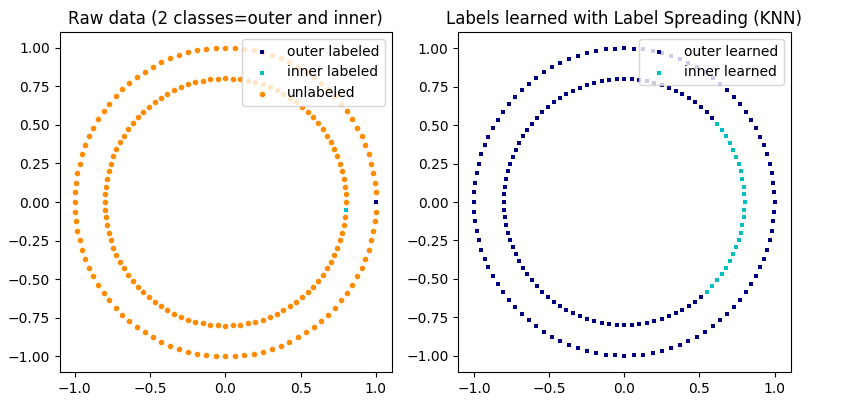

# 1.14. 半监督学习

校验者:
        [@STAN,废柴0.1](https://github.com/apachecn/scikit-learn-doc-zh)
        [@Loopy](https://github.com/loopyme)
翻译者:
        [@那伊抹微笑](https://github.com/apachecn/scikit-learn-doc-zh)

[半监督学习](https://en.wikipedia.org/wiki/Semi-supervised_learning) 适用于在训练数据上的一些样本数据没有贴上标签的情况。 [`sklearn.semi_supervised`](classes.html#module-sklearn.semi_supervised "sklearn.semi_supervised") 中的半监督估计, 能够利用这些附加的未标记数据来更好地捕获底层数据分布的形状，并将其更好地类推到新的样本。 当我们有非常少量的已标签化的点和大量的未标签化的点时，这些算法表现均良好。

> *y* 中含有未标记的数据
>
>在使用 `fit` 方法训练数据时, 将标识符与已标签化的数据一起分配给未标签化的点是尤其重要的. 实现该标记的方法是使用整数值 .

## 1.14.1. 标签传播

标签传播表示半监督图推理算法的几个变体。

*该模型的一些特性如下:*
*   可用于分类和回归任务
*   使用内核方法将数据投影到备用维度空间

*scikit-learn* 提供了两种标签传播模型: [`LabelPropagation`](https://scikit-learn.org/stable/modules/generated/sklearn.semi_supervised.LabelPropagation.html#sklearn.semi_supervised.LabelPropagation "sklearn.semi_supervised.LabelPropagation") 和 [`LabelSpreading`](https://scikit-learn.org/stable/modules/generated/sklearn.semi_supervised.LabelSpreading.html#sklearn.semi_supervised.LabelSpreading "sklearn.semi_supervised.LabelSpreading") 。 两者都通过在输入的 dataset（数据集）中的所有 items（项）上构建 similarity graph （相似图）来进行工作。

**标签传播说明:** _未标签化的观察值结构与 class（类）结构一致, 因此可以将 class（类）标签传播到训练集的未标签化的观察值_

[`LabelPropagation`](https://scikit-learn.org/stable/modules/generated/sklearn.semi_supervised.LabelPropagation.html#sklearn.semi_supervised.LabelPropagation "sklearn.semi_supervised.LabelPropagation") 和 [`LabelSpreading`](https://scikit-learn.org/stable/modules/generated/sklearn.semi_supervised.LabelSpreading.html#sklearn.semi_supervised.LabelSpreading "sklearn.semi_supervised.LabelSpreading") 在对图形的相似性矩阵, 以及对标签分布的 clamping effect（夹持效应）的修改方面不太一样。 Clamping 允许算法在一定程度上改变真实标签化数据的权重。 该 [`LabelPropagation`](https://scikit-learn.org/stable/modules/generated/sklearn.semi_supervised.LabelPropagation.html#sklearn.semi_supervised.LabelPropagation "sklearn.semi_supervised.LabelPropagation") 算法执行输入标签的 hard clamping, 这意味着  。 这些 clamping factor 可以不是很严格的, 例如  , 这意味着我们将始终保留原始标签分配的 80%, 但该算法可以将其分布的置信度改变在 20% 以内。

[`LabelPropagation`](https://scikit-learn.org/stable/modules/generated/sklearn.semi_supervised.LabelPropagation.html#sklearn.semi_supervised.LabelPropagation "sklearn.semi_supervised.LabelPropagation") 使用原始相似性矩阵从未修改的数据来构建。 [`LabelSpreading`](https://scikit-learn.org/stable/modules/generated/sklearn.semi_supervised.LabelSpreading.html#sklearn.semi_supervised.LabelSpreading "sklearn.semi_supervised.LabelSpreading") 最小化具有正则化属性的损耗函数, 因此它通常更适用于噪声数据。 该算法在原始图形的修改版本上进行迭代, 并通过计算 normalized graph Laplacian matrix （归一化图拉普拉斯矩阵）来对边缘的权重进行归一化。 此过程也用于 [Spectral clustering](clustering.html#spectral-clustering) 。

标签传播模型有两种内置的 kernel methods（核函数）。 kernel （核）的选择会影响算法的可扩展性和性能。 以下是可用的:

*   rbf ().  通过关键字 gamma 来指定。
*   knn (![1[x' \in kNN(x)]](img/6db85b1ad926d9ad860d58629ff5f235.jpg)).  通过关键字 n_neighbors 来指定。

RBF 核将产生一个完全连接的图形, 它通过密集矩阵在内存中表示。 该矩阵可能非常大, 与算法的每次迭代执行全矩阵乘法计算的成本相结合可导致超长的运行时间。 在另一方面, KNN 核将产生更多的内存友好的稀疏矩阵, 这样可以大幅度的减少运行时间。

> **示例**
>
>*   [Decision boundary of label propagation versus SVM on the Iris dataset](https://scikit-learn.org/stable/auto_examples/semi_supervised/plot_label_propagation_versus_svm_iris.html#sphx-glr-auto-examples-semi-supervised-plot-label-propagation-versus-svm-iris-py)
>*   [Label Propagation learning a complex structure](https://scikit-learn.org/stable/auto_examples/semi_supervised/plot_label_propagation_structure.html#sphx-glr-auto-examples-semi-supervised-plot-label-propagation-structure-py)
>*   [Label Propagation digits active learning](https://scikit-learn.org/stable/auto_examples/semi_supervised/plot_label_propagation_digits_active_learning.html#sphx-glr-auto-examples-semi-supervised-plot-label-propagation-digits-active-learning-py)

> **参考资料**
>* [1] Yoshua Bengio, Olivier Delalleau, Nicolas Le Roux. In Semi-Supervised Learning (2006), pp. 193-216
>* [2] Olivier Delalleau, Yoshua Bengio, Nicolas Le Roux. Efficient Non-Parametric Function Induction in Semi-Supervised Learning. AISTAT 2005 [http://research.microsoft.com/en-us/people/nicolasl/efficient_ssl.pdf](http://research.microsoft.com/en-us/people/nicolasl/efficient_ssl.pdf)
