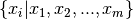
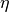
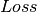
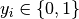
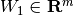
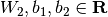
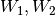
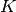
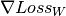
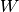

# 1.17. 神经网络模型（有监督）

校验者:
        [@tiantian1412](https://github.com/tiantian1412)
        [@火星](https://github.com/apachecn/scikit-learn-doc-zh)
        [@Loopy](https://github.com/loopyme)
翻译者:
        [@A](https://github.com/apachecn/scikit-learn-doc-zh)

>**警告**
>
>此实现不适用于大规模数据应用。 特别是 scikit-learn 不支持 GPU。如果想要提高运行速度并使用基于 GPU 的实现以及为构建深度学习架构提供更多灵活性的框架，请参阅 [Related Projects](https://scikit-learn.org/stable/related_projects.html#related-projects) 。

## 1.17.1. 多层感知器

**多层感知器(MLP)** 是一种监督学习算法，通过在数据集上训练来学习函数 ，其中  是输入的维数， 是输出的维数。 给定一组特征  和标签  ，它可以学习用于分类或回归的非线性函数。 与逻辑回归不同的是，在输入层和输出层之间，可以有一个或多个非线性层，称为隐藏层。 图1 展示了一个具有标量输出的单隐藏层 MLP。

[](http://sklearn.apachecn.org/cn/0.19.0/_images/multilayerperceptron_network.png)

**图1：单隐藏层MLP.**

最左层的输入层由一组代表输入特征的神经元  组成。 每个隐藏层中的神经元将前一层的值进行加权线性求和转换  ，再通过非线性激活函数  - 比如双曲正切函数 tanh 。 输出层接收到的值是最后一个隐藏层的输出经过变换而来的。

该模块包含公共属性 `coefs_` 和 `intercepts_` 。 `coefs_` 是一系列权重矩阵，其中下标为  的权重矩阵表示第  层和第  层之间的权重。 `intercepts_` 是一系列偏置向量，其中的下标为  的向量表示添加到第  层的偏置值。

多层感知器的优点:

*   可以学习得到非线性模型。
*   使用``partial_fit`` 可以学习得到实时模型(在线学习)。

多层感知器(MLP)的缺点:

*   具有隐藏层的 MLP 具有非凸的损失函数，它有不止一个的局部最小值。 因此不同的随机权重初始化会导致不同的验证集准确率。
*   MLP 需要调试一些超参数，例如隐藏层神经元的数量、层数和迭代轮数。
*   MLP 对特征归一化很敏感.

解决这些缺点的方法请参阅 [实用使用技巧](#1178-实用技巧) 部分。

## 1.17.2. 分类

 [`MLPClassifier`](https://scikit-learn.org/stable/modules/generated/sklearn.neural_network.MLPClassifier.html#sklearn.neural_network.MLPClassifier "sklearn.neural_network.MLPClassifier") 类实现了通过 [Backpropagation](http://ufldl.stanford.edu/wiki/index.php/Backpropagation_Algorithm) 进行训练的多层感知器（MLP）算法。

MLP 在两个 array 上进行训练:大小为 (n_samples, n_features) 的 array X 储存表示训练样本的浮点型特征向量; 大小为 (n_samples,) 的 array y 储存训练样本的目标值（类别标签）:

```py
>>> from sklearn.neural_network import MLPClassifier
>>> X = [[0., 0.], [1., 1.]]
>>> y = [0, 1]
>>> clf = MLPClassifier(solver='lbfgs', alpha=1e-5,
...                     hidden_layer_sizes=(5, 2), random_state=1)
...
>>> clf.fit(X, y)                         
MLPClassifier(activation='relu', alpha=1e-05, batch_size='auto',
              beta_1=0.9, beta_2=0.999, early_stopping=False,
              epsilon=1e-08, hidden_layer_sizes=(5, 2),
              learning_rate='constant', learning_rate_init=0.001,
              max_iter=200, momentum=0.9, n_iter_no_change=10,
              nesterovs_momentum=True, power_t=0.5, random_state=1,
              shuffle=True, solver='lbfgs', tol=0.0001,
              validation_fraction=0.1, verbose=False, warm_start=False)
```

拟合（训练）后，该模型可以预测新样本的标签:

```py
>>> clf.predict([[2., 2.], [-1., -2.]])
array([1, 0])

```

MLP 可以为训练数据拟合一个非线性模型。 `clf.coefs_` 包含了构建模型的权值矩阵:

```py
>>> [coef.shape for coef in clf.coefs_]
[(2, 5), (5, 2), (2, 1)]

```

目前， [`MLPClassifier`](https://scikit-learn.org/stable/modules/generated/sklearn.neural_network.MLPClassifier.html#sklearn.neural_network.MLPClassifier "sklearn.neural_network.MLPClassifier") 只支持交叉熵损失函数，通过运行 `predict_proba` 方法进行概率估计。

MLP 算法使用的是反向传播的方式。 更准确地说，它使用了通过反向传播计算得到的梯度和某种形式的梯度下降来进行训练。 对于分类来说，它最小化交叉熵损失函数，为每个样本  给出一个向量形式的概率估计 

```py
>>> clf.predict_proba([[2., 2.], [1., 2.]])  
array([[  1.967...e-04,   9.998...-01],
 [  1.967...e-04,   9.998...-01]])

```

[`MLPClassifier`](https://scikit-learn.org/stable/modules/generated/sklearn.neural_network.MLPClassifier.html#sklearn.neural_network.MLPClassifier "sklearn.neural_network.MLPClassifier") 通过应用 [Softmax](https://en.wikipedia.org/wiki/Softmax_activation_function) 作为输出函数来支持多分类。

此外，该模型支持 [多标签分类](multiclass.html#multiclass) ，一个样本可能属于多个类别。 对于每个类，原始输出经过 logistic 函数变换后，大于或等于 0.5 的值将进为 1，否则为 0。 对于样本的预测输出，值为 1 的索引位置表示该样本的分类类别:

```py
>>> X = [[0., 0.], [1., 1.]]
>>> y = [[0, 1], [1, 1]]
>>> clf = MLPClassifier(solver='lbfgs', alpha=1e-5,
...                     hidden_layer_sizes=(15,), random_state=1)
...
>>> clf.fit(X, y)                         
MLPClassifier(activation='relu', alpha=1e-05, batch_size='auto',
              beta_1=0.9, beta_2=0.999, early_stopping=False,
              epsilon=1e-08, hidden_layer_sizes=(15,),
              learning_rate='constant', learning_rate_init=0.001,
              max_iter=200, momentum=0.9, n_iter_no_change=10,
              nesterovs_momentum=True, power_t=0.5,  random_state=1,
              shuffle=True, solver='lbfgs', tol=0.0001,
              validation_fraction=0.1, verbose=False, warm_start=False)
>>> clf.predict([[1., 2.]])
array([[1, 1]])
>>> clf.predict([[0., 0.]])
array([[0, 1]])

```

更多内容请参阅下面的示例和文档 [`MLPClassifier.fit`](https://scikit-learn.org/stable/modules/generated/sklearn.neural_network.MLPClassifier.html#sklearn.neural_network.MLPClassifier.fit "sklearn.neural_network.MLPClassifier.fit") 。

> **示例**:
>*   [Compare Stochastic learning strategies for MLPClassifier](https://scikit-learn.org/stable/auto_examples/neural_networks/plot_mlp_training_curves.html#sphx-glr-auto-examples-neural-networks-plot-mlp-training-curves-py)
>*   [Visualization of MLP weights on MNIST](https://scikit-learn.org/stable/auto_examples/neural_networks/plot_mnist_filters.html#sphx-glr-auto-examples-neural-networks-plot-mnist-filters-py)

## 1.17.3. 回归

[`MLPRegressor`](https://scikit-learn.org/stable/modules/generated/sklearn.neural_network.MLPRegressor.html#sklearn.neural_network.MLPRegressor "sklearn.neural_network.MLPRegressor") 类多层感知器（MLP）的实现，在使用反向传播进行训练时的输出层没有使用激活函数，也可以看作是使用恒等函数（identity function）作为激活函数。 因此，它使用平方误差作为损失函数，输出是一组连续值。

[`MLPRegressor`](https://scikit-learn.org/stable/modules/generated/sklearn.neural_network.MLPRegressor.html#sklearn.neural_network.MLPRegressor "sklearn.neural_network.MLPRegressor") 还支持多输出回归，其中一个样本可以有多个目标值。

## 1.17.4. 正则化

[`MLPRegressor`](https://scikit-learn.org/stable/modules/generated/sklearn.neural_network.MLPRegressor.html#sklearn.neural_network.MLPRegressor "sklearn.neural_network.MLPRegressor") 类和 [`MLPClassifier`](https://scikit-learn.org/stable/modules/generated/sklearn.neural_network.MLPClassifier.html#sklearn.neural_network.MLPClassifier "sklearn.neural_network.MLPClassifier") 类都使用参数 `alpha` 作为正则化( L2 正则化)系数，正则化通过惩罚大数量级的权重值以避免过拟合问题。 下面的图表展示了不同的 alpha 值下的决策函数的变化。

[](https://scikit-learn.org/stable/auto_examples/neural_networks/plot_mlp_alpha.html)

详细信息，请参阅下面的示例。

> **示例**:
>*   [Varying regularization in Multi-layer Perceptron](https://scikit-learn.org/stable/auto_examples/neural_networks/plot_mlp_alpha.html#sphx-glr-auto-examples-neural-networks-plot-mlp-alpha-py)

## 1.17.5. 算法

MLP 使用 [Stochastic Gradient Descent（随机梯度下降）(SGD)](https://en.wikipedia.org/wiki/Stochastic_gradient_descent), [Adam](http://arxiv.org/abs/1412.6980), 或者 [L-BFGS](https://en.wikipedia.org/wiki/Limited-memory_BFGS) 进行训练。 随机梯度下降（SGD） 使用关于需要适应的一个参数的损失函数的梯度来更新参数，即


其中  是控制训练过程参数更新步长的学习率（learning rate）。  是损失函数（loss function）。

更多细节可以在这个文档中找到 [SGD](6) 。

Adam 类似于 SGD，因为它是 stochastic optimizer （随机优化器），但它可以根据低阶矩的自适应估计自动调整参数更新的量。

使用 SGD 或 Adam ，训练过程支持在线模式和小批量学习模式。

L-BFGS 是利用 Hessian 矩阵来近似函数的二阶偏导数的求解器，它使用 Hessian 的逆矩阵来近似进行参数更新。 该实现使用 Scipy 版本的 [L-BFGS](http://docs.scipy.org/doc/scipy/reference/generated/scipy.optimize.fmin_l_bfgs_b.html)。

如果所选择的方法是 ‘L-BFGS’，训练过程不支持在线学习模式和小批量学习模式。

## 1.17.6. 复杂度

假设有  个训练样本，  个特征，  个隐藏层，每个包含  个神经元 - 为简单起见，  个输出神经元。 反向传播的时间复杂度是  ，其中  是迭代次数。 由于反向传播具有高时间复杂性，最好以较少数量的隐藏层神经元和较少的隐藏层个数开始训练。

## 1.17.7. 数学公式

给出一组训练样本  其中  ，  ，一个单隐藏层单神经元 MLP 学习到的函数是  ，其中  和  是模型参数.  分别是输入层与隐藏层之间和隐藏层与输出层之间的权重，  分别是隐藏层和输出层的偏置值.  是激活函数，默认为双曲正切函数。 具体形式如下，


对于二分类，  经过 logistic 函数  得到 0 到 1 之间的输出值。 阈值设置为 0.5 ，输出大于等于 0.5 的样本分到 positive class （正类），其他的分为 negative class （负类）。

如果多于两类，则  本身将是一个大小为 (n_classes,) 的向量。 它需要经过 softmax 函数而不是 logistic 函数进行变换，具体形式如下，


其中  表示 softmax 函数的第  个输入的元素，它对应于第  类，  是类别的数量。 计算结果是样本  属于每个类别的概率的向量。 最终输出的分类结果是具有最高概率的类别。

在回归问题中，输出依然是  ;因此，输出激活函数就是恒等函数。

MLP 根据特定问题使用不同的损失函数。 二分类问题的损失函数的是交叉熵，具体形式如下，


其中  是 L2 正则化的模型复杂度惩罚项;  这个非负的超参数控制惩罚的程度。

对于回归问题，MLP 使用平方误差损失函数，具体形式如下，


从随机初始化权重开始，多层感知器（MLP）不断更新这些权重值来最小化损失函数。计算完损失之后，从输出层到前面各层进行反向传播，更新权重参数的值，旨在减小损失函数。

在梯度下降中，计算得到损失函数关于每个权重的梯度  并从权重  中减掉。用公式表示为，


其中  是当前迭代步数，  是大于 0 学习率。

算法停止的条件或者是达到预设的最大迭代次数，或者是损失函数低于某个特定值。

## 1.17.8. 实用技巧

* 多层感知器对特征的缩放是敏感的，所以它强烈建议您归一化你的数据。 例如，将输入向量 X 的每个属性放缩到到 [0, 1] 或 [-1，+1] ，或者将其标准化使它具有 0 均值和方差 1。注意，为了得到有意义的结果，您必须对测试集也应用 *相同的* 尺度缩放。 您可以使用 `StandardScaler` 进行标准化。

  ```py
  from sklearn.preprocessing import StandardScaler  
  scaler = StandardScaler()  
  # Don't cheat - fit only on training data
  scaler.fit(X_train)  
  X_train = scaler.transform(X_train)  
  # apply same transformation to test data
  X_test = scaler.transform(X_test)  
  ```
  另一个推荐的方法是在 `Pipeline` 中使用的 `StandardScaler` 。
* 最好使用 `GridSearchCV` 找到一个合理的正则化参数  ，通常范围是在 `10.0 ** -np.arange(1, 7)` 。
*   据经验可知，我们观察到 *L-BFGS* 收敛速度是更快的并且是小数据集上更好的解决方案。对于规模相对比较大的数据集，*Adam* 是非常鲁棒的。 它通常会迅速收敛，并得到相当不错的表现。另一方面，如果学习率调整得正确， 使用 momentum 或 nesterov’s momentum 的 *SGD* 可以比这两种算法更好。

## 1.17.9. 使用 warm_start 的更多控制

如果您希望更多地控制 SGD 中的停止标准或学习率，或者想要进行额外的监视，使用 `warm_start=True` 和 `max_iter=1` 并且自身迭代可能会有所帮助:

```py
>>> X = [[0., 0.], [1., 1.]]
>>> y = [0, 1]
>>> clf = MLPClassifier(hidden_layer_sizes=(15,), random_state=1, max_iter=1, warm_start=True)
>>> for i in range(10):
...     clf.fit(X, y)
...     # additional monitoring / inspection
MLPClassifier(...

```

> **参考资料**:
>
>* [“Learning representations by back-propagating errors.”](http://www.iro.umontreal.ca/~pift6266/A06/refs/backprop_old.pdf) Rumelhart, David E., Geoffrey E. Hinton, and Ronald J. Williams.
>*   [“Stochastic Gradient Descent”](http://leon.bottou.org/projects/sgd) L. Bottou - Website, 2010.
>*   [“Backpropagation”](http://ufldl.stanford.edu/wiki/index.php/Backpropagation_Algorithm) Andrew Ng, Jiquan Ngiam, Chuan Yu Foo, Yifan Mai, Caroline Suen - Website, 2011.
>*   [“Efficient BackProp”](http://yann.lecun.com/exdb/publis/pdf/lecun-98b.pdf) Y. LeCun, L. Bottou, G. Orr, K. Müller - In Neural Networks: Tricks of the Trade 1998.
>*   [“Adam: A method for stochastic optimization.”](http://arxiv.org/pdf/1412.6980v8.pdf) Kingma, Diederik, and Jimmy Ba. arXiv preprint arXiv:1412.6980 (2014).
