# 2.4. 双聚类

校验者:
        [@udy](https://github.com/apachecn/scikit-learn-doc-zh)
        [@barrycg](https://github.com/barrycg)
翻译者:
        [@程威](https://github.com/apachecn/scikit-learn-doc-zh)

Biclustering(双向聚类) 的实现模块是 [`sklearn.cluster.bicluster`](classes.html#module-sklearn.cluster.bicluster "sklearn.cluster.bicluster")。 双向聚类算法对数据矩阵的行列同时进行聚类。而这些行列的聚类称之为 双向簇(biclusters)。每一次聚类都会基于原始数据矩阵确定一个子矩阵, 并且这些子矩阵具有一些需要的属性。

例如, 给定一个矩阵 `(10, 10)` , 如果对其中三行二列进行双向聚类，就可以获得一个子矩阵 `(3, 2)`。

```py
>>> import numpy as np
>>> data = np.arange(100).reshape(10, 10)
>>> rows = np.array([0, 2, 3])[:, np.newaxis]
>>> columns = np.array([1, 2])
>>> data[rows, columns]
array([[ 1,  2],
 [21, 22],
 [31, 32]])

```

为了可视化，给定一个双向簇，数据矩阵的行列可以重新分配，使得该双向簇是连续的。

不同的双向聚类算法在如何定义双向簇方面有所不同，但其中通用类型包括：
*   常量, 常量行或常量列。
*   异常高的或者低的值。
*   低方差的子矩阵。
*   相互关联的行列。

算法在给双向簇分配行列的方式不同, 会导致不同的双向聚类结构。当行和列分成区块时，会出现块对角或者棋盘结构。

如果每一行和每一列仅属于一个双向簇,重新排列数据矩阵的行和列,会使得双向簇出现在对角线上。下面是一个例子，此结构的双向簇具有比其他行列更高的平均值:

[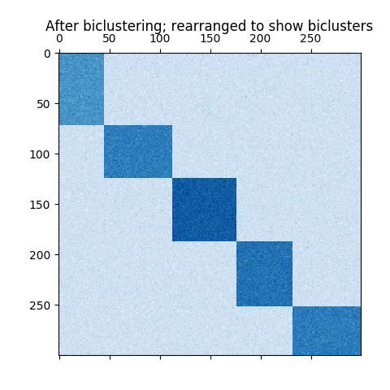](https://scikit-learn.org/stable/auto_examples/bicluster/images/sphx_glr_plot_spectral_coclustering_003.png)

在棋盘结构的例子中, 每一行属于所有的列簇, 每一列属于所有的行簇。下面是一个例子，每个双向簇内的值差异较小:

[](https://scikit-learn.org/stable/auto_examples/bicluster/images/sphx_glr_plot_spectral_biclustering_003.png)

在拟合模型之后， 可以在 `rows_` 和 `columns_` 属性中找到行簇和列簇的归属信息(membership)。`rows_[i]` 是一个二元向量， 其中非零元素表示属于双向簇`i` 的行。 同样的, `columns_[i]` 就表示属于双向簇 `i` 的列。

一些模块也有 `row_labels_` 和 `column_labels_` 属性。 这些模块可以对行列进行分区, 例如在块对角或者棋盘双向簇结构。

>**注意**
>双向聚类在不同的领域有很多其他名称，包括 co-clustering, two-mode clustering, two-way clustering, block clustering, coupled two-way clustering 等.有一些算法的名称，比如 Spectral Co-Clustering algorithm, 反应了这些备用名称。

## 2.4.1. Spectral Co-Clustering

 [`SpectralCoclustering(联合谱聚类)`](https://scikit-learn.org/stable/modules/generated/sklearn.cluster.bicluster.SpectralCoclustering.html#sklearn.cluster.bicluster.SpectralCoclustering "sklearn.cluster.bicluster.SpectralCoclustering") 算法找到的双向簇的值比其它的行和列更高。每一个行和列都只属于一个双向簇, 所以重新分配行和列，使得分区连续显示对角线上的高值:

>**注意**
>算法将输入的数据矩阵看做成二分图：该矩阵的行和列对应于两组顶点，每个条目对应于行和列之间的边，该算法近似的进行归一化，对图进行切割，找到更重的子图。

### 2.4.1.1. 数学公式

找到最优归一化剪切的近似解，可以通过图形的 Laplacian 的广义特征值分解。 通常这意味着直接使用 Laplacian 矩阵. 如果原始数据矩阵 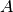 的形状 , 则对应的二分图(bipartite graph)的 Laplacian 矩阵具有形状 。 但是, 在这种情况下, 直接使用  , 因为它更小，更有效率。

输入矩阵  被预处理如下:

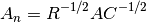

 是对角线矩阵， 其中元素  等于  ，  是 对角矩阵，其中元素 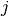 等于 。

奇异值分解,  , 产生了  行列的分区. 左边奇异向量的子集给予行分区，右边的奇异向量的子集给予列分区。

奇异向量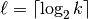 从第二个开始, 提供所需的分区信息。这些用于形成矩阵 *Z*:


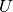 的列是 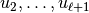, 和 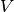 的列也具有相似特性。

然后  的所有行通过使用 [k-means](clustering.html#k-means) 进行聚类. 第一个`n_rows` 标签提供行分区信息, 剩下的 `n_columns` 标签提供列分区信息。

> **示例**:
>*   [A demo of the Spectral Co-Clustering algorithm](https://scikit-learn.org/stable/auto_examples/bicluster/plot_spectral_coclustering.html#sphx-glr-auto-examples-bicluster-plot-spectral-coclustering-py): 如何用双向簇产生一个数据矩阵并应用。
>*   [Biclustering documents with the Spectral Co-clustering algorithm](https://scikit-learn.org/stable/auto_examples/bicluster/plot_bicluster_newsgroups.html#sphx-glr-auto-examples-bicluster-plot-bicluster-newsgroups-py):一个在 20 个新闻组数据集中发现双向簇的例子

> **参考资料**:
>*   Dhillon, Inderjit S, 2001. [Co-clustering documents and words using bipartite spectral graph partitioning](http://citeseerx.ist.psu.edu/viewdoc/summary?doi=10.1.1.140.3011).

## 2.4.2. Spectral Biclustering

 [`SpectralBiclustering(双向谱聚类)`](https://scikit-learn.org/stable/modules/generated/sklearn.cluster.bicluster.SpectralBiclustering.html#sklearn.cluster.bicluster.SpectralBiclustering "sklearn.cluster.bicluster.SpectralBiclustering") 算法假设输入的数据矩阵具有隐藏的棋盘结构。具有这种结构的矩阵的行列可能被分区，使得在笛卡尔积中的大部分双向簇的列簇和行簇是近似恒定的。

例如，如果有两个行分区和三个列分区，每一行属于三个双向簇，每一列属于两个双向簇。

这个算法对矩阵的行和列进行分区，以至于提供一个相应的块状不变的棋盘矩阵，近似于原始矩阵。

### 2.4.2.1. 数学表示

输入矩阵  先归一化，使得矩阵的棋盘模式更明显。这里有三种方法:

1.  **独立的行列归一化**, 如联合谱聚类中所示. 这个方法使得所有行进行行内相加得到一个相同常量，所有列相加得到另一个相同常量。
2.  **Bistochastization**: 重复行和列归一化直到收敛。该方法使得行和列相加得到一个相同的常数。
3.  **对数归一化**: 数据矩阵的对数是 . 列对数就是 , 行 对数就是 ,  是  的整体平均.  最终矩阵通过下面的公式计算


归一化后，第一个的奇异向量被计算，就如同联合谱聚类算法一样。

如果使用对数归一化，则所有的奇异向量都是有意义的。但是, 如果是独立归一化或Bistochastization 被使用, 第一个奇异向量,  和 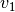。 会被丢弃。 从现在开始, “第一个” 奇异向量指的是 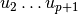 和  ，除了对数归一化的情况。

给定这些奇异向量，按照分段常数向量的最佳近似程度,将他们排序。使用一维 k-means 找到每个向量的近似值并使用欧氏距离进行评分。最好的左右奇异向量的某个子集被选择。下一步, 数据将被投影到奇异向量的最佳子集并进行聚类。

例如，如果已计算得到  个奇异向量,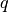 个 最佳得奇异向量可以被找出, 因为 。让 为列是  个最佳左奇异向量的矩阵, 并且   是用右奇异向量组成的矩阵. 为了划分行, 将  投影到  维空间: 。把 矩阵的  行作为样本, 然后使用 k-means 的聚类处理产生行标签。类似地，将列投影到  ，并且对  矩阵进行聚类得到列标签。

> **示例**:
>*   [A demo of the Spectral Biclustering algorithm](https://scikit-learn.org/stable/auto_examples/bicluster/plot_spectral_biclustering.html#sphx-glr-auto-examples-bicluster-plot-spectral-biclustering-py): 一个简单的例子显示如何生成棋盘矩阵和对它进行双向聚类。

> **参考资料**:
>*   Kluger, Yuval, et. al., 2003. [Spectral biclustering of microarray data: coclustering genes and conditions](http://citeseerx.ist.psu.edu/viewdoc/summary?doi=10.1.1.135.1608).

## 2.4.3. Biclustering 评价

有两种评估双聚类结果的方法：内部和外部。内部评估,如聚类稳定性, 依赖于数据和结果本身。目前在scikit-learn中没有内部的双向簇评估。外部评估是指外部信息来源，例如真实解。当处理真实数据时，真实解通常是未知的，但是，由于真实解是已知，因此人造数据的双向聚类可能对于评估算法非常有用。

为了将一组已发现的双向簇与一组真实的双向簇行比较，需要两个相似性度量：单个双向簇的相似性度量以及将这些个体相似度结合到总分中的度量。

为了比较单个双向簇，可以采用了几种措施。现在，只有Jaccard索引已被实现：


其中Ａ和Ｂ是双向簇, ｜Ａ∩Ｂ｜ 是交叉点的元素的数量。

Jaccard 索引 达到最小值0，当biclusters完全不同时，Jaccard指数最小值为0;当biclusters完全相同时，Jaccard指数最大值为1。

一些方法已经开发出来，用来比较两个双向簇的集合(set)。从现在开始,  仅[`consensus_score`](https://scikit-learn.org/stable/modules/generated/sklearn.metrics.consensus_score.html#sklearn.metrics.consensus_score "sklearn.metrics.consensus_score") (Hochreiter et. al., 2010) 是可以用:

1.  使用 Jaccard 索引或类似措施， 为每个集合中的一个双向簇对计算簇之间的相似性。
2.  以一对一的方式将双向簇从一个集合分配给另一个集合，以最大化其相似性的总和。该步骤使用匈牙利算法(Hungarian algorithm)执行。
3.  相似性的最终总和除以较大集合的大小。

当所有双向簇对都完全不相似时,最小共识得分为0。当两个双向簇集合相同时，最大得分为1。

> **参考资料**:
>*   Hochreiter, Bodenhofer, et. al., 2010. [FABIA: factor analysis for bicluster acquisition](https://www.ncbi.nlm.nih.gov/pmc/articles/PMC2881408/).
