# 2.5. 分解成分中的信号（矩阵分解问题）

校验者:
        [@武器大师一个挑俩](https://github.com/apachecn/scikit-learn-doc-zh)
        [@png](https://github.com/apachecn/scikit-learn-doc-zh)
        [@barrycg](https://github.com/barrycg)
翻译者:
        [@柠檬](https://github.com/apachecn/scikit-learn-doc-zh)
        [@片刻](https://github.com/apachecn/scikit-learn-doc-zh)

## 2.5.1. 主成分分析（PCA）

### 2.5.1.1. 准确的PCA和概率解释（Exact PCA and probabilistic interpretation）

PCA 用于对具有一组连续正交分量(Orthogonal component _译注: 或译为正交成分,下出现 成分 和 分量 是同意词_)的多变量数据集进行方差最大化的分解。 在 scikit-learn 中， [`PCA`](https://scikit-learn.org/stable/modules/generated/sklearn.decomposition.PCA.html#sklearn.decomposition.PCA "sklearn.decomposition.PCA") 被实现为一个变换器对象， 通过 `fit` 方法可以拟合出 *n* 个成分， 并且可以将新的数据投影(project, 亦可理解为分解)到这些成分中。

在应用SVD(奇异值分解) 之前, PCA 是在为每个特征聚集而不是缩放输入数据。可选参数 `whiten=True` 使得可以将数据投影到奇异（singular）空间上，同时将每个成分缩放到单位方差。 如果下游模型对信号的各向同性作出强假设，这通常是有用的，例如，使用RBF内核的 SVM 算法和 K-Means 聚类算法。

以下是iris数据集的一个示例，该数据集包含4个特征，通过PCA降维后投影到方差最大的二维空间上：


[`PCA`](https://scikit-learn.org/stable/modules/generated/sklearn.decomposition.PCA.html#sklearn.decomposition.PCA "sklearn.decomposition.PCA") 对象还提供了 PCA 算法的概率解释，其可以基于可解释的方差量给出数据的可能性。PCA对象实现了在交叉验证（cross-validation）中使用 *score* 方法：

[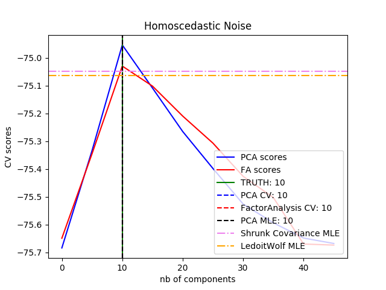](https://scikit-learn.org/stable/auto_examples/decomposition/plot_pca_vs_fa_model_selection.html)

> **示例**:
>*   [Comparison of LDA and PCA 2D projection of Iris dataset](https://scikit-learn.org/stable/auto_examples/decomposition/plot_pca_vs_lda.html#sphx-glr-auto-examples-decomposition-plot-pca-vs-lda-py)
>*   [Model selection with Probabilistic PCA and Factor Analysis (FA)](https://scikit-learn.org/stable/auto_examples/decomposition/plot_pca_vs_fa_model_selection.html#sphx-glr-auto-examples-decomposition-plot-pca-vs-fa-model-selection-py)

### 2.5.1.2. 增量PCA (Incremental PCA)

[`PCA`](https://scikit-learn.org/stable/modules/generated/sklearn.decomposition.PCA.html#sklearn.decomposition.PCA "sklearn.decomposition.PCA") 对象非常有用, 但 针对大型数据集的应用, 仍然具有一定的限制。 最大的限制是 [`PCA`](https://scikit-learn.org/stable/modules/generated/sklearn.decomposition.PCA.html#sklearn.decomposition.PCA "sklearn.decomposition.PCA") 仅支持批处理，这意味着所有要处理的数据必须放在主内存。 [`IncrementalPCA`](https://scikit-learn.org/stable/modules/generated/sklearn.decomposition.IncrementalPCA.html#sklearn.decomposition.IncrementalPCA "sklearn.decomposition.IncrementalPCA") 对象使用不同的处理形式, 即允许部分计算以小型批处理方式处理数据的方法进行, 而得到和 [`PCA`](https://scikit-learn.org/stable/modules/generated/sklearn.decomposition.PCA.html#sklearn.decomposition.PCA "sklearn.decomposition.PCA") 算法差不多的结果。 [`IncrementalPCA`](https://scikit-learn.org/stable/modules/generated/sklearn.decomposition.IncrementalPCA.html#sklearn.decomposition.IncrementalPCA "sklearn.decomposition.IncrementalPCA") 可以通过以下方式实现核外（out-of-core）主成分分析：

*   基于从本地硬盘或网络数据库中连续获取的数据块之上, 使用 `partial_fit` 方法。
*   在 memory mapped file (通过 `numpy.memmap` 创建)上使用 fit 方法。

[`IncrementalPCA`](https://scikit-learn.org/stable/modules/generated/sklearn.decomposition.IncrementalPCA.html#sklearn.decomposition.IncrementalPCA "sklearn.decomposition.IncrementalPCA") 类为了增量式的更新 explained_variance_ratio_ ，仅需要存储估计出的分量和噪声方差。 这就是为什么内存使用量依赖于每个批次的样本数量，而不是数据集中需要处理的样本总量。

在应用SVD之前，[`IncrementalPCA`](https://scikit-learn.org/stable/modules/generated/sklearn.decomposition.IncrementalPCA.html#sklearn.decomposition.IncrementalPCA "sklearn.decomposition.IncrementalPCA")就像[`PCA`](https://scikit-learn.org/stable/modules/generated/sklearn.decomposition.PCA.html#sklearn.decomposition.PCA)一样,为每个特征聚集而不是缩放输入数据。

[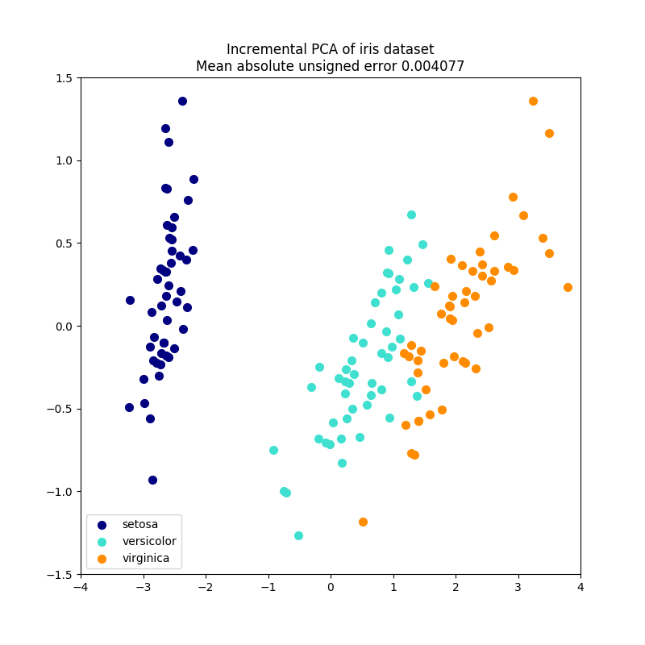](https://scikit-learn.org/stable/auto_examples/decomposition/plot_incremental_pca.html)[](https://scikit-learn.org/stable/auto_examples/decomposition/plot_incremental_pca.html)

> **示例**
>*   [Incremental PCA](https://scikit-learn.org/stable/auto_examples/decomposition/plot_incremental_pca.html#sphx-glr-auto-examples-decomposition-plot-incremental-pca-py)

### 2.5.1.3. 基于随机化SVD的PCA

通过丢弃具有较低奇异值的奇异向量的分量，将数据降维到低维空间并保留大部分方差信息是非常有意义的。

例如，如果我们使用64x64像素的灰度级图像进行人脸识别，数据的维数为4096，在这样大的数据上训练含RBF内核的支持向量机是很慢的。此外我们知道这些数据固有维度远低于4096，因为人脸的所有照片都看起来有点相似。样本位于较低维度的流体上（例如约200维）。 PCA算法可以用于线性变换数据，同时降低维数并同时保留大部分可描述的方差信息。

在这种情况下，使用可选参数 `svd_solver='randomized'` 的 [`PCA`](https://scikit-learn.org/stable/modules/generated/sklearn.decomposition.PCA.html#sklearn.decomposition.PCA "sklearn.decomposition.PCA") 是非常有用的。既然我们将要丢弃大部分奇异值，那么仅仅就实际转换中所需的奇异向量进行计算就可以使得 PCA 计算过程变得异常有效。

例如：以下显示了来自 Olivetti 数据集的 16 个样本肖像（以 0.0 为中心）。右侧是前 16 个奇异向量重画的肖像。因为我们只需要使用大小为  和  的数据集的前 16 个奇异向量, 使得计算时间小于 1 秒。

**[](https://scikit-learn.org/stable/auto_examples/decomposition/plot_faces_decomposition.html) [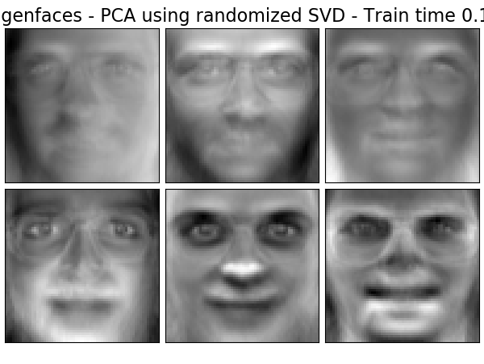](https://scikit-learn.org/stable/auto_examples/decomposition/plot_faces_decomposition.html)**

注意：使用可选参数 `svd_solver='randomized'` ，在 [`PCA`](https://scikit-learn.org/stable/modules/generated/sklearn.decomposition.PCA.html#sklearn.decomposition.PCA "sklearn.decomposition.PCA") 中我们还需要给出输入低维空间大小 `n_components` 。

我们注意到, 如果  且 , 对于PCA中的实现，随机 [`PCA`](https://scikit-learn.org/stable/modules/generated/sklearn.decomposition.PCA.html#sklearn.decomposition.PCA "sklearn.decomposition.PCA") 的时间复杂度是：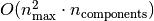, 而不是  。

就内部实现的方法而言, 随机 [`PCA`](https://scikit-learn.org/stable/modules/generated/sklearn.decomposition.PCA.html#sklearn.decomposition.PCA "sklearn.decomposition.PCA") 的内存占用量和 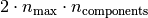, 而不是  成正比。

注意：选择参数 `svd_solver='randomized'` 的 [`PCA`](https://scikit-learn.org/stable/modules/generated/sklearn.decomposition.PCA.html#sklearn.decomposition.PCA "sklearn.decomposition.PCA") 的 `inverse_transform` 的实现, 并不是对应 `transform` 的逆变换（即使 参数设置为默认的 `whiten=False`）

> **示例**:
>*   [Faces recognition example using eigenfaces and SVMs](https://scikit-learn.org/stable/auto_examples/applications/plot_face_recognition.html#sphx-glr-auto-examples-applications-plot-face-recognition-py)
>*   [Faces dataset decompositions](https://scikit-learn.org/stable/auto_examples/decomposition/plot_faces_decomposition.html#sphx-glr-auto-examples-decomposition-plot-faces-decomposition-py)

> **参考资料**:
*   [“Finding structure with randomness: Stochastic algorithms for constructing approximate matrix decompositions”](http://arxiv.org/abs/0909.4061) Halko, et al., 2009

### 2.5.1.4. 核 PCA

[`KernelPCA`](https://scikit-learn.org/stable/modules/generated/sklearn.decomposition.KernelPCA.html#sklearn.decomposition.KernelPCA "sklearn.decomposition.KernelPCA") 是 PCA 的扩展，通过使用核方法实现非线性降维（dimensionality reduction） (参阅 [成对的矩阵, 类别和核函数](metrics.html#metrics))。 它具有许多应用，包括去噪, 压缩和结构化预测（ structured prediction ） (kernel dependency estimation（内核依赖估计）)。
[`KernelPCA`](https://scikit-learn.org/stable/modules/generated/sklearn.decomposition.KernelPCA.html#sklearn.decomposition.KernelPCA "sklearn.decomposition.KernelPCA") 支持 `transform` 和 `inverse_transform` 。

[](https://scikit-learn.org/stable/auto_examples/decomposition/plot_kernel_pca.html)

> **示例**:
>*   [Kernel PCA](https://scikit-learn.org/stable/auto_examples/decomposition/plot_kernel_pca.html#sphx-glr-auto-examples-decomposition-plot-kernel-pca-py)

### 2.5.1.5. 稀疏主成分分析 ( SparsePCA 和 MiniBatchSparsePCA )

[`SparsePCA`](https://scikit-learn.org/stable/modules/generated/sklearn.decomposition.SparsePCA.html#sklearn.decomposition.SparsePCA "sklearn.decomposition.SparsePCA") 是 PCA 的一个变体，目的是提取能最大程度得重建数据的稀疏分量集合。

小批量稀疏 PCA ( [`MiniBatchSparsePCA`](https://scikit-learn.org/stable/modules/generated/sklearn.decomposition.MiniBatchSparsePCA.html#sklearn.decomposition.MiniBatchSparsePCA "sklearn.decomposition.MiniBatchSparsePCA") ) 是一个 [`SparsePCA`](https://scikit-learn.org/stable/modules/generated/sklearn.decomposition.SparsePCA.html#sklearn.decomposition.SparsePCA "sklearn.decomposition.SparsePCA") 的变体，它速度更快但准确度有所降低。对于给定的迭代次数，通过迭代该组特征的小块来达到速度的增加。

Principal component analysis（主成分分析） ([`PCA`](https://scikit-learn.org/stable/modules/generated/sklearn.decomposition.PCA.html#sklearn.decomposition.PCA "sklearn.decomposition.PCA")) 的缺点在于，通过该方法提取的成分具有独占的密度表达式，即当表示为原始变量的线性组合时，它们具有非零系数，使之难以解释。在许多情况下，真正的基础分量可以被更自然地想象为稀疏向量; 例如在面部识别中，每个分量可能自然地映射到面部的某个部分。

稀疏的主成分产生更节约、可解释的表达式，明确强调了样本之间的差异性来自哪些原始特征。

以下示例说明了使用稀疏 PCA 提取 Olivetti 人脸数据集中的 16 个分量。可以看出正则化项产生了许多零。此外，数据的自然结构导致了非零系数垂直相邻 （vertically adjacent）。该模型并不具备纯数学意义的执行: 每个分量都是一个向量 , 除非人性化地的可视化为 64x64 像素的图像，否则没有垂直相邻性的概念。下面显示的分量看起来局部化（appear local)是数据的内在结构的影响，这种局部模式使重建误差最小化。有一种考虑到邻接性和不同结构类型的导致稀疏的规范（sparsity-inducing norms）,参见 [[Jen09]](#jen09) 对这种方法进行了解。有关如何使用稀疏 PCA 的更多详细信息，请参阅下面的示例部分。

**[](https://scikit-learn.org/stable/auto_examples/decomposition/plot_faces_decomposition.html) [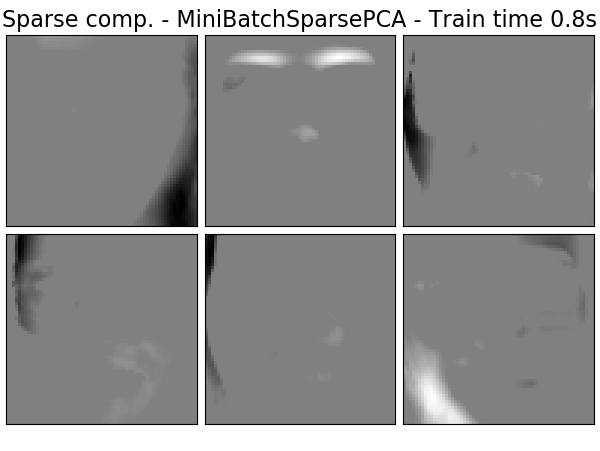](https://scikit-learn.org/stable/auto_examples/decomposition/plot_faces_decomposition.html)**

请注意，有多种不同的计算稀疏PCA 问题的公式。 这里使用的方法基于 [[Mrl09]](#mrl09) 。对应优化问题的解决是一个带有惩罚项（L1范数的）  的 PCA 问题（dictionary learning（字典学习））:


稀疏推导（sparsity-inducing）  规范也可以当训练样本很少时,避免从噪声中拟合分量。可以通过超参数 `alpha` 来调整惩罚程度（或称稀疏度）。值较小会导致温和的正则化因式分解，而较大的值将许多系数缩小到零。

> **注意**
>虽然本着在线算法的精神， [`MiniBatchSparsePCA`](https://scikit-learn.org/stable/modules/generated/sklearn.decomposition.MiniBatchSparsePCA.html#sklearn.decomposition.MiniBatchSparsePCA "sklearn.decomposition.MiniBatchSparsePCA") 类不实现 `partial_fit` , 因为在线算法是以特征为导向，而不是以样本为导向。

> **示例**:
>*   [Faces dataset decompositions](https://scikit-learn.org/stable/auto_examples/decomposition/plot_faces_decomposition.html#sphx-glr-auto-examples-decomposition-plot-faces-decomposition-py)

> **参考资料**:
>* [Mrl09] [“Online Dictionary Learning for Sparse Coding”](http://www.di.ens.fr/sierra/pdfs/icml09.pdf) J. Mairal, F. Bach, J. Ponce, G. Sapiro, 2009
>* [Jen09] [“Structured Sparse Principal Component Analysis”](www.di.ens.fr/~fbach/sspca_AISTATS2010.pdf) R. Jenatton, G. Obozinski, F. Bach, 2009

## 2.5.2. 截断奇异值分解和隐语义分析

[`TruncatedSVD`](https://scikit-learn.org/stable/modules/generated/sklearn.decomposition.TruncatedSVD.html#sklearn.decomposition.TruncatedSVD "sklearn.decomposition.TruncatedSVD") 实现了一个奇异值分解（SVD）的变体，它只计算  个最大的奇异值，其中  是用户指定的参数。

当截断的 SVD被应用于 term-document矩阵（由 `CountVectorizer` 或 `TfidfVectorizer` 返回）时，这种转换被称为 [latent semantic analysis](http://nlp.stanford.edu/IR-book/pdf/18lsi.pdf) (LSA), 因为它将这样的矩阵转换为低维度的"语义"空间。特别地是 LSA 能够抵抗同义词和多义词的影响（两者大致意味着每个单词有多重含义）, 这导致 term-document 矩阵过度稀疏，并且在诸如余弦相似性的度量下表现出差的相似性。

> **注意**
> LSA 也被称为隐语义索引 LSI，尽管严格地说它是指用于信息检索的持久索引（persistent indexes）。

从数学角度来说, 训练样本  用截断的SVD 会产生一个低秩的（ low-rank）近似值 :


在这个操作之后，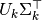 是转换后的训练集，其中包括  个特征（在 API 中被称为 `n_components` ）。

还需要转换一个测试集 , 我们乘以 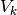:


> **注意**
>自然语言处理(NLP) 和信息检索(IR) 文献中的 LSA 的大多数处理方式是交换矩阵  的坐标轴,使其具有 `n_features` × `n_samples` 的形状。 我们 在 scikit-learn API 使用不同方式呈现 LSA, 找到的奇异值是相同的。

[`TruncatedSVD`](https://scikit-learn.org/stable/modules/generated/sklearn.decomposition.TruncatedSVD.html#sklearn.decomposition.TruncatedSVD "sklearn.decomposition.TruncatedSVD") 非常类似于 [`PCA`](https://scikit-learn.org/stable/modules/generated/sklearn.decomposition.PCA.html#sklearn.decomposition.PCA "sklearn.decomposition.PCA"), 但不同之处在于它应用于样本矩阵  而不是它们的协方差矩阵。当从特征值中减去  的每列（每个特征per-feature）的均值时，在得到的矩阵上应用 truncated SVD 相当于 PCA 。 实际上，这意味着 [`TruncatedSVD`](https://scikit-learn.org/stable/modules/generated/sklearn.decomposition.TruncatedSVD.html#sklearn.decomposition.TruncatedSVD "sklearn.decomposition.TruncatedSVD") 转换器（transformer）接受 `scipy.sparse` 矩阵，而不需要对它们进行密集（densify），因为即使对于中型大小文档的集合, 密集化 （densifying）也可能填满内存。

虽然 [`TruncatedSVD`](https://scikit-learn.org/stable/modules/generated/sklearn.decomposition.TruncatedSVD.html#sklearn.decomposition.TruncatedSVD "sklearn.decomposition.TruncatedSVD") 转换器（transformer）可以在任何（稀疏的）特征矩阵上工作，但还是建议在 LSA/document 处理背景中，在 tf–idf 矩阵上的原始频率计数使用它。特别地，应该打开子线性缩放（sublinear scaling）和逆文档频率（inverse document frequency） (`sublinear_tf=True, use_idf=True`) 以使特征值更接近于高斯分布，补偿 LSA 对文本数据的错误假设。

> **示例**:
>*   [Clustering text documents using k-means](https://scikit-learn.org/stable/auto_examples/text/document_clustering.html#sphx-glr-auto-examples-text-document-clustering-py)

> **参考资料**:
>*   Christopher D. Manning, Prabhakar Raghavan and Hinrich Schütze (2008), _Introduction to Information Retrieval_, Cambridge University Press, chapter 18: [Matrix decompositions & latent semantic indexing](http://nlp.stanford.edu/IR-book/pdf/18lsi.pdf)

## 2.5.3. 词典学习

### 2.5.3.1. 带有预计算词典的稀疏编码

[`SparseCoder`](https://scikit-learn.org/stable/modules/generated/sklearn.decomposition.SparseCoder.html#sklearn.decomposition.SparseCoder "sklearn.decomposition.SparseCoder") 对象是一个估计器 （estimator），可以用来将信号转换成一个固定的,预计算的词典内原子（atoms）的稀疏线性组合（sparse linear combination），如离散小波基（ discrete wavelet basis ）。 因此，该对象不实现 `fit` 方法。该转换相当于一个稀疏编码问题: 将数据的表示为尽可能少的词典原子的线性组合。 词典学习的所有变体实现以下变换方法，可以通过 `transform_method` 初始化参数进行控制:

*   Orthogonal matching pursuit(追求正交匹配) ([正交匹配追踪法（OMP）](linear_model.html#omp))
*   Least-angle regression (最小角度回归)([最小角回归](linear_model.html#least-angle-regression))
*   Lasso computed by least-angle regression(最小角度回归的Lasso 计算)
*   Lasso using coordinate descent ( 使用坐标下降的Lasso)([Lasso](linear_model.html#lasso))
*   Thresholding(阈值)

阈值方法速度非常快，但是不能产生精确的重建。 它们在分类任务的文献中已被证明是有用的。对于图像重建任务，追求正交匹配可以产生最精确、无偏的重建。

词典学习对象通过 `split_code` 参数提供稀疏编码结果中的正值和负值分离的可能性。当使用词典学习来提取将用于监督学习的特征时，这是有用的，因为它允许学习算法将不同的权重从正加载（loading）分配给相应的负加载的特定原子。

单个样本的分割编码具有长度 `2 * n_components` ，并使用以下规则构造: 首先，计算长度为 `n_components` 的常规编码。然后， `split_code` 的第一个 `n_components` 条目将用常规编码向量的正部分填充。分割编码的第二部分用编码向量的负部分填充，只有一个正号。因此， split_code 是非负的。

> **示例**:
>*   [Sparse coding with a precomputed dictionary](https://scikit-learn.org/stable/auto_examples/decomposition/plot_sparse_coding.html#sphx-glr-auto-examples-decomposition-plot-sparse-coding-py)

### 2.5.3.2. 通用词典学习

词典学习( [`DictionaryLearning`](https://scikit-learn.org/stable/modules/generated/sklearn.decomposition.DictionaryLearning.html#sklearn.decomposition.DictionaryLearning "sklearn.decomposition.DictionaryLearning") ) 是一个矩阵因式分解问题，相当于找到一个在拟合数据的稀疏编码中表现良好的（通常是过完备的（overcomplete））词典。

 使用过完备词典的原子的稀疏组合来表示数据被认为是哺乳动物初级视觉皮层的工作方式。 因此，应用于图像补丁的词典学习已被证明在诸如图像完成、修复和去噪，以及有监督的识别图像处理任务中表现良好的结果。

词典学习被视为通过交替更新稀疏编码来解决的优化问题，也作为解决多个 Lasso 问题的一个解决方案，考虑到字典固定，可以通过更新字典以最大程度的拟合出稀疏编码。


**[](https://scikit-learn.org/stable/auto_examples/decomposition/plot_faces_decomposition.html) [](https://scikit-learn.org/stable/auto_examples/decomposition/plot_faces_decomposition.html)**

在使用这样一个过程来拟合词典之后，变换只是一个稀疏编码的步骤，与所有的词典学习对象共享相同的实现。(参见 [带有预计算词典的稀疏编码](#sparsecoder))。

 也可以通过限制字典和/或编码为正来匹配数据中可能表现的约束。以下是正约束应用的脸部图像。红色表示负值, 蓝色表示正值,白色表示零值。

[](https://scikit-learn.org/stable/auto_examples/decomposition/plot_image_denoising.html)
[](https://scikit-learn.org/stable/auto_examples/decomposition/plot_image_denoising.html)
[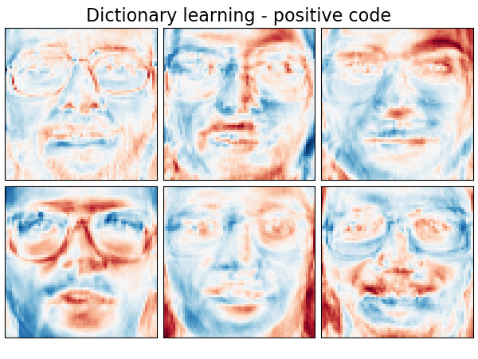](https://scikit-learn.org/stable/auto_examples/decomposition/plot_image_denoising.html)
[](https://scikit-learn.org/stable/auto_examples/decomposition/plot_image_denoising.html)

以下图像显示了字典学习是如何从浣熊脸部的部分图像中提取的4x4像素图像补丁中进行词典学习的。

[](https://scikit-learn.org/stable/auto_examples/decomposition/plot_image_denoising.html)

> **示例**:
>*   [Image denoising using dictionary learning](https://scikit-learn.org/stable/auto_examples/decomposition/plot_image_denoising.html#sphx-glr-auto-examples-decomposition-plot-image-denoising-py)

> **参考资料**:
*   [“Online dictionary learning for sparse coding”](http://www.di.ens.fr/sierra/pdfs/icml09.pdf) J. Mairal, F. Bach, J. Ponce, G. Sapiro, 2009

### 2.5.3.3. 小批量字典学习

[`MiniBatchDictionaryLearning`](https://scikit-learn.org/stable/modules/generated/sklearn.decomposition.MiniBatchDictionaryLearning.html#sklearn.decomposition.MiniBatchDictionaryLearning "sklearn.decomposition.MiniBatchDictionaryLearning") 实现了更快、更适合大型数据集的字典学习算法，其运行速度更快，但准确度有所降低。

默认情况下，[`MiniBatchDictionaryLearning`](https://scikit-learn.org/stable/modules/generated/sklearn.decomposition.MiniBatchDictionaryLearning.html#sklearn.decomposition.MiniBatchDictionaryLearning "sklearn.decomposition.MiniBatchDictionaryLearning") 将数据分成小批量，并通过在指定次数的迭代中循环使用小批量，以在线方式进行优化。但是，目前它没有实现停止条件。

估计器还实现了 `partial_fit`, 它通过在一个小批处理中仅迭代一次来更新字典。 当在线学习的数据从一开始就不容易获得，或者数据超出内存时，可以使用这种迭代方法。


>**字典学习聚类**
>
>[](https://scikit-learn.org/stable/auto_examples/cluster/plot_dict_face_patches.html)
>
>注意，当使用字典学习来提取表示（例如，用于稀疏编码）时，聚类可以是学习字典的良好中间方法。 例如，[`MiniBatchKMeans`](https://scikit-learn.org/stable/modules/generated/sklearn.cluster.MiniBatchKMeans.html#sklearn.cluster.MiniBatchKMeans "sklearn.cluster.MiniBatchKMeans") 估计器能高效计算并使用 `partial_fit` 方法实现在线学习。
>
> **示例**: 在线学习面部部分的字典 [Online learning of a dictionary of parts of faces](https://scikit-learn.org/stable/auto_examples/cluster/plot_dict_face_patches.html#sphx-glr-auto-examples-cluster-plot-dict-face-patches-py)

## 2.5.4. 因子分析

在无监督的学习中，我们只有一个数据集 . 这个数据集如何进行数学描述？  的一个非常简单的`连续隐变量模型`


矢量  被称为 “隐性的”，因为它是不可观察的。  被认为是符合高斯分布的噪声项，平均值为 0，协方差为  （即 ）， 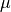 是偏移向量。 这样一个模型被称为 “生成的”，因为它描述了如何从  生成  。 如果我们使用所有的  作为列来形成一个矩阵 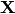 ，并将所有的  作为矩阵 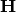 的列， 那么我们可以写（适当定义的  和  ）:

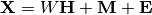

换句话说，我们 _分解_ 矩阵 . 如果给出 ，上述方程自动地表示以下概率解释：


对于一个完整的概率模型，我们还需要隐变量  的先验分布。 最直接的假设（基于高斯分布的良好性质）是 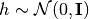. 这产生一个高斯分布作为  的边际分布:

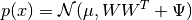

现在，在没有任何进一步假设的前提下，隐变量  是多余的 –  完全可以用均值和协方差来建模。 我们需要对这两个参数之一进行更具体的构造。 一个简单的附加假设是将误差协方差  构造成如下:

*   : 这个假设能推导出 [`PCA`](https://scikit-learn.org/stable/modules/generated/sklearn.decomposition.PCA.html#sklearn.decomposition.PCA "sklearn.decomposition.PCA") 的概率模型。
*   : 这个模型称为 [`FactorAnalysis`](https://scikit-learn.org/stable/modules/generated/sklearn.decomposition.FactorAnalysis.html#sklearn.decomposition.FactorAnalysis "sklearn.decomposition.FactorAnalysis"), 一个经典的统计模型。 矩阵W有时称为 “因子加载矩阵”。

两个模型基都可以使用低阶协方差矩阵来估计一个高斯分布。因为这两个模型都是概率性的，所以它们可以集成到更复杂的模型中，例如因子分析器的混合。如果隐变量基于非高斯分布的先验，则得到完全不同的模型（例如， [`FastICA`](https://scikit-learn.org/stable/modules/generated/sklearn.decomposition.FastICA.html#sklearn.decomposition.FastICA "sklearn.decomposition.FastICA") ）。

因子分析 _可以_ 产生与`PCA`类似的成分（例如其加载矩阵的列）。 然而，这些成分没有通用的性质（例如它们是否是正交的）:

**[](https://scikit-learn.org/stable/auto_examples/decomposition/plot_faces_decomposition.html) [](https://scikit-learn.org/stable/auto_examples/decomposition/plot_faces_decomposition.html)**

因子分析( [`PCA`](https://scikit-learn.org/stable/modules/generated/sklearn.decomposition.PCA.html#sklearn.decomposition.PCA "sklearn.decomposition.PCA") ) 的主要优点是可以独立地对输入空间的每个方向（异方差噪声）的方差进行建模:

[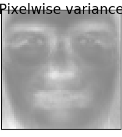](https://scikit-learn.org/stable/auto_examples/decomposition/plot_faces_decomposition.html)

在异方差噪声存在的情况下，这可以比概率 PCA 作出更好的模型选择:

[](https://scikit-learn.org/stable/auto_examples/decomposition/plot_pca_vs_fa_model_selection.html)

> **示例**:
>*   [Model selection with Probabilistic PCA and Factor Analysis (FA)](https://scikit-learn.org/stable/auto_examples/decomposition/plot_pca_vs_fa_model_selection.html#sphx-glr-auto-examples-decomposition-plot-pca-vs-fa-model-selection-py)

## 2.5.5. 独立成分分析（ICA）

独立分量分析将多变量信号分解为独立性最强的加性子组件。 它通过 [`Fast ICA`](https://scikit-learn.org/stable/modules/generated/sklearn.decomposition.FastICA.html#sklearn.decomposition.FastICA "sklearn.decomposition.FastICA") 算法在 scikit-learn 中实现。 ICA 通常不用于降低维度，而是用于分离叠加信号。 由于 ICA 模型不包括噪声项，因此要使模型正确，必须使用白化(whitening)。这可以在内部使用 whiten 参数或手动使用 PCA 的一种变体。

ICA 通常用于分离混合信号（称为 _盲源分离_ 的问题），如下例所示:

[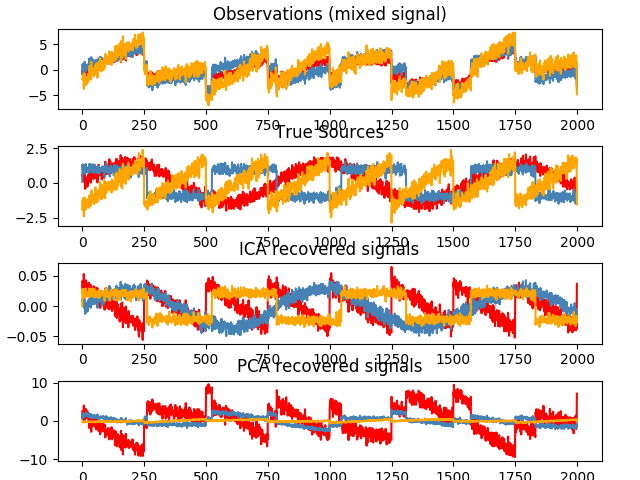](https://scikit-learn.org/stable/auto_examples/decomposition/plot_ica_blind_source_separation.html)

ICA 也可以用于寻找具有稀疏性的分量的非线性分解:

**[](https://scikit-learn.org/stable/auto_examples/decomposition/plot_faces_decomposition.html) [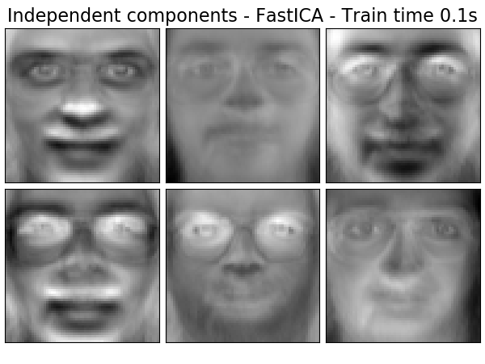](https://scikit-learn.org/stable/auto_examples/decomposition/plot_faces_decomposition.html)**

> **示例**:
>*   [Blind source separation using FastICA](https://scikit-learn.org/stable/auto_examples/decomposition/plot_ica_blind_source_separation.html#sphx-glr-auto-examples-decomposition-plot-ica-blind-source-separation-py)
>*   [FastICA on 2D point clouds](https://scikit-learn.org/stable/auto_examples/decomposition/plot_ica_vs_pca.html#sphx-glr-auto-examples-decomposition-plot-ica-vs-pca-py)
>*   [Faces dataset decompositions](https://scikit-learn.org/stable/auto_examples/decomposition/plot_faces_decomposition.html#sphx-glr-auto-examples-decomposition-plot-faces-decomposition-py)

## 2.5.6. 非负矩阵分解(NMF 或 NNMF)

### 2.5.6.1. NMF 与 Frobenius 范数

[`NMF`](https://scikit-learn.org/stable/modules/generated/sklearn.decomposition.NMF.html#sklearn.decomposition.NMF "sklearn.decomposition.NMF") [[1]](#id22) 是在数据和分量是非负情况下的另一种降维方法。 在数据矩阵不包含负值的情况下，可以插入 [`NMF`](https://scikit-learn.org/stable/modules/generated/sklearn.decomposition.NMF.html#sklearn.decomposition.NMF "sklearn.decomposition.NMF") 而不是 [`PCA`](https://scikit-learn.org/stable/modules/generated/sklearn.decomposition.PCA.html#sklearn.decomposition.PCA "sklearn.decomposition.PCA") 或其变体。 通过优化  与矩阵乘积 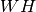 之间的距离  ，可以将样本  分解为两个非负矩阵  和 。 最广泛使用的距离函数是 Frobenius 平方范数，它是欧几里德范数到矩阵的推广:

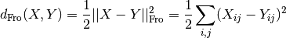

与 [`PCA`](https://scikit-learn.org/stable/modules/generated/sklearn.decomposition.PCA.html#sklearn.decomposition.PCA "sklearn.decomposition.PCA") 不同，通过叠加分量而不减去，以加法方式获得向量的表示。这种加性模型对于表示图像和文本是有效的。

[Hoyer, 2004] [[2]](#id23) 研究表明，当处于一定约束时，[`NMF`](https://scikit-learn.org/stable/modules/generated/sklearn.decomposition.NMF.html#sklearn.decomposition.NMF "sklearn.decomposition.NMF") 可以产生数据集基于某子部分的表示，从而获得可解释的模型。以下示例展示了与 PCA 特征面相比， [`NMF`](https://scikit-learn.org/stable/modules/generated/sklearn.decomposition.NMF.html#sklearn.decomposition.NMF "sklearn.decomposition.NMF") 从 Olivetti 面部数据集中的图像中发现的16个稀疏分量。

**[](https://scikit-learn.org/stable/auto_examples/decomposition/plot_faces_decomposition.html) [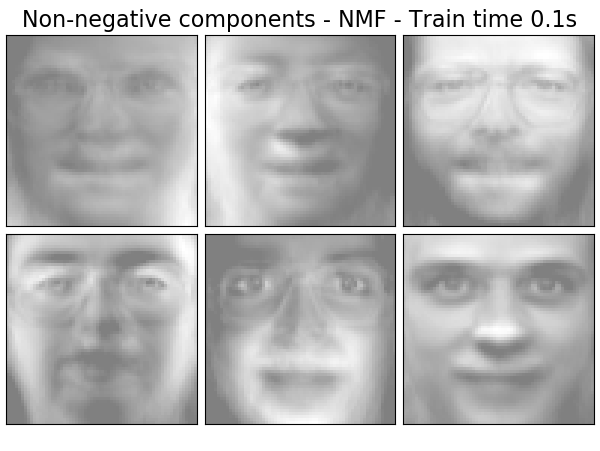](https://scikit-learn.org/stable/auto_examples/decomposition/plot_faces_decomposition.html)**

`init` 属性确定了应用的初始化方法，这对方法的性能有很大的影响。[`NMF`](https://scikit-learn.org/stable/modules/generated/sklearn.decomposition.NMF.html#sklearn.decomposition.NMF "sklearn.decomposition.NMF") 实现了非负双奇异值分解方法。NNDSVD [[4]](#id24) 基于两个 SVD 过程，一个估算数据矩阵, 另一个使用单位秩矩阵的代数性质估算的部分SVD因子的正部分。基本的 NNDSVD 算法更适合稀疏分解。其变体 NNDSVDa（全部零值替换为所有元素的平均值）和 NNDSVDar（零值替换为比数据平均值除以100小的随机扰动）在稠密情况时推荐使用。

请注意，乘法更新 ( Multiplicative Update ‘mu’) 求解器无法更新初始化中存在的零，因此当与引入大量零的基本 NNDSVD 算法联合使用时，会导致较差的结果; 在这种情况下，应优先使用 NNDSVDa 或 NNDSVDar。

也可以通过设置 `init="random"`，使用正确缩放的随机非负矩阵来初始化 [`NMF`](https://scikit-learn.org/stable/modules/generated/sklearn.decomposition.NMF.html#sklearn.decomposition.NMF "sklearn.decomposition.NMF")。 整数种子或 `RandomState` 也可以传递给 `random_state` 以控制重现性。

在 [`NMF`](https://scikit-learn.org/stable/modules/generated/sklearn.decomposition.NMF.html#sklearn.decomposition.NMF "sklearn.decomposition.NMF") 中，L1 和 L2 先验可以被添加到损失函数中以使模型正则化。 L2 先验使用 Frobenius 范数，而L1 先验使用 L1 范数。与 `ElasticNet` 一样， 我们通过 `l1_ratio` () 参数和正则化强度参数 `alpha` () 来控制 L1 和 L2 的组合。那么先验项是:


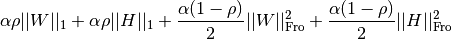


正则化目标函数为:


[`NMF`](https://scikit-learn.org/stable/modules/generated/sklearn.decomposition.NMF.html#sklearn.decomposition.NMF "sklearn.decomposition.NMF") 正则化 W 和 H . 公共函数 `non_negative_factorization` 允许通过 `regularization` 属性进行更精细的控制，将 仅W ，仅H 或两者正则化。

### 2.5.6.2. 具有 beta-divergence 的 NMF

如前所述，最广泛使用的距离函数是 Frobenius 平方范数，这是欧几里得范数到矩阵的推广:


其他距离函数可用于 NMF，例如（广义） Kullback-Leibler(KL) 散度，也称为 I-divergence:


或者， Itakura-Saito(IS) divergence:

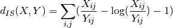

这三个距离函数是 beta-divergence 函数族的特殊情况，其参数分别为  [[6]](#id26) 。 beta-divergence 定义如下:

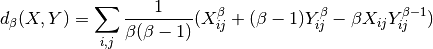

[](https://scikit-learn.org/stable/auto_examples/decomposition/plot_beta_divergence.html)

请注意，在 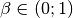 上定义无效，仅仅分别连续扩展到 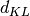 和 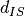 。

[`NMF`](https://scikit-learn.org/stable/modules/generated/sklearn.decomposition.NMF.html#sklearn.decomposition.NMF "sklearn.decomposition.NMF") 使用  坐标下降 ( Coordinate Descent ‘cd’) [[5]](#id25) 和乘法更新( Multiplicative Update ‘mu’) [[6]](#id26) 来实现两个求解器。 ‘mu’ 求解器可以被用于优化每个 beta-divergence，包括 Frobenius 范数 () ， （广义） Kullback-Leibler divergence () 和Itakura-Saito divergence（beta = 0））。请注意，对于 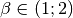，’mu’ 求解器明显快于  的其他值。还要注意，使用负数（或0，即 ‘itakura-saito’ ） ，输入矩阵不能包含零值。

‘cd’ 求解器只能优化 Frobenius 范数。由于 NMF 的潜在非凸性，即使优化相同的距离函数，不同的求解器也可能会收敛到不同的最小值。

NMF最适用于 `fit_transform` 方法，该方法返回矩阵W.矩阵 H 被存储到拟合模型中的`components_` 属性; 方法 `transform` 将基于这些存储的分量,分解新的矩阵 X_new:

```py
>>> import numpy as np
>>> X = np.array([[1, 1], [2, 1], [3, 1.2], [4, 1], [5, 0.8], [6, 1]])
>>> from sklearn.decomposition import NMF
>>> model = NMF(n_components=2, init='random', random_state=0)
>>> W = model.fit_transform(X)
>>> H = model.components_
>>> X_new = np.array([[1, 0], [1, 6.1], [1, 0], [1, 4], [3.2, 1], [0, 4]])
>>> W_new = model.transform(X_new)

```

> **示例**:
>*   [Faces dataset decompositions](https://scikit-learn.org/stable/auto_examples/decomposition/plot_faces_decomposition.html#sphx-glr-auto-examples-decomposition-plot-faces-decomposition-py)
>*   [Topic extraction with Non-negative Matrix Factorization and Latent Dirichlet Allocation](https://scikit-learn.org/stable/auto_examples/applications/plot_topics_extraction_with_nmf_lda.html#sphx-glr-auto-examples-applications-plot-topics-extraction-with-nmf-lda-py)
>*   [Beta-divergence loss functions](https://scikit-learn.org/stable/auto_examples/decomposition/plot_beta_divergence.html#sphx-glr-auto-examples-decomposition-plot-beta-divergence-py)

> **参考资料**:
>* [1] [“Learning the parts of objects by non-negative matrix factorization”](http://www.columbia.edu/~jwp2128/Teaching/W4721/papers/nmf_nature.pdf) D. Lee, S. Seung, 1999
>* [2] [“Non-negative Matrix Factorization with Sparseness Constraints”](http://www.jmlr.org/papers/volume5/hoyer04a/hoyer04a.pdf) P. Hoyer, 2004
>* [4] [“SVD based initialization: A head start for nonnegative matrix factorization”](http://scgroup.hpclab.ceid.upatras.gr/faculty/stratis/Papers/HPCLAB020107.pdf) C. Boutsidis, E. Gallopoulos, 2008
>* [5] [“Fast local algorithms for large scale nonnegative matrix and tensor factorizations.”](http://www.bsp.brain.riken.jp/publications/2009/Cichocki-Phan-IEICE_col.pdf) A. Cichocki, P. Anh-Huy, 2009
>* [6]  [“Algorithms for nonnegative matrix factorization with the beta-divergence”](http://http://arxiv.org/pdf/1010.1763v3.pdf) C. Fevotte, J. Idier, 2011

## 2.5.7. 隐 Dirichlet 分配（LDA）

隐 Dirichlet 分配是离散数据集（如文本语料库）的集合的生成概率模型。 它也是一个主题模型，用于从文档集合中发现抽象主题。

LDA 的图形模型是一个三级生成模型:


关于上述图形模型中出现的符号的说明，可以在Hoffman et al.(2013)中找到:
 - 语料库是D个文档的集合。
 - 文档是由N个单词组成的序列。
 - 语料库中有K个主题。
 - 这些框表示重复采样。

在图形模型中，每个节点都是一个随机变量，在生成过程中起着一定的作用。阴影节点表示观察到的变量，未阴影节点表示隐藏的(潜在的)变量。在这种情况下，语料库中的单词是我们观察到的唯一数据。潜在变量决定了语料库中主题的随机混合和文档中单词的分布。LDA的目标是利用观察到的词语来推断隐含的主题结构。

当建模文本语料库时，该模型假设具有 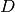 文档和  主题的语料库的以下生成过程, 其中 对应 API 中的 `n_components`:

1. 对于每个主题 $$k\in K$$, 绘制 $$\beta_k \thicksim Dirichlet(\eta) $$. 提供一个基于单词的分布, 比如, 一个单词在 topic $$k$$ 中出现的概率。 $$\eta$$ 对应 topic_word_prior。
2. 对于每个文档 $$d\in D$$, 绘制主题概率 $$\theta_k \thicksim Dirichlet(\alpha) $$. $$\alpha$$ 对应 doc_topic_prior。
3.  对于文档  中的每个单词 :
  1.  绘制主题索引 
  2.  绘制观察词 

对于参数估计，后验分布为:

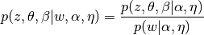


由于后验分布难以处理，变体贝叶斯方法使用更简单的分布 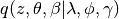 去近似估算， 并且优化了这些变体参数 , ,  以最大化Evidence Lower Bound (ELBO):


![\log\: P(w | \alpha, \eta) \geq L(w,\phi,\gamma,\lambda) \overset{\triangle}{=} E_{q}[\log\:p(w,z,\theta,\beta|\alpha,\eta)] - E_{q}[\log\:q(z, \theta, \beta)]](img/6d8b62cf31afb168e2b2acb89d6abccd.jpg)


最大化 ELBO 相当于最小化  和后验  之间的 Kullback-Leibler(KL) 散度。

[`LatentDirichletAllocation`](https://scikit-learn.org/stable/modules/generated/sklearn.decomposition.LatentDirichletAllocation.html#sklearn.decomposition.LatentDirichletAllocation "sklearn.decomposition.LatentDirichletAllocation") 实现在线变体贝叶斯算法，支持在线和批量更新方法。 批处理方法在每次完全传递数据后更新变体变量，在线方法从小批量数据点中更新变体变量。

> **注意**
>虽然在线方法保证收敛到局部最优点，最优点的质量和收敛速度可能取决于与小批量大小和学习率相关的属性。

当 [`LatentDirichletAllocation`](https://scikit-learn.org/stable/modules/generated/sklearn.decomposition.LatentDirichletAllocation.html#sklearn.decomposition.LatentDirichletAllocation "sklearn.decomposition.LatentDirichletAllocation") 应用于 “document-term” 矩阵时，矩阵将被分解为 “topic-term” 矩阵和 “document-topic” 矩阵。 虽然 “topic-term” 矩阵在模型中被存储为 `components_` ，但是可以通过 `transform` 方法计算 “document-topic” 矩阵。

[`LatentDirichletAllocation`](https://scikit-learn.org/stable/modules/generated/sklearn.decomposition.LatentDirichletAllocation.html#sklearn.decomposition.LatentDirichletAllocation "sklearn.decomposition.LatentDirichletAllocation") 还实现了 `partial_fit` 方法。这可用于当数据被顺序提取时。

> **示例**:
>*   [Topic extraction with Non-negative Matrix Factorization and Latent Dirichlet Allocation](https://scikit-learn.org/stable/auto_examples/applications/plot_topics_extraction_with_nmf_lda.html#sphx-glr-auto-examples-applications-plot-topics-extraction-with-nmf-lda-py)

> **参考资料**:
>*   [“Latent Dirichlet Allocation”](https://www.cs.princeton.edu/~blei/papers/BleiNgJordan2003.pdf) D. Blei, A. Ng, M. Jordan, 2003
>*   [“Online Learning for Latent Dirichlet Allocation”](https://www.cs.princeton.edu/~blei/papers/HoffmanBleiBach2010b.pdf) M. Hoffman, D. Blei, F. Bach, 2010
>*   [“Stochastic Variational Inference”](http://www.columbia.edu/~jwp2128/Papers/HoffmanBleiWangPaisley2013.pdf) M. Hoffman, D. Blei, C. Wang, J. Paisley, 2013

参考 [Neighborhood Components Analysis](7.html#1662-降维) 的降维方式.
