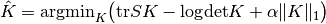


# 2.6. 协方差估计

校验者:
        [@李昊伟](https://github.com/apachecn/scikit-learn-doc-zh)
        [@小瑶](https://github.com/apachecn/scikit-learn-doc-zh)
        [@Loopy](https://github.com/loopyme)
        [@barrycg](https://github.com/barrycg)
翻译者:
        [@柠檬](https://github.com/apachecn/scikit-learn-doc-zh)

许多统计问题需要估计一个总体的协方差矩阵，这可以看作是对数据集散点图形状的估计。大多数情况下,必须对某个样本进行这样的估计,当它的属性(如尺寸,结构,均匀性)对估计质量有重大影响时。*sklearn.covariance* 包的目的是提供一个能在各种设置下准确估计总体协方差矩阵的工具。

我们假设观察是独立的，相同分布的 (i.i.d.)。

## 2.6.1. 经验协方差

总所周知,数据集的协方差矩阵可以被经典 _maximum likelihood estimator(最大似然估计)_ （或 “经验协方差”） 很好地近似，条件是与特征数量（描述观测值的变量）相比，观测数量足够大。 更准确地说，样本的最大似然估计是相应的总体协方差矩阵的无偏估计。

样本的经验协方差矩阵可以使用该包的函数 [`empirical_covariance`](https://scikit-learn.org/stable/modules/generated/sklearn.covariance.empirical_covariance.html#sklearn.covariance.empirical_covariance "sklearn.covariance.empirical_covariance") 计算 ， 或者使用 [`EmpiricalCovariance.fit`](https://scikit-learn.org/stable/modules/generated/sklearn.covariance.EmpiricalCovariance.html#sklearn.covariance.EmpiricalCovariance.fit "sklearn.covariance.EmpiricalCovariance.fit") 方法将对象[`EmpiricalCovariance`](https://scikit-learn.org/stable/modules/generated/sklearn.covariance.EmpiricalCovariance.html#sklearn.covariance.EmpiricalCovariance "sklearn.covariance.EmpiricalCovariance") 与数据样本拟合 。 要注意，根据数据是否聚集，结果会有所不同，所以可能需要准确地使用参数 `assume_centered`。更准确地说，如果要使用 `assume_centered=False`, 测试集应该具有与训练集相同的均值向量。 如果不是这样，两者都应该被用户聚集， 然后再使用 `assume_centered=True`。

> **示例**:
>*   See [Shrinkage covariance estimation: LedoitWolf vs OAS and max-likelihood](https://scikit-learn.org/stable/auto_examples/covariance/plot_covariance_estimation.html#sphx-glr-auto-examples-covariance-plot-covariance-estimation-py) for an example on how to fit an [`EmpiricalCovariance`](https://scikit-learn.org/stable/modules/generated/sklearn.covariance.EmpiricalCovariance.html#sklearn.covariance.EmpiricalCovariance "sklearn.covariance.EmpiricalCovariance") object to data.

## 2.6.2. 收缩协方差

### 2.6.2.1. 基本收缩

尽管是协方差矩阵的无偏估计， 最大似然估计不是协方差矩阵的特征值的一个很好的估计， 所以从反演(_译注：矩阵的求逆过程_)得到的精度矩阵是不准确的。 有时，甚至出现因矩阵元素地特性,经验协方差矩阵不能求逆。 为了避免这样的反演问题，引入了经验协方差矩阵的一种变换方式：`shrinkage` 。

在 scikit-learn 中，该变换（使用用户定义的收缩系数） 可以直接应用于使用 [`shrunk_covariance`](https://scikit-learn.org/stable/modules/generated/sklearn.covariance.shrunk_covariance.html#sklearn.covariance.shrunk_covariance "sklearn.covariance.shrunk_covariance") 方法预先计算的协方差。 此外，协方差的收缩估计可以通过 [`ShrunkCovariance`](https://scikit-learn.org/stable/modules/generated/sklearn.covariance.ShrunkCovariance.html#sklearn.covariance.ShrunkCovariance "sklearn.covariance.ShrunkCovariance") 对象的 [`ShrunkCovariance.fit`](https://scikit-learn.org/stable/modules/generated/sklearn.covariance.ShrunkCovariance.html#sklearn.covariance.ShrunkCovariance.fit "sklearn.covariance.ShrunkCovariance.fit") 方法拟合到数据中。再次，根据数据是否聚集，结果会不同，所以可能要准确使用参数 `assume_centered` 。

在数学上，这种收缩在于减少经验协方差矩阵的最小和最大特征值之间的比率 可以通过简单地根据给定的偏移量移动每个特征值来完成，这相当于找到协方差矩阵的l2惩罚的最大似然估计器（l2-penalized Maximum Likelihood Estimator）。在实践中，收缩归结为简单的凸变换：
.

选择收缩量，  相当于设置了偏差/方差权衡，下面将就此进行讨论。

> **示例**:
>*   See [Shrinkage covariance estimation: LedoitWolf vs OAS and max-likelihood](https://scikit-learn.org/stable/auto_examples/covariance/plot_covariance_estimation.html#sphx-glr-auto-examples-covariance-plot-covariance-estimation-py) for an example on how to fit a [`ShrunkCovariance`](https://scikit-learn.org/stable/modules/generated/sklearn.covariance.ShrunkCovariance.html#sklearn.covariance.ShrunkCovariance "sklearn.covariance.ShrunkCovariance") object to data.

### 2.6.2.2. Ledoit-Wolf 收缩

在他们的 2004 年的论文 [[1]](#id6) 中， O.Ledoit 和 M.Wolf 提出了一个公式， 用来计算最优的收缩系数  ，它使得估计协方差和实际协方差矩阵之间的均方误差(Mean Squared Error)进行最小化。

可以使用[sklearn.covariance](https://scikit-learn.org/stable/modules/classes.html#module-sklearn.covariance)包中 [`ledoit_wolf`](https://scikit-learn.org/stable/modules/generated/sklearn.covariance.ledoit_wolf.html#sklearn.covariance.ledoit_wolf "sklearn.covariance.ledoit_wolf") 函数来计算样本的协方差的Ledoit-Wolf 估计， 或者拟合一个[`LedoitWolf`](https://scikit-learn.org/stable/modules/generated/sklearn.covariance.LedoitWolf.html#sklearn.covariance.LedoitWolf "sklearn.covariance.LedoitWolf") 对象对相同的样本来获取该估计。

>**注意**:协方差矩阵为各向同性(isotropic)的情形
>
>值得注意的是，当样本数量远远大于特征数量时，人们会认为不需要收缩。这背后的直觉是，如果总体协方差是满秩的， 当样本数量增加时，样本协方差也会变为正定。因此，没有收缩的必要，该方法应该自动做到这一点。
>
>然而， 上述情况并不适用于总体协方差恰好是恒等矩阵(identity matrix)的倍数时, 即Ledoit-Wolf过程。在这种情况下，Ledoit-Wolf收缩估计值随着样本数的增加而接近1。这表明，Ledoit-Wolf意义下协方差矩阵的最优估计是恒等式的倍数(multiple of the identity)。 由于总体协方差已经是恒等矩阵的倍数，Ledoit-Wolf解确实是一个合理的估计。

> **示例**:
>*   See [Shrinkage covariance estimation: LedoitWolf vs OAS and max-likelihood](https://scikit-learn.org/stable/auto_examples/covariance/plot_covariance_estimation.html#sphx-glr-auto-examples-covariance-plot-covariance-estimation-py) 关于如何将 [`LedoitWolf`](https://scikit-learn.org/stable/modules/generated/sklearn.covariance.LedoitWolf.html#sklearn.covariance.LedoitWolf "sklearn.covariance.LedoitWolf") 对象与数据拟合， 并将 Ledoit-Wolf 估计器的性能进行可视化的示例。

> **参考资料**:
>* [1] O. Ledoit and M. Wolf, “A Well-Conditioned Estimator for Large-Dimensional Covariance Matrices”, Journal of Multivariate Analysis, Volume 88, Issue 2, February 2004, pages 365-411.

### 2.6.2.3. Oracle 近似收缩

在数据为高斯分布的假设下，Chen et al. 等 [[2]](#id8) 推导出了一个公式，旨在 产生比 Ledoit-Wolf 公式具有更小均方误差的收缩系数。 所得到的估计器被称为协方差的 Oracle 收缩近似估计器。

可以使用[sklearn.covariance](https://scikit-learn.org/stable/modules/classes.html#module-sklearn.covariance) 包中函数 [`oas`](https://scikit-learn.org/stable/modules/generated/sklearn.covariance.oas.html#sklearn.covariance.oas "sklearn.covariance.oas") 计算样本协方差的OAS估计，或者可以通过将 [`OAS`](https://scikit-learn.org/stable/modules/generated/sklearn.covariance.OAS.html#sklearn.covariance.OAS "sklearn.covariance.OAS") 对象拟合到相同的样本来获得该估计。

设定收缩时的偏差方差权衡：比较 Ledoit-Wolf 和 OAS 估计的选择

> **参考资料**:
>* [2]Chen et al., “Shrinkage Algorithms for MMSE Covariance Estimation”, IEEE Trans. on Sign. Proc., Volume 58, Issue 10, October 2010.

> **示例**:
>*   See [Shrinkage covariance estimation: LedoitWolf vs OAS and max-likelihood](https://scikit-learn.org/stable/auto_examples/covariance/plot_covariance_estimation.html#sphx-glr-auto-examples-covariance-plot-covariance-estimation-py) for an example on how to fit an [`OAS`](https://scikit-learn.org/stable/modules/generated/sklearn.covariance.OAS.html#sklearn.covariance.OAS "sklearn.covariance.OAS") object to data.
>*   See [Ledoit-Wolf vs OAS estimation](https://scikit-learn.org/stable/auto_examples/covariance/plot_lw_vs_oas.html#sphx-glr-auto-examples-covariance-plot-lw-vs-oas-py) to visualize the Mean Squared Error difference between a [`LedoitWolf`](https://scikit-learn.org/stable/modules/generated/sklearn.covariance.LedoitWolf.html#sklearn.covariance.LedoitWolf "sklearn.covariance.LedoitWolf") and an [`OAS`](https://scikit-learn.org/stable/modules/generated/sklearn.covariance.OAS.html#sklearn.covariance.OAS "sklearn.covariance.OAS") estimator of the covariance.

## 2.6.3. 稀疏逆协方差

协方差矩阵的逆矩阵，通常称为精度矩阵（precision matrix），它与部分相关矩阵（partial correlation matrix）成正比。它给出部分独立性关系。换句话说，如果两个特征与其他特征有条件地独立， 则精度矩阵中的对应系数将为零。这就是为什么估计一个稀疏精度矩阵是有道理的：通过从数据中学习独立关系， 可以得到更好的协方差矩阵估计。这被称为 _协方差选择(covariance selection)_。

在小样本的情况，即 `n_samples` 和 `n_features`  相等或更小， 稀疏的逆协方差估计往往比收缩的协方差估计更好。然而，在相反的情况下，或者对于非常相关的数据，它们可能在数值上不稳定。 此外，与收缩估算不同，稀疏估计器能够恢复非对角线结构 （off-diagonal structure）。

[`GraphLasso`](https://scikit-learn.org/stable/modules/generated/sklearn.covariance.GraphLasso.html#sklearn.covariance.GraphLasso "sklearn.covariance.GraphLasso") 估计器使用 L1 惩罚确立精度矩阵的稀疏性： `alpha` 参数越高，精度矩阵的稀疏性越大。 相应的 [`GraphLassoCV`](https://scikit-learn.org/stable/modules/generated/sklearn.covariance.GraphLassoCV.html#sklearn.covariance.GraphLassoCV "sklearn.covariance.GraphLassoCV") 对象使用交叉验证来自动设置 `alpha` 参数。

协方差矩阵和 精度矩阵基于最大似然度估计,收缩估计和稀疏估计的比较_

> **注意**:**结构恢复**
>
>从数据中的相关性恢复图形结构是一个具有挑战性的事情。如果您对这种恢复感兴趣，请记住：
>*   相关矩阵的恢复比协方差矩阵更容易：在运行 [`GraphLasso`](https://scikit-learn.org/stable/modules/generated/sklearn.covariance.GraphLasso.html#sklearn.covariance.GraphLasso "sklearn.covariance.GraphLasso") 前先标准化观察值
>*   如果底层图具有比平均节点更多的连接节点，则算法将错过其中一些连接。
>*   如果您的观察次数与底层图形中的边数相比不大，则不会恢复。
>*   即使您具有良好的恢复条件，通过交叉验证（例如使用GraphLassoCV对象）选择的 Alpha 参数将导致选择太多边。然而，相关的边会比不相关的边有更大的权重。

数学公式如下：

其中： 是要估计的精度矩阵（precision matrix），  是样本的协方差矩阵。  是非对角系数  （off-diagonal coefficients）的绝对值之和。 用于解决这个问题的算法是来自 Friedman 2008 Biostatistics 论文的 GLasso 算法。 它与 R 语言 `glasso` 包中的算法相同。

> **示例**:
>*   [Sparse inverse covariance estimation](https://scikit-learn.org/stable/auto_examples/covariance/plot_sparse_cov.html#sphx-glr-auto-examples-covariance-plot-sparse-cov-py):合成数据的示例，显示结构的一些恢复，并与其他协方差估计器进行比较。
>*   [Visualizing the stock market structure](https://scikit-learn.org/stable/auto_examples/applications/plot_stock_market.html#sphx-glr-auto-examples-applications-plot-stock-market-py): 真实股票市场数据的示例，查找哪些信号相关度最强。

> **参考资料**:
>*   Friedman et al, [“Sparse inverse covariance estimation with the graphical lasso”](http://biostatistics.oxfordjournals.org/content/9/3/432.short), Biostatistics 9, pp 432, 2008

## 2.6.4. 鲁棒协方差估计

实际数据集通常是会有测量或记录错误。常规但不常见的观察也可能出于各种原因。 每个不常见的观察称为异常值(outliers)。上面提出的经验协方差估计器和收缩协方差估计器对数据中异常值非常敏感。 因此，应该使用鲁棒协方差估计（robust covariance estimators）来估算其真实数据集的协方差。 或者，可以使用鲁棒协方差估计器来执行异常值检测， 并根据数据的进一步处理:丢弃/降低某些观察值。

`sklearn.covariance` 包实现了 robust estimator of covariance， 即 Minimum Covariance Determinant [3]。

### 2.6.4.1. 最小协方差决定

最小协方差决定（Minimum Covariance Determinant）估计器是 由 P.J. Rousseeuw 在 [[3]](#id14) 中引入的数据集协方差的鲁棒估计 (robust estimator)。 这个想法是找出一个给定比例（h）的 “好” 观察值，它们不是离群值， 且可以计算其经验协方差矩阵。 然后将该经验协方差矩阵重新缩放以补偿所执行的观察选择（”consistency step(一致性步骤)”）。计算完最小协方差决定估计器后，可以根据其马氏距离（Mahalanobis distance）给出观测值的权重, 得到数据集的协方差矩阵的重新加权估计（”reweighting step(重新加权步骤)”）。

Rousseeuw 和 Van Driessen [[4]](#id15) 开发了 FastMCD 算法，以计算最小协方差决定因子（Minimum Covariance Determinant）。在 scikit-learn 中，在将 MCD 对象拟合到数据时, 使用该算法。FastMCD 算法同时计算数据集位置的鲁棒估计。

原始估计(Raw estimates)可通过 [`MinCovDet`](https://scikit-learn.org/stable/modules/generated/sklearn.covariance.MinCovDet.html#sklearn.covariance.MinCovDet "sklearn.covariance.MinCovDet") 对象的 `raw_location_` 和 `raw_covariance_` 属性获得。

> **参考资料**:
>* [3] P. J. Rousseeuw. Least median of squares regression. J. Am Stat Ass, 79:871, 1984.
>* [4] A Fast Algorithm for the Minimum Covariance Determinant Estimator, 1999, American Statistical Association and the American Society for Quality, TECHNOMETRICS.

> **示例**:
>*   See [Robust vs Empirical covariance estimate](https://scikit-learn.org/stable/auto_examples/covariance/plot_robust_vs_empirical_covariance.html#sphx-glr-auto-examples-covariance-plot-robust-vs-empirical-covariance-py) 关于如何将对象 [`MinCovDet`](https://scikit-learn.org/stable/modules/generated/sklearn.covariance.MinCovDet.html#sklearn.covariance.MinCovDet "sklearn.covariance.MinCovDet") 与数据拟合的示例， 尽管存在异常值，但估计结果仍然比较准确。
>*   See [Robust covariance estimation and Mahalanobis distances relevance](https://scikit-learn.org/stable/auto_examples/covariance/plot_mahalanobis_distances.html#sphx-glr-auto-examples-covariance-plot-mahalanobis-distances-py) 依据马氏距离（Mahalanobis distance），对协方差估计器 [`EmpiricalCovariance`](https://scikit-learn.org/stable/modules/generated/sklearn.covariance.EmpiricalCovariance.html#sklearn.covariance.EmpiricalCovariance "sklearn.covariance.EmpiricalCovariance") 和 [`MinCovDet`](https://scikit-learn.org/stable/modules/generated/sklearn.covariance.MinCovDet.html#sklearn.covariance.MinCovDet "sklearn.covariance.MinCovDet") 之间的差异进行可视化。（所以我们得到了精度矩阵的更好估计）

| 异常值对位置和协方差估计的影响 | 使用Mahalanobis距离分离内围点和离群点 |
| --- | --- |
|  |  |

