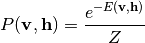
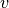

# 2.9. 神经网络模型（无监督）

校验者:
        [@不将就](https://github.com/apachecn/scikit-learn-doc-zh)
        [@Loopy](https://github.com/loopyme)
        [@barrycg](https://github.com/barrycg)
翻译者:
        [@夜神月](https://github.com/apachecn/scikit-learn-doc-zh)

## 2.9.1. 限制波尔兹曼机

限制玻尔兹曼机 (Restricted Boltzmann machines, 简称RBM)是基于概率模型的无监督非线性特征学习器。当用 RBM 或 多层次结构的RBMs 提取的特征在馈入线性分类器（如线性支持向量机或感知机）时通常会获得良好的结果。

该模型对输入的分布作出假设。目前，scikit-learn 只提供了 [`BernoulliRBM`](https://scikit-learn.org/stable/modules/generated/sklearn.neural_network.BernoulliRBM.html#sklearn.neural_network.BernoulliRBM "sklearn.neural_network.BernoulliRBM")，它假定输入是二值(binary values)的，或者是 0 到 1 之间的值，每个值都编码特定特征被激活的概率。

RBM 尝试使用特定图形模型最大化数据的可能性(the likelihood of the data)。所使用的参数学习算法（ [Stochastic Maximum Likelihood](#sml) （随机最大似然））防止特征表示偏离输入数据，这使得它们能学习到有趣的特征，但使得该模型对于小数据集不太有用且通常对于密度估计无效。

该方法因为深层神经网络需要独立RBM的权重来初始化而普及。这种方法被称为无监督的预训练（unsupervised pre-training）。

> **示例**:
>*   [Restricted Boltzmann Machine features for digit classification](https://scikit-learn.org/stable/auto_examples/neural_networks/plot_rbm_logistic_classification.html#sphx-glr-auto-examples-neural-networks-plot-rbm-logistic-classification-py)

### 2.9.1.1. 图形模型和参数化

RBM 的图形模型是一个全连接的二分图（fully-connected bipartite graph）。

节点是随机变量，其状态取决于它连接到的其他节点的状态。这个模型可通过连接的权重值进行参数化,同时每个可见或隐藏单元都有一个偏置项(biased term), 为了简单起见, 上图中的偏置项被省略了。

用能量函数衡量联合概率分布的质量:

在上面的公式中，  和  分别是可见层和隐藏层的偏置向量。 模型的联合概率是根据能量来定义的:

“限制”是指模型的二分图结构，它禁止隐藏单元之间或可见单元之间的直接交互。 这代表以下条件独立性成立:

二分图结构允许使用高效的块吉比斯采样(block Gibbs sampling)进行推断。

### 2.9.1.2. 伯努利限制玻尔兹曼机

在 [`BernoulliRBM`](https://scikit-learn.org/stable/modules/generated/sklearn.neural_network.BernoulliRBM.html#sklearn.neural_network.BernoulliRBM "sklearn.neural_network.BernoulliRBM") 中，所有单位都是二进制随机单元。 这意味着输入数据应该是二值,或者是在 0 和 1 之间的实数值, 其表示可见单元活跃或不活跃的概率。 这是一个很好的字符识别模型，其中的关注点是哪些像素是活跃的，哪些不是。 对于自然场景的图像，它不再适合，因为背景，深度和相邻像素的趋势取相同的值。

每个单位的条件概率分布由其接收的输入的 logistic sigmoid函数给出:

其中  是 logistic sigmoid函数:

### 2.9.1.3. 随机最大似然学习

在 [`BernoulliRBM`](https://scikit-learn.org/stable/modules/generated/sklearn.neural_network.BernoulliRBM.html#sklearn.neural_network.BernoulliRBM "sklearn.neural_network.BernoulliRBM") 函数中实现的训练算法被称为随机最大似然（Stochastic Maximum Likelihood (SML)）或持续对比发散（Persistent Contrastive Divergence (PCD)）。由于数据的似然函数的形式，直接优化最大似然是不可行的:

为了简单起见，上面的等式是针对单个训练样本所写的。相对于权重的梯度由对应于上述的两个项构成。根据它们的符号，它们通常被称为正梯度和负梯度。在这种实现中，按照小批量样本（mini-batches of samples ）对梯度进行计算。

在最大化对数似然度(maximizing the log-likelihood)的情况下，正梯度使模型更倾向于与观察到的训练数据兼容的隐藏状态。由于 RBM 的二分体结构，可以高效地计算。然而，负梯度是棘手的。其目标是降低模型偏好的联合状态的能量，从而使数据保持真实。可以通过马尔可夫链蒙特卡罗近似，使用块吉比斯采样，通过迭代地对每个  和  进行交互采样，直到链混合。以这种方式产生的样本有时被称为幻想粒子。这是无效的，很难确定马可夫链是否混合。

对比发散方法建议在经过少量迭代后停止链，迭代数 通常为 1.该方法快速且方差小，但样本远离模型分布。

持续对比发散(PCD)解决了这个问题。而不是每次需要梯度时都启动一个新的链，并且只执行一个吉比斯采样步骤，在 PCD 中，我们保留了多个链（幻想粒子）,每个 链,在每个权重更新之后, 执行个吉比斯采样步骤。这使得粒子能更彻底地探索空间.

> **参考资料**:
>*   [“A fast learning algorithm for deep belief nets”](http://www.cs.toronto.edu/~hinton/absps/fastnc.pdf) G. Hinton, S. Osindero, Y.-W. Teh, 2006
>*   [“Training Restricted Boltzmann Machines using Approximations to the Likelihood Gradient”](http://www.cs.toronto.edu/~tijmen/pcd/pcd.pdf) T. Tieleman, 2008
