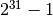
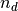
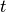
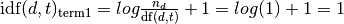

# 5.2. 特征提取

校验者:
        [@if only](https://github.com/apachecn/scikit-learn-doc-zh)
翻译者:
        [@片刻](https://github.com/apachecn/scikit-learn-doc-zh)

模块 [`sklearn.feature_extraction`](classes.html#module-sklearn.feature_extraction "sklearn.feature_extraction") 可用于提取符合机器学习算法支持的特征，比如文本和图片。

>**注意**
>特征特征提取与[特征选择](14.md#113-特征选择)有很大的不同：前者包括将任意数据（如文本或图像）转换为可用于机器学习的数值特征。后者是将这些特征应用到机器学习中。

## 5.2.1. 从字典类型加载特征

类 [`DictVectorizer`](https://scikit-learn.org/stable/modules/generated/sklearn.feature_extraction.DictVectorizer.html#sklearn.feature_extraction.DictVectorizer "sklearn.feature_extraction.DictVectorizer") 可用于将标准的Python字典（dict）对象列表的要素数组转换为 scikit-learn 估计器使用的 NumPy/SciPy 表示形式。

虽然 Python 的处理速度不是特别快，但 Python 的 `dict` 优点是使用方便，稀疏（不需要存储的特征），并且除了值之外还存储特征名称。

类 [`DictVectorizer`](https://scikit-learn.org/stable/modules/generated/sklearn.feature_extraction.DictVectorizer.html#sklearn.feature_extraction.DictVectorizer "sklearn.feature_extraction.DictVectorizer") 实现了 “one-of-K” 或 “one-hot” 编码，用于分类（也称为标称，离散）特征。分类功能是 “属性值” 对，其中该值被限制为不排序的可能性的离散列表（例如主题标识符，对象类型，标签，名称…）。

在下面的例子，”城市” 是一个分类属性，而 “温度” 是传统的数字特征:

```py
>>> measurements = [
...     {'city': 'Dubai', 'temperature': 33.},
...     {'city': 'London', 'temperature': 12.},
...     {'city': 'San Francisco', 'temperature': 18.},
... ]

>>> from sklearn.feature_extraction import DictVectorizer
>>> vec = DictVectorizer()

>>> vec.fit_transform(measurements).toarray()
array([[  1.,   0.,   0.,  33.],
 [  0.,   1.,   0.,  12.],
 [  0.,   0.,   1.,  18.]])

>>> vec.get_feature_names()
['city=Dubai', 'city=London', 'city=San Francisco', 'temperature']

```

类 [`DictVectorizer`](https://scikit-learn.org/stable/modules/generated/sklearn.feature_extraction.DictVectorizer.html#sklearn.feature_extraction.DictVectorizer "sklearn.feature_extraction.DictVectorizer") 也是对自然语言处理模型中训练序列分类器的有用的表示变换，通常通过提取围绕感兴趣的特定的词的特征窗口来工作。

例如，假设我们具有提取我们想要用作训练序列分类器（例如：块）的互补标签的部分语音（PoS）标签的第一算法。以下 dict 可以是在 “坐在垫子上的猫” 的句子，围绕 “sat” 一词提取的这样一个特征窗口:

```py
>>> pos_window = [
...     {
...         'word-2': 'the',
...         'pos-2': 'DT',
...         'word-1': 'cat',
...         'pos-1': 'NN',
...         'word+1': 'on',
...         'pos+1': 'PP',
...     },
...     # in a real application one would extract many such dictionaries
... ]

```

该描述可以被矢量化为适合于呈递分类器的稀疏二维矩阵（可能在被管道 [`text.TfidfTransformer`](https://scikit-learn.org/stable/modules/generated/sklearn.feature_extraction.text.TfidfTransformer.html#sklearn.feature_extraction.text.TfidfTransformer "sklearn.feature_extraction.text.TfidfTransformer") 进行归一化之后）:

```py
>>> vec = DictVectorizer()
>>> pos_vectorized = vec.fit_transform(pos_window)
>>> pos_vectorized                
<1x6 sparse matrix of type '<... 'numpy.float64'>'
 with 6 stored elements in Compressed Sparse ... format>
>>> pos_vectorized.toarray()
array([[ 1.,  1.,  1.,  1.,  1.,  1.]])
>>> vec.get_feature_names()
['pos+1=PP', 'pos-1=NN', 'pos-2=DT', 'word+1=on', 'word-1=cat', 'word-2=the']

```

你可以想象，如果一个文本语料库的每一个单词都提取了这样一个上下文，那么所得的矩阵将会非常宽（许多 one-hot-features），其中大部分通常将会是0。 为了使结果数据结构能够适应内存，该类``DictVectorizer`` 的 `scipy.sparse` 默认使用一个矩阵而不是一个 `numpy.ndarray`。

## 5.2.2. 特征哈希（相当于一种降维技巧）

类 [`FeatureHasher`](https://scikit-learn.org/stable/modules/generated/sklearn.feature_extraction.FeatureHasher.html#sklearn.feature_extraction.FeatureHasher "sklearn.feature_extraction.FeatureHasher") 是一种高速，低内存消耗的向量化方法，它使用了[特征散列](https://en.wikipedia.org/wiki/Feature_hashing)技术 ，或可称为 “散列法” （hashing trick）的技术。 代替在构建训练中遇到的特征的哈希表，如向量化所做的那样 [`FeatureHasher`](https://scikit-learn.org/stable/modules/generated/sklearn.feature_extraction.FeatureHasher.html#sklearn.feature_extraction.FeatureHasher "sklearn.feature_extraction.FeatureHasher") 将哈希函数应用于特征，以便直接在样本矩阵中确定它们的列索引。 结果是以牺牲可检测性为代价，提高速度和减少内存的使用; 哈希表不记得输入特性是什么样的，没有 `inverse_transform` 办法。

由于散列函数可能导致（不相关）特征之间的冲突，因此使用带符号散列函数，并且散列值的符号确定存储在特征的输出矩阵中的值的符号。 这样，碰撞可能会抵消而不是累积错误，并且任何输出要素的值的预期平均值为零。默认情况下，此机制将使用 `alternate_sign=True` 启用，对于小型哈希表大小（`n_features &lt; 10000`）特别有用。 对于大的哈希表大小，可以禁用它，以便将输出传递给估计器，如 [`sklearn.naive_bayes.MultinomialNB`](https://scikit-learn.org/stable/modules/generated/sklearn.naive_bayes.MultinomialNB.html#sklearn.naive_bayes.MultinomialNB "sklearn.naive_bayes.MultinomialNB") 或 [`sklearn.feature_selection.chi2`](https://scikit-learn.org/stable/modules/generated/sklearn.feature_selection.chi2.html#sklearn.feature_selection.chi2 "sklearn.feature_selection.chi2") 特征选择器，这些特征选项器可以使用非负输入。

类 [`FeatureHasher`](https://scikit-learn.org/stable/modules/generated/sklearn.feature_extraction.FeatureHasher.html#sklearn.feature_extraction.FeatureHasher "sklearn.feature_extraction.FeatureHasher") 接受映射（如 Python 的 `dict` 及其在 `collections` 模块中的变体），使用键值对 `(feature, value)` 或字符串，具体取决于构造函数参数 `input_type`。 映射被视为 `(feature, value)` 对的列表，而单个字符串的隐含值为1，因此 `['feat1', 'feat2', 'feat3']` 被解释为 `[('feat1', 1), ('feat2', 1), ('feat3', 1)]`。 如果单个特征在样本中多次出现，相关值将被求和（所以 `('feat', 2)` 和 `('feat', 3.5)` 变为 `('feat', 5.5)`）。 [`FeatureHasher`](https://scikit-learn.org/stable/modules/generated/sklearn.feature_extraction.FeatureHasher.html#sklearn.feature_extraction.FeatureHasher "sklearn.feature_extraction.FeatureHasher") 的输出始终是 CSR 格式的 `scipy.sparse` 矩阵。

特征散列可以在文档分类中使用，但与 [`text.CountVectorizer`](https://scikit-learn.org/stable/modules/generated/sklearn.feature_extraction.text.CountVectorizer.html#sklearn.feature_extraction.text.CountVectorizer "sklearn.feature_extraction.text.CountVectorizer") 不同，[`FeatureHasher`](https://scikit-learn.org/stable/modules/generated/sklearn.feature_extraction.FeatureHasher.html#sklearn.feature_extraction.FeatureHasher "sklearn.feature_extraction.FeatureHasher") 不执行除 Unicode 或 UTF-8 编码之外的任何其他预处理; 请参阅下面的哈希技巧向量化大文本语料库，用于组合的 tokenizer/hasher。

例如，有一个词级别的自然语言处理任务，需要从 `(token, part_of_speech)` 键值对中提取特征。可以使用 Python 生成器函数来提取功能:

```py
def token_features(token, part_of_speech):
    if token.isdigit():
        yield "numeric"
    else:
        yield "token={}".format(token.lower())
        yield "token,pos={},{}".format(token, part_of_speech)
    if token[0].isupper():
        yield "uppercase_initial"
    if token.isupper():
        yield "all_uppercase"
    yield "pos={}".format(part_of_speech)

```

然后， `raw_X` 为了可以传入 `FeatureHasher.transform` 可以通过如下方式构造:

```py
raw_X = (token_features(tok, pos_tagger(tok)) for tok in corpus)

```

并传入一个 hasher:

```py
hasher = FeatureHasher(input_type='string')
X = hasher.transform(raw_X)

```

得到一个 `scipy.sparse` 类型的矩阵 `X`。

注意使用发生器的理解，它将懒惰引入到特征提取中：词令牌（token）只能根据需要从哈希值进行处理。

### 5.2.2.1. 实现细节

类 [`FeatureHasher`](https://scikit-learn.org/stable/modules/generated/sklearn.feature_extraction.FeatureHasher.html#sklearn.feature_extraction.FeatureHasher "sklearn.feature_extraction.FeatureHasher") 使用签名的 32-bit 变体的 MurmurHash3。 因此导致（并且由于限制 `scipy.sparse`），当前支持的功能的最大数量 .

特征哈希的原始形式源于Weinberger et al，使用两个单独的哈希函数， 和  分别确定特征的列索引和符号。 现有的实现是基于假设：MurmurHash3的符号位与其他位独立。

由于使用简单的模数将哈希函数转换为列索引，建议使用2次幂作为 `n_features` 参数; 否则特征不会均匀的分布到列中。

> **参考资料**:
>*   Kilian Weinberger, Anirban Dasgupta, John Langford, Alex Smola and Josh Attenberg (2009). [用于大规模多任务学习的特征散列](http://alex.smola.org/papers/2009/Weinbergeretal09.pdf). Proc. ICML.
>*   [MurmurHash3](https://github.com/aappleby/smhasher).

## 5.2.3. 文本特征提取

### 5.2.3.1. 话语表示

文本分析是机器学习算法的主要应用领域。 然而，原始数据，符号文字序列不能直接传递给算法，因为它们大多数要求具有固定长度的数字矩阵特征向量，而不是具有可变长度的原始文本文档。

为解决这个问题，scikit-learn提供了从文本内容中提取数字特征的最常见方法，即：

*   **令牌化（tokenizing）** 对每个可能的词令牌分成字符串并赋予整数形的id，例如通过使用空格和标点符号作为令牌分隔符。
*   **统计（counting）** 每个词令牌在文档中的出现次数。
*   **标准化（normalizing）** 在大多数的文档 / 样本中，可以减少重要的次令牌的出现次数的权重。。

在该方案中，特征和样本定义如下：

*   每个**单独的令牌发生频率**（标准化或不标准化）被视为一个**特征**。
*   给定**文档**中所有的令牌频率向量被看做一个多元sample**样本**。

因此，文本的集合可被表示为矩阵形式，每行对应一条文本，每列对应每个文本中出现的词令牌(如单个词)。

我们称**向量化**是将文本文档集合转换为数字集合特征向量的普通方法。 这种特殊思想（令牌化，计数和归一化）被称为 **Bag of Words** 或 “Bag of n-grams” 模型。 文档由单词出现来描述，同时完全忽略文档中单词的相对位置信息。

### 5.2.3.2. 稀疏

由于大多数文本文档通常只使用文本词向量全集中的一个小子集，所以得到的矩阵将具有许多特征值为零（通常大于99％）。

例如，10,000 个短文本文档（如电子邮件）的集合将使用总共100,000个独特词的大小的词汇，而每个文档将单独使用100到1000个独特的单词。

为了能够将这样的矩阵存储在存储器中，并且还可以加速代数的矩阵/向量运算，实现通常将使用诸如 `scipy.sparse` 包中的稀疏实现。

### 5.2.3.3. 常见 Vectorizer 使用方法

类 [`CountVectorizer`](https://scikit-learn.org/stable/modules/generated/sklearn.feature_extraction.text.CountVectorizer.html#sklearn.feature_extraction.text.CountVectorizer "sklearn.feature_extraction.text.CountVectorizer") 在单个类中实现了 tokenization （词语切分）和 occurrence counting （出现频数统计）:

```py
>>> from sklearn.feature_extraction.text import CountVectorizer

```

这个模型有很多参数，但参数的默认初始值是相当合理的（请参阅 [参考文档](classes.html#text-feature-extraction-ref) 了解详细信息）:

```py
>>> vectorizer = CountVectorizer()
>>> vectorizer                     
CountVectorizer(analyzer=...'word', binary=False, decode_error=...'strict',
 dtype=<... 'numpy.int64'>, encoding=...'utf-8', input=...'content',
 lowercase=True, max_df=1.0, max_features=None, min_df=1,
 ngram_range=(1, 1), preprocessor=None, stop_words=None,
 strip_accents=None, token_pattern=...'(?u)\\b\\w\\w+\\b',
 tokenizer=None, vocabulary=None)

```

我们用它来对简约的文本语料库进行 tokenize（分词）和统计单词出现频数:

```py
>>> corpus = [
...     'This is the first document.',
...     'This is the second second document.',
...     'And the third one.',
...     'Is this the first document?',
... ]
>>> X = vectorizer.fit_transform(corpus)
>>> X                              
<4x9 sparse matrix of type '<... 'numpy.int64'>'
 with 19 stored elements in Compressed Sparse ... format>

```

默认配置通过提取至少 2 个字母的单词来对 string 进行分词。做这一步的函数可以显式地被调用:

```py
>>> analyze = vectorizer.build_analyzer()
>>> analyze("This is a text document to analyze.") == (
...     ['this', 'is', 'text', 'document', 'to', 'analyze'])
True

```

analyzer 在拟合过程中找到的每个 term（项）都会被分配一个唯一的整数索引，对应于 resulting matrix（结果矩阵）中的一列。此列的一些说明可以被检索如下:

```py
>>> vectorizer.get_feature_names() == (
...     ['and', 'document', 'first', 'is', 'one',
...      'second', 'the', 'third', 'this'])
True

>>> X.toarray()           
array([[0, 1, 1, 1, 0, 0, 1, 0, 1],
 [0, 1, 0, 1, 0, 2, 1, 0, 1],
 [1, 0, 0, 0, 1, 0, 1, 1, 0],
 [0, 1, 1, 1, 0, 0, 1, 0, 1]]...)

```

从 feature 名称到 column index（列索引） 的逆映射存储在 `vocabulary_` 属性中:

```py
>>> vectorizer.vocabulary_.get('document')
1

```

因此，在未来对 transform 方法的调用中，在 training corpus （训练语料库）中没有看到的单词将被完全忽略:

```py
>>> vectorizer.transform(['Something completely new.']).toarray()
...                           
array([[0, 0, 0, 0, 0, 0, 0, 0, 0]]...)

```

请注意，在前面的 corpus（语料库）中，第一个和最后一个文档具有完全相同的词，因为被编码成相同的向量。 特别是我们丢失了最后一个文件是一个疑问的形式的信息。为了防止词组顺序颠倒，除了提取一元模型 1-grams（个别词）之外，我们还可以提取 2-grams 的单词:

```py
>>> bigram_vectorizer = CountVectorizer(ngram_range=(1, 2),
...                                     token_pattern=r'\b\w+\b', min_df=1)
>>> analyze = bigram_vectorizer.build_analyzer()
>>> analyze('Bi-grams are cool!') == (
...     ['bi', 'grams', 'are', 'cool', 'bi grams', 'grams are', 'are cool'])
True

```

由 vectorizer（向量化器）提取的 vocabulary（词汇）因此会变得更大，同时可以在定位模式时消除歧义:

```py
>>> X_2 = bigram_vectorizer.fit_transform(corpus).toarray()
>>> X_2
...                           
array([[0, 0, 1, 1, 1, 1, 1, 0, 0, 0, 0, 0, 1, 1, 0, 0, 0, 0, 1, 1, 0],
 [0, 0, 1, 0, 0, 1, 1, 0, 0, 2, 1, 1, 1, 0, 1, 0, 0, 0, 1, 1, 0],
 [1, 1, 0, 0, 0, 0, 0, 0, 1, 0, 0, 0, 1, 0, 0, 1, 1, 1, 0, 0, 0],
 [0, 0, 1, 1, 1, 1, 0, 1, 0, 0, 0, 0, 1, 1, 0, 0, 0, 0, 1, 0, 1]]...)

```

特别是 “Is this” 的疑问形式只出现在最后一个文档中:

```py
>>> feature_index = bigram_vectorizer.vocabulary_.get('is this')
>>> X_2[:, feature_index]     
array([0, 0, 0, 1]...)

```
#### 5.2.3.3.1 使用停止词
停止词是像“and”、“the”、“him”这样的词，这些词在表示文本内容时被认为是没有信息的，可以删除它们，以避免它们被理解为预测的信号。然而，有时，类似的词对预测很有用，比如在对写作风格或性格进行分类时。

在我们提供的“英w文”停止词列表中有几个已知的问题。详情参见[NQY18]。

请慎重选择停止词列表。流行的停止词列表可能包括对某些任务(如计算机)具有高度信息性的词。

您还应该确保停止单词列表具有与矢量化器中使用的相同的预处理和标记。单词"we’ve"被`CountVectorizer`的默认记号分配器分割成"we"和"ve"，所以如果"we’ve"在停止词列表中，但"ve"不在，"ve"会被保留在转换后的文本中。我们的矢量化器将尝试识别和警告某些类型的不一致性。

> **参考资料**
>* [NQY18]	J. Nothman, H. Qin and R. Yurchak (2018). “[Stop Word Lists in Free Open-source Software Packages](https://aclweb.org/anthology/W18-2502)”. In Proc. Workshop for NLP Open Source Software.

### 5.2.3.4. Tf–idf 项加权

在一个大的文本语料库中，一些单词将出现很多次（例如 “the”, “a”, “is” 是英文），因此对文档的实际内容没有什么有意义的信息。 如果我们将直接计数数据直接提供给分类器，那么这些频繁词组会掩盖住那些我们关注但很少出现的词。

为了重新计算特征权重，并将其转化为适合分类器使用的浮点值，因此使用 tf-idf 变换是非常常见的。

Tf表示**术语频率**，而 tf-idf 表示术语频率乘以**转制文档频率**: .

使用 `TfidfTransformer` 的默认设置，`TfidfTransformer(norm='l2', use_idf=True, smooth_idf=True, sublinear_tf=False)` 术语频率，一个术语在给定文档中出现的次数乘以 idf 组件， 计算为

,

其中  是文档的总数， 是包含术语  的文档数。 然后，所得到的 tf-idf 向量通过欧几里得范数归一化：

.

它源于一个词权重的信息检索方式(作为搜索引擎结果的评级函数)，同时也在文档分类和聚类中表现良好。

以下部分包含进一步说明和示例，说明如何精确计算 tf-idfs 以及如何在 scikit-learn 中计算 tf-idfs， [`TfidfTransformer`](https://scikit-learn.org/stable/modules/generated/sklearn.feature_extraction.text.TfidfTransformer.html#sklearn.feature_extraction.text.TfidfTransformer "sklearn.feature_extraction.text.TfidfTransformer") 并 [`TfidfVectorizer`](https://scikit-learn.org/stable/modules/generated/sklearn.feature_extraction.text.TfidfVectorizer.html#sklearn.feature_extraction.text.TfidfVectorizer "sklearn.feature_extraction.text.TfidfVectorizer") 与定义 idf 的标准教科书符号略有不同


在 [`TfidfTransformer`](https://scikit-learn.org/stable/modules/generated/sklearn.feature_extraction.text.TfidfTransformer.html#sklearn.feature_extraction.text.TfidfTransformer "sklearn.feature_extraction.text.TfidfTransformer") 和 [`TfidfVectorizer`](https://scikit-learn.org/stable/modules/generated/sklearn.feature_extraction.text.TfidfVectorizer.html#sklearn.feature_extraction.text.TfidfVectorizer "sklearn.feature_extraction.text.TfidfVectorizer") 中 `smooth_idf=False`，将 “1” 计数添加到 idf 而不是 idf 的分母:


该归一化由类 [`TfidfTransformer`](https://scikit-learn.org/stable/modules/generated/sklearn.feature_extraction.text.TfidfTransformer.html#sklearn.feature_extraction.text.TfidfTransformer "sklearn.feature_extraction.text.TfidfTransformer") 实现:

```py
>>> from sklearn.feature_extraction.text import TfidfTransformer
>>> transformer = TfidfTransformer(smooth_idf=False)
>>> transformer   
TfidfTransformer(norm=...'l2', smooth_idf=False, sublinear_tf=False,
 use_idf=True)

```

有关所有参数的详细信息，请参阅 [参考文档](classes.html#text-feature-extraction-ref)。

让我们以下方的词频为例。第一个次在任何时间都是100％出现，因此不是很有重要。另外两个特征只占不到50％的比例，因此可能更具有代表性:

```py
>>> counts = [[3, 0, 1],
...           [2, 0, 0],
...           [3, 0, 0],
...           [4, 0, 0],
...           [3, 2, 0],
...           [3, 0, 2]]
...
>>> tfidf = transformer.fit_transform(counts)
>>> tfidf                         
<6x3 sparse matrix of type '<... 'numpy.float64'>'
    with 9 stored elements in Compressed Sparse ... format>

>>> tfidf.toarray()                        
array([[0.81940995, 0.        , 0.57320793],
       [1.        , 0.        , 0.        ],
       [1.        , 0.        , 0.        ],
       [1.        , 0.        , 0.        ],
       [0.47330339, 0.88089948, 0.        ],
       [0.58149261, 0.        , 0.81355169]])
```

每行都被正则化，使其适应欧几里得标准:


例如，我们可以计算`计数`数组中第一个文档中第一个项的 tf-idf ，如下所示:





现在，如果我们对文档中剩下的2个术语重复这个计算，我们得到:


和原始 tf-idfs 的向量:

![\text{tf-idf}_raw = [3, 0, 2.0986].](img/fd785ede0569b8be0bea11bc8eecd583.jpg)

然后，应用欧几里德（L2）规范，我们获得文档1的以下 tf-idfs:

![\frac{[3, 0, 2.0986]}{\sqrt{\big(3^2 + 0^2 + 2.0986^2\big)}} = [ 0.819,  0,  0.573].](img/715cb9aaddb7a5ea10028eb49f509f61.jpg)

此外，默认参数 `smooth_idf=True` 将 “1” 添加到分子和分母，就好像一个额外的文档被看到一样包含集合中的每个术语，这样可以避免零分割:


使用此修改，文档1中第三项的 tf-idf 更改为 1.8473:


而 L2 标准化的 tf-idf 变为

![\frac{[3, 0, 1.8473]}{\sqrt{\big(3^2 + 0^2 + 1.8473^2\big)}} = [0.8515, 0, 0.5243]](img/1ddb602277c74f97c01c61af96da4a87.jpg):

```py
>>> transformer = TfidfTransformer()
>>> transformer.fit_transform(counts).toarray()
array([[0.85151335, 0.        , 0.52433293],
       [1.        , 0.        , 0.        ],
       [1.        , 0.        , 0.        ],
       [1.        , 0.        , 0.        ],
       [0.55422893, 0.83236428, 0.        ],
       [0.63035731, 0.        , 0.77630514]])

```

通过 `拟合` 方法调用计算的每个特征的权重存储在模型属性中:

```py
>>> transformer.idf_                       
array([1. ..., 2.25..., 1.84...])

```

由于 tf-idf 经常用于文本特征，所以还有一个类 [`TfidfVectorizer`](https://scikit-learn.org/stable/modules/generated/sklearn.feature_extraction.text.TfidfVectorizer.html#sklearn.feature_extraction.text.TfidfVectorizer "sklearn.feature_extraction.text.TfidfVectorizer") ，它将 [`CountVectorizer`](https://scikit-learn.org/stable/modules/generated/sklearn.feature_extraction.text.CountVectorizer.html#sklearn.feature_extraction.text.CountVectorizer "sklearn.feature_extraction.text.CountVectorizer") 和 [`TfidfTransformer`](https://scikit-learn.org/stable/modules/generated/sklearn.feature_extraction.text.TfidfTransformer.html#sklearn.feature_extraction.text.TfidfTransformer "sklearn.feature_extraction.text.TfidfTransformer") 的所有选项组合在一个单例模型中:

```py
>>> from sklearn.feature_extraction.text import TfidfVectorizer
>>> vectorizer = TfidfVectorizer()
>>> vectorizer.fit_transform(corpus)
...                                
<4x9 sparse matrix of type '<... 'numpy.float64'>'
 with 19 stored elements in Compressed Sparse ... format>

```

虽然tf-idf标准化通常非常有用，但是可能有一种情况是二元变量显示会提供更好的特征。 这可以使用类 [`CountVectorizer`](https://scikit-learn.org/stable/modules/generated/sklearn.feature_extraction.text.CountVectorizer.html#sklearn.feature_extraction.text.CountVectorizer "sklearn.feature_extraction.text.CountVectorizer") 的 `二进制` 参数来实现。 特别地，一些估计器，诸如 [伯努利朴素贝叶斯](naive_bayes.html#bernoulli-naive-bayes) 显式的使用离散的布尔随机变量。 而且，非常短的文本很可能影响 tf-idf 值，而二进制出现信息更稳定。

通常情况下，调整特征提取参数的最佳方法是使用基于网格搜索的交叉验证，例如通过将特征提取器与分类器进行流水线化:

> *   用于文本特征提取和评估的样本管道 [Sample pipeline for text feature extraction and evaluation](https://scikit-learn.org/stable/auto_examples/model_selection/grid_search_text_feature_extraction.html#sphx-glr-auto-examples-model-selection-grid-search-text-feature-extraction-py)

### 5.2.3.5. 解码文本文件

文本由字符组成，但文件由字节组成。字节转化成字符依照一定的编码(encoding)方式。 为了在Python中的使用文本文档，这些字节必须被 _解码_ 为 Unicode 的字符集。 常用的编码方式有 ASCII，Latin-1（西欧），KOI8-R（俄语）和通用编码 UTF-8 和 UTF-16。还有许多其他的编码存在

>**注意**
>
编码也可以称为 ‘字符集’, 但是这个术语不太准确: 单个字符集可能存在多个编码。

scikit-learn 中的文本提取器知道如何解码文本文件， 但只有当您告诉他们文件的编码的情况下才行， [`CountVectorizer`](https://scikit-learn.org/stable/modules/generated/sklearn.feature_extraction.text.CountVectorizer.html#sklearn.feature_extraction.text.CountVectorizer "sklearn.feature_extraction.text.CountVectorizer") 才需要一个 `encoding` 参数。 对于现代文本文件，正确的编码可能是 UTF-8，因此它也是默认解码方式 (`encoding="utf-8"`).

如果正在加载的文本不是使用UTF-8进行编码，则会得到 `UnicodeDecodeError`. 矢量化的方式可以通过设定 `decode_error` 参数设置为 `"ignore"` 或 `"replace"``来避免抛出解码错误。 有关详细信息，请参阅Python函数 ``bytes.decode` 的文档（在Python提示符下键入 `help(bytes.decode)` ）。

如果您在解码文本时遇到问题，请尝试以下操作:

*   了解文本的实际编码方式。该文件可能带有标题或 README，告诉您编码，或者可能有一些标准编码，您可以根据文本的来源来推断编码方式。
*   您可能可以使用 UNIX 命令 `file` 找出它一般使用什么样的编码。 Python `chardet` 模块附带一个名为 `chardetect.py` 的脚本，它会猜测具体的编码，尽管你不能依靠它的猜测是正确的。
*   你可以尝试 UTF-8 并忽略错误。您可以使用 `bytes.decode(errors='replace')` 对字节字符串进行解码，用无意义字符替换所有解码错误，或在向量化器中设置 `decode_error='replace'`. 这可能会损坏您的功能的有用性。
*   真实文本可能来自各种使用不同编码的来源，或者甚至以与编码的编码不同的编码进行粗略解码。这在从 Web 检索的文本中是常见的。Python 包 [ftfy](https://github.com/LuminosoInsight/python-ftfy) 可以自动排序一些解码错误类，所以您可以尝试将未知文本解码为 `latin-1`，然后使用 `ftfy` 修复错误。
*   如果文本的编码的混合，那么它很难整理分类（20个新闻组数据集的情况），您可以把它们回到简单的单字节编码，如 `latin-1`。某些文本可能显示不正确，但至少相同的字节序列将始终代表相同的功能。

例如，以下代码段使用 `chardet` （未附带 scikit-learn，必须单独安装）来计算出编码方式。然后，它将文本向量化并打印学习的词汇（特征）。输出在下方给出。

```py
>>> import chardet    
>>> text1 = b"Sei mir gegr\xc3\xbc\xc3\x9ft mein Sauerkraut"
>>> text2 = b"holdselig sind deine Ger\xfcche"
>>> text3 = b"\xff\xfeA\x00u\x00f\x00 \x00F\x00l\x00\xfc\x00g\x00e\x00l\x00n\x00 \x00d\x00e\x00s\x00 \x00G\x00e\x00s\x00a\x00n\x00g\x00e\x00s\x00,\x00 \x00H\x00e\x00r\x00z\x00l\x00i\x00e\x00b\x00c\x00h\x00e\x00n\x00,\x00 \x00t\x00r\x00a\x00g\x00 \x00i\x00c\x00h\x00 \x00d\x00i\x00c\x00h\x00 \x00f\x00o\x00r\x00t\x00"
>>> decoded = [x.decode(chardet.detect(x)['encoding'])
...            for x in (text1, text2, text3)]        
>>> v = CountVectorizer().fit(decoded).vocabulary_    
>>> for term in v: print(v)                         

```

（根据 `chardet` 的版本，可能会返回第一个值错误的结果。） 有关 Unicode 和字符编码的一般介绍，请参阅Joel Spolsky的 [绝对最低要求每个软件开发人员必须了解 Unicode](http://www.joelonsoftware.com/articles/Unicode.html).

### 5.2.3.6. 应用和实例

词汇表达方式相当简单，但在实践中却非常有用。

特别是在 **监督学习的设置** 中，它能够把快速和可扩展的线性模型组合来训练 **文档分类器**, 例如:

> *   使用稀疏特征对文本文档进行分类 [Classification of text documents using sparse features](https://scikit-learn.org/stable/auto_examples/text/document_classification_20newsgroups.html#sphx-glr-auto-examples-text-document-classification-20newsgroups-py)

在 **无监督的设置** 中，可以通过应用诸如 [K-means](clustering.html#k-means) 的聚类算法来将相似文档分组在一起：

> *   使用k-means聚类文本文档 [Clustering text documents using k-means](https://scikit-learn.org/stable/auto_examples/text/document_clustering.html#sphx-glr-auto-examples-text-document-clustering-py)

最后，通过松弛聚类的约束条件，可以通过使用非负矩阵分解（ [非负矩阵分解(NMF 或 NNMF)](decomposition.html#nmf) 或NNMF）来发现语料库的主要主题：

> *   主题提取与非负矩阵分解和潜在Dirichlet分配 [Topic extraction with Non-negative Matrix Factorization and Latent Dirichlet Allocation](https://scikit-learn.org/stable/auto_examples/applications/plot_topics_extraction_with_nmf_lda.html#sphx-glr-auto-examples-applications-plot-topics-extraction-with-nmf-lda-py)

### 5.2.3.7. 词语表示的限制

一组单词（什么是单词）无法捕获短语和多字表达，有效地忽略任何单词顺序依赖。另外，这个单词模型不包含潜在的拼写错误或词汇导出。

N-grams 可以帮助我们！而不是构建一个简单的unigrams集合 (n=1)，可能更喜欢一组二进制 (n=2)，其中计算连续字对。

还可以考虑一个字符 n-grams 的集合，这是一种对拼写错误和派生有弹性的表示。

例如，假设我们正在处理两个文档的语料库： `['words', 'wprds']`. 第二个文件包含 ‘words’ 一词的拼写错误。 一个简单的单词表示将把这两个视为非常不同的文档，两个可能的特征都是不同的。 然而，一个字符 2-gram 的表示可以找到匹配的文档中的8个特征中的4个，这可能有助于优选的分类器更好地决定:

```py
>>> ngram_vectorizer = CountVectorizer(analyzer='char_wb', ngram_range=(2, 2))
>>> counts = ngram_vectorizer.fit_transform(['words', 'wprds'])
>>> ngram_vectorizer.get_feature_names() == (
...     [' w', 'ds', 'or', 'pr', 'rd', 's ', 'wo', 'wp'])
True
>>> counts.toarray().astype(int)
array([[1, 1, 1, 0, 1, 1, 1, 0],
 [1, 1, 0, 1, 1, 1, 0, 1]])

```

在上面的例子中，使用 `'char_wb` 分析器’，它只能从字边界内的字符（每侧填充空格）创建 n-grams。 `'char'` 分析器可以创建跨越单词的 n-grams:

```py
>>> ngram_vectorizer = CountVectorizer(analyzer='char_wb', ngram_range=(5, 5))
>>> ngram_vectorizer.fit_transform(['jumpy fox'])
...                                
<1x4 sparse matrix of type '<... 'numpy.int64'>'
 with 4 stored elements in Compressed Sparse ... format>
>>> ngram_vectorizer.get_feature_names() == (
...     [' fox ', ' jump', 'jumpy', 'umpy '])
True

>>> ngram_vectorizer = CountVectorizer(analyzer='char', ngram_range=(5, 5))
>>> ngram_vectorizer.fit_transform(['jumpy fox'])
...                                
<1x5 sparse matrix of type '<... 'numpy.int64'>'
 with 5 stored elements in Compressed Sparse ... format>
>>> ngram_vectorizer.get_feature_names() == (
...     ['jumpy', 'mpy f', 'py fo', 'umpy ', 'y fox'])
True

```

对于使用白色空格进行单词分离的语言，对于语言边界感知变体 `char_wb` 尤其有趣，因为在这种情况下，它会产生比原始 `char` 变体显着更少的噪音特征。 对于这样的语言，它可以增加使用这些特征训练的分类器的预测精度和收敛速度，同时保持关于拼写错误和词导出的稳健性。

虽然可以通过提取 n-grams 而不是单独的单词来保存一些本地定位信息，但是包含 n-grams 的单词和袋子可以破坏文档的大部分内部结构，因此破坏了该内部结构的大部分含义。

为了处理自然语言理解的更广泛的任务，因此应考虑到句子和段落的地方结构。因此，许多这样的模型将被称为 “结构化输出” 问题，这些问题目前不在 scikit-learn 的范围之内。

### 5.2.3.8. 用哈希技巧矢量化大文本语料库

上述向量化方案是简单的，但是它存在 **从字符串令牌到整数特征索引的内存映射** （ `vocabulary_` 属性），在处理 **大型数据集时会引起几个问题** :

*   语料库越大，词汇量越大，使用的内存也越大.
*   拟合（fitting）需要根据原始数据集的大小等比例分配中间数据结构的大小.
*   构建词映射需要完整的传递数据集，因此不可能以严格在线的方式拟合文本分类器.
*   pickling和un-pickling vocabulary 很大的向量器会非常慢（通常比pickling/un-pickling单纯数据的结构，比如同等大小的Numpy数组）.
*   将向量化任务分隔成并行的子任务很不容易实现，因为 `vocabulary_` 属性要共享状态有一个细颗粒度的同步障碍：从标记字符串中映射特征索引与每个标记的首次出现顺序是独立的，因此应该被共享，在这点上并行worker的性能收到了损害，使他们比串行更慢。

通过组合由 [`sklearn.feature_extraction.FeatureHasher`](https://scikit-learn.org/stable/modules/generated/sklearn.feature_extraction.FeatureHasher.html#sklearn.feature_extraction.FeatureHasher "sklearn.feature_extraction.FeatureHasher") 类实现的 “散列技巧” ([特征哈希（相当于一种降维技巧）](#feature-hashing)) 和 [`CountVectorizer`](https://scikit-learn.org/stable/modules/generated/sklearn.feature_extraction.text.CountVectorizer.html#sklearn.feature_extraction.text.CountVectorizer "sklearn.feature_extraction.text.CountVectorizer") 的文本预处理和标记化功能，可以克服这些限制。

这种组合是在 [`HashingVectorizer`](https://scikit-learn.org/stable/modules/generated/sklearn.feature_extraction.text.HashingVectorizer.html#sklearn.feature_extraction.text.HashingVectorizer "sklearn.feature_extraction.text.HashingVectorizer") 中实现的，该类是与 [`CountVectorizer`](https://scikit-learn.org/stable/modules/generated/sklearn.feature_extraction.text.CountVectorizer.html#sklearn.feature_extraction.text.CountVectorizer "sklearn.feature_extraction.text.CountVectorizer") 大部分 API 兼容的变压器类。 [`HashingVectorizer`](https://scikit-learn.org/stable/modules/generated/sklearn.feature_extraction.text.HashingVectorizer.html#sklearn.feature_extraction.text.HashingVectorizer "sklearn.feature_extraction.text.HashingVectorizer") 是无状态的，这意味着您不需要 `fit` 它:

```py
>>> from sklearn.feature_extraction.text import HashingVectorizer
>>> hv = HashingVectorizer(n_features=10)
>>> hv.transform(corpus)
...                                
<4x10 sparse matrix of type '<... 'numpy.float64'>'
 with 16 stored elements in Compressed Sparse ... format>

```

你可以看到从向量输出中抽取了16个非0特征标记：与之前由CountVectorizer在同一个样本语料库抽取的19个非0特征要少。差异来自哈希方法的冲突，因为较低的n_features参数的值。

在真实世界的环境下，n_features参数可以使用默认值2 ** 20（将近100万可能的特征）。如果内存或者下游模型的大小是一个问题，那么选择一个较小的值比如2 ** 18可能有一些帮助，而不需要为典型的文本分类任务引入太多额外的冲突。

注意维度并不影响CPU的算法训练时间，这部分是在操作CSR指标（LinearSVC(dual=True), Perceptron, SGDClassifier, PassiveAggressive），但是，它对CSC matrices (LinearSVC(dual=False), Lasso(), etc)算法有效。

让我们再次尝试使用默认设置:

```py
>>> hv = HashingVectorizer()
>>> hv.transform(corpus)
...                               
<4x1048576 sparse matrix of type '<... 'numpy.float64'>'
 with 19 stored elements in Compressed Sparse ... format>

```

冲突没有再出现，但是，代价是输出空间的维度值非常大。当然，这里使用的19词以外的其他词之前仍会有冲突。

类 [`HashingVectorizer`](https://scikit-learn.org/stable/modules/generated/sklearn.feature_extraction.text.HashingVectorizer.html#sklearn.feature_extraction.text.HashingVectorizer "sklearn.feature_extraction.text.HashingVectorizer") 还具有以下限制：

*   不能反转模型（没有inverse_transform方法），也无法访问原始的字符串表征，因为，进行mapping的哈希方法是单向本性。
*   没有提供了IDF权重，因为这需要在模型中引入状态。如果需要的话，可以在管道中添加 [`TfidfTransformer`](https://scikit-learn.org/stable/modules/generated/sklearn.feature_extraction.text.TfidfTransformer.html#sklearn.feature_extraction.text.TfidfTransformer "sklearn.feature_extraction.text.TfidfTransformer") 。

### 5.2.3.9. 使用 HashingVectorizer 执行外核缩放

使用 [`HashingVectorizer`](https://scikit-learn.org/stable/modules/generated/sklearn.feature_extraction.text.HashingVectorizer.html#sklearn.feature_extraction.text.HashingVectorizer "sklearn.feature_extraction.text.HashingVectorizer") 的一个有趣的开发是执行外核 [out-of-core](https://en.wikipedia.org/wiki/Out-of-core_algorithm) 缩放的能力。 这意味着我们可以从无法放入电脑主内存的数据中进行学习。

实现核外扩展的一个策略是将数据以流的方式以一小批提交给评估器。每批的向量化都是用HashingVectorizer这样来保证评估器的输入空间的维度是相等的。因此任何时间使用的内存数都限定在小频次的大小。 尽管用这种方法可以处理的数据没有限制，但是从实用角度学习时间受到想要在这个任务上花费的CPU时间的限制。

对于文本分类任务中的外核缩放的完整示例，请参阅文本文档的外核分类 [Out-of-core classification of text documents](https://scikit-learn.org/stable/auto_examples/applications/plot_out_of_core_classification.html#sphx-glr-auto-examples-applications-plot-out-of-core-classification-py).

### 5.2.3.10. 自定义矢量化器类

通过将可调用传递给向量化程序构造函数可以定制行为:

```py
>>> def my_tokenizer(s):
...     return s.split()
...
>>> vectorizer = CountVectorizer(tokenizer=my_tokenizer)
>>> vectorizer.build_analyzer()(u"Some... punctuation!") == (
...     ['some...', 'punctuation!'])
True

```

特别是我们命名：

*   `预处理器`: 可以将整个文档作为输入（作为单个字符串）的可调用，并返回文档的可能转换的版本，仍然是整个字符串。这可以用于删除HTML标签，小写整个文档等。
*   `tokenizer`: 一个可从预处理器接收输出并将其分成标记的可调用函数，然后返回这些列表。
*   `分析器`: 一个可替代预处理程序和标记器的可调用程序。默认分析仪都会调用预处理器和刻录机，但是自定义分析仪将会跳过这个。 N-gram提取和停止字过滤在分析器级进行，因此定制分析器可能必须重现这些步骤。

（Lucene 用户可能会识别这些名称，但请注意，scikit-learn 概念可能无法一对一映射到 Lucene 概念上。）

为了使预处理器，标记器和分析器了解模型参数，可以从类派生并覆盖 `build_preprocessor`, `build_tokenizer` 和 `build_analyzer` 工厂方法，而不是传递自定义函数。

一些提示和技巧:

*   如果文档由外部包进行预先标记，则将它们存储在文件（或字符串）中，令牌由空格分隔，并通过 `analyzer=str.split`
*   Fancy 令牌级分析，如词干，词法，复合分割，基于词性的过滤等不包括在 scikit-learn 代码库中，但可以通过定制分词器或分析器来添加。这是一个 `CountVectorizer`, 使用 [NLTK](http://www.nltk.org) 的 tokenizer 和 lemmatizer:
  ```py
  >>> from nltk import word_tokenize          
  >>> from nltk.stem import WordNetLemmatizer
  >>> class LemmaTokenizer(object):
  ...     def __init__(self):
  ...         self.wnl = WordNetLemmatizer()
  ...     def __call__(self, doc):
  ...         return [self.wnl.lemmatize(t) for t in word_tokenize(doc)]
  ...
  >>> vect = CountVectorizer(tokenizer=LemmaTokenizer())  
  ```
  （请注意，这不会过滤标点符号。）
  例如，以下例子将英国的一些拼写变成美国拼写::
  ```py
  >>> import re
  >>> def to_british(tokens):
  ...     for t in tokens:
  ...         t = re.sub(r"(...)our$", r"\1or", t)
  ...         t = re.sub(r"([bt])re$", r"\1er", t)
  ...         t = re.sub(r"([iy])s(e$|ing|ation)", r"\1z\2", t)
  ...         t = re.sub(r"ogue$", "og", t)
  ...         yield t
  ...
  >>> class CustomVectorizer(CountVectorizer):
  ...     def build_tokenizer(self):
  ...         tokenize = super().build_tokenizer()
  ...         return lambda doc: list(to_british(tokenize(doc)))
  ...
  >>> print(CustomVectorizer().build_analyzer()(u"color colour"))
  [...'color', ...'color']
  ```
  用于其他样式的预处理; 例子包括 stemming, lemmatization, 或 normalizing numerical tokens, 后者说明如下:
    * [Biclustering documents with the Spectral Co-clustering algorithm
](https://scikit-learn.org/stable/auto_examples/bicluster/plot_bicluster_newsgroups.html#sphx-glr-auto-examples-bicluster-plot-bicluster-newsgroups-py)

在处理不使用显式字分隔符（例如空格）的亚洲语言时，自定义向量化器也是有用的。

## 5.2.4. 图像特征提取

### 5.2.4.1. 补丁提取

[`extract_patches_2d`](https://scikit-learn.org/stable/modules/generated/sklearn.feature_extraction.image.extract_patches_2d.html#sklearn.feature_extraction.image.extract_patches_2d "sklearn.feature_extraction.image.extract_patches_2d") 函数从存储为二维数组的图像或沿着第三轴的颜色信息三维提取修补程序。 要从其所有补丁重建图像，请使用 [`reconstruct_from_patches_2d`](https://scikit-learn.org/stable/modules/generated/sklearn.feature_extraction.image.reconstruct_from_patches_2d.html#sklearn.feature_extraction.image.reconstruct_from_patches_2d "sklearn.feature_extraction.image.reconstruct_from_patches_2d"). 例如让我们使用3个彩色通道（例如 RGB 格式）生成一个 4x4 像素的图像:

```py
>>> import numpy as np
>>> from sklearn.feature_extraction import image

>>> one_image = np.arange(4 * 4 * 3).reshape((4, 4, 3))
>>> one_image[:, :, 0]  # R channel of a fake RGB picture
array([[ 0,  3,  6,  9],
 [12, 15, 18, 21],
 [24, 27, 30, 33],
 [36, 39, 42, 45]])

>>> patches = image.extract_patches_2d(one_image, (2, 2), max_patches=2,
...     random_state=0)
>>> patches.shape
(2, 2, 2, 3)
>>> patches[:, :, :, 0]
array([[[ 0,  3],
 [12, 15]],

 [[15, 18],
 [27, 30]]])
>>> patches = image.extract_patches_2d(one_image, (2, 2))
>>> patches.shape
(9, 2, 2, 3)
>>> patches[4, :, :, 0]
array([[15, 18],
 [27, 30]])

```

现在让我们尝试通过在重叠区域进行平均来从补丁重建原始图像:

```py
>>> reconstructed = image.reconstruct_from_patches_2d(patches, (4, 4, 3))
>>> np.testing.assert_array_equal(one_image, reconstructed)

```

在 [`PatchExtractor`](https://scikit-learn.org/stable/modules/generated/sklearn.feature_extraction.image.PatchExtractor.html#sklearn.feature_extraction.image.PatchExtractor "sklearn.feature_extraction.image.PatchExtractor") 以同样的方式类作品 [`extract_patches_2d`](https://scikit-learn.org/stable/modules/generated/sklearn.feature_extraction.image.extract_patches_2d.html#sklearn.feature_extraction.image.extract_patches_2d "sklearn.feature_extraction.image.extract_patches_2d"), 只是它支持多种图像作为输入。它被实现为一个估计器，因此它可以在管道中使用。看到:

```py
>>> five_images = np.arange(5 * 4 * 4 * 3).reshape(5, 4, 4, 3)
>>> patches = image.PatchExtractor((2, 2)).transform(five_images)
>>> patches.shape
(45, 2, 2, 3)

```

### 5.2.4.2. 图像的连接图

scikit-learn 中的几个估计可以使用特征或样本之间的连接信息。 例如，Ward聚类（层次聚类 [层次聚类](clustering.html#hierarchical-clustering) ）可以聚集在一起，只有图像的相邻像素，从而形成连续的斑块:

[](https://scikit-learn.org/stable/auto_examples/cluster/plot_coin_ward_segmentation.html)

为此，估计器使用 ‘连接性’ 矩阵，给出连接的样本。

该函数 [`img_to_graph`](https://scikit-learn.org/stable/modules/generated/sklearn.feature_extraction.image.img_to_graph.html#sklearn.feature_extraction.image.img_to_graph "sklearn.feature_extraction.image.img_to_graph") 从2D或3D图像返回这样一个矩阵。类似地，[`grid_to_graph`](https://scikit-learn.org/stable/modules/generated/sklearn.feature_extraction.image.grid_to_graph.html#sklearn.feature_extraction.image.grid_to_graph "sklearn.feature_extraction.image.grid_to_graph") 为给定这些图像的形状的图像构建连接矩阵。

这些矩阵可用于在使用连接信息的估计器中强加连接，如 Ward 聚类（层次聚类 [层次聚类](clustering.html#hierarchical-clustering) ），而且还要构建预计算的内核或相似矩阵。

>**示例**
>
>*   [A demo of structured Ward hierarchical clustering on a raccoon face image](https://scikit-learn.org/stable/auto_examples/cluster/plot_face_ward_segmentation.html#sphx-glr-auto-examples-cluster-plot-face-ward-segmentation-py)
>*   [Spectral clustering for image segmentation](https://scikit-learn.org/stable/auto_examples/cluster/plot_segmentation_toy.html#sphx-glr-auto-examples-cluster-plot-segmentation-toy-py)
>*   [Feature agglomeration vs. univariate selection](https://scikit-learn.org/stable/auto_examples/cluster/plot_feature_agglomeration_vs_univariate_selection.html#sphx-glr-auto-examples-cluster-plot-feature-agglomeration-vs-univariate-selection-py)
