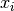
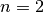
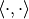

# 5.7. 内核近似

校验者:
        [@FontTian](https://github.com/FontTian)
        [@numpy](https://github.com/apachecn/scikit-learn-doc-zh)
        [@Loopy](https://github.com/loopyme)
翻译者:
        [@程威](https://github.com/apachecn/scikit-learn-doc-zh)

这个子模块包含与某些 kernel 对应的特征映射的函数，这个会用于例如支持向量机的算法当中(see [支持向量机](svm.html#svm))。 下面这些特征函数对输入执行非线性转换，可以用于线性分类或者其他算法。

与 [kernel trick](https://en.wikipedia.org/wiki/Kernel_trick) 相比，近似的进行特征映射更适合在线学习，并能够有效 减少学习大量数据的内存开销。使用标准核技巧的 svm 不能有效的适用到海量数据，但是使用近似内核映射的方法，对于线性 SVM 来说效果可能更好。 而且，使用 [`SGDClassifier`](https://scikit-learn.org/stable/modules/generated/sklearn.linear_model.SGDClassifier.html#sklearn.linear_model.SGDClassifier "sklearn.linear_model.SGDClassifier") 进行近似的内核映射，使得对海量数据进行非线性学习也成为了可能。

由于近似嵌入的方法没有太多经验性的验证，所以建议将结果和使用精确的内核方法的结果进行比较。

也可参阅[多项式回归：用基函数展开线性模型](2#1116-多项式回归：用基函数展开线性模型) 用于精确的多项式变换。

## 5.7.1. 内核近似的 Nystroem 方法

[`Nystroem`](https://scikit-learn.org/stable/modules/generated/sklearn.kernel_approximation.Nystroem.html#sklearn.kernel_approximation.Nystroem "sklearn.kernel_approximation.Nystroem") 中实现了 Nystroem 方法用于低等级的近似核。它是通过采样 kernel 已经评估好的数据。默认情况下， [`Nystroem`](https://scikit-learn.org/stable/modules/generated/sklearn.kernel_approximation.Nystroem.html#sklearn.kernel_approximation.Nystroem "sklearn.kernel_approximation.Nystroem") 使用 `rbf` kernel，但它可以使用任何内核函数和预计算内核矩阵. 使用的样本数量 - 计算的特征维数 - 由参数 `n_components` 给出.

## 5.7.2. 径向基函数内核

[`RBFSampler`](https://scikit-learn.org/stable/modules/generated/sklearn.kernel_approximation.RBFSampler.html#sklearn.kernel_approximation.RBFSampler "sklearn.kernel_approximation.RBFSampler") 为径向基函数核构造一个近似映射，又称为 Random Kitchen Sinks [RR2007]. 在应用线性算法（例如线性 SVM ）之前，可以使用此转换来明确建模内核映射:

```py
>>> from sklearn.kernel_approximation import RBFSampler
>>> from sklearn.linear_model import SGDClassifier
>>> X = [[0, 0], [1, 1], [1, 0], [0, 1]]
>>> y = [0, 0, 1, 1]
>>> rbf_feature = RBFSampler(gamma=1, random_state=1)
>>> X_features = rbf_feature.fit_transform(X)
>>> clf = SGDClassifier()   
>>> clf.fit(X_features, y)
SGDClassifier(alpha=0.0001, average=False, class_weight=None, epsilon=0.1,
 eta0=0.0, fit_intercept=True, l1_ratio=0.15,
 learning_rate='optimal', loss='hinge', max_iter=5, n_iter=None,
 n_jobs=1, penalty='l2', power_t=0.5, random_state=None,
 shuffle=True, tol=None, verbose=0, warm_start=False)
>>> clf.score(X_features, y)
1.0

```

这个映射依赖于内核值的 Monte Carlo 近似. `fit` 方法执行 Monte Carlo 采样，而该 `transform` 方法执行 数据的映射.由于过程的固有随机性，结果可能会在不同的 `fit` 函数调用之间变化。

该 `fit` 函数有两个参数: `n_components` 是特征变换的目标维数. `gamma` 是 RBF-kernel 的参数. `n_components` 越高，会导致更好的内核近似， 并且将产生与内核 SVM 产生的结果更相似的结果。请注意，”拟合” 特征函数实际上不取决于 `fit` 函数传递的数据。只有数据的维数被使用。 详情可以参考 [[RR2007]](#rr2007).

对于给定的值 `n_components` [`RBFSampler`](https://scikit-learn.org/stable/modules/generated/sklearn.kernel_approximation.RBFSampler.html#sklearn.kernel_approximation.RBFSampler "sklearn.kernel_approximation.RBFSampler") 在 [`Nystroem`](https://scikit-learn.org/stable/modules/generated/sklearn.kernel_approximation.Nystroem.html#sklearn.kernel_approximation.Nystroem "sklearn.kernel_approximation.Nystroem") 中使用通常不太准确， 但是 [`RBFSampler`](https://scikit-learn.org/stable/modules/generated/sklearn.kernel_approximation.RBFSampler.html#sklearn.kernel_approximation.RBFSampler "sklearn.kernel_approximation.RBFSampler") 使用更大的特征空间，更容易计算。

[](https://scikit-learn.org/stable/auto_examples/plot_kernel_approximation.html)

将精确的 RBF kernel (左) 与 approximation (右) 进行比较。

> **示例**:
>*   [Explicit feature map approximation for RBF kernels](https://scikit-learn.org/stable/auto_examples/plot_kernel_approximation.html#sphx-glr-auto-examples-plot-kernel-approximation-py)

## 5.7.3. 加性卡方核

Additive Chi Squared Kernel (加性卡方核)是直方图的核心，通常用于计算机视觉。

这里使用的 Additive Chi Squared Kernel 给出


这个和 `sklearn.metrics.additive_chi2_kernel` 不完全一样.[VZ2010]_ 的作者喜欢上面的版本，因为它总是积极的。 由于这个 kernel 是可添加的，因此可以分别处理嵌入的 . 这使得在规则的间隔类对傅里叶变换进行性才赢，代替近似的 Monte Carlo 采样。

 [`AdditiveChi2Sampler`](https://scikit-learn.org/stable/modules/generated/sklearn.kernel_approximation.AdditiveChi2Sampler.html#sklearn.kernel_approximation.AdditiveChi2Sampler "sklearn.kernel_approximation.AdditiveChi2Sampler") 类实现了这个组件采样方法. 每个组件都被采样  次，每一个输入维数都会产生 *2n+1* 维（来自傅立叶变换的实部和复数部分的两个数据段的倍数）. 在文献中， 经常取为 1 或者 2，将数据集转换为 `n_samples * 5 * n_features` 大小（在  的情况下 ）.

[`AdditiveChi2Sampler`](https://scikit-learn.org/stable/modules/generated/sklearn.kernel_approximation.AdditiveChi2Sampler.html#sklearn.kernel_approximation.AdditiveChi2Sampler "sklearn.kernel_approximation.AdditiveChi2Sampler") 提供的近似特征映射可以和 [`RBFSampler`](https://scikit-learn.org/stable/modules/generated/sklearn.kernel_approximation.RBFSampler.html#sklearn.kernel_approximation.RBFSampler "sklearn.kernel_approximation.RBFSampler") 提供的近似特征映射合并，得到一个取幂的 chi squared kerne。可以查看 [[VZ2010]](#vz2010) 和 [[VVZ2010]](#vvz2010) [`RBFSampler`](https://scikit-learn.org/stable/modules/generated/sklearn.kernel_approximation.RBFSampler.html#sklearn.kernel_approximation.RBFSampler "sklearn.kernel_approximation.RBFSampler") 的合并.

## 5.7.4. Skewed Chi Squared Kernel (偏斜卡方核?暂译)

skewed chi squared kernel 给出下面公式


它有和 指数卡方核 相似的属性，用于计算机视觉.但是允许进行简单的蒙特卡洛近似的特征映射。

[`SkewedChi2Sampler`](https://scikit-learn.org/stable/modules/generated/sklearn.kernel_approximation.SkewedChi2Sampler.html#sklearn.kernel_approximation.SkewedChi2Sampler "sklearn.kernel_approximation.SkewedChi2Sampler") 的使用和之前描述的 [`RBFSampler`](https://scikit-learn.org/stable/modules/generated/sklearn.kernel_approximation.RBFSampler.html#sklearn.kernel_approximation.RBFSampler "sklearn.kernel_approximation.RBFSampler") 一样.唯一的区别是自由参数，称之为 . 这种映射和数学细节可以参考 [[LS2010]](#ls2010).

## 5.7.5. 数学方面的细节

核技巧 像支持向量机，或者 核化 PCA 依赖于 再生核希尔伯特空间（RKHS） 对于任何 核函数  （叫做 Mercer kernel），保证了  进入 希尔伯特空间  的映射，例如：


 是在 Hilbert space 中做内积.

如果一个算法，例如线性支持向量机或者 PCA，依赖于数据集的数量级  ，可能会使用  ， 符合孙发的映射  . 使用  的优点在于  永远不会直接计算，允许大量的特征计算（甚至是无限的）.

kernel 方法的一个缺点是，在优化过程中有可能存储大量的 kernel 值 . 如果使用核函数的分类器应用于新的数据  ，  需要计算用来做预测，训练集中的  有可能有很多不同的。

这个子模块的这些类中允许嵌入 ，从而明确的与  一起工作， 这消除了使用 kernel 的需要和存储训练样本.

> **参考资料**:
>* [[RR2007]](#id3)  [“Random features for large-scale kernel machines”](http://www.robots.ox.ac.uk/~vgg/rg/papers/randomfeatures.pdf) Rahimi, A. and Recht, B. - Advances in neural information processing 2007,
>* [[LS2010]](#id7)  [“Random Fourier approximations for skewed multiplicative histogram kernels”](http://www.maths.lth.se/matematiklth/personal/sminchis/papers/lis_dagm10.pdf) Random Fourier approximations for skewed multiplicative histogram kernels - Lecture Notes for Computer Sciencd (DAGM)
>* [[VZ2010]](#id5)  [“Efficient additive kernels via explicit feature maps”](https://www.robots.ox.ac.uk/~vgg/publications/2011/Vedaldi11/vedaldi11.pdf) Vedaldi, A. and Zisserman, A. - Computer Vision and Pattern Recognition 2010
>* [[VVZ2010]](#id6)  [“Generalized RBF feature maps for Efficient Detection”](https://www.robots.ox.ac.uk/~vgg/publications/2010/Sreekanth10/sreekanth10.pdf) Vempati, S. and Vedaldi, A. and Zisserman, A. and Jawahar, CV - 2010
