# 1.4. 支持向量机

校验者:
        [@尔了个达](https://github.com/weiyd)
        [@维](https://github.com/apachecn/scikit-learn-doc-zh)
        [@子浪](https://github.com/apachecn/scikit-learn-doc-zh)
        [@小瑶](https://github.com/apachecn/scikit-learn-doc-zh)
        [@Loopy](https://github.com/loopyme)
        [@qinhanmin2014](https://github.com/qinhanmin2014)
翻译者:
        [@Damon](https://github.com/apachecn/scikit-learn-doc-zh)
        [@Leon晋](https://github.com/apachecn/scikit-learn-doc-zh)

**支持向量机 (SVMs)** 可用于以下监督学习算法: [分类](#141-分类), [回归](#142-回归) 和 [异常检测](#143-密度估计-异常（novelty）检测).

支持向量机的优势在于:

 *   在高维空间中非常高效.
 *   即使在数据维度比样本数量大的情况下仍然有效.
 *   在决策函数（称为支持向量）中使用训练集的子集,因此它也是高效利用内存的.
 *   通用性: 不同的核函数 [核函数](#146-核函数) 与特定的决策函数一一对应.常见的 kernel 已经提供,也可以指定定制的内核.

支持向量机的缺点包括:

 *   如果特征数量比样本数量大得多,在选择核函数 [核函数](#146-核函数) 时要避免过拟合, 而且正则化项是非常重要的.

 *   支持向量机不直接提供概率估计,这些都是使用昂贵的五次交叉验算计算的. (详情见 [得分和概率](#1412-得分和概率)).

在 scikit-learn 中,支持向量机提供 dense(`numpy.ndarray` ,可以通过 `numpy.asarray` 进行转换) 和 sparse (任何 `scipy.sparse`) 样例向量作为输出.然而,要使用支持向量机来对 sparse 数据作预测,它必须已经拟合这样的数据.使用行优先存储（C-order）的 `numpy.ndarray` (dense) 或者带有 `dtype=float64` 的 `scipy.sparse.csr_matrix` (sparse) 来优化性能.

## 1.4.1. 分类

[`SVC`](https://scikit-learn.org/stable/modules/generated/sklearn.svm.SVC.html#sklearn.svm.SVC), [`NuSVC`](https://scikit-learn.org/stable/modules/generated/sklearn.svm.NuSVC.html#sklearn.svm.NuSVC) 和 [`LinearSVC`](https://scikit-learn.org/stable/modules/generated/sklearn.svm.LinearSVC.html#sklearn.svm.LinearSVC) 能在数据集中实现多元分类.

[](https://scikit-learn.org/stable/auto_examples/svm/plot_iris_svc.html)

[`SVC`](https://scikit-learn.org/stable/modules/generated/sklearn.svm.SVC.html#sklearn.svm.SVC) 和 [`NuSVC`](https://scikit-learn.org/stable/modules/generated/sklearn.svm.NuSVC.html#sklearn.svm.NuSVC) 是相似的方法, 但是接受稍许不同的参数设置并且有不同的数学方程(在这部分看 [数学公式](#147-数学公式)). 另一方面, [`LinearSVC`](https://scikit-learn.org/stable/modules/generated/sklearn.svm.LinearSVC.html#sklearn.svm.LinearSVC) 是另一个实现线性核函数的支持向量分类. 记住 [`LinearSVC`](https://scikit-learn.org/stable/modules/generated/sklearn.svm.LinearSVC.html#sklearn.svm.LinearSVC) 不接受关键词 `kernel`, 因为它被假设为线性的. 它也缺少一些 [`SVC`](https://scikit-learn.org/stable/modules/generated/sklearn.svm.SVC.html#sklearn.svm.SVC) 和 [`NuSVC`](https://scikit-learn.org/stable/modules/generated/sklearn.svm.NuSVC.html#sklearn.svm.NuSVC) 的成员(members) 比如 `support_` .

和其他分类器一样, [`SVC`](https://scikit-learn.org/stable/modules/generated/sklearn.svm.SVC.html#sklearn.svm.SVC), [`NuSVC`](https://scikit-learn.org/stable/modules/generated/sklearn.svm.NuSVC.html#sklearn.svm.NuSVC) 和 [`LinearSVC`](https://scikit-learn.org/stable/modules/generated/sklearn.svm.LinearSVC.html#sklearn.svm.LinearSVC) 将两个数组作为输入: `[n_samples, n_features]` 大小的数组 X 作为训练样本, `[n_samples]` 大小的数组 y 作为类别标签(字符串或者整数):

```py
>>> from sklearn import svm
>>> X = [[0, 0], [1, 1]]
>>> y = [0, 1]
>>> clf = svm.SVC(gamma='scale')
>>> clf.fit(X, y)  
SVC(C=1.0, cache_size=200, class_weight=None, coef0=0.0,
 decision_function_shape='ovr', degree=3, gamma='scale', kernel='rbf',
 max_iter=-1, probability=False, random_state=None, shrinking=True,
 tol=0.001, verbose=False)

```

在拟合后, 这个模型可以用来预测新的值:

```py
>>> clf.predict([[2., 2.]])
array([1])

```

SVMs 决策函数取决于训练集的一些子集, 称作支持向量. 这些支持向量的部分特性可以在 `support_vectors_`, `support_` 和 `n_support` 找到:

```py
>>> # 获得支持向量
>>> clf.support_vectors_
array([[ 0.,  0.],
 [ 1.,  1.]])
>>> # 获得支持向量的索引
>>> clf.support_
array([0, 1]...)
>>> # 为每一个类别获得支持向量的数量
>>> clf.n_support_
array([1, 1]...)

```

### 1.4.1.1. 多元分类

[`SVC`](https://scikit-learn.org/stable/modules/generated/sklearn.svm.SVC.html#sklearn.svm.SVC) 和 [`NuSVC`](https://scikit-learn.org/stable/modules/generated/sklearn.svm.NuSVC.html#sklearn.svm.NuSVC) 为多元分类实现了 “one-against-one” 的方法 (Knerr et al., 1990) 如果 `n_class` 是类别的数量, 那么 `n_class * (n_class - 1) / 2` 分类器被重构, 而且每一个从两个类别中训练数据. 为了提供与其他分类器一致的接口, `decision_function_shape` 选项允许聚合 “one-against-one” 分类器的结果成 `(n_samples, n_classes)` 的大小到决策函数:

```py
>>> X = [[0], [1], [2], [3]]
>>> Y = [0, 1, 2, 3]
>>> clf = svm.SVC(gamma='scale', decision_function_shape='ovo')
>>> clf.fit(X, Y)
SVC(C=1.0, cache_size=200, class_weight=None, coef0=0.0,
 decision_function_shape='ovo', degree=3, gamma='scale', kernel='rbf',
 max_iter=-1, probability=False, random_state=None, shrinking=True,
 tol=0.001, verbose=False)
>>> dec = clf.decision_function([[1]])
>>> dec.shape[1] # 4 classes: 4*3/2 = 6
6
>>> clf.decision_function_shape = "ovr"
>>> dec = clf.decision_function([[1]])
>>> dec.shape[1] # 4 classes
4

```

另一方面, [`LinearSVC`](https://scikit-learn.org/stable/modules/generated/sklearn.svm.LinearSVC.html#sklearn.svm.LinearSVC) 实现 “one-vs-the-rest” 多类别策略, 从而训练 n 类别的模型. 如果只有两类, 只训练一个模型.:

```py
>>> lin_clf = svm.LinearSVC()
>>> lin_clf.fit(X, Y)
LinearSVC(C=1.0, class_weight=None, dual=True, fit_intercept=True,
 intercept_scaling=1, loss='squared_hinge', max_iter=1000,
 multi_class='ovr', penalty='l2', random_state=None, tol=0.0001,
 verbose=0)
>>> dec = lin_clf.decision_function([[1]])
>>> dec.shape[1]
4

```

参见 [数学公式](#147-数学公式) 查看决策函数的完整描述.

记住 [`LinearSVC`](https://scikit-learn.org/stable/modules/generated/sklearn.svm.LinearSVC.html#sklearn.svm.LinearSVC) 也实现了可选择的多类别策略, 通过使用选项 `multi_class='crammer_singer'`, 所谓的多元 SVM 由 Crammer 和 Singer 明确表达. 这个方法是一致的, 对于 one-vs-rest 是不正确的. 实际上, one-vs-rest 分类通常受到青睐, 因为结果大多数是相似的, 但是运行时间却显著减少.

对于 “one-vs-rest” [`LinearSVC`](https://scikit-learn.org/stable/modules/generated/sklearn.svm.LinearSVC.html#sklearn.svm.LinearSVC), 属性 `coef_` 和 `intercept_` 分别具有 `[n_class, n_features]` 和 `[n_class]` 尺寸. 系数的每一行符合 `n_class` 的许多 one-vs-rest 分类器之一, 并且就以这一类的顺序与拦截器(intercepts)相似.

至于 one-vs-one [`SVC`](https://scikit-learn.org/stable/modules/generated/sklearn.svm.SVC.html#sklearn.svm.SVC), 属性特征的布局(layout)有少多些复杂. 考虑到有一种线性核函数, `coef_` 和 `intercept_` 的布局(layout)与上文描述成 [`LinearSVC`](https://scikit-learn.org/stable/modules/generated/sklearn.svm.LinearSVC.html#sklearn.svm.LinearSVC) 相似, 除了 `coef_` 的形状 `[n_class * (n_class - 1) / 2, n_features]`, 与许多二元的分类器相似. 0到n的类别顺序是 “0 vs 1”, “0 vs 2” , … “0 vs n”, “1 vs 2”, “1 vs 3”, “1 vs n”, … “n-1 vs n”.

`dual_coef_` 的形状是 `[n_class-1, n_SV]`, 这个结构有些难以理解. 对应于支持向量的列与 `n_class * (n_class - 1) / 2` “one-vs-one” 分类器相关. 每一个支持向量用于 `n_class - 1` 分类器中.对于这些分类器,每一行的 `n_class - 1` 条目对应于对偶系数(dual coefficients).

通过这个例子更容易说明:

考虑一个三类的问题,类0有三个支持向量 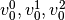 而类 1 和 2 分别有 如下两个支持向量  and 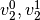.对于每个支持 向量 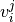, 有两个对偶系数.在类别  和   中, 我们将支持向量的系数记录为  那么 `dual_coef_` 可以表示为:

||||
| ---|---|---|
|  |  | 第0类的SVs系数 |
| 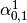 | 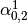 |
|  |  |
|  |  | 第1类的SVs系数|
|  |  |
|  |  | 第2类的SVs系数|
|  |  |
(空单元格表示与上方单元格合并)

### 1.4.1.2. 得分和概率

[`SVC`](https://scikit-learn.org/stable/modules/generated/sklearn.svm.SVC.html#sklearn.svm.SVC) 方法的 `decision_function` 给每一个样例每一个类别分值(scores)(或者在一个二元类中每一个样例一个分值). 当构造器(constructor)选项 `probability` 设置为 `True` 的时候, 类成员可能性评估开启.(来自 `predict_proba` 和 `predict_log_proba` 方法) 在二元分类中,概率使用 Platt scaling 进行标准化: 在 SVM 分数上的逻辑回归,在训练集上用额外的交叉验证来拟合.在多类情况下,这可以扩展为 per Wu et al.(2004)

不用说,对于大数据集来说,在 Platt scaling 中进行交叉验证是一项昂贵的操作. 另外,可能性预测可能与 scores 不一致,因为 scores 的 “argmax” 可能不是可能性的 argmax. (例如,在二元分类中,一个样本可能被标记为一个有可能性的类 `predict` &lt;½ according to `predict_proba`.) Platt 的方法也有理论问题. 如果 confidence scores 必要,但是这些没必要是可能性, 那么建议设置 `probability=False` 并使用 `decision_function` 而不是 `predict_proba`.

> **参考资料**:
>
>*   Wu, Lin and Weng, [`"Probability estimates for multi-class classification by pairwise coupling（成对耦合的多类分类的概率估计）"&lt;http://www.csie.ntu.edu.tw/~cjlin/papers/svmprob/svmprob.pdf&gt;`_](#id13), JMLR 5:975-1005, 2004.
>*   Platt [`"Probabilistic outputs for SVMs and comparisons to regularized likelihood methods（SVMs 的概率输出和与规则化似然方法的比较）"&lt;http://www.cs.colorado.edu/~mozer/Teaching/syllabi/6622/papers/Platt1999.pdf&gt;`_](#id15) .

### 1.4.1.3. 非均衡问题

这个问题期望给予某一类或某个别样例能使用的关键词 `class_weight` 和 `sample_weight` 提高权重(importance).

[`SVC`](https://scikit-learn.org/stable/modules/generated/sklearn.svm.SVC.html#sklearn.svm.SVC) (而不是 [`NuSVC`](https://scikit-learn.org/stable/modules/generated/sklearn.svm.NuSVC.html#sklearn.svm.NuSVC)) 在 `fit` 方法中生成了一个关键词 `class_weight`. 它是形如 `{class_label : value}` 的字典, value 是浮点数大于 0 的值, 把类 `class_label` 的参数 `C` 设置为 `C * value`.

[](https://scikit-learn.org/stable/auto_examples/svm/plot_separating_hyperplane_unbalanced.html)

[`SVC`](https://scikit-learn.org/stable/modules/generated/sklearn.svm.SVC.html#sklearn.svm.SVC), [`NuSVC`](https://scikit-learn.org/stable/modules/generated/sklearn.svm.NuSVC.html#sklearn.svm.NuSVC), [`SVR`](https://scikit-learn.org/stable/modules/generated/sklearn.svm.SVR.html#sklearn.svm.SVR), [`NuSVR`](https://scikit-learn.org/stable/modules/generated/sklearn.svm.NuSVR.html#sklearn.svm.NuSVR) 和 [`OneClassSVM`](https://scikit-learn.org/stable/modules/generated/sklearn.svm.OneClassSVM.html#sklearn.svm.OneClassSVM) 在 `fit` 方法中通过关键词 `sample_weight` 为单一样例实现权重weights.与 `class_weight` 相似, 这些把第i个样例的参数 `C` 换成 `C * sample_weight[i]`.

[](https://scikit-learn.org/stable/auto_examples/svm/plot_weighted_samples.html)

> **示例**:
> *   [Plot different SVM classifiers in the iris dataset](https://scikit-learn.org/stable/auto_examples/svm/plot_iris_svc.html#sphx-glr-auto-examples-svm-plot-iris-py),
>*   [SVM: Maximum margin separating hyperplane](https://scikit-learn.org/stable/auto_examples/svm/plot_separating_hyperplane.html#sphx-glr-auto-examples-svm-plot-separating-hyperplane-py),
>*   [SVM: Separating hyperplane for unbalanced classes](https://scikit-learn.org/stable/auto_examples/svm/plot_separating_hyperplane_unbalanced.html#sphx-glr-auto-examples-svm-plot-separating-hyperplane-unbalanced-py)
>*   [SVM-Anova: SVM with univariate feature selection](https://scikit-learn.org/stable/auto_examples/svm/plot_svm_anova.html#sphx-glr-auto-examples-svm-plot-svm-anova-py),
>*   [Non-linear SVM](https://scikit-learn.org/stable/auto_examples/svm/plot_svm_nonlinear.html#sphx-glr-auto-examples-svm-plot-svm-nonlinear-py)
>*   [SVM: Weighted samples](https://scikit-learn.org/stable/auto_examples/svm/plot_weighted_samples.html#sphx-glr-auto-examples-svm-plot-weighted-samples-py),

## 1.4.2. 回归

支持向量分类的方法可以被扩展用作解决回归问题. 这个方法被称作支持向量回归.

支持向量分类生成的模型(如前描述)只依赖于训练集的子集,因为构建模型的 cost function 不在乎边缘之外的训练点. 类似的,支持向量回归生成的模型只依赖于训练集的子集, 因为构建模型的 cost function 忽略任何接近于模型预测的训练数据.

支持向量分类有三种不同的实现形式: [`SVR`](https://scikit-learn.org/stable/modules/generated/sklearn.svm.SVR.html#sklearn.svm.SVR), [`NuSVR`](https://scikit-learn.org/stable/modules/generated/sklearn.svm.NuSVR.html#sklearn.svm.NuSVR) 和 [`LinearSVR`](https://scikit-learn.org/stable/modules/generated/sklearn.svm.LinearSVR.html#sklearn.svm.LinearSVR). 在只考虑线性核的情况下, [`LinearSVR`](https://scikit-learn.org/stable/modules/generated/sklearn.svm.LinearSVR.html#sklearn.svm.LinearSVR) 比 [`SVR`](https://scikit-learn.org/stable/modules/generated/sklearn.svm.SVR.html#sklearn.svm.SVR) 提供一个更快的实现形式, 然而比起 [`SVR`](https://scikit-learn.org/stable/modules/generated/sklearn.svm.SVR.html#sklearn.svm.SVR) 和 [`LinearSVR`](https://scikit-learn.org/stable/modules/generated/sklearn.svm.LinearSVR.html#sklearn.svm.LinearSVR), [`NuSVR`](https://scikit-learn.org/stable/modules/generated/sklearn.svm.NuSVR.html#sklearn.svm.NuSVR) 实现一个稍微不同的构思(formulation).细节参见 [实现细节](#148-实现细节).

与分类的类别一样, fit方法会调用参数向量 X, y, 只在 y 是浮点数而不是整数型.:

```py
>>> from sklearn import svm
>>> X = [[0, 0], [2, 2]]
>>> y = [0.5, 2.5]
>>> clf = svm.SVR()
>>> clf.fit(X, y)
SVR(C=1.0, cache_size=200, coef0=0.0, degree=3, epsilon=0.1, gamma='auto_deprecated',
 kernel='rbf', max_iter=-1, shrinking=True, tol=0.001, verbose=False)
>>> clf.predict([[1, 1]])
array([ 1.5])

```

示例:

>*   [Support Vector Regression (SVR) using linear and non-linear kernels](http://localhost:4000/#/../auto_examples/svm/plot_svm_regression.html)

## 1.4.3. 密度估计, 异常（novelty）检测

类[`OneClassSVM`](https://scikit-learn.org/stable/modules/generated/sklearn.svm.OneClassSVM.html#sklearn.svm.OneClassSVM)实现了一个用于离群点检测的单类SVM。

有关OneClassSVM的描述和使用，请参见[新奇和异常值检测](/docs/30).

## 1.4.4. 复杂度

支持向量机是个强大的工具，不过它的计算和存储空间要求也会随着要训练向量的数目增加而快速增加。 SVM的核心是一个二次规划问题(Quadratic Programming, QP)，是将支持向量和训练数据的其余部分分离开来。 在实践中(数据集相关)，会根据 [libsvm](http://www.csie.ntu.edu.tw/~cjlin/libsvm/) 的缓存有多效，在  和 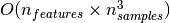 之间基于 [libsvm](http://www.csie.ntu.edu.tw/~cjlin/libsvm/) 的缩放操作才会调用这个 QP 解析器。 如果数据是非常稀疏，那  就用样本向量中非零特征的平均数量去替换。

另外请注意，在线性情况下，由 [liblinear](http://www.csie.ntu.edu.tw/~cjlin/liblinear/) 操作的 [`LinearSVC`](https://scikit-learn.org/stable/modules/generated/sklearn.svm.LinearSVC.html#sklearn.svm.LinearSVC) 算法要比由它的 [libsvm](http://www.csie.ntu.edu.tw/~cjlin/libsvm/) 对应的 [`SVC`](https://scikit-learn.org/stable/modules/generated/sklearn.svm.SVC.html#sklearn.svm.SVC) 更为高效，并且它几乎可以线性缩放到数百万样本或者特征。

## 1.4.5. 使用诀窍

*   **避免数据复制**: 对于 [`SVC`](https://scikit-learn.org/stable/modules/generated/sklearn.svm.SVC.html#sklearn.svm.SVC)， [`SVR`](https://scikit-learn.org/stable/modules/generated/sklearn.svm.SVR.html#sklearn.svm.SVR)， [`NuSVC`](https://scikit-learn.org/stable/modules/generated/sklearn.svm.NuSVC.html#sklearn.svm.NuSVC) 和 [`NuSVR`](https://scikit-learn.org/stable/modules/generated/sklearn.svm.NuSVR.html#sklearn.svm.NuSVR)， 如果数据是通过某些方法而不是用行优先存储（C-order）的双精度，那它会在调用底层的 C 命令前先被复制。 您可以通过检查它的 `flags` 属性，来确定给定的 numpy 数组是不是行优先存储（C-order）的。

     对于 [`LinearSVC`](https://scikit-learn.org/stable/modules/generated/sklearn.svm.LinearSVC.html#sklearn.svm.LinearSVC) (和 [`LogisticRegression`](https://scikit-learn.org/stable/modules/generated/sklearn.linear_model.LogisticRegression.html#sklearn.linear_model.LogisticRegression "sklearn.linear_model.LogisticRegression")) 的任何输入，都会以 numpy 数组形式，被复制和转换为 用 liblinear 内部稀疏数据去表达（双精度浮点型 float 和非零部分的 int32 索引）。 如果您想要一个适合大规模的线性分类器，又不打算复制一个密集的行优先存储（C-order）双精度 numpy 数组作为输入， 那我们建议您去使用 [`SGDClassifier`](https://scikit-learn.org/stable/modules/generated/sklearn.linear_model.SGDClassifier.html#sklearn.linear_model.SGDClassifier "sklearn.linear_model.SGDClassifier") 类作为替代。目标函数可以配置为和 [`LinearSVC`](https://scikit-learn.org/stable/modules/generated/sklearn.svm.LinearSVC.html#sklearn.svm.LinearSVC) 模型差不多相同的。


*   **内核的缓存大小**: 在大规模问题上，对于 [`SVC`](https://scikit-learn.org/stable/modules/generated/sklearn.svm.SVC.html#sklearn.svm.SVC), [`SVR`](https://scikit-learn.org/stable/modules/generated/sklearn.svm.SVR.html#sklearn.svm.SVR), `nuSVC` 和 [`NuSVR`](https://scikit-learn.org/stable/modules/generated/sklearn.svm.NuSVR.html#sklearn.svm.NuSVR), 内核缓存的大小会特别影响到运行时间。如果您有足够可用的 RAM，不妨把它的 `缓存大小` 设得比默认的 200(MB) 要高，例如为 500(MB) 或者 1000(MB)。     

*   **惩罚系数C的设置**:在合理的情况下， `C` 的默认选择为 `1` 。如果您有很多混杂的观察数据， 您应该要去调小它。 `C` 越小，就能更好地去正规化估计。

    当C值较大时，[`LinearSVC`](https://scikit-learn.org/stable/modules/generated/sklearn.svm.LinearSVC.html#sklearn.svm.LinearSVC)和[`LinearSVR`](https://scikit-learn.org/stable/modules/generated/sklearn.svm.LinearSVR.html#sklearn.svm.LinearSVR)对C值较不敏感，即当C值大于特定阈值后，模型效果将会停止提升。同时，较大的C值将会导致较长的训练时间，Fan et al.(2008)的论文显示，训练时间的差距有时会达到10倍。
     
*   支持向量机算法本身不能够很好地支持非标准化的数据，所以 **我们强烈建议您将数据标准化**。 举个例子，对于输入向量 X， 规整它的每个数值范围为 [0, 1] 或 [-1, +1] ，或者标准化它的为均值为0方差为1的数据分布。请注意， 相同的缩放标准必须要应用到所有的测试向量，从而获得有意义的结果。 请参考章节 [预处理数据](preprocessing.html#preprocessing) ，那里会提供到更多关于缩放和规整。
*   在 [`NuSVC`](https://scikit-learn.org/stable/modules/generated/sklearn.svm.NuSVC.html#sklearn.svm.NuSVC)/[`OneClassSVM`](https://scikit-learn.org/stable/modules/generated/sklearn.svm.OneClassSVM.html#sklearn.svm.OneClassSVM)/[`NuSVR`](https://scikit-learn.org/stable/modules/generated/sklearn.svm.NuSVR.html#sklearn.svm.NuSVR) 内的参数 `nu` ， 近似是训练误差和支持向量的比值。
*   在 [`SVC`](https://scikit-learn.org/stable/modules/generated/sklearn.svm.SVC.html#sklearn.svm.SVC), ，如果分类器的数据不均衡（例如，很多正例很少负例），设置 `class_weight='balanced'` 与/或尝试不同的惩罚系数 `C` 。
* **底层实现的随机性**:[`SVC`](https://scikit-learn.org/stable/modules/generated/sklearn.svm.SVC.html#sklearn.svm.SVC)和[`NuSVC`](https://scikit-learn.org/stable/modules/generated/sklearn.svm.NuSVC.html#sklearn.svm.NuSVC)的底层实现仅使用随机数生成器来打乱数据顺序进行概率估计(当`probability`被设置为True时)。这种随机性可以用`random_state`参数来控制。如果将`probability`设为False，这些估计器就不是随机的，random_state对结果没有影响。底层的[`OneClassSVM`](https://scikit-learn.org/stable/modules/generated/sklearn.svm.OneClassSVM.html#sklearn.svm.OneClassSVM)实现类似于[`SVC`](https://scikit-learn.org/stable/modules/generated/sklearn.svm.SVC.html#sklearn.svm.SVC)和[`NuSVC`](https://scikit-learn.org/stable/modules/generated/sklearn.svm.NuSVC.html#sklearn.svm.NuSVC)的实现。由于[`OneClassSVM`](https://scikit-learn.org/stable/modules/generated/sklearn.svm.OneClassSVM.html#sklearn.svm.OneClassSVM)没有提供概率估计，所以它不是随机的。
底层的[`LinearSVC`](https://scikit-learn.org/stable/modules/generated/sklearn.svm.LinearSVC.html#sklearn.svm.LinearSVC)实现使用随机数生成器来选择特征，当用双坐标下降(当`dual`被设置为True)。因此，对于相同的输入数据，结果略有不同并不罕见。如果发生这种情况，尝试使用较小的`tol`参数。这种随机性也可以通过`random_state`参数来控制。当`dual`设置为False时，[`LinearSVC`](https://scikit-learn.org/stable/modules/generated/sklearn.svm.LinearSVC.html#sklearn.svm.LinearSVC)的底层实现不是随机的，`random_state`对结果没有影响。

*   使用由 `LinearSVC(loss='l2', penalty='l1', dual=False)` 提供的 L1 惩罚去产生稀疏解，也就是说，特征权重的子集不同于零，这样做有助于决策函数。 随着增加 `C` 会产生一个更复杂的模型（有更多的特征被选择）。可以使用 [`l1_min_c`](https://scikit-learn.org/stable/modules/generated/sklearn.svm.l1_min_c.html#sklearn.svm.l1_min_c "sklearn.svm.l1_min_c") 去计算 `C` 的数值，去产生一个”null” 模型（所有的权重等于零）。

> **参考资料**:
>* Fan, Rong-En, et al., “[LIBLINEAR: A library for large linear classification.](https://www.csie.ntu.edu.tw/~cjlin/papers/liblinear.pdf)”, Journal of machine learning research 9.Aug (2008): 1871-1874.

## 1.4.6. 核函数

**核函数** 可以是以下任何形式：:

*   线性: 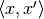.
*   多项式: 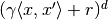.  是关键词 `degree`,  指定 `coef0`。
*   rbf: .  是关键词 `gamma`, 必须大于 0。
*   sigmoid (), 其中  指定 `coef0`。

初始化时，不同内核由不同的函数名调用:

```py
>>> linear_svc = svm.SVC(kernel='linear')
>>> linear_svc.kernel
'linear'
>>> rbf_svc = svm.SVC(kernel='rbf')
>>> rbf_svc.kernel
'rbf'

```

### 1.4.6.1. 自定义核

您可以自定义自己的核，通过使用python函数作为内核或者通过预计算 Gram 矩阵。

自定义内核的分类器和别的分类器一样，除了下面这几点:

*   空间 `support_vectors_` 现在是空的, 只有支持向量的索引被存储在 `support_`
*   `fit()` 方法的第一个参数的引用（不是副本）将被存储，并作为将来的引用。 如果在 `fit()` 和 `predict()` 之间有数组发生改变，您将会碰到意料外的结果。

#### 1.4.6.1.1. 使用 python 函数作为内核

在构造时，您同样可以通过一个函数传递到关键词 `kernel` ，来使用您自己定义的内核。

您的内核必须要以两个矩阵作为参数，大小分别是 `(n_samples_1, n_features)`, `(n_samples_2, n_features)` 和返回一个内核矩阵，shape 是 `(n_samples_1, n_samples_2)`.

以下代码定义一个线性核，和构造一个使用该内核的分类器例子:

```py
>>> import numpy as np
>>> from sklearn import svm
>>> def my_kernel(X, Y):
...     return np.dot(X, Y.T)
...
>>> clf = svm.SVC(kernel=my_kernel)

```

> **示例**:
>*   [自定义核的SVM](https://scikit-learn.org/stable/auto_examples/svm/plot_custom_kernel.html#sphx-glr-auto-examples-svm-plot-custom-kernel-py)

#### 1.4.6.1.2. 使用 Gram 矩阵

在适应算法中，设置 `kernel='precomputed'` 和把 X 替换为 Gram 矩阵。 此时，必须要提供在 _所有_ 训练矢量和测试矢量中的内核值。

```py
>>> import numpy as np
>>> from sklearn import svm
>>> X = np.array([[0, 0], [1, 1]])
>>> y = [0, 1]
>>> clf = svm.SVC(kernel='precomputed')
>>> # 线性内核计算
>>> gram = np.dot(X, X.T)
>>> clf.fit(gram, y)
SVC(C=1.0, cache_size=200, class_weight=None, coef0=0.0,
 decision_function_shape='ovr', degree=3, gamma='auto_deprecated',
 kernel='precomputed', max_iter=-1, probability=False,
 random_state=None, shrinking=True, tol=0.001, verbose=False)
>>> # 预测训练样本
>>> clf.predict(gram)
array([0, 1])

```

#### 1.4.6.1.3. RBF 内核参数

当用 _径向基_ (RBF) 内核去训练 SVM，有两个参数必须要去考虑： `C` 惩罚系数和 `gamma` 。参数 `C` ， 通用在所有 SVM 内核，与决策表面的简单性相抗衡，可以对训练样本的误分类进行有价转换。 较小的 `C` 会使决策表面更平滑，同时较高的 `C` 旨在正确地分类所有训练样本。 `Gamma` 定义了单一 训练样本能起到多大的影响。较大的 `gamma` 会更让其他样本受到影响。

选择合适的 `C` 和 `gamma` ，对SVM的性能起到很关键的作用。建议一点是 使用  [`sklearn.model_selection.GridSearchCV`](https://scikit-learn.org/stable/modules/generated/sklearn.model_selection.GridSearchCV.html#sklearn.model_selection.GridSearchCV) 与 `C` 和 `gamma` 相隔 成倍差距从而选择到好的数值。

> **示例**:
>*   [RBF SVM parameters](https://scikit-learn.org/stable/auto_examples/svm/plot_rbf_parameters.html#sphx-glr-auto-examples-svm-plot-rbf-parameters-py)

## 1.4.7. 数学公式

支持向量机在高维度或无穷维度空间中，构建一个超平面或者一系列的超平面，可以用于分类、回归或者别的任务。 直观地看，借助超平面去实现一个好的分割， 能在任意类别中使最为接近的训练数据点具有最大的间隔距离（即所 谓的函数余量），这样做是因为通常更大的余量能有更低的分类器泛化误差。

[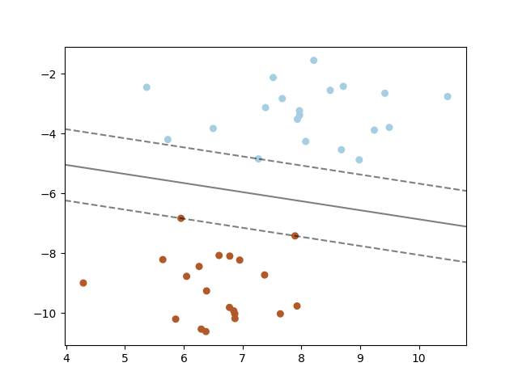](http://sklearn.apachecn.org/cn/0.19.0/_images/sphx_glr_plot_separating_hyperplane_0011.png)

### 1.4.7.1. SVC

在两类中，给定训练向量 , i=1,…, n, 和一个向量 , SVC能解决 如下主要问题:


它的对偶是


其中  是所有的向量，  是上界，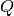 是一个  由  个半正定矩阵， 而  ，其中  是内核。所以训练向量是通过函数 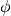，间接反映到一个更高维度的（无穷的）空间。

决策函数是:


>注意:
>
>虽然这些SVM模型是从 [libsvm](http://www.csie.ntu.edu.tw/~cjlin/libsvm/) 和 [liblinear](http://www.csie.ntu.edu.tw/~cjlin/liblinear/) 中派生出来，使用了 `C` 作为调整参数，但是大多数的 攻击使用了 `alpha`。两个模型的正则化量之间的精确等价，取决于模型优化的准确目标函数。举 个例子，当使用的估计器是 `sklearn.linear_model.Ridge` 做回归时，他们之间的相关性是 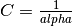。

这些参数能通过成员 `dual_coef_`、 `support_vectors_` 、 `intercept_` 去访问，这些成员分别控制了输出 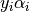、支持向量和无关项 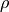 ：

> **参考资料**:
>
>*   [“Automatic Capacity Tuning of Very Large VC-dimension Classifiers”](http://citeseerx.ist.psu.edu/viewdoc/summary?doi=10.1.1.17.7215), I. Guyon, B. Boser, V. Vapnik - Advances in neural information processing 1993.
>*   [“Support-vector networks”](http://link.springer.com/article/10.1007%2FBF00994018), C. Cortes, V. Vapnik - Machine Learning, 20, 273-297 (1995).

### 1.4.7.2. NuSVC

我们引入一个新的参数  来控制支持向量的数量和训练误差。参数 ![\nu \in (0,1]](img/50eda5a92ebcfda1468e1508393b748a.jpg) 是训练误差分数的上限和支持向量分数的下限。

可以看出， -SVC 公式是 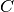-SVC 的再参数化，所以数学上是等效的。

### 1.4.7.3. SVR

给定训练向量 , i=1,…, n，向量  -SVR 能解决以下的主要问题：


它的对偶是


其中  是所有的向量，  是上界， 是一个  由  个半正定矩阵， 而  是内核。 所以训练向量是通过函数 ，间接反映到一个更高维度的（无穷的）空间。

决策函数是:


这些参数能通过成员 `dual_coef_`、 `support_vectors_` 、 `intercept_` 去访问，这些 成员分别控制了不同的 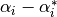、支持向量和无关项 ：

> **参考资料**:
>*   [“A Tutorial on Support Vector Regression”](http://citeseerx.ist.psu.edu/viewdoc/summary?doi=10.1.1.114.4288), Alex J. Smola, Bernhard Schölkopf - Statistics and Computing archive Volume 14 Issue 3, August 2004, p. 199-222.

## 1.4.8. 实现细节

在底层里，我们使用 [libsvm](http://www.csie.ntu.edu.tw/~cjlin/libsvm/) 和 [liblinear](http://www.csie.ntu.edu.tw/~cjlin/liblinear/) 去处理所有的计算。这些库都使用了 C 和 Cython 去包装。

> **参考资料**:
>
>有关实现的描述和使用算法的细节，请参考
>*   [LIBSVM: A Library for Support Vector Machines](http://www.csie.ntu.edu.tw/~cjlin/papers/libsvm.pdf).
>*   [LIBLINEAR – A Library for Large Linear Classification](http://www.csie.ntu.edu.tw/~cjlin/liblinear/).
