# 1.7. 高斯过程

校验者:
        [@glassy](https://github.com/apachecn/scikit-learn-doc-zh)
        [@Trembleguy](https://github.com/apachecn/scikit-learn-doc-zh)
        [@Loopy](https://github.com/loopyme)
翻译者:
        [@AI追寻者](https://github.com/apachecn/scikit-learn-doc-zh)

**高斯过程 (GP)** 是一种常用的监督学习方法，旨在解决*回归问题*和*概率分类问题*。

高斯过程模型的优点如下：
 *   预测内插了观察结果（至少对于正则核）。
 *  预测结果是概率形式的（高斯形式的）。这样的话，人们可以计算得到经验置信区间并且据此来判断是否需要修改（在线拟合，自适应）在一些区域的预测值。
 *  通用性: 可以指定不同的:[内核(kernels)](#175-高斯过程内核)。虽然该函数提供了常用的内核，但是也可以指定自定义内核。

高斯过程模型的缺点包括：
 *   它们不稀疏，例如，模型通常使用整个样本/特征信息来进行预测。
 *   高维空间模型会失效，高维也就是指特征的数量超过几十个。

## 1.7.1. 高斯过程回归（GPR）

[`GaussianProcessRegressor`](https://scikit-learn.org/stable/modules/generated/sklearn.gaussian_process.GaussianProcessRegressor.html#sklearn.gaussian_process.GaussianProcessRegressor "sklearn.gaussian_process.GaussianProcessRegressor") 类实现了回归情况下的高斯过程(GP)模型。 为此，需要实现指定GP的先验。当参数 `normalize_y=False` 时，先验的均值 通常假定为常数或者零; 当 `normalize_y=True` 时，先验均值通常为训练数 据的均值。而先验的方差通过传递 [内核(kernel)](#gp-kernels) 对象来指定。通过 最大化基于传递 `optimizer` 的对数边缘似然估计(LML)，内核的超参可以在 GaussianProcessRegressor 类执行拟合过程中被优化。由于 LML 可能会存在多个 局部最优解，因此优化过程可以通过指定 `n_restarts_optimizer` 参数进行 多次重复。通过设置内核的超参初始值来进行第一次优化的运行。后续的运行 过程中超参值都是从合理范围值中随机选取的。如果需要保持初始化超参值， 那么需要把优化器设置为 *None* 。

目标变量中的噪声级别通过参数 `alpha` 来传递并指定，要么全局是常数要么是一个数据点。 请注意，适度的噪声水平也可以有助于处理拟合期间的数字问题，因为它被有效地实现为吉洪诺夫正则化(Tikhonov regularization)， 即通过将其添加到核心矩阵的对角线。明确指定噪声水平的替代方法是将 WhiteKernel 组件包含在内核中， 这可以从数据中估计全局噪声水平（见下面的示例）。

算法实现是基于[[RW2006]](#rw2006)中的算法 2.1 。除了标准 scikit learn 估计器的 API 之外， GaussianProcessRegressor 的作用还包括：

*   允许预测，无需事先拟合（基于GP先验）
*   提供了一种额外的方法 `sample_y(X)` , 其评估 在给定输入处从 GPR （先验或后验）绘制的样本
*   公开了一种方法 `log_marginal_likelihood(theta)` , 可以在外部使用其他方式选择超参数，例如通过马尔科夫链蒙特卡罗链(Markov chain Monte Carlo)。

## 1.7.2. GPR 示例

### 1.7.2.1. 具有噪声级的 GPR 估计

该示例说明具有包含 WhiteKernel 的和核(sum-kernel)的 GPR 可以估计数据的噪声水平。 对数边缘似然（LML）景观的图示表明存在 LML 的两个局部最大值。

[](https://scikit-learn.org/stable/auto_examples/gaussian_process/plot_gpr_noisy.html)

第一个对应于具有高噪声电平和大长度尺度的模型，其解释数据中噪声的所有变化。

[](https://scikit-learn.org/stable/auto_examples/gaussian_process/plot_gpr_noisy.html)

第二个具有较小的噪声水平和较短的长度尺度，这解释了无噪声功能关系的大部分变化。 第二种模式有较高的可能性; 然而，根据超参数的初始值，基于梯度的优化也可能会收敛到高噪声解。 因此，对于不同的初始化，重复优化多次是很重要的。

[](https://scikit-learn.org/stable/auto_examples/gaussian_process/plot_gpr_noisy.html)

### 1.7.2.2. GPR 和内核岭回归（Kernel Ridge Regression）的比较

内核脊回归（KRR）和 GPR 通过内部使用 “kernel trick(内核技巧)” 来学习目标函数。 KRR学习由相应内核引起的空间中的线性函数，该空间对应于原始空间中的非线性函数。 基于平均误差损失与脊正弦化，选择内核空间中的线性函数。 GPR使用内核来定义先验分布在目标函数上的协方差，并使用观察到的训练数据来定义似然函数。 基于贝叶斯定理，定义了目标函数上的（高斯）后验分布，其平均值用于预测。

一个主要区别是，GPR 可以基于边际似然函数上的梯度上升选择内核的超参数， 而KRR需要在交叉验证的损失函数（均方误差损失）上执行网格搜索。 另一个区别是，GPR 学习目标函数的生成概率模型，因此可以提供有意义的置信区间和后验样本以及预测值， 而KRR仅提供预测。

下图说明了人造数据集上的两种方法，其中包括正弦目标函数和强噪声。 该图比较了基于 ExpSineSquared 内核的 KRR 和 GPR 的学习模型，适用于学习周期函数。 内核的超参数控制内核的平滑度（length_scale）和周期性（周期性）。 此外，数据的噪声水平由 GPR 通过内核中的另外的 WhiteKernel 组件和 KRR 的正则化参数 α 明确地学习。

[](https://scikit-learn.org/stable/auto_examples/gaussian_process/plot_compare_gpr_krr.html)

该图显示，两种方法都可以学习合理的目标函数模型。 GPR将函数的周期正确地识别为  （6.28），而 KRR 选择倍增的周期为 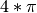 。 此外，GPR 为 KRR 不可用的预测提供了合理的置信区间。 两种方法之间的主要区别是拟合和预测所需的时间： 原则上KRR的拟合速度较快，超参数优化的网格搜索与超参数（ “curse of dimensionality(维度诅咒)” ）呈指数级关系。 GPR中的参数的基于梯度的优化不受此指数缩放的影响，因此在具有三维超参数空间的该示例上相当快。 预测的时间是相似的; 然而，生成 GPR 预测分布的方差需要的时间比生成平均值要长。

### 1.7.2.3. Mauna Loa CO2 数据中的 GRR

该示例基于[[RW2006]](#rw2006)的第 5.4.3 节。 它演示了使用梯度上升的对数边缘似然性的复杂内核工程和超参数优化的示例。 数据包括在 1958 年至 1997 年间夏威夷 Mauna Loa 天文台收集的每月平均大气二氧 化碳浓度（以百万分之几（ppmv）计）。目的是将二氧化碳浓度建模为时间t的函数。

内核由几个术语组成，负责说明信号的不同属性：

*   一个长期的，顺利的上升趋势是由一个 RBF 内核来解释的。 具有较大长度尺寸的RBF内核将使该分量平滑; 没有强制这种趋势正在上升，这给 GP 带来了这个选择。 具体的长度尺度和振幅是自由的超参数。
*   季节性因素，由定期的 ExpSineSquared 内核解释，固定周期为1年。 该周期分量的长度尺度控制其平滑度是一个自由参数。 为了使准确周期性的衰减，采用带有RBF内核的产品。 该RBF组件的长度尺寸控制衰减时间，并且是另一个自由参数。
*   较小的中期不规则性将由 RationalQuadratic 内核组件来解释， RationalQuadratic 内核组件的长度尺度和 alpha 参数决定长度尺度的扩散性。 根据[[RW2006]](#rw2006)，这些不规则性可以更好地由 RationalQuadratic 来解释， 而不是 RBF 内核组件，这可能是因为它可以容纳几个长度尺度。
*   “noise(噪声)” 一词，由一个 RBF 内核贡献组成，它将解释相关的噪声分量，如局部天气现象以及 WhiteKernel 对白噪声的贡献。 相对幅度和RBF的长度尺度是进一步的自由参数。

在减去目标平均值后最大化对数边际似然率产生下列内核，其中LML为-83.214:

```py
34.4**2 * RBF(length_scale=41.8)
+ 3.27**2 * RBF(length_scale=180) * ExpSineSquared(length_scale=1.44,
                                                   periodicity=1)
+ 0.446**2 * RationalQuadratic(alpha=17.7, length_scale=0.957)
+ 0.197**2 * RBF(length_scale=0.138) + WhiteKernel(noise_level=0.0336)

```

因此，大多数目标信号（34.4ppm）由长期上升趋势（长度为41.8年）解释。 周期分量的振幅为3.27ppm，衰减时间为180年，长度为1.44。 长时间的衰变时间表明我们在当地非常接近周期性的季节性成分。 相关噪声的幅度为0.197ppm，长度为0.138年，白噪声贡献为0.197ppm。 因此，整体噪声水平非常小，表明该模型可以很好地解释数据。 该图还显示，该模型直到2015年左右才能做出置信度比较高的预测

[](https://scikit-learn.org/stable/auto_examples/gaussian_process/plot_gpr_co2.html)

## 1.7.3. 高斯过程分类（GPC）

所述 [`GaussianProcessClassifier`](https://scikit-learn.org/stable/modules/generated/sklearn.gaussian_process.GaussianProcessClassifier.html#sklearn.gaussian_process.GaussianProcessClassifier "sklearn.gaussian_process.GaussianProcessClassifier") 器实现了用于分类目的的高斯过程（GP），当测试的预测采用类概率的形式，更能够用于概率分类。 GaussianProcessClassifier 在隐函数  之前设置GP先验，然后通过链接函数进行压缩以获得概率分类。 隐函数  因此就是所谓的干扰函数(nuisance function)，其值不能被观测到，并且自身不具有相关性。 其目的是允许模型的表达形式更加简便，并且  在预测过程中被去除（整合）。 GaussianProcessClassifier 实现了逻辑链接函数， 对于该逻辑，积分不能在分析上计算，但在二进制情况下很容易近似。

与回归设置相反，即使设置了高斯过程先验，隐函数  的后验也不符合高斯分布， 因为高斯似然不适用于离散类标签。相反，使用的是与逻辑链接函数（logit）对应的非高斯似然。 GaussianProcessClassifier 通过拉普拉斯近似(Laplace approximation)来估计非高斯后验分布。 更多详细信息，请参见[[RW2006]](#rw2006)的第 3 章。

GP先验平均值假定为零。先验的协方差是通过传递 [内核(kernel)](#gp-kernels) 对象来指定的。 在通过最大化基于传递的对数边缘似然（LML）的 GaussianProcessRegressor 拟合期间， 优化内核的超参数 `optimizer` 。由于LML可能具有多个局部最优值， 所以优化器可以通过指定重复启动 `n_restarts_optimizer` 。 第一次运行始终从内核的初始超参数值开始执行; 从已经从允许值的范围中随机选择超参数值来进行后续运行。 如果初始超参数需要保持固定，*None* 可以传递作为优化器。

[`GaussianProcessClassifier`](https://scikit-learn.org/stable/modules/generated/sklearn.gaussian_process.GaussianProcessClassifier.html#sklearn.gaussian_process.GaussianProcessClassifier "sklearn.gaussian_process.GaussianProcessClassifier") 通过执行基于OvR(one-versus-rest)或 OvO(one-versus-one )策略的训练和预测来支持多类分类。 在OvR(one-versus-rest)策略中，每个类都配有一个二进制高斯过程分类器，该类别被训练为将该类与其余类分开。 在 “one_vs_one” 中，对于每对类拟合一个二进制高斯过程分类器，这被训练为分离这两个类。 这些二进制预测因子的预测被组合成多类预测。更多详细信息，请参阅 [多类别分类](multiclass.html#multiclass) 。

在高斯过程分类的情况下，”one_vs_one” 策略可能在计算上更廉价， 因为它必须解决涉及整个训练集的每一个子集的许多问题， 而不是整个数据集的较少的问题。由于高斯过程分类与数据集的大小相互立方，这可能要快得多。 但是，请注意，”one_vs_one” 不支持预测概率估计，而只是简单的预测。 此外，请注意， [`GaussianProcessClassifier`](https://scikit-learn.org/stable/modules/generated/sklearn.gaussian_process.GaussianProcessClassifier.html#sklearn.gaussian_process.GaussianProcessClassifier "sklearn.gaussian_process.GaussianProcessClassifier") 在内部还没有实现真正的多类 Laplace 近似， 但如上所述，在解决内部二进制分类任务的基础上，它们使用OvR或OvO的组合方法。

## 1.7.4. GPC 示例

### 1.7.4.1. GPC 概率预测

该示例说明了对于具有不同选项的超参数的RBF内核的GPC预测概率。 第一幅图显示GPC具有任意选择的超参数的预测概率，以及对应于最大LML（对数边缘似然）对应的超参数。

虽然通过优化LML选择的超参数具有相当大的LML，但是根据测试数据的对数损失，它们的表现更差。 该图显示，这是因为它们在阶级边界（这是好的）表现出类概率的急剧变化， 但预测概率接近0.5远离类边界（这是坏的）这种不良影响是由于GPC内部使用了拉普拉斯逼近。

第二幅图显示了内核超参数的不同选择的LML（对数边缘似然），突出了在第一幅图中使用的通过黑点（训练集）选择的两个超参数。

[](https://scikit-learn.org/stable/auto_examples/gaussian_process/plot_gpc.html)[](https://scikit-learn.org/stable/auto_examples/gaussian_process/plot_gpc.html)

### 1.7.4.2. GPC 在 XOR 数据集上的举例说明

此示例说明了在XOR数据上的GPC。各向同性的核（ [`RBF`](https://scikit-learn.org/stable/modules/generated/sklearn.gaussian_process.kernels.RBF.html#sklearn.gaussian_process.kernels.RBF "sklearn.gaussian_process.kernels.RBF") ）和非固定的核（ [`DotProduct`](https://scikit-learn.org/stable/modules/generated/sklearn.gaussian_process.kernels.DotProduct.html#sklearn.gaussian_process.kernels.DotProduct "sklearn.gaussian_process.kernels.DotProduct") ）对比固定性。 在这个特定的数据集上， *DotProduct* 内核获得了更好的结果，因为类边界是线性的，与坐标轴重合。 然而，实际上，诸如 [`RBF`](https://scikit-learn.org/stable/modules/generated/sklearn.gaussian_process.kernels.RBF.html#sklearn.gaussian_process.kernels.RBF "sklearn.gaussian_process.kernels.RBF") 这样的固定内核经常获得更好结果。

[](https://scikit-learn.org/stable/auto_examples/gaussian_process/plot_gpc_xor.html)

### 1.7.4.3. iris 数据集上的高斯过程分类（GPC）

该示例说明了用于虹膜数据集的二维版本上各向同性和各向异性RBF核的GPC的预测概率。 这说明了GPC对多类分类的适用性。 各向异性RBF内核通过为两个特征维度分配不同的长度尺度来获得稍高的LML（对数边缘似然）。

[](https://scikit-learn.org/stable/auto_examples/gaussian_process/plot_gpc_iris.html)

## 1.7.5. 高斯过程内核

内核（也可以叫做GPs上下文中的”协方差函数”） 是决定高斯过程（GP）先验和后验形状的关键组成部分。 它们通过定义两个数据点的“相似性”，并结合相似的 数据点应该具有相似的目标值的假设，对所学习的函数进行编码。 内核可以分为两类：固定内核，只取决于两个数据点的距离， 不依赖于它们的绝对值 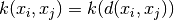 ，因此它们对于输入空间中的转换是不变的；非固定的内核，取 决于数据点的具体值。固定内核可以进一步细分为各向同性和各向 异性内核，其中各向同性内核不会在输入空间中旋转。想要了解 更多细节，请参看 [[RW2006]](#rw2006) 的第四章。

### 1.7.5.1. 高斯过程内核 API

[`Kernel`](https://scikit-learn.org/stable/modules/generated/sklearn.gaussian_process.kernels.Kernel.html#sklearn.gaussian_process.kernels.Kernel "sklearn.gaussian_process.kernels.Kernel") 主要是用来计算数据点之间的高斯过程协方差。 为此，内核中 `__call__` 方法会被调用。该方法可以用于计算 2d阵列X中所有数据点对的“自动协方差”，或二维阵列X的数据点 与二维阵列Y中的数据点的所有组合的“互协方差”。以下论断对于 所有内核k（除了 [`WhiteKernel`](https://scikit-learn.org/stable/modules/generated/sklearn.gaussian_process.kernels.WhiteKernel.html#sklearn.gaussian_process.kernels.WhiteKernel "sklearn.gaussian_process.kernels.WhiteKernel")）都是成立的：`k(X) == K(X, Y=X)`。 如果仅仅是自协方差的对角线元素被使用，那么内核的方法 `diag()` 将会被调用， 该方法比等价的调用 `__call__`: `np.diag(k(X, X)) == k.diag(X)` 具有更高的计算效率。

内核通过超参数向量 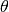 进行参数化。这些超参数可以 控制例如内核的长度或周期性（见下文）。通过设置 `__call__` 方法的参数 `eval_gradient=True` ，所有的内核支持计算解析 内核自协方差对于  的解析梯度。该梯度被用来在 高斯过程中（不论是回归型还是分类型的）计算LML（对数边缘似然）函数 的梯度，进而被用来通过梯度下降的方法极大化LML（对数边缘似然）函数 从而确定  的值。对于每个超参数，当对内核的实例 进行赋值时，初始值和边界值需要被指定。通过内核对象属性 `theta` ，  的当前值可以被获取或者设置。更重要的是， 超参的边界值可以被内核属性 `bounds` 获取。需要注意的是， 以上两种属性值(theta和bounds)都会返回内部使用值的日志转换值， 这是因为这两种属性值通常更适合基于梯度的优化。每个超参数的 规范 [`Hyperparameter`](https://scikit-learn.org/stable/modules/generated/sklearn.gaussian_process.kernels.Hyperparameter.html#sklearn.gaussian_process.kernels.Hyperparameter "sklearn.gaussian_process.kernels.Hyperparameter") 以实例形式被存储在相应内核中。 请注意使用了以”x”命名的超参的内核必然具有self.x和self.x_bounds这两种属性。

所有内核的抽象基类为 [`Kernel`](https://scikit-learn.org/stable/modules/generated/sklearn.gaussian_process.kernels.Kernel.html#sklearn.gaussian_process.kernels.Kernel "sklearn.gaussian_process.kernels.Kernel") 。Kernel 基类实现了 一个相似的接口 `Estimator` ，提供了方法 `get_params()` , `set_params()` 以及 `clone()` 。这也允许通过诸如 `Pipeline` 或者 `GridSearch` 之类的元估计来设置内核值。 需要注意的是，由于内核的嵌套结构（通过内核操作符，如下所见）， 内核参数的名称可能会变得相对复杂些。通常来说，对于二元内核操作， 参数的左运算元以 `k1__` 为前缀，而右运算元以 `k2__` 为前缀。 一个额外的便利方法是 `clone_with_theta(theta)`， 该方法返回克隆版本的内核，但是设置超参数为 `theta`。 示例如下：

```py
>>> from sklearn.gaussian_process.kernels import ConstantKernel, RBF
>>> kernel = ConstantKernel(constant_value=1.0, constant_value_bounds=(0.0, 10.0)) * RBF(length_scale=0.5, length_scale_bounds=(0.0, 10.0)) + RBF(length_scale=2.0, length_scale_bounds=(0.0, 10.0))
>>> for hyperparameter in kernel.hyperparameters: print(hyperparameter)
Hyperparameter(name='k1__k1__constant_value', value_type='numeric', bounds=array([[ 0., 10.]]), n_elements=1, fixed=False)
Hyperparameter(name='k1__k2__length_scale', value_type='numeric', bounds=array([[ 0., 10.]]), n_elements=1, fixed=False)
Hyperparameter(name='k2__length_scale', value_type='numeric', bounds=array([[ 0., 10.]]), n_elements=1, fixed=False)
>>> params = kernel.get_params()
>>> for key in sorted(params): print("%s : %s" % (key, params[key]))
k1 : 1**2 * RBF(length_scale=0.5)
k1__k1 : 1**2
k1__k1__constant_value : 1.0
k1__k1__constant_value_bounds : (0.0, 10.0)
k1__k2 : RBF(length_scale=0.5)
k1__k2__length_scale : 0.5
k1__k2__length_scale_bounds : (0.0, 10.0)
k2 : RBF(length_scale=2)
k2__length_scale : 2.0
k2__length_scale_bounds : (0.0, 10.0)
>>> print(kernel.theta)  # Note: log-transformed
[ 0.         -0.69314718  0.69314718]
>>> print(kernel.bounds)  # Note: log-transformed
[[      -inf 2.30258509]
 [      -inf 2.30258509]
 [      -inf 2.30258509]]
```

所有的高斯过程内核操作都可以通过 [`sklearn.metrics.pairwise`](classes.html#module-sklearn.metrics.pairwise "sklearn.metrics.pairwise") 来进行互操作，反之亦然。 [`Kernel`](https://scikit-learn.org/stable/modules/generated/sklearn.gaussian_process.kernels.Kernel.html#sklearn.gaussian_process.kernels.Kernel "sklearn.gaussian_process.kernels.Kernel") 的子类实例可以通过 `metric` 参数传给 [`sklearn.metrics.pairwise`](classes.html#module-sklearn.metrics.pairwise "sklearn.metrics.pairwise") 中的`pairwise_kernels` 。更重要的是，超参数的梯度不是分析的，而是数字，所有这些内核只支持各向同性距离。该参数 `gamma` 被认为是一个超参数，可以进行优化。其他内核参数在初始化时直接设置， 并保持固定。

### 1.7.5.2. 基础内核

[`ConstantKernel`](https://scikit-learn.org/stable/modules/generated/sklearn.gaussian_process.kernels.ConstantKernel.html#sklearn.gaussian_process.kernels.ConstantKernel "sklearn.gaussian_process.kernels.ConstantKernel") 内核类可以被用作 [`Product`](https://scikit-learn.org/stable/modules/generated/sklearn.gaussian_process.kernels.Product.html#sklearn.gaussian_process.kernels.Product "sklearn.gaussian_process.kernels.Product") 内核类的一部分， 在它可以对其他因子（内核）进行度量的场景下或者作为更改高斯过程均值的[`Sum`](https://scikit-learn.org/stable/modules/generated/sklearn.gaussian_process.kernels.Sum.html#sklearn.gaussian_process.kernels.Sum "sklearn.gaussian_process.kernels.Sum") 类的一部分。这取决于参数 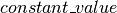 的设置。该方法定义为：

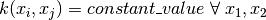

[`WhiteKernel`](https://scikit-learn.org/stable/modules/generated/sklearn.gaussian_process.kernels.WhiteKernel.html#sklearn.gaussian_process.kernels.WhiteKernel "sklearn.gaussian_process.kernels.WhiteKernel") 内核类的主要应用实例在于当解释信号的噪声部分时 可以作为内核集合的一部分。通过调节参数 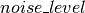， 该类可以用来估计噪声级别。具体如下所示：


### 1.7.5.3. 内核操作

内核操作是把1~2个基内核与新内核进行合并。内核类 [`Sum`](https://scikit-learn.org/stable/modules/generated/sklearn.gaussian_process.kernels.Sum.html#sklearn.gaussian_process.kernels.Sum "sklearn.gaussian_process.kernels.Sum") 通过 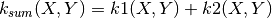 相加来合并  和  内核。内核类 [`Product`](https://scikit-learn.org/stable/modules/generated/sklearn.gaussian_process.kernels.Product.html#sklearn.gaussian_process.kernels.Product "sklearn.gaussian_process.kernels.Product") 通过  把  和  内核进行合并。内核类 [`Exponentiation`](https://scikit-learn.org/stable/modules/generated/sklearn.gaussian_process.kernels.Exponentiation.html#sklearn.gaussian_process.kernels.Exponentiation "sklearn.gaussian_process.kernels.Exponentiation") 通过  把基内核与 常量参数  进行合并。

### 1.7.5.4. 径向基函数内核

[`RBF`](https://scikit-learn.org/stable/modules/generated/sklearn.gaussian_process.kernels.RBF.html#sklearn.gaussian_process.kernels.RBF "sklearn.gaussian_process.kernels.RBF") 内核是一个固定内核，它也被称为“平方指数”内核。它通过定长的参数  来对内核进行参数化。该参数既可以是标量（内核的各向同性变体）或者与输入  （内核的各向异性变体） 具有相同数量的维度的向量。该内核可以被定义为：


这个内核是无限可微的，这意味着这个内核作为协方差函数的 GP 具有所有阶数的均方差导数， 因此非常平滑。由RBF内核产生的GP的先验和后验示意图如下所示：

[](https://scikit-learn.org/stable/auto_examples/gaussian_process/plot_gpr_prior_posterior.html)

### 1.7.5.5. Matérn 内核

[`Matern`](https://scikit-learn.org/stable/modules/generated/sklearn.gaussian_process.kernels.Matern.html#sklearn.gaussian_process.kernels.Matern "sklearn.gaussian_process.kernels.Matern") 内核是一个固定内核，是 [`RBF`](https://scikit-learn.org/stable/modules/generated/sklearn.gaussian_process.kernels.RBF.html#sklearn.gaussian_process.kernels.RBF "sklearn.gaussian_process.kernels.RBF") 内核的泛化。它有一个额外的参数 ， 该参数控制结果函数的平滑程度。它由定长参数  来实现参数化。该参数既可以是标量 （内核的各向同性变体）或者与输入  （内核的各向异性变体）具有相同数量的维度的向量。 该内核可以被定义为：

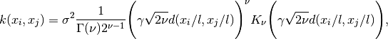

因为  ，Matérn 内核收敛到 RBF 内核。 当  时，Matérn 内核变得与绝对指数内核相同时，即


特别的，当  时：


和 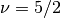 :


是学习函数的常用选择，并且不是无限可微的（由 RBF 内核假定） 但是至少具有一阶(  )或者二阶(  )可微性。

通过  灵活控制学习函数的平滑性可以更加适应真正的底层函数关联属性。 通过 Matérn 内核产生的高斯过程的先验和后验如下图所示：

[](https://scikit-learn.org/stable/auto_examples/gaussian_process/plot_gpr_prior_posterior.html)

想要更进一步地了解不同类型的Matérn内核请参阅 [[RW2006]](#rw2006) , pp84。

### 1.7.5.6. 有理二次内核

[`RationalQuadratic`](https://scikit-learn.org/stable/modules/generated/sklearn.gaussian_process.kernels.RationalQuadratic.html#sklearn.gaussian_process.kernels.RationalQuadratic "sklearn.gaussian_process.kernels.RationalQuadratic") 内核可以被看做不同特征尺度下的 [`RBF`](https://scikit-learn.org/stable/modules/generated/sklearn.gaussian_process.kernels.RBF.html#sklearn.gaussian_process.kernels.RBF "sklearn.gaussian_process.kernels.RBF") 内核的规模混合（一个无穷和） 它通过长度尺度参数  和比例混合参数  进行参数化。 此时仅支持  标量的各向同性变量。内核公式如下：


从 RBF 内核中产生的高斯过程的先验和后验如下图所示：

[](https://scikit-learn.org/stable/auto_examples/gaussian_process/plot_gpr_prior_posterior.html)

### 1.7.5.7. 正弦平方内核

[`ExpSineSquared`](https://scikit-learn.org/stable/modules/generated/sklearn.gaussian_process.kernels.ExpSineSquared.html#sklearn.gaussian_process.kernels.ExpSineSquared "sklearn.gaussian_process.kernels.ExpSineSquared") 内核可以对周期性函数进行建模。它由定长参数  以及周期参数 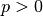 来实现参数化。此时仅支持  标量的各向同性变量。内核公式如下：


从ExpSineSquared内核中产生的高斯过程的先验和后验如下图所示：

[](https://scikit-learn.org/stable/auto_examples/gaussian_process/plot_gpr_prior_posterior.html)

### 1.7.5.8. 点乘内核

[`DotProduct`](https://scikit-learn.org/stable/modules/generated/sklearn.gaussian_process.kernels.DotProduct.html#sklearn.gaussian_process.kernels.DotProduct "sklearn.gaussian_process.kernels.DotProduct") 内核是非固定内核，它可以通过在线性回归的 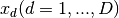 的相关系数上加上 服从于  的先验以及在线性回归的偏置上加上服从于  的先验来获得。 该 [`DotProduct`](https://scikit-learn.org/stable/modules/generated/sklearn.gaussian_process.kernels.DotProduct.html#sklearn.gaussian_process.kernels.DotProduct "sklearn.gaussian_process.kernels.DotProduct") 内核对于原点坐标的旋转是不变的，因此不是转换。它通过设置参数  来进行参数化。 当 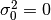 时，该内核叫做同质线性内核；否则该内核是非同质的。内核公式如下：

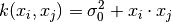

[`DotProduct`](https://scikit-learn.org/stable/modules/generated/sklearn.gaussian_process.kernels.DotProduct.html#sklearn.gaussian_process.kernels.DotProduct "sklearn.gaussian_process.kernels.DotProduct") 内核通常和指数分布相结合。实例如下图所示：

[](https://scikit-learn.org/stable/auto_examples/gaussian_process/plot_gpr_prior_posterior.html)

### 1.7.5.9. 参考文献
<span id="rw2006">[RW2006]</span> Carl Eduard Rasmussen and Christopher K.I. Williams, “Gaussian Processes for Machine Learning”, MIT Press 2006, Link to an official complete PDF version of the book [here](http://www.gaussianprocess.org/gpml/chapters/RW.pdf) .
