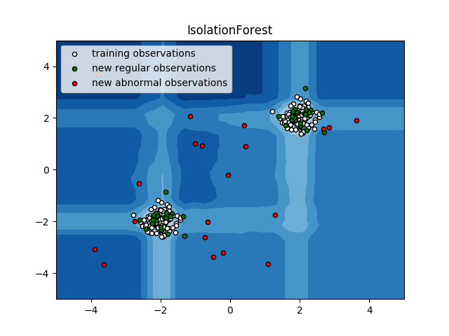
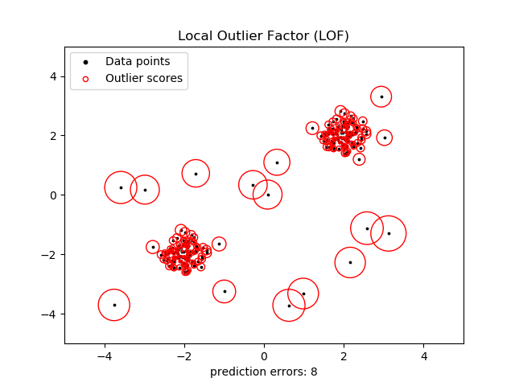

# 2.7. 新奇和异常值检测

校验者:
        [@RyanZhiNie](https://github.com/RyanZhiNie)
        [@羊三](https://github.com/apachecn/scikit-learn-doc-zh)
        [@Loopy](https://github.com/loopyme)
翻译者:
        [@羊三](https://github.com/apachecn/scikit-learn-doc-zh)

许多应用需要能够对新观测进行判断，判断其是否与现有观测服从同一分布（即新观测为内围值），相反则被认为不服从同一分布（即新观测为异常值）。 通常，这种能力被用于清理实际的数据集。必须做出两种重要区分：


* **新奇检测:** 训练数据未被异常值污染，我们对于新观测中的异常情况有兴趣检测。
* **异常值检测:** 训练数据包含异常值，我们需要拟合出训练数据的中心模式，以忽略有偏差的观测。

孤立点检测 和 新奇点检测 都被用于异常检测, 所谓异常检测就是 检测反常的的观测或不平常的观测。 孤立点检测 也被称之为 无监督异常检测; 而 新奇点检测 被称之为 半监督异常检测。 在孤立点检测的语境下, 离群点/新奇点 不能够形成一个稠密的聚类簇，因为可用的估计器都假定了 离群点/新奇点 位于低密度区域。相反的，在新奇点检测的语境下， 异常点/新奇点 是可以形成 稠密聚类簇的，只要它们在训练数据的一个低密度区域，这被认为是正常的。

scikit-learn项目提供了一套可用于新奇或异常值检测的机器学习工具。 该策略是以无监督的方式学习数据中的对象来实现的:

```py
estimator.fit(X_train)

```

然后可以使用 *predict* 方法将新观测归为内围值或异常值:

```py
estimator.predict(X_test)

```

内围值被标记为1，而异常值被标记为-1。 预测方法使用一个阈值在估计器计算出的原始评分函数上。 这个评分函数可以通过方法`score_samples`进行访问，而且 这个阈值可以由参数`contamination`控制。

`decision_function`方法也是从评分函数定义的，这样的话，得分为负值的就是 outliers, 得分为非负的就是 inliers:

```py
estimator.decision_function(X_test)
```

请注意 [neighbors.LocalOutlierFactor](https://scikit-learn.org/stable/modules/generated/sklearn.neighbors.LocalOutlierFactor.html#sklearn.neighbors.LocalOutlierFactor) 类默认不支持 `predict`, `decision_function` 和 `score_samples` 方法，而只支持 `fit_predict` 方法, 因为这个估计器一开始就是要把它用到孤立点检测中去的。 训练样本的异常性得分可以通过 `negative_outlier_factor_`属性来访问获取。

如果你真的特别想用 [neighbors.LocalOutlierFactor](https://scikit-learn.org/stable/modules/generated/sklearn.neighbors.LocalOutlierFactor.html#sklearn.neighbors.LocalOutlierFactor) 类进行新奇点检测, 即：对新的未见过的样本 预测其标签或计算其异常性得分, 你可以在实例化这个估计器的时候将其`novelty`参数设为 True ，这一步必须要在拟合之前做。这样的话，`fit_predict`方法就不可用了。

>**警告** ：使用局部异常因子(Local Outlier Factor,LOF)进行新奇点检测
>
>当`novelty`参数被设为 True 时，要当心。在新的未见过的数据上，你只能使用 `predict`, `decision_function` 和 `score_samples` ，而不能把这几个函数用在训练数据上， 否则会导致错误的结果。训练样本的异常性得分总是可以通过 `negative_outlier_factor_`属性来访问获取。

[neighbors.LocalOutlierFactor](https://scikit-learn.org/stable/modules/generated/sklearn.neighbors.LocalOutlierFactor.html#sklearn.neighbors.LocalOutlierFactor) 类在孤立点检测和新奇点检测中的行为被总结在下面的表中。

|　方法 | 孤立点检测 | 新奇点检测 |
|---|---|---|
|`fit_predict` | 可用 | 不可用 |
|`predict` | 不可用 | 只能用于新数据 |
|`decision_function` | 不可用 | 只能用于新数据 |
|`score_samples` | 用 `negative_outlier_factor_` | 只能用于新数据 |

## 2.7.1. 孤立点检测方法一览

下面这个示例针对scikit-learn 中的所有孤立点检测算法进行了对比。 局部异常因子(LOF) 没有在图的背景上画出决策边界，因为在孤立点检测中使用LOF时 它没有 predict 方法可以用在新数据上（见上面表格）。

[](https://scikit-learn.org/stable/auto_examples/plot_anomaly_comparison.html)

[ensemble.IsolationForest](https://scikit-learn.org/stable/modules/generated/sklearn.ensemble.IsolationForest.html#sklearn.ensemble.IsolationForest) 和 [neighbors.LocalOutlierFactor](https://scikit-learn.org/stable/modules/generated/sklearn.neighbors.LocalOutlierFactor.html#sklearn.neighbors.LocalOutlierFactor) 在这里所用的数据集上表现得相当好。 [svm.OneClassSVM](https://scikit-learn.org/stable/modules/generated/sklearn.svm.OneClassSVM.html#sklearn.svm.OneClassSVM) 类对outliers本来就很敏感， 因此在outlier的检测中表现的不是很好。最后, [covariance.EllipticEnvelope](https://scikit-learn.org/stable/modules/generated/sklearn.covariance.EllipticEnvelope.html#sklearn.covariance.EllipticEnvelope) 类 假定了数据是服从高斯分布的且要学习一个椭圆(ellipse)。关于这个对比试验中各种estimators的更多详细信息,请参考[ Comparing anomaly detection algorithms for outlier detection on toy datasets](https://scikit-learn.org/stable/auto_examples/plot_anomaly_comparison.html#sphx-glr-auto-examples-plot-anomaly-comparison-py)和后续小节。

> **示例**:
>* 查看[ Comparing anomaly detection algorithms for outlier detection on toy datasets](https://scikit-learn.org/stable/auto_examples/plot_anomaly_comparison.html#sphx-glr-auto-examples-plot-anomaly-comparison-py)以对比 [svm.OneClassSVM](https://scikit-learn.org/stable/modules/generated/sklearn.svm.OneClassSVM.html#sklearn.svm.OneClassSVM), [ensemble.IsolationForest](https://scikit-learn.org/stable/modules/generated/sklearn.ensemble.IsolationForest.html#sklearn.ensemble.IsolationForest), [neighbors.LocalOutlierFactor](https://scikit-learn.org/stable/modules/generated/sklearn.neighbors.LocalOutlierFactor.html#sklearn.neighbors.LocalOutlierFactor) 和 [covariance.EllipticEnvelope](https://scikit-learn.org/stable/modules/generated/sklearn.covariance.EllipticEnvelope.html#sklearn.covariance.EllipticEnvelope) 的表现.

## 2.7.2. Novelty Detection（新奇检测）

考虑一个来自同一分布的数据集，以  个特征描述、有  个观测。 现在考虑我们再往该数据集中添加一个观测。 如果新观测与原有观测有很大差异，我们就可以怀疑它是否是内围值吗？ （即是否来自同一分布？）或者相反，如果新观测与原有观测很相似，我们就无法将其与原有观测区分开吗？ 这就是新奇检测工具和方法所解决的问题。

一般来说，它将要学习出一个粗略且紧密的边界，界定出初始观测分布的轮廓，绘制在相互嵌入的  维空间中。 那么，如果后续的观测在边界划分的子空间内，则它们被认为来自与初始观测相同的总体。 否则，如果它们在边界之外，我们可以说就我们评估中给定的置信度而言，它们是异常值。

One-Class SVM（一类支持向量机）已经由 Schölkopf 等人采用以实现新奇检测，并在 [支持向量机](svm.html#svm) 模块的 [`svm.OneClassSVM`](https://scikit-learn.org/stable/modules/generated/sklearn.svm.OneClassSVM.html#sklearn.svm.OneClassSVM "sklearn.svm.OneClassSVM") 对象中实现。 需要选择 kernel 和 scalar 参数来定义边界。 通常选择 RBF kernel，即使没有确切的公式或算法来设置其带宽参数。 这是 scikit-learn 实现中的默认值。  参数，也称为一类支持向量机的边沿，对应于在边界之外找到新的但内围的观测的概率。

> **参考资料**:
>*   [Estimating the support of a high-dimensional distribution](http://dl.acm.org/citation.cfm?id=1119749) Schölkopf, Bernhard, et al. Neural computation 13.7 (2001): 1443-1471.

> **示例**:
>*   参见 [One-class SVM with non-linear kernel (RBF)](https://scikit-learn.org/stable/auto_examples/svm/plot_oneclass.html#sphx-glr-auto-examples-svm-plot-oneclass-py) ，通过 [`svm.OneClassSVM`](https://scikit-learn.org/stable/modules/generated/sklearn.svm.OneClassSVM.html#sklearn.svm.OneClassSVM "sklearn.svm.OneClassSVM") 对象学习一些数据来将边界可视化。
* [Species distribution modeling](https://scikit-learn.org/stable/auto_examples/applications/plot_species_distribution_modeling.html#sphx-glr-auto-examples-applications-plot-species-distribution-modeling-py)

[](https://scikit-learn.org/stable/auto_examples/svm/plot_oneclass.html)

## 2.7.3. Outlier Detection（异常值检测）

异常值检测类似于新奇检测，其目的是将内围观测的中心与一些被称为 “异常值” 的污染数据进行分离。 然而，在异常值检测的情况下，我们没有干净且适用于训练任何工具的数据集来代表内围观测的总体。

### 2.7.3.1. Fitting an elliptic envelope（椭圆模型拟合）

实现异常值检测的一种常见方式是假设内围数据来自已知分布（例如，数据服从高斯分布）。 从这个假设来看，我们通常试图定义数据的 “形状”，并且可以将异常观测定义为足够远离拟合形状的观测。

scikit-learn 提供了 [`covariance.EllipticEnvelope`](https://scikit-learn.org/stable/modules/generated/sklearn.covariance.EllipticEnvelope.html#sklearn.covariance.EllipticEnvelope "sklearn.covariance.EllipticEnvelope") 对象，它能拟合出数据的稳健协方差估计，从而为中心数据点拟合出一个椭圆，忽略中心模式之外的点。

例如，假设内围数据服从高斯分布，它将稳健地（即不受异常值的影响）估计内围位置和协方差。 从该估计得到的马氏距离用于得出异常度量。 该策略如下图所示。

[](https://scikit-learn.org/stable/auto_examples/covariance/plot_mahalanobis_distances.html)

> **示例**:
>*   参见 [Robust covariance estimation and Mahalanobis distances relevance](https://scikit-learn.org/stable/auto_examples/covariance/plot_mahalanobis_distances.html#sphx-glr-auto-examples-covariance-plot-mahalanobis-distances-py) 说明对位置和协方差使用标准估计 ([`covariance.EmpiricalCovariance`](https://scikit-learn.org/stable/modules/generated/sklearn.covariance.EmpiricalCovariance.html#sklearn.covariance.EmpiricalCovariance "sklearn.covariance.EmpiricalCovariance")) 或稳健估计 ([`covariance.MinCovDet`](https://scikit-learn.org/stable/modules/generated/sklearn.covariance.MinCovDet.html#sklearn.covariance.MinCovDet "sklearn.covariance.MinCovDet")) 来评估观测的异常程度的差异。

> **参考资料**:
>*   Rousseeuw, P.J., Van Driessen, K. “A fast algorithm for the minimum covariance determinant estimator” Technometrics 41(3), 212 (1999)

### 2.7.3.2. Isolation Forest（隔离森林）

在高维数据集中实现异常值检测的一种有效方法是使用随机森林。[`ensemble.IsolationForest`](https://scikit-learn.org/stable/modules/generated/sklearn.ensemble.IsolationForest.html#sklearn.ensemble.IsolationForest "sklearn.ensemble.IsolationForest") 通过随机选择特征然后随机选择所选特征的最大值和最小值之间的分割值来隔离观测。

由于递归划分可以由树形结构表示，因此隔离样本所需的分割次数等同于从根节点到终止节点的路径长度。

在这样的随机树的森林中取平均的路径长度是数据正态性和我们的决策功能的量度。

随机划分能为异常观测产生明显的较短路径。 因此，当随机树的森林共同为特定样本产生较短的路径长度时，这些样本就很有可能是异常观测。

[ensemble.IsolationForest](https://scikit-learn.org/stable/modules/generated/sklearn.ensemble.IsolationForest.html#sklearn.ensemble.IsolationForest)的实现，是基于是[tree.ExtraTreeRegressor](https://scikit-learn.org/stable/modules/generated/sklearn.tree.ExtraTreeRegressor.html#sklearn.tree.ExtraTreeRegressor).按照隔离森林的原始论文，每棵树的最大深度设置为log<sub>2</sub>(n),其中ｎ是构建树所用的样本数量（详见：(Liu et al., 2008) ）

该策略已在下面的示例中进行了说明。

[](https://scikit-learn.org/stable/auto_examples/ensemble/plot_isolation_forest.html)

[`ensemble.IsolationForest`](https://scikit-learn.org/stable/modules/generated/sklearn.ensemble.IsolationForest.html#sklearn.ensemble.IsolationForest "sklearn.ensemble.IsolationForest")支持`warm_start=True`，这让你可以添加更多的树到一个拟合好的模型中:

``` py
>>> from sklearn.ensemble import # 2.7.4Forest
>>> import numpy as np
>>> X = np.array([[-1, -1], [-2, -1], [-3, -2], [0, 0], [-20, 50], [3, 5]])
>>> clf = IsolationForest(n_estimators=10, warm_start=True)
>>> clf.fit(X)  # fit 10 trees  
>>> clf.set_params(n_estimators=20)  # add 10 more trees  
>>> clf.fit(X)  # fit the added trees  
```

> **示例**:
>*   参见 [IsolationForest example](https://scikit-learn.org/stable/auto_examples/ensemble/plot_isolation_forest.html#sphx-glr-auto-examples-ensemble-plot-isolation-forest-py) 说明隔离森林的用法。
>*   参见 [Outlier detection with several methods.](https://scikit-learn.org/stable/auto_examples/covariance/plot_outlier_detection.html#sphx-glr-auto-examples-covariance-plot-outlier-detection-py) 比较 [`ensemble.IsolationForest`](https://scikit-learn.org/stable/modules/generated/sklearn.ensemble.IsolationForest.html#sklearn.ensemble.IsolationForest "sklearn.ensemble.IsolationForest") 与 [`neighbors.LocalOutlierFactor`](https://scikit-learn.org/stable/modules/generated/sklearn.neighbors.LocalOutlierFactor.html#sklearn.neighbors.LocalOutlierFactor "sklearn.neighbors.LocalOutlierFactor"), [`svm.OneClassSVM`](https://scikit-learn.org/stable/modules/generated/sklearn.svm.OneClassSVM.html#sklearn.svm.OneClassSVM "sklearn.svm.OneClassSVM") (调整为执行类似异常值检测的方法）和基于协方差使用 [`covariance.EllipticEnvelope`](https://scikit-learn.org/stable/modules/generated/sklearn.covariance.EllipticEnvelope.html#sklearn.covariance.EllipticEnvelope "sklearn.covariance.EllipticEnvelope") 进行异常值检测。

> **参考资料**:
>*   Liu, Fei Tony, Ting, Kai Ming and Zhou, Zhi-Hua. “Isolation forest.” Data Mining, 2008. ICDM‘08. Eighth IEEE International Conference on.

### 2.7.3.3. Local Outlier Factor（局部异常系数）

对中等高维数据集实现异常值检测的另一种有效方法是使用局部异常系数（LOF）算法。

[`neighbors.LocalOutlierFactor`](https://scikit-learn.org/stable/modules/generated/sklearn.neighbors.LocalOutlierFactor.html#sklearn.neighbors.LocalOutlierFactor "sklearn.neighbors.LocalOutlierFactor") （LOF）算法计算出反映观测异常程度的得分（称为局部异常系数）。 它测量给定数据点相对于其邻近点的局部密度偏差。 算法思想是检测出具有比其邻近点明显更低密度的样本。

实际上，局部密度从 k 个最近邻得到。 观测数据的 LOF 得分等于其 k 个最近邻的平均局部密度与其本身密度的比值：正常情况预期具有与其近邻类似的局部密度，而异常数据 则预计比局部密度要小得多。

考虑的k个近邻数（别名参数 n_neighbors ）通常选择 1) 大于聚类必须包含的对象最小数量，以便其它对象相对于该聚类成为局部异常值，并且 2) 小于可能成为局部异常值对象的最大数量。 在实践中，这样的信息通常不可用，并且使 n_neighbors = 20 似乎通常都能很好地工作。 当异常值的比例较高时（即大于 10% 时，如下面的示例），n_neighbors 应该较大（在下面的示例中，n_neighbors = 35）。

LOF 算法的优点是考虑到数据集的局部和全局属性：即使在异常样本具有不同潜在密度的数据集中，它也能够表现得很好。 问题不在于样本是如何被分离的，而是样本与周围近邻的分离程度有多大。

当使用 LOF 进行孤立点检测的时候，不能使用 predict, decision_function 和 score_samples 方法， 只能使用 fit_predict 方法。训练样本的异常性得分可以通过 negative_outlier_factor_ 属性来获得。 注意当使用LOF算法进行新奇点检测的时候(novelty 设为 True)， predict, decision_function 和 score_samples 函数可被用于新的未见过的观测数据。请查看[使用LOF进行新奇点检测](#_274-使用LOF进行新奇点检测).

该策略如下图所示。

[](https://scikit-learn.org/stable/auto_examples/neighbors/sphx_glr_plot_lof_outlier_detection.html)

> **示例**:
>*   参见 [Anomaly detection with Local Outlier Factor (LOF)](https://scikit-learn.org/stable/auto_examples/neighbors/plot_lof.html#sphx-glr-auto-examples-neighbors-plot-lof-py) 的 [`neighbors.LocalOutlierFactor`](https://scikit-learn.org/stable/modules/generated/sklearn.neighbors.LocalOutlierFactor.html#sklearn.neighbors.LocalOutlierFactor "sklearn.neighbors.LocalOutlierFactor") 使用说明。
>*   参见 [Outlier detection with several methods.](https://scikit-learn.org/stable/auto_examples/covariance/plot_outlier_detection.html#sphx-glr-auto-examples-covariance-plot-outlier-detection-py) 与其它异常检测方法进行比较。

> **参考资料**:
>*   Breunig, Kriegel, Ng, and Sander (2000) [LOF: identifying density-based local outliers.](http://www.dbs.ifi.lmu.de/Publikationen/Papers/LOF.pdf) Proc. ACM SIGMOD

## 2.7.4. 使用LOF进行新奇点检测
如果要用 [neighbors.LocalOutlierFactor](https://www.studyai.cn/modules/generated/sklearn.neighbors.LocalOutlierFactor.html#sklearn.neighbors.LocalOutlierFactor) 类进行新奇点检测, 即对新的未见过的样本 预测其标签或计算其异常性得分, 你可以在实例化这个估计器的时候将其`novelty`参数设为 True ，这一步必须要在拟合之前完成:

```py
lof = LocalOutlierFactor(novelty=True)
lof.fit(X_train)
```
请注意`fit_predict` 方法在这情况下就不可用了。
>**警告** ：使用局部异常因子(Local Outlier Factor,LOF)进行新奇点检测
>
>当`novelty`参数被设为 True 时，要当心。在新的未见过的数据上，你只能使用 `predict`, `decision_function` 和 `score_samples` ，而不能把这几个函数用在训练数据上， 否则会导致错误的结果。训练样本的异常性得分总是可以通过 `negative_outlier_factor_`属性来访问获取。

使用局部异常因子(LOF)进行新奇点检测的示例见下图。

[](https://www.studyai.cn/images/sphx_glr_plot_lof_novelty_detection_0011.png)
