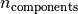

# 5.6. 随机投影

校验者:
        [@FontTian](https://github.com/FontTian)
        [@程威](https://github.com/apachecn/scikit-learn-doc-zh)
翻译者:
        [@Sehriff](https://github.com/apachecn/scikit-learn-doc-zh)

[`sklearn.random_projection`](classes.html#module-sklearn.random_projection "sklearn.random_projection") 模块实现了一个简单且高效率的计算方式来减少数据维度，通过牺牲一定的精度（作为附加变量）来加速处理时间及更小的模型尺寸。 这个模型实现了两类无结构化的随机矩阵: [Gaussian random matrix](#gaussian-random-matrix) 和 [sparse random matrix](#sparse-random-matrix).

随机投影矩阵的维度和分布是受控制的，所以可以保存任意两个数据集的距离。因此随机投影适用于基于距离的方法。

> **参考资料**:
>*   Sanjoy Dasgupta. 2000. [Experiments with random projection.](http://cseweb.ucsd.edu/~dasgupta/papers/randomf.pdf) In Proceedings of the Sixteenth conference on Uncertainty in artificial intelligence (UAI‘00), Craig Boutilier and Moisés Goldszmidt (Eds.). Morgan Kaufmann Publishers Inc., San Francisco, CA, USA, 143-151.
>*   Ella Bingham and Heikki Mannila. 2001. [Random projection in dimensionality reduction: applications to image and text data.](http://citeseerx.ist.psu.edu/viewdoc/download?doi=10.1.1.24.5135&rep=rep1&type=pdf) In Proceedings of the seventh ACM SIGKDD international conference on Knowledge discovery and data mining (KDD ‘01). ACM, New York, NY, USA, 245-250.

## 5.6.1. Johnson-Lindenstrauss 辅助定理

支撑随机投影效率的主要理论成果是[Johnson-Lindenstrauss lemma (quoting Wikipedia)](https://en.wikipedia.org/wiki/Johnson%E2%80%93Lindenstrauss_lemma):

> 在数学中，johnson - lindenstrauss 引理是一种将高维的点从高维到低维欧几里得空间的低失真嵌入的方案。 引理阐释了高维空间下的一小部分的点集可以内嵌到非常低维的空间，这种方式下点之间的距离几乎全部被保留。 内嵌所用到的映射至少符合 Lipschitz 条件,甚至可以被当做正交投影。

有了样本数量， [`sklearn.random_projection.johnson_lindenstrauss_min_dim`](https://scikit-learn.org/stable/modules/generated/sklearn.random_projection.johnson_lindenstrauss_min_dim.html#sklearn.random_projection.johnson_lindenstrauss_min_dim "sklearn.random_projection.johnson_lindenstrauss_min_dim") 会保守估计随机子空间的最小大小来保证随机投影导致的变形在一定范围内：

```py
>>> from sklearn.random_projection import johnson_lindenstrauss_min_dim
>>> johnson_lindenstrauss_min_dim(n_samples=1e6, eps=0.5)
663
>>> johnson_lindenstrauss_min_dim(n_samples=1e6, eps=[0.5, 0.1, 0.01])
array([    663,   11841, 1112658])
>>> johnson_lindenstrauss_min_dim(n_samples=[1e4, 1e5, 1e6], eps=0.1)
array([ 7894,  9868, 11841])`

```

[](https://scikit-learn.org/stable/auto_examples/plot_johnson_lindenstrauss_bound.html)[](https://scikit-learn.org/stable/auto_examples/plot_johnson_lindenstrauss_bound.html)

> **示例**:
>*   查看 [The Johnson-Lindenstrauss bound for embedding with random projections](https://scikit-learn.org/stable/auto_examples/plot_johnson_lindenstrauss_bound.html#sphx-glr-auto-examples-plot-johnson-lindenstrauss-bound-py) 里面有Johnson-Lindenstrauss引理的理论说明和使用稀疏随机矩阵的经验验证。

> **参考资料**:
>*   Sanjoy Dasgupta and Anupam Gupta, 1999. [An elementary proof of the Johnson-Lindenstrauss Lemma.](http://citeseerx.ist.psu.edu/viewdoc/download?doi=10.1.1.39.3334&rep=rep1&type=pdf)

## 5.6.2. 高斯随机投影

The [`sklearn.random_projection.GaussianRandomProjection`](https://scikit-learn.org/stable/modules/generated/sklearn.random_projection.GaussianRandomProjection.html#sklearn.random_projection.GaussianRandomProjection "sklearn.random_projection.GaussianRandomProjection") 通过将原始输入空间投影到随机生成的矩阵（该矩阵的组件由以下分布中抽取）:降低维度。

以下小片段演示了任何使用高斯随机投影转换器:

```py
>>> import numpy as np
>>> from sklearn import random_projection
>>> X = np.random.rand(100, 10000)
>>> transformer = random_projection.GaussianRandomProjection()
>>> X_new = transformer.fit_transform(X)
>>> X_new.shape
(100, 3947)

```

## 5.6.3. 稀疏随机矩阵

[`sklearn.random_projection.SparseRandomProjection`](https://scikit-learn.org/stable/modules/generated/sklearn.random_projection.SparseRandomProjection.html#sklearn.random_projection.SparseRandomProjection "sklearn.random_projection.SparseRandomProjection") 使用稀疏随机矩阵，通过投影原始输入空间来降低维度。

稀疏矩阵可以替换高斯随机投影矩阵来保证相似的嵌入质量，且内存利用率更高、投影数据的计算更快。

如果我们定义 `s = 1 / density`, 随机矩阵的元素由下式抽取。


其中  是投影后的子空间大小。 默认非零元素的浓密度设置为最小浓密度，该值由Ping Li et al.:推荐，根据公式:计算。

以下小片段演示了如何使用稀疏随机投影转换器:

```py
>>> import numpy as np
>>> from sklearn import random_projection
>>> X = np.random.rand(100,10000)
>>> transformer = random_projection.SparseRandomProjection()
>>> X_new = transformer.fit_transform(X)
>>> X_new.shape
(100, 3947)
```

> **参考资料**:
>*   D. Achlioptas. 2003. [Database-friendly random projections: Johnson-Lindenstrauss with binary coins](www.cs.ucsc.edu/~optas/papers/jl.pdf). Journal of Computer and System Sciences 66 (2003) 671–687
>*   Ping Li, Trevor J. Hastie, and Kenneth W. Church. 2006. [Very sparse random projections.](http://citeseerx.ist.psu.edu/viewdoc/download?doi=10.1.1.62.585&rep=rep1&type=pdf) In Proceedings of the 12th ACM SIGKDD international conference on Knowledge discovery and data mining (KDD ‘06). ACM, New York, NY, USA, 287-296.
