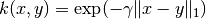

# 5.8. 成对的矩阵, 类别和核函数

校验者:
        [@FontTian](https://github.com/FontTian)
        [@numpy](https://github.com/apachecn/scikit-learn-doc-zh)
翻译者:
        [@程威](https://github.com/apachecn/scikit-learn-doc-zh)

The [`sklearn.metrics.pairwise`](classes.html#module-sklearn.metrics.pairwise "sklearn.metrics.pairwise") 子模块实现了用于评估成对距离或样本集合之间的联系的实用程序。

本模块同时包含距离度量和核函数，对于这两者这里提供一个简短的总结。

距离度量是形如 `d(a, b)` 例如 `d(a, b) &lt; d(a, c)` 如果对象 `a` 和 `b` 被认为 “更加相似” 相比于 `a` 和 `c`. 两个完全相同的目标的距离是零。最广泛使用的例子就是欧几里得距离。 为了保证是 ‘真实的’ 度量, 其必须满足以下条件:

> 1.  对于所有的 a 和 b，d(a, b) &gt;= 0
> 2.  正定性：当且仅当 a = b时，d(a, b) == 0
> 3.  对称性：d(a, b) == d(b, a)
> 4.  三角不等式：d(a, c) &lt;= d(a, b) + d(b, c)

核函数是相似度的标准. 如果对象 `a` 和 `b` 被认为 “更加相似” 相比对象 `a` 和 `c`，那么 `s(a, b) > s(a, c)`. 核函数必须是半正定性的.

存在许多种方法将距离度量转换为相似度标准，例如核函数。 假定 `D` 是距离, and `S` 是核函数:

> 1.  `S = np.exp(-D * gamma)`, 其中 `gamma` 的一种选择是 `1 / num_features`
> 2.  `S = 1. / (D / np.max(D))`

X 的行向量和 Y 的行向量之间的距离可以用函数 [pairwise_distances](https://scikit-learn.org/stable/modules/generated/sklearn.metrics.pairwise_distances.html#sklearn.metrics.pairwise_distances) 进行计算。 如果 Y 被忽略，则 X 的所有行向量的成对距离就会被计算。 类似的，函数 [pairwise.pairwise_kernels](https://scikit-learn.org/stable/modules/generated/sklearn.metrics.pairwise.pairwise_kernels.html#sklearn.metrics.pairwise.pairwise_kernels) 可以使用不同的核函数(kernel functions)来计算 X 和 Y 之间的 kernel。 请查看API获得更多详情。
```py
>>> import numpy as np
>>> from sklearn.metrics import pairwise_distances
>>> from sklearn.metrics.pairwise import pairwise_kernels
>>> X = np.array([[2, 3], [3, 5], [5, 8]])
>>> Y = np.array([[1, 0], [2, 1]])
>>> pairwise_distances(X, Y, metric='manhattan')
array([[ 4.,  2.],
       [ 7.,  5.],
       [12., 10.]])
>>> pairwise_distances(X, metric='manhattan')
array([[0., 3., 8.],
       [3., 0., 5.],
       [8., 5., 0.]])
>>> pairwise_kernels(X, Y, metric='linear')
array([[ 2.,  7.],
       [ 3., 11.],
       [ 5., 18.]])
```

## 5.8.1. 余弦相似度

[`cosine_similarity`](https://scikit-learn.org/stable/modules/generated/sklearn.metrics.pairwise.cosine_similarity.html#sklearn.metrics.pairwise.cosine_similarity "sklearn.metrics.pairwise.cosine_similarity") 计算L2正则化的向量的点积. 也就是说, if  和  都是行向量,, 它们的余弦相似度  定义为:


这被称为余弦相似度, 因为欧几里得(L2) 正则化将向量投影到单元球面内，那么它们的点积就是被向量表示的点之间的角度。

这种核函数对于计算以tf-idf向量表示的文档之间的相似度是一个通常的选择. [`cosine_similarity`](https://scikit-learn.org/stable/modules/generated/sklearn.metrics.pairwise.cosine_similarity.html#sklearn.metrics.pairwise.cosine_similarity "sklearn.metrics.pairwise.cosine_similarity") 接受 `scipy.sparse` 矩阵. (注意到 `sklearn.feature_extraction.text` 中的tf-idf函数能计算归一化的向量，在这种情况下 [`cosine_similarity`](https://scikit-learn.org/stable/modules/generated/sklearn.metrics.pairwise.cosine_similarity.html#sklearn.metrics.pairwise.cosine_similarity "sklearn.metrics.pairwise.cosine_similarity") 等同于 [`linear_kernel`](https://scikit-learn.org/stable/modules/generated/sklearn.metrics.pairwise.linear_kernel.html#sklearn.metrics.pairwise.linear_kernel "sklearn.metrics.pairwise.linear_kernel"), 只是慢一点而已.)

> **参考资料**:
>*   C.D. Manning, P. Raghavan and H. Schütze (2008). Introduction to Information Retrieval. Cambridge University Press. [http://nlp.stanford.edu/IR-book/html/htmledition/the-vector-space-model-for-scoring-1.html](http://nlp.stanford.edu/IR-book/html/htmledition/the-vector-space-model-for-scoring-1.html)

## 5.8.2. 线性核函数

函数 [`linear_kernel`](https://scikit-learn.org/stable/modules/generated/sklearn.metrics.pairwise.linear_kernel.html#sklearn.metrics.pairwise.linear_kernel "sklearn.metrics.pairwise.linear_kernel") 是计算线性核函数, 也就是一种在 `degree=1` 和 `coef0=0` (同质化) 情况下的 [`polynomial_kernel`](https://scikit-learn.org/stable/modules/generated/sklearn.metrics.pairwise.polynomial_kernel.html#sklearn.metrics.pairwise.polynomial_kernel "sklearn.metrics.pairwise.polynomial_kernel") 的特殊形式. 如果 `x` 和 `y` 是列向量, 它们的线性核函数是:


## 5.8.3. 多项式核函数

函数[polynomial_kernel](https://scikit-learn.org/stable/modules/generated/sklearn.metrics.pairwise.polynomial_kernel.html#sklearn.metrics.pairwise.polynomial_kernel)计算两个向量的d次方的多项式核函数. 多项式核函数代表着两个向量之间的相似度.概念上来说，多项式核函数不仅考虑相同维度还考虑跨维度的向量的相似度。当被用在机器学习中的时候，这可以原来代表着特征之间的 相互作用。

多项式函数定义为:


其中:
*   `x`, `y` 是输入向量
*   `d` 核函数维度

如果  那么核函数就被定义为同质化的.

## 5.8.4. Sigmoid 核函数

函数 [`sigmoid_kernel`](https://scikit-learn.org/stable/modules/generated/sklearn.metrics.pairwise.sigmoid_kernel.html#sklearn.metrics.pairwise.sigmoid_kernel "sklearn.metrics.pairwise.sigmoid_kernel") 计算两个向量之间的S型核函数. S型核函数也被称为双曲切线或者 多层感知机(因为在神经网络领域，它经常被当做激活函数). S型核函数定义为:


其中:
*   `x`, `y` 是输入向量
*    是斜度
*    是截距

## 5.8.5. RBF 核函数

函数 [`rbf_kernel`](https://scikit-learn.org/stable/modules/generated/sklearn.metrics.pairwise.rbf_kernel.html#sklearn.metrics.pairwise.rbf_kernel "sklearn.metrics.pairwise.rbf_kernel") 计算计算两个向量之间的径向基函数核 (RBF) 。 其定义为:


其中 `x` 和 `y` 是输入向量. 如果  核函数就变成方差为  的高斯核函数.

## 5.8.6. 拉普拉斯核函数

函数 [`laplacian_kernel`](https://scikit-learn.org/stable/modules/generated/sklearn.metrics.pairwise.laplacian_kernel.html#sklearn.metrics.pairwise.laplacian_kernel "sklearn.metrics.pairwise.laplacian_kernel") 是一种径向基函数核的变体，定义为:



其中 `x` 和 `y` 是输入向量 并且  是输入向量之间的曼哈顿距离.

已被证明在机器学习中运用到无噪声数据中是有用的. 可见例如 [Machine learning for quantum mechanics in a nutshell](http://onlinelibrary.wiley.com/doi/10.1002/qua.24954/abstract/).

## 5.8.7. 卡方核函数

在计算机视觉应用中训练非线性支持向量机时，卡方核函数是一种非常流行的选择.它能以 [`chi2_kernel`](https://scikit-learn.org/stable/modules/generated/sklearn.metrics.pairwise.chi2_kernel.html#sklearn.metrics.pairwise.chi2_kernel "sklearn.metrics.pairwise.chi2_kernel") 计算然后将参数`kernel=”precomputed”`传递到
[`sklearn.svm.SVC`](https://scikit-learn.org/stable/modules/generated/sklearn.svm.SVC.html#sklearn.svm.SVC "sklearn.svm.SVC") :

```py
>>> from sklearn.svm import SVC
>>> from sklearn.metrics.pairwise import chi2_kernel
>>> X = [[0, 1], [1, 0], [.2, .8], [.7, .3]]
>>> y = [0, 1, 0, 1]
>>> K = chi2_kernel(X, gamma=.5)
>>> K                        
array([[1.        , 0.36787944, 0.89483932, 0.58364548],
       [0.36787944, 1.        , 0.51341712, 0.83822343],
       [0.89483932, 0.51341712, 1.        , 0.7768366 ],
       [0.58364548, 0.83822343, 0.7768366 , 1.        ]])

>>> svm = SVC(kernel='precomputed').fit(K, y)
>>> svm.predict(K)
array([0, 1, 0, 1])

```

也可以直接使用 `kernel` 变量:

```py
>>> svm = SVC(kernel=chi2_kernel).fit(X, y)
>>> svm.predict(X)
array([0, 1, 0, 1])

```

卡方核函数定义为

![k(x, y) = \exp \left (-\gamma \sum_i \frac{(x[i] - y[i]) ^ 2}{x[i] + y[i]} \right )](img/33b1cdc0654561cadac36a1232552b99.jpg)

数据假定为非负的，并且已经以L1正则化。 归一化随着与卡方平方距离的连接而被合理化，其是离散概率分布之间的距离。

卡方核函数最常用于可视化词汇的矩形图。

> **参考资料**:
>*   Zhang, J. and Marszalek, M. and Lazebnik, S. and Schmid, C. Local features and kernels for classification of texture and object categories: A comprehensive study International Journal of Computer Vision 2007 [http://research.microsoft.com/en-us/um/people/manik/projects/trade-off/papers/ZhangIJCV06.pdf](http://research.microsoft.com/en-us/um/people/manik/projects/trade-off/papers/ZhangIJCV06.pdf)
