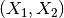
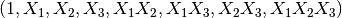

# 4.3\. 预处理数据

校验者:
        [@if only](https://github.com/apachecn/scikit-learn-doc-zh)
翻译者:
        [@Trembleguy](https://github.com/apachecn/scikit-learn-doc-zh)

`sklearn.preprocessing` 包提供了几个常见的实用功能和变换器类型，用来将原始特征向量更改为更适合机器学习模型的形式。

一般来说，机器学习算法受益于数据集的标准化。如果数据集中存在一些离群值，那么稳定的缩放或转换更合适。不同缩放、转换以及归一在一个包含边缘离群值的数据集中的表现在 [Compare the effect of different scalers on data with outliers](https://scikit-learn.org/stable/auto_examples/preprocessing/plot_all_scaling.html#sphx-glr-auto-examples-preprocessing-plot-all-scaling-py) 中有着重说明。

## 4.3.1\. 标准化，也称去均值和方差按比例缩放

数据集的 **标准化** 对scikit-learn中实现的大多数机器学习算法来说是 **常见的要求** 。如果个别特征或多或少看起来不是很像标准正态分布(**具有零均值和单位方差**)，那么它们的表现力可能会较差。

在实际情况中,我们经常忽略特征的分布形状，直接经过去均值来对某个特征进行中心化，再通过除以非常量特征(non-constant features)的标准差进行缩放。

例如，在机器学习算法的目标函数(例如SVM的RBF内核或线性模型的l1和l2正则化)，许多学习算法中目标函数的基础都是假设所有的特征都是零均值并且具有同一阶数上的方差。如果某个特征的方差比其他特征大几个数量级，那么它就会在学习算法中占据主导位置，导致学习器并不能像我们说期望的那样，从其他特征中学习。

函数 [`scale`](https://scikit-learn.org/stable/modules/generated/sklearn.preprocessing.scale.html#sklearn.preprocessing.scale "sklearn.preprocessing.scale") 为数组形状的数据集的标准化提供了一个快捷实现:

```py
>>> from sklearn import preprocessing
>>> import numpy as np
>>> X_train = np.array([[ 1., -1.,  2.],
...                     [ 2.,  0.,  0.],
...                     [ 0.,  1., -1.]])
>>> X_scaled = preprocessing.scale(X_train)

>>> X_scaled                                          
array([[ 0\.  ..., -1.22...,  1.33...],
 [ 1.22...,  0\.  ..., -0.26...],
 [-1.22...,  1.22..., -1.06...]])

```

经过缩放后的数据具有零均值以及标准方差:

```py
>>> X_scaled.mean(axis=0)
array([ 0.,  0.,  0.])

>>> X_scaled.std(axis=0)
array([ 1.,  1.,  1.])

```

`预处理` 模块还提供了一个实用类 [`StandardScaler`](https://scikit-learn.org/stable/modules/generated/sklearn.preprocessing.StandardScaler.html#sklearn.preprocessing.StandardScaler "sklearn.preprocessing.StandardScaler") ，它实现了转化器的API来计算训练集上的平均值和标准偏差，以便以后能够在测试集上重新应用相同的变换。因此，这个类适用于 [`sklearn.pipeline.Pipeline`](https://scikit-learn.org/stable/modules/generated/sklearn.pipeline.Pipeline.html#sklearn.pipeline.Pipeline "sklearn.pipeline.Pipeline") 的早期步骤:

```py
>>> scaler = preprocessing.StandardScaler().fit(X_train)
>>> scaler
StandardScaler(copy=True, with_mean=True, with_std=True)

>>> scaler.mean_                                      
array([ 1\. ...,  0\. ...,  0.33...])

>>> scaler.scale_                                       
array([ 0.81...,  0.81...,  1.24...])

>>> scaler.transform(X_train)                           
array([[ 0\.  ..., -1.22...,  1.33...],
 [ 1.22...,  0\.  ..., -0.26...],
 [-1.22...,  1.22..., -1.06...]])

```

缩放类对象可以在新的数据上实现和训练集相同缩放操作:

```py
>>> X_test = [[-1., 1., 0.]]
>>> scaler.transform(X_test)                
array([[-2.44...,  1.22..., -0.26...]])

```

你也可以通过在构造函数 :class:StandardScaler 中传入参数 `with_mean=False` 或者``with_std=False` 来取消中心化或缩放操作。

### 4.3.1.1\. 将特征缩放至特定范围内

一种标准化是将特征缩放到给定的最小值和最大值之间，通常在零和一之间，或者也可以将每个特征的最大绝对值转换至单位大小。可以分别使用 [`MinMaxScaler`](https://scikit-learn.org/stable/modules/generated/sklearn.preprocessing.MinMaxScaler.html#sklearn.preprocessing.MinMaxScaler "sklearn.preprocessing.MinMaxScaler") 和 [`MaxAbsScaler`](https://scikit-learn.org/stable/modules/generated/sklearn.preprocessing.MaxAbsScaler.html#sklearn.preprocessing.MaxAbsScaler "sklearn.preprocessing.MaxAbsScaler") 实现。

使用这种缩放的目的包括实现特征极小方差的鲁棒性以及在稀疏矩阵中保留零元素。

以下是一个将简单的数据矩阵缩放到``[0, 1]``的例子:

```py
>>> X_train = np.array([[ 1., -1.,  2.],
...                     [ 2.,  0.,  0.],
...                     [ 0.,  1., -1.]])
...
>>> min_max_scaler = preprocessing.MinMaxScaler()
>>> X_train_minmax = min_max_scaler.fit_transform(X_train)
>>> X_train_minmax
array([[ 0.5       ,  0\.        ,  1\.        ],
 [ 1\.        ,  0.5       ,  0.33333333],
 [ 0\.        ,  1\.        ,  0\.        ]])

```

同样的转换实例可以被用与在训练过程中不可见的测试数据:实现和训练数据一致的缩放和移位操作:

```py
>>> X_test = np.array([[ -3., -1.,  4.]])
>>> X_test_minmax = min_max_scaler.transform(X_test)
>>> X_test_minmax
array([[-1.5       ,  0\.        ,  1.66666667]])

```

可以检查缩放器（scaler）属性，来观察在训练集中学习到的转换操作的基本性质:

```py
>>> min_max_scaler.scale_                             
array([ 0.5       ,  0.5       ,  0.33...])

>>> min_max_scaler.min_                               
array([ 0\.        ,  0.5       ,  0.33...])

```

如果给 [`MinMaxScaler`](https://scikit-learn.org/stable/modules/generated/sklearn.preprocessing.MinMaxScaler.html#sklearn.preprocessing.MinMaxScaler "sklearn.preprocessing.MinMaxScaler") 提供一个明确的 `feature_range=(min, max)` ，完整的公式是:

```py
X_std = (X - X.min(axis=0)) / (X.max(axis=0) - X.min(axis=0))

X_scaled = X_std * (max - min) + min

```

类 [`MaxAbsScaler`](https://scikit-learn.org/stable/modules/generated/sklearn.preprocessing.MaxAbsScaler.html#sklearn.preprocessing.MaxAbsScaler "sklearn.preprocessing.MaxAbsScaler") 的工作原理非常相似，但是它只通过除以每个特征的最大值将训练数据特征缩放至 `[-1, 1]` 范围内，这就意味着，训练数据应该是已经零中心化或者是稀疏数据。 例子::用先前例子的数据实现最大绝对值缩放操作。

以下是使用上例中数据运用这个缩放器的例子:

```py
>>> X_train = np.array([[ 1., -1.,  2.],
...                     [ 2.,  0.,  0.],
...                     [ 0.,  1., -1.]])
...
>>> max_abs_scaler = preprocessing.MaxAbsScaler()
>>> X_train_maxabs = max_abs_scaler.fit_transform(X_train)
>>> X_train_maxabs                # doctest +NORMALIZE_WHITESPACE^
array([[ 0.5, -1\. ,  1\. ],
 [ 1\. ,  0\. ,  0\. ],
 [ 0\. ,  1\. , -0.5]])
>>> X_test = np.array([[ -3., -1.,  4.]])
>>> X_test_maxabs = max_abs_scaler.transform(X_test)
>>> X_test_maxabs                 
array([[-1.5, -1\. ,  2\. ]])
>>> max_abs_scaler.scale_         
array([ 2.,  1.,  2.])

```

在 [`scale`](https://scikit-learn.org/stable/modules/generated/sklearn.preprocessing.scale.html#sklearn.preprocessing.scale "sklearn.preprocessing.scale") 模块中进一步提供了方便的功能。当你不想创建对象时，可以使用如 [`minmax_scale`](https://scikit-learn.org/stable/modules/generated/sklearn.preprocessing.minmax_scale.html#sklearn.preprocessing.minmax_scale "sklearn.preprocessing.minmax_scale") 以及 [`maxabs_scale`](https://scikit-learn.org/stable/modules/generated/sklearn.preprocessing.maxabs_scale.html#sklearn.preprocessing.maxabs_scale "sklearn.preprocessing.maxabs_scale") 。

### 4.3.1.2\. 缩放稀疏（矩阵）数据

中心化稀疏(矩阵)数据会破坏数据的稀疏结构，因此很少有一个比较明智的实现方式。但是缩放稀疏输入是有意义的，尤其是当几个特征在不同的量级范围时。

[`MaxAbsScaler`](https://scikit-learn.org/stable/modules/generated/sklearn.preprocessing.MaxAbsScaler.html#sklearn.preprocessing.MaxAbsScaler "sklearn.preprocessing.MaxAbsScaler") 以及 [`maxabs_scale`](https://scikit-learn.org/stable/modules/generated/sklearn.preprocessing.maxabs_scale.html#sklearn.preprocessing.maxabs_scale "sklearn.preprocessing.maxabs_scale") 是专为缩放数据而设计的，并且是缩放数据的推荐方法。但是， [`scale`](https://scikit-learn.org/stable/modules/generated/sklearn.preprocessing.scale.html#sklearn.preprocessing.scale "sklearn.preprocessing.scale") 和 [`StandardScaler`](https://scikit-learn.org/stable/modules/generated/sklearn.preprocessing.StandardScaler.html#sklearn.preprocessing.StandardScaler "sklearn.preprocessing.StandardScaler") 也能够接受 `scipy.sparse` 作为输入，只要参数 `with_mean=False` 被准确传入它的构造器。否则会出现 `ValueError` 的错误，因为默认的中心化会破坏稀疏性，并且经常会因为分配过多的内存而使执行崩溃。 [`RobustScaler`](https://scikit-learn.org/stable/modules/generated/sklearn.preprocessing.RobustScaler.html#sklearn.preprocessing.RobustScaler "sklearn.preprocessing.RobustScaler") 不能适应稀疏输入，但你可以在稀疏输入使用 `transform` 方法。

注意，缩放器同时接受压缩的稀疏行和稀疏列(参见 `scipy.sparse.csr_matrix` 以及 `scipy.sparse.csc_matrix` )。任何其他稀疏输入将会 **转化为压缩稀疏行表示** 。为了避免不必要的内存复制，建议在上游(早期)选择CSR或CSC表示。

最后，最后，如果已经中心化的数据并不是很大，使用 `toarray` 方法将输入的稀疏矩阵显式转换为数组是另一种选择。

### 4.3.1.3\. 缩放有离群值的数据

如果你的数据包含许多异常值，使用均值和方差缩放可能并不是一个很好的选择。这种情况下，你可以使用 [`robust_scale`](https://scikit-learn.org/stable/modules/generated/sklearn.preprocessing.robust_scale.html#sklearn.preprocessing.robust_scale "sklearn.preprocessing.robust_scale") 以及 [`RobustScaler`](https://scikit-learn.org/stable/modules/generated/sklearn.preprocessing.RobustScaler.html#sklearn.preprocessing.RobustScaler "sklearn.preprocessing.RobustScaler") 作为替代品。它们对你的数据的中心和范围使用更有鲁棒性的估计。

参考:

更多关于中心化和缩放数据的重要性讨论在此FAQ中提及: [Should I normalize/standardize/rescale the data?](http://www.faqs.org/faqs/ai-faq/neural-nets/part2/section-16.html)

Scaling vs Whitening 有时候独立地中心化和缩放数据是不够的，因为下游的机器学习模型能够对特征之间的线性依赖做出一些假设(这对模型的学习过程来说是不利的)。

要解决这个问题，你可以使用 [`sklearn.decomposition.PCA`](https://scikit-learn.org/stable/modules/generated/sklearn.decomposition.PCA.html#sklearn.decomposition.PCA "sklearn.decomposition.PCA") 或 [`sklearn.decomposition.RandomizedPCA`](https://scikit-learn.org/stable/modules/generated/sklearn.decomposition.RandomizedPCA.html#sklearn.decomposition.RandomizedPCA "sklearn.decomposition.RandomizedPCA") 并指定参数 `whiten=True` 来更多移除特征间的线性关联。

在回归中缩放目标变量

[`scale`](https://scikit-learn.org/stable/modules/generated/sklearn.preprocessing.scale.html#sklearn.preprocessing.scale "sklearn.preprocessing.scale") 以及 [`StandardScaler`](https://scikit-learn.org/stable/modules/generated/sklearn.preprocessing.StandardScaler.html#sklearn.preprocessing.StandardScaler "sklearn.preprocessing.StandardScaler") 可以直接处理一维数组。在回归中，缩放目标/相应变量时非常有用。

### 4.3.1.4\. 核矩阵的中心化

如果你有一个核矩阵  ，它计算由函数  定义的特征空间的点积，那么一个 [`KernelCenterer`](https://scikit-learn.org/stable/modules/generated/sklearn.preprocessing.KernelCenterer.html#sklearn.preprocessing.KernelCenterer "sklearn.preprocessing.KernelCenterer") 类能够转化这个核矩阵，通过移除特征空间的平均值，使它包含由函数  定义的内部产物。

## 4.3.2\. 非线性转换

类似于缩放， [`QuantileTransformer`](https://scikit-learn.org/stable/modules/generated/sklearn.preprocessing.QuantileTransformer.html#sklearn.preprocessing.QuantileTransformer "sklearn.preprocessing.QuantileTransformer") 类将每个特征缩放在同样的范围或分布情况下。但是，通过执行一个秩转换能够使异常的分布平滑化，并且能够比缩放更少地受到离群值的影响。但是它的确使特征间及特征内的关联和距离失真了。

[`QuantileTransformer`](https://scikit-learn.org/stable/modules/generated/sklearn.preprocessing.QuantileTransformer.html#sklearn.preprocessing.QuantileTransformer "sklearn.preprocessing.QuantileTransformer") 类以及 [`quantile_transform`](https://scikit-learn.org/stable/modules/generated/sklearn.preprocessing.quantile_transform.html#sklearn.preprocessing.quantile_transform "sklearn.preprocessing.quantile_transform") 函数提供了一个基于分位数函数的无参数转换，将数据映射到了零到一的均匀分布上:

```py
>>> from sklearn.datasets import load_iris
>>> from sklearn.model_selection import train_test_split
>>> iris = load_iris()
>>> X, y = iris.data, iris.target
>>> X_train, X_test, y_train, y_test = train_test_split(X, y, random_state=0)
>>> quantile_transformer = preprocessing.QuantileTransformer(random_state=0)
>>> X_train_trans = quantile_transformer.fit_transform(X_train)
>>> X_test_trans = quantile_transformer.transform(X_test)
>>> np.percentile(X_train[:, 0], [0, 25, 50, 75, 100]) 
array([ 4.3,  5.1,  5.8,  6.5,  7.9])

```

这个特征是萼片的厘米单位的长度。一旦应用分位数转换，这些元素就接近于之前定义的百分位数:

```py
>>> np.percentile(X_train_trans[:, 0], [0, 25, 50, 75, 100])
... 
array([ 0.00... ,  0.24...,  0.49...,  0.73...,  0.99... ])

```

这可以在具有类似形式的独立测试集上确认:

```py
>>> np.percentile(X_test[:, 0], [0, 25, 50, 75, 100])
... 
array([ 4.4  ,  5.125,  5.75 ,  6.175,  7.3  ])
>>> np.percentile(X_test_trans[:, 0], [0, 25, 50, 75, 100])
... 
array([ 0.01...,  0.25...,  0.46...,  0.60... ,  0.94...])

```

也可以通过设置 `output_distribution='normal'` 将转换后的数据映射到正态分布:

```py
>>> quantile_transformer = preprocessing.QuantileTransformer(
...     output_distribution='normal', random_state=0)
>>> X_trans = quantile_transformer.fit_transform(X)
>>> quantile_transformer.quantiles_ 
array([[ 4.3...,   2...,     1...,     0.1...],
 [ 4.31...,  2.02...,  1.01...,  0.1...],
 [ 4.32...,  2.05...,  1.02...,  0.1...],
 ...,
 [ 7.84...,  4.34...,  6.84...,  2.5...],
 [ 7.87...,  4.37...,  6.87...,  2.5...],
 [ 7.9...,   4.4...,   6.9...,   2.5...]])

```

这样，输入的中值称为输出的平均值，并且以0为中心。正常输出被剪切，使得输入的最小和最大值分别对应于1e-7和1-1e-7分位数——在变换下不会变得无限大。

## 4.3.3\. 归一化

**归一化** 是 **缩放单个样本以具有单位范数** 的过程。如果你计划使用二次形式(如点积或任何其他核函数)来量化任何样本间的相似度，则此过程将非常有用。

这个观点基于 [向量空间模型(Vector Space Model)](https://en.wikipedia.org/wiki/Vector_Space_Model) ，经常在文本分类和内容聚类中使用.

函数 [`normalize`](https://scikit-learn.org/stable/modules/generated/sklearn.preprocessing.normalize.html#sklearn.preprocessing.normalize "sklearn.preprocessing.normalize") 提供了一个快速简单的方法在类似数组的数据集上执行操作，使用 `l1` 或 `l2` 范式:

```py
>>> X = [[ 1., -1.,  2.],
...      [ 2.,  0.,  0.],
...      [ 0.,  1., -1.]]
>>> X_normalized = preprocessing.normalize(X, norm='l2')

>>> X_normalized                                      
array([[ 0.40..., -0.40...,  0.81...],
 [ 1\.  ...,  0\.  ...,  0\.  ...],
 [ 0\.  ...,  0.70..., -0.70...]])

```

`preprocessing` 预处理模块提供的 [`Normalizer`](https://scikit-learn.org/stable/modules/generated/sklearn.preprocessing.Normalizer.html#sklearn.preprocessing.Normalizer "sklearn.preprocessing.Normalizer") 工具类使用 `Transformer` API 实现了相同的操作(即使在这种情况下， `fit` 方法是无用的：该类是无状态的，因为该操作独立对待样本).

因此这个类适用于 [`sklearn.pipeline.Pipeline`](https://scikit-learn.org/stable/modules/generated/sklearn.pipeline.Pipeline.html#sklearn.pipeline.Pipeline "sklearn.pipeline.Pipeline") 的早期步骤:

```py
>>> normalizer = preprocessing.Normalizer().fit(X)  # fit does nothing
>>> normalizer
Normalizer(copy=True, norm='l2')

```

在这之后归一化实例可以被使用在样本向量中，像任何其他转换器一样:

```py
>>> normalizer.transform(X)                            
array([[ 0.40..., -0.40...,  0.81...],
 [ 1\.  ...,  0\.  ...,  0\.  ...],
 [ 0\.  ...,  0.70..., -0.70...]])

>>> normalizer.transform([[-1.,  1., 0.]])             
array([[-0.70...,  0.70...,  0\.  ...]])

```

稀疏(数据)输入

函数 [`normalize`](https://scikit-learn.org/stable/modules/generated/sklearn.preprocessing.normalize.html#sklearn.preprocessing.normalize "sklearn.preprocessing.normalize") 以及类 [`Normalizer`](https://scikit-learn.org/stable/modules/generated/sklearn.preprocessing.Normalizer.html#sklearn.preprocessing.Normalizer "sklearn.preprocessing.Normalizer") 接收 **来自scipy.sparse的密集类数组数据和稀疏矩阵** 作为输入。

对于稀疏输入，在被提交给高效Cython例程前，数据被 **转化为压缩的稀疏行形式** (参见 `scipy.sparse.csr_matrix` )。为了避免不必要的内存复制，推荐在上游选择CSR表示。

## 4.3.4\. 二值化

### 4.3.4.1\. 特征二值化

**特征二值化** 是 **将数值特征用阈值过滤得到布尔值** 的过程。这对于下游的概率型模型是有用的，它们假设输入数据是多值 [伯努利分布(Bernoulli distribution)](https://en.wikipedia.org/wiki/Bernoulli_distribution) 。例如这个例子 [`sklearn.neural_network.BernoulliRBM`](https://scikit-learn.org/stable/modules/generated/sklearn.neural_network.BernoulliRBM.html#sklearn.neural_network.BernoulliRBM "sklearn.neural_network.BernoulliRBM") 。

即使归一化计数(又名术语频率)和TF-IDF值特征在实践中表现稍好一些，文本处理团队也常常使用二值化特征值(这可能会简化概率估计)。

相比于 [`Normalizer`](https://scikit-learn.org/stable/modules/generated/sklearn.preprocessing.Normalizer.html#sklearn.preprocessing.Normalizer "sklearn.preprocessing.Normalizer") ，实用程序类 [`Binarizer`](https://scikit-learn.org/stable/modules/generated/sklearn.preprocessing.Binarizer.html#sklearn.preprocessing.Binarizer "sklearn.preprocessing.Binarizer") 也被用于 [`sklearn.pipeline.Pipeline`](https://scikit-learn.org/stable/modules/generated/sklearn.pipeline.Pipeline.html#sklearn.pipeline.Pipeline "sklearn.pipeline.Pipeline") 的早期步骤中。因为每个样本被当做是独立于其他样本的，所以 `fit` 方法是无用的:

```py
>>> X = [[ 1., -1.,  2.],
...      [ 2.,  0.,  0.],
...      [ 0.,  1., -1.]]

>>> binarizer = preprocessing.Binarizer().fit(X)  # fit does nothing
>>> binarizer
Binarizer(copy=True, threshold=0.0)

>>> binarizer.transform(X)
array([[ 1.,  0.,  1.],
 [ 1.,  0.,  0.],
 [ 0.,  1.,  0.]])

```

也可以为二值化器赋一个阈值:

```py
>>> binarizer = preprocessing.Binarizer(threshold=1.1)
>>> binarizer.transform(X)
array([[ 0.,  0.,  1.],
 [ 1.,  0.,  0.],
 [ 0.,  0.,  0.]])

```

相比于 [`StandardScaler`](https://scikit-learn.org/stable/modules/generated/sklearn.preprocessing.StandardScaler.html#sklearn.preprocessing.StandardScaler "sklearn.preprocessing.StandardScaler") 和 [`Normalizer`](https://scikit-learn.org/stable/modules/generated/sklearn.preprocessing.Normalizer.html#sklearn.preprocessing.Normalizer "sklearn.preprocessing.Normalizer") 类的情况，预处理模块提供了一个相似的函数 [`binarize`](https://scikit-learn.org/stable/modules/generated/sklearn.preprocessing.binarize.html#sklearn.preprocessing.binarize "sklearn.preprocessing.binarize") ，以便不需要转换接口时使用。

稀疏输入

[`binarize`](https://scikit-learn.org/stable/modules/generated/sklearn.preprocessing.binarize.html#sklearn.preprocessing.binarize "sklearn.preprocessing.binarize") 以及 [`Binarizer`](https://scikit-learn.org/stable/modules/generated/sklearn.preprocessing.Binarizer.html#sklearn.preprocessing.Binarizer "sklearn.preprocessing.Binarizer") 接收 **来自scipy.sparse的密集类数组数据以及稀疏矩阵作为输入** 。

对于稀疏输入，数据被 **转化为压缩的稀疏行形式** (参见 `scipy.sparse.csr_matrix` )。为了避免不必要的内存复制，推荐在上游选择CSR表示。

## 4.3.5\. 分类特征编码

在机器学习中，特征经常不是数值型的而是分类型的。举个例子，一个人可能有 `["male", "female"]` ， `["from Europe", "from US", "from Asia"]` ， `["uses Firefox", "uses Chrome", "uses Safari", "uses Internet Explorer"]` 等分类的特征。这些特征能够被有效地编码成整数，比如 `["male", "from US", "uses Internet Explorer"]` 可以被表示为 `[0, 1, 3]` ， `["female", "from Asia", "uses Chrome"]` 表示为 `[1, 2, 1]` 。

这个的整数特征表示并不能在scikit-learn的估计器中直接使用，因为这样的连续输入，估计器会认为类别之间是有序的，但实际却是无序的。(例如：浏览器的类别数据则是任意排序的)

一种将分类特征转换为能够被scikit-learn中模型使用的编码是one-of-K或one-hot编码，在 [`OneHotEncoder`](https://scikit-learn.org/stable/modules/generated/sklearn.preprocessing.OneHotEncoder.html#sklearn.preprocessing.OneHotEncoder "sklearn.preprocessing.OneHotEncoder") 中实现。这个类使用 `m` 个可能值转换为 `m` 值化特征，将分类特征的每个元素转化为一个值。

考虑如下例子:

```py
>>> enc = preprocessing.OneHotEncoder()
>>> enc.fit([[0, 0, 3], [1, 1, 0], [0, 2, 1], [1, 0, 2]])  
OneHotEncoder(categorical_features='all', dtype=<... 'numpy.float64'>,
 handle_unknown='error', n_values='auto', sparse=True)
>>> enc.transform([[0, 1, 3]]).toarray()
array([[ 1.,  0.,  0.,  1.,  0.,  0.,  0.,  0.,  1.]])

```

默认情况下，每个特征使用几维的数值由数据集自动推断。当然，你也可以通过使用参数``n_values``来精确指定。 在我们的例子数据集中，有两个可能得性别类别，三个洲，四个网络浏览器。接着，我们训练编码算法，并用来对一个样本数据进行转换。 在结果中，前两个数值是性别编码，紧接着的三个数值是洲编码，最后的四个数值是浏览器编码

注意，如果训练集中有丢失的分类特征值，必须显式地设置 `n_values` ，举个例子，

```py
>>> enc = preprocessing.OneHotEncoder(n_values=[2, 3, 4])
>>> # 注意到第二、三个特征是不全的
>>> # features
>>> enc.fit([[1, 2, 3], [0, 2, 0]])  
OneHotEncoder(categorical_features='all', dtype=<... 'numpy.float64'>,
 handle_unknown='error', n_values=[2, 3, 4], sparse=True)
>>> enc.transform([[1, 0, 0]]).toarray()
array([[ 0.,  1.,  1.,  0.,  0.,  1.,  0.,  0.,  0.]])

```

参见 [从字典类型加载特征](feature_extraction.html#dict-feature-extraction) ，它对于分类特征代表一个dict，而不是整数。

## 4.3.6\. 缺失值插补

因为各种各样的原因，真实世界中的许多数据集都包含缺失数据，这类数据经常被编码成空格、NaNs，或者是其他的占位符。但是这样的数据集并不能scikit-learn学习算法兼容，因为大多的学习算法都默认假设数组中的元素都是数值，因而所有的元素都有自己的意义。 使用不完整的数据集的一个基本策略就是舍弃掉整行或整列包含缺失值的数据。但是这样就付出了舍弃可能有价值数据（即使是不完整的 ）的代价。 处理缺失数值的一个更好的策略就是从已有的数据推断出缺失的数值。

[`Imputer`](https://scikit-learn.org/stable/modules/generated/sklearn.preprocessing.Imputer.html#sklearn.preprocessing.Imputer "sklearn.preprocessing.Imputer") 类提供了估算缺失值的基本策略，使用缺失值所在的行/列中的平均值、中位数或者众数来填充。这个类也支持不同的缺失值编码。

以下代码段演示了如何使用包含缺失值的列(轴0)的平均值来替换编码为 `np.nan` 的缺失值:

```py
>>> import numpy as np
>>> from sklearn.preprocessing import Imputer
>>> imp = Imputer(missing_values='NaN', strategy='mean', axis=0)
>>> imp.fit([[1, 2], [np.nan, 3], [7, 6]])
Imputer(axis=0, copy=True, missing_values='NaN', strategy='mean', verbose=0)
>>> X = [[np.nan, 2], [6, np.nan], [7, 6]]
>>> print(imp.transform(X))                           
[[ 4\.          2\.        ]
 [ 6\.          3.666...]
 [ 7\.          6\.        ]]

```

[`Imputer`](https://scikit-learn.org/stable/modules/generated/sklearn.preprocessing.Imputer.html#sklearn.preprocessing.Imputer "sklearn.preprocessing.Imputer") 类也支持稀疏矩阵:

```py
>>> import scipy.sparse as sp
>>> X = sp.csc_matrix([[1, 2], [0, 3], [7, 6]])
>>> imp = Imputer(missing_values=0, strategy='mean', axis=0)
>>> imp.fit(X)
Imputer(axis=0, copy=True, missing_values=0, strategy='mean', verbose=0)
>>> X_test = sp.csc_matrix([[0, 2], [6, 0], [7, 6]])
>>> print(imp.transform(X_test))                      
[[ 4\.          2\.        ]
 [ 6\.          3.666...]
 [ 7\.          6\.        ]]

```

注意，缺失值被编码为0，因此隐式地存储在矩阵中。当缺失值比可观察到的值多的时候，这种格式是合适的。

[`Imputer`](https://scikit-learn.org/stable/modules/generated/sklearn.preprocessing.Imputer.html#sklearn.preprocessing.Imputer "sklearn.preprocessing.Imputer") 可以在 Pipeline 中用作构建支持插补的合成模型。参见 [Imputing missing values before building an estimator](https://scikit-learn.org/stable/auto_examples/plot_missing_values.html#sphx-glr-auto-examples-plot-missing-values-py) 。

## 4.3.7\. 生成多项式特征

在机器学习中，通过增加一些输入数据的非线性特征来增加模型的复杂度通常是有效的。一个简单通用的办法是使用多项式特征，这可以获得特征的更高维度和互相间关系的项。这在 [`PolynomialFeatures`](https://scikit-learn.org/stable/modules/generated/sklearn.preprocessing.PolynomialFeatures.html#sklearn.preprocessing.PolynomialFeatures "sklearn.preprocessing.PolynomialFeatures") 中实现:

```py
>>> import numpy as np
>>> from sklearn.preprocessing import PolynomialFeatures
>>> X = np.arange(6).reshape(3, 2)
>>> X                                                 
array([[0, 1],
 [2, 3],
 [4, 5]])
>>> poly = PolynomialFeatures(2)
>>> poly.fit_transform(X)                             
array([[  1.,   0.,   1.,   0.,   0.,   1.],
 [  1.,   2.,   3.,   4.,   6.,   9.],
 [  1.,   4.,   5.,  16.,  20.,  25.]])

```

X 的特征已经从  转换为  。

在一些情况下，只需要特征间的交互项，这可以通过设置 `interaction_only=True` 来得到:

```py
>>> X = np.arange(9).reshape(3, 3)
>>> X                                                 
array([[0, 1, 2],
 [3, 4, 5],
 [6, 7, 8]])
>>> poly = PolynomialFeatures(degree=3, interaction_only=True)
>>> poly.fit_transform(X)                             
array([[   1.,    0.,    1.,    2.,    0.,    0.,    2.,    0.],
 [   1.,    3.,    4.,    5.,   12.,   15.,   20.,   60.],
 [   1.,    6.,    7.,    8.,   42.,   48.,   56.,  336.]])

```

X的特征已经从  转换为  。

注意，当使用多项的 [:ref:`svm_kernels`时 ，多项式特征被隐式地使用在 `核函数(kernel methods) &lt;https://en.wikipedia.org/wiki/Kernel_method&gt;`_](#id14) 中(比如， [`sklearn.svm.SVC`](https://scikit-learn.org/stable/modules/generated/sklearn.svm.SVC.html#sklearn.svm.SVC "sklearn.svm.SVC") ， [`sklearn.decomposition.KernelPCA`](https://scikit-learn.org/stable/modules/generated/sklearn.decomposition.KernelPCA.html#sklearn.decomposition.KernelPCA "sklearn.decomposition.KernelPCA") )。

创建并使用多项式特征的岭回归实例请见 [Polynomial interpolation](https://scikit-learn.org/stable/auto_examples/linear_model/plot_polynomial_interpolation.html#sphx-glr-auto-examples-linear-model-plot-polynomial-interpolation-py) 。

## 4.3.8\. 自定义转换器

在机器学习中，想要将一个已有的 Python 函数转化为一个转换器来协助数据清理或处理。可以使用 [`FunctionTransformer`](https://scikit-learn.org/stable/modules/generated/sklearn.preprocessing.FunctionTransformer.html#sklearn.preprocessing.FunctionTransformer "sklearn.preprocessing.FunctionTransformer") 从任意函数中实现一个转换器。例如，在一个管道中构建一个实现日志转换的转化器，这样做:

```py
>>> import numpy as np
>>> from sklearn.preprocessing import FunctionTransformer
>>> transformer = FunctionTransformer(np.log1p)
>>> X = np.array([[0, 1], [2, 3]])
>>> transformer.transform(X)
array([[ 0\.        ,  0.69314718],
 [ 1.09861229,  1.38629436]])

```

使用一个 [`FunctionTransformer`](https://scikit-learn.org/stable/modules/generated/sklearn.preprocessing.FunctionTransformer.html#sklearn.preprocessing.FunctionTransformer "sklearn.preprocessing.FunctionTransformer") 类来做定制化特征选择的例子，请见 [Using FunctionTransformer to select columns](https://scikit-learn.org/stable/auto_examples/preprocessing/plot_function_transformer.html#sphx-glr-auto-examples-preprocessing-plot-function-transformer-py) 。