# 示例

英文地址: <https://scikit-learn.org/stable/auto_examples/index.html>

## 其他示例

scikit-learn 的 Miscellaneous 和入门示例。

| | | | |
| -- | -- | -- | -- |
|    [紧凑的估计表示](https://scikit-learn.org/stable/auto_examples/plot_changed_only_pprint_parameter.html#sphx-glr-auto-examples-plot-changed-only-pprint-parameter-py) | 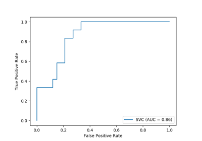   [带有可视化API的ROC曲线](https://scikit-learn.org/stable/auto_examples/plot_roc_curve_visualization_api.html#sphx-glr-auto-examples-plot-roc-curve-visualization-api-py) |    [序回归](https://scikit-learn.org/stable/auto_examples/plot_isotonic_regression.html#sphx-glr-auto-examples-plot-isotonic-regression-py) | 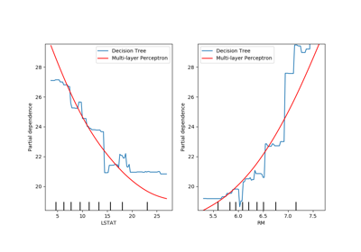   [先进的绘图具有部分依赖](https://scikit-learn.org/stable/auto_examples/plot_partial_dependence_visualization_api.html#sphx-glr-auto-examples-plot-partial-dependence-visualization-api-py) |
| 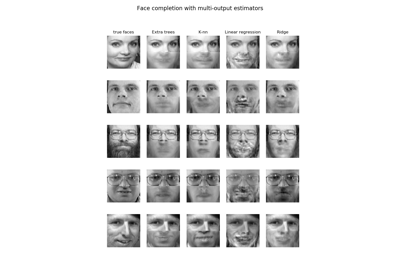   [使用多输出估计器完成人脸](https://scikit-learn.org/stable/auto_examples/plot_multioutput_face_completion.html#sphx-glr-auto-examples-plot-multioutput-face-completion-py) | 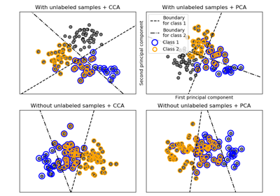   [多标签分类](https://scikit-learn.org/stable/auto_examples/plot_multilabel.html#sphx-glr-auto-examples-plot-multilabel-py) | 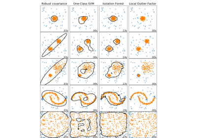   [比较异常检测算法以对玩具数据集进行异常检测](https://scikit-learn.org/stable/auto_examples/plot_anomaly_comparison.html#sphx-glr-auto-examples-plot-anomaly-comparison-py) | 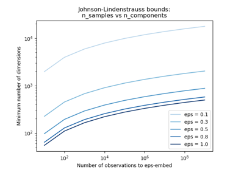   [具有随机投影嵌入的Johnson-Lindenstrauss边界](https://scikit-learn.org/stable/auto_examples/plot_johnson_lindenstrauss_bound.html#sphx-glr-auto-examples-plot-johnson-lindenstrauss-bound-py) |
| 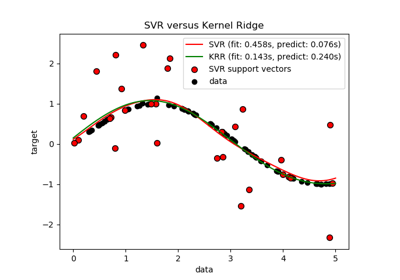   [内核岭回归和SVR的比较](https://scikit-learn.org/stable/auto_examples/plot_kernel_ridge_regression.html#sphx-glr-auto-examples-plot-kernel-ridge-regression-py) | 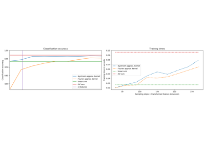   [RBF内核的显式特征图逼近](https://scikit-learn.org/stable/auto_examples/plot_kernel_approximation.html#sphx-glr-auto-examples-plot-kernel-approximation-py) |

## 双聚类

有关`sklearn.cluster.bicluster`模块的示例。

| | | | |
| -- | -- | -- | -- |
|    [频谱共聚算法演示](Biclustering/a_demo_of_the_spectral_co-clustering_algorithm.md) | 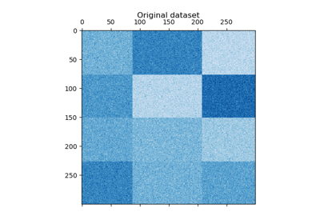   [频谱双聚类算法的演示](Biclustering/a_demo_of_the_spectral_clustering_algorithm.md) |    [使用频谱共聚算法对文档进行聚合](Biclustering/biclustering_documents_with_the_spectral_co-clustering_algorithm.md) ||

## 校准

举例说明了对分类器的预测概率进行校准的示例。

| | | | |
| -- | -- | -- | -- |
| 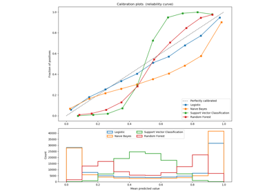   [分类器校准的比较](https://scikit-learn.org/stable/auto_examples/calibration/plot_compare_calibration.html#sphx-glr-auto-examples-calibration-plot-compare-calibration-py) | 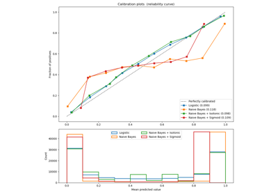   [概率校准曲线](https://scikit-learn.org/stable/auto_examples/calibration/plot_calibration_curve.html#sphx-glr-auto-examples-calibration-plot-calibration-curve-py) | 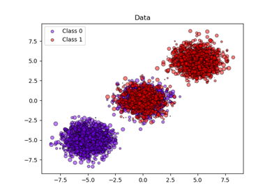   [分类器的概率校准](https://scikit-learn.org/stable/auto_examples/calibration/plot_calibration.html#sphx-glr-auto-examples-calibration-plot-calibration-py) | 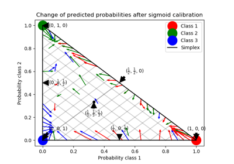   [3级分类的概率校准](https://scikit-learn.org/stable/auto_examples/calibration/plot_calibration_multiclass.html#sphx-glr-auto-examples-calibration-plot-calibration-multiclass-py) |

## 分类

有关分类算法的一般示例。

| | | | |
| -- | -- | -- | -- |
| 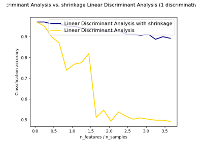   [分类法线和收缩线线性判别分析](https://scikit-learn.org/stable/auto_examples/classification/plot_lda.html#sphx-glr-auto-examples-classification-plot-lda-py) | 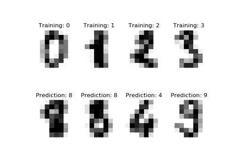   [识别手写数字](https://scikit-learn.org/stable/auto_examples/classification/plot_digits_classification.html#sphx-glr-auto-examples-classification-plot-digits-classification-py) | 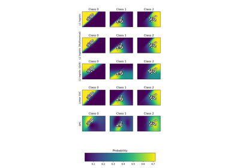   [情节分类概率](https://scikit-learn.org/stable/auto_examples/classification/plot_classification_probability.html#sphx-glr-auto-examples-classification-plot-classification-probability-py) | 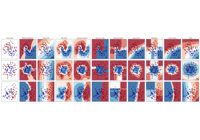   [分类器比较](https://scikit-learn.org/stable/auto_examples/classification/plot_classifier_comparison.html#sphx-glr-auto-examples-classification-plot-classifier-comparison-py) |
| 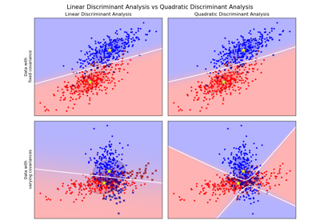   [线性和二次判别分析与协方差椭球](https://scikit-learn.org/stable/auto_examples/classification/plot_lda_qda.html#sphx-glr-auto-examples-classification-plot-lda-qda-py) |

## 多聚类

有关[`sklearn.cluster`](https://scikit-learn.org/stable/modules/classes.html#module-sklearn.cluster "sklearn.cluster")模块的示例。

| | | | |
| -- | -- | -- | -- |
| 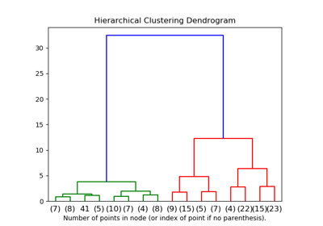   [绘制层次聚类树状图](https://scikit-learn.org/stable/auto_examples/cluster/plot_agglomerative_dendrogram.html#sphx-glr-auto-examples-cluster-plot-agglomerative-dendrogram-py) | 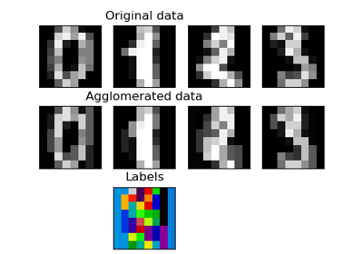   [功能集聚](https://scikit-learn.org/stable/auto_examples/cluster/plot_digits_agglomeration.html#sphx-glr-auto-examples-cluster-plot-digits-agglomeration-py) | 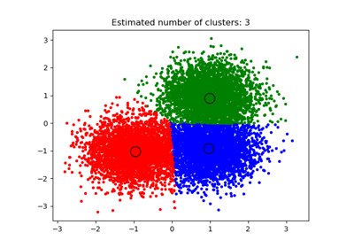   [均值漂移聚类算法的演示](https://scikit-learn.org/stable/auto_examples/cluster/plot_mean_shift.html#sphx-glr-auto-examples-cluster-plot-mean-shift-py) | 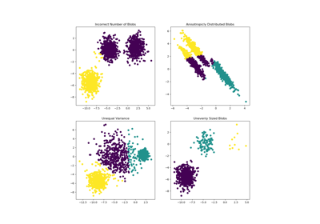   [的k均值假设示范](https://scikit-learn.org/stable/auto_examples/cluster/plot_kmeans_assumptions.html#sphx-glr-auto-examples-cluster-plot-kmeans-assumptions-py) |
| 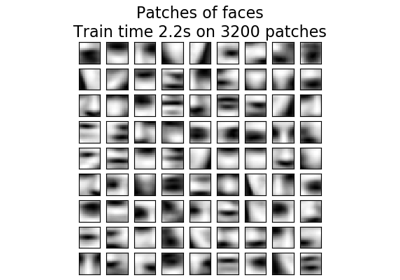   [在线学习面部表情字典](https://scikit-learn.org/stable/auto_examples/cluster/plot_dict_face_patches.html#sphx-glr-auto-examples-cluster-plot-dict-face-patches-py) | 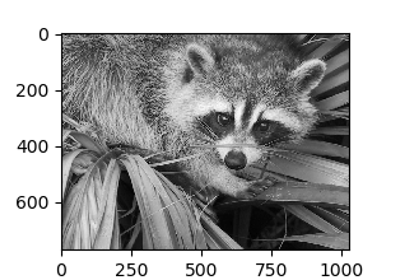   [矢量量化示例](https://scikit-learn.org/stable/auto_examples/cluster/plot_face_compress.html#sphx-glr-auto-examples-cluster-plot-face-compress-py) | 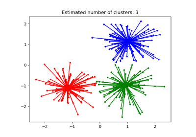   [相似性传播聚类算法演示](https://scikit-learn.org/stable/auto_examples/cluster/plot_affinity_propagation.html#sphx-glr-auto-examples-cluster-plot-affinity-propagation-py) | 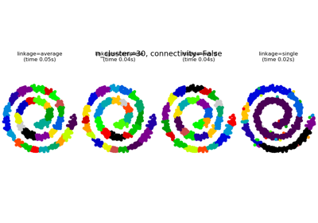   [有和没有结构的聚集聚类](https://scikit-learn.org/stable/auto_examples/cluster/plot_agglomerative_clustering.html#sphx-glr-auto-examples-cluster-plot-agglomerative-clustering-py) |
| 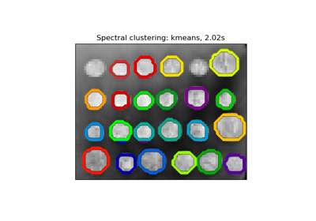   [分割区域中希腊硬币的图片](https://scikit-learn.org/stable/auto_examples/cluster/plot_coin_segmentation.html#sphx-glr-auto-examples-cluster-plot-coin-segmentation-py) | 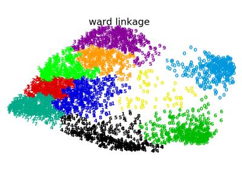   [二维数字嵌入中的各种聚集聚类](https://scikit-learn.org/stable/auto_examples/cluster/plot_digits_linkage.html#sphx-glr-auto-examples-cluster-plot-digits-linkage-py) | 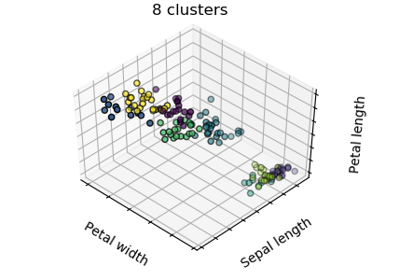   [K-means聚类](https://scikit-learn.org/stable/auto_examples/cluster/plot_cluster_iris.html#sphx-glr-auto-examples-cluster-plot-cluster-iris-py) | 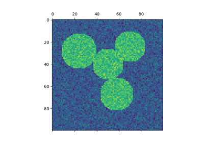   [光谱聚类用于图像分割](https://scikit-learn.org/stable/auto_examples/cluster/plot_segmentation_toy.html#sphx-glr-auto-examples-cluster-plot-segmentation-toy-py) |
| 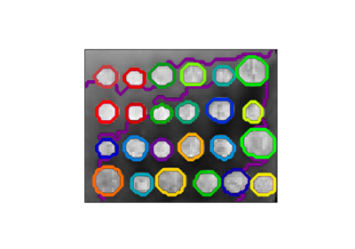   [硬币图像上的结构化Ward层次聚类演示](https://scikit-learn.org/stable/auto_examples/cluster/plot_coin_ward_segmentation.html#sphx-glr-auto-examples-cluster-plot-coin-ward-segmentation-py) |    [DBSCAN聚类算法演示](https://scikit-learn.org/stable/auto_examples/cluster/plot_dbscan.html#sphx-glr-auto-examples-cluster-plot-dbscan-py) |    [使用K均值的颜色量化](https://scikit-learn.org/stable/auto_examples/cluster/plot_color_quantization.html#sphx-glr-auto-examples-cluster-plot-color-quantization-py) |    [分层聚类：结构化与非结构化病房](https://scikit-learn.org/stable/auto_examples/cluster/plot_ward_structured_vs_unstructured.html#sphx-glr-auto-examples-cluster-plot-ward-structured-vs-unstructured-py) |
|    [具有不同指标的聚集集群](https://scikit-learn.org/stable/auto_examples/cluster/plot_agglomerative_clustering_metrics.html#sphx-glr-auto-examples-cluster-plot-agglomerative-clustering-metrics-py) |    [归纳聚类](https://scikit-learn.org/stable/auto_examples/cluster/plot_inductive_clustering.html#sphx-glr-auto-examples-cluster-plot-inductive-clustering-py) | 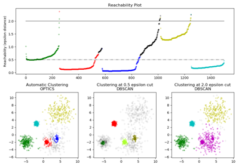   [OPTICS聚类算法演示](https://scikit-learn.org/stable/auto_examples/cluster/plot_optics.html#sphx-glr-auto-examples-cluster-plot-optics-py) | 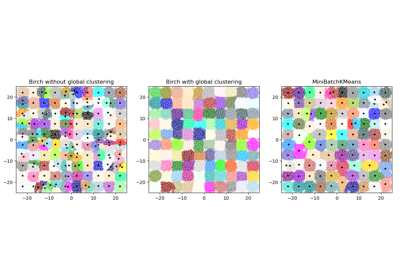   [比较桦木和MiniBatchKMeans](https://scikit-learn.org/stable/auto_examples/cluster/plot_birch_vs_minibatchkmeans.html#sphx-glr-auto-examples-cluster-plot-birch-vs-minibatchkmeans-py) |
| 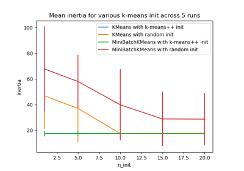   [k均值初始化影响的实证评估](https://scikit-learn.org/stable/auto_examples/cluster/plot_kmeans_stability_low_dim_dense.html#sphx-glr-auto-examples-cluster-plot-kmeans-stability-low-dim-dense-py) | 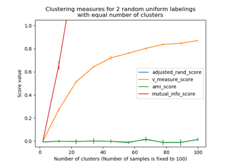   [集群绩效评估中机会的调整](https://scikit-learn.org/stable/auto_examples/cluster/plot_adjusted_for_chance_measures.html#sphx-glr-auto-examples-cluster-plot-adjusted-for-chance-measures-py) | 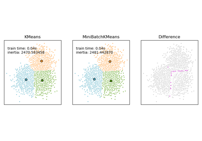   [K-Means和MiniBatchKMeans聚类算法的比较](https://scikit-learn.org/stable/auto_examples/cluster/plot_mini_batch_kmeans.html#sphx-glr-auto-examples-cluster-plot-mini-batch-kmeans-py) | 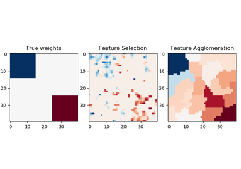   [特征集聚与单变量选择](https://scikit-learn.org/stable/auto_examples/cluster/plot_feature_agglomeration_vs_univariate_selection.html#sphx-glr-auto-examples-cluster-plot-feature-agglomeration-vs-univariate-selection-py) |
| 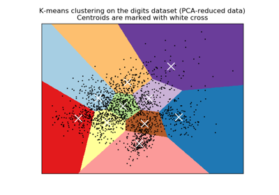   [手写数字数据上的K-Means聚类演示](https://scikit-learn.org/stable/auto_examples/cluster/plot_kmeans_digits.html#sphx-glr-auto-examples-cluster-plot-kmeans-digits-py) | 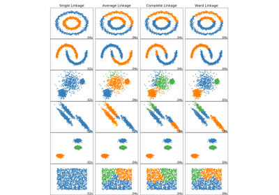   [比较玩具数据集上的不同层次链接方法](https://scikit-learn.org/stable/auto_examples/cluster/plot_linkage_comparison.html#sphx-glr-auto-examples-cluster-plot-linkage-comparison-py) | 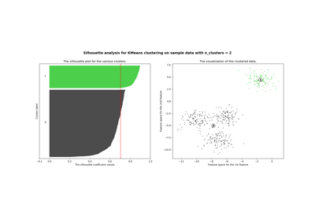   [在KMeans聚类上通过轮廓分析选择聚类数量](https://scikit-learn.org/stable/auto_examples/cluster/plot_kmeans_silhouette_analysis.html#sphx-glr-auto-examples-cluster-plot-kmeans-silhouette-analysis-py) | 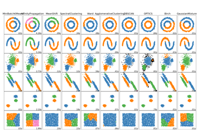   [比较玩具数据集上的不同聚类算法](https://scikit-learn.org/stable/auto_examples/cluster/plot_cluster_comparison.html#sphx-glr-auto-examples-cluster-plot-cluster-comparison-py) |

## 协方差估计

有关[`sklearn.covariance`](https://scikit-learn.org/stable/modules/classes.html#module-sklearn.covariance)模块的示例。

| | | | |
| -- | -- | -- | -- |
| 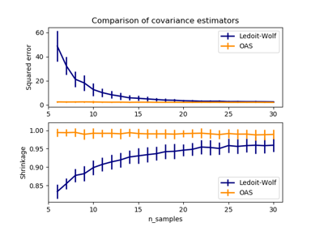   [Ledoit-Wolf与OAS估计](https://scikit-learn.org/stable/auto_examples/covariance/plot_lw_vs_oas.html#sphx-glr-auto-examples-covariance-plot-lw-vs-oas-py) | 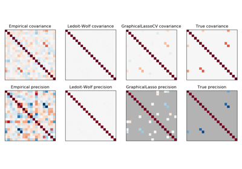   [稀疏逆协方差估计](https://scikit-learn.org/stable/auto_examples/covariance/plot_sparse_cov.html#sphx-glr-auto-examples-covariance-plot-sparse-cov-py) | 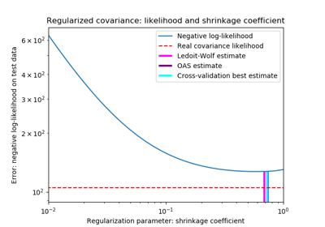   [收缩协方差估计：LedoitWolf与OAS和最大似然性](https://scikit-learn.org/stable/auto_examples/covariance/plot_covariance_estimation.html#sphx-glr-auto-examples-covariance-plot-covariance-estimation-py) | 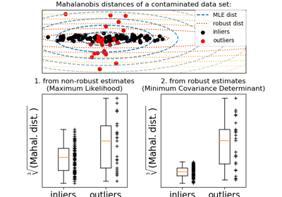   [健壮的协方差估计和马氏距离相关性](https://scikit-learn.org/stable/auto_examples/covariance/plot_mahalanobis_distances.html#sphx-glr-auto-examples-covariance-plot-mahalanobis-distances-py) |
| 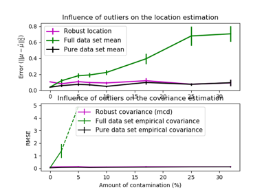   [乐百氏VS实证协方差估计](https://scikit-learn.org/stable/auto_examples/covariance/plot_robust_vs_empirical_covariance.html#sphx-glr-auto-examples-covariance-plot-robust-vs-empirical-covariance-py) |

## 交叉分解

有关[`sklearn.cross_decomposition`](https://scikit-learn.org/stable/modules/classes.html#module-sklearn.cross_decomposition "sklearn.cross_decomposition")模块的示例。

| | | | |
| -- | -- | -- | -- |
| 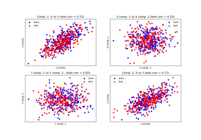   [比较交叉分解方法](https://scikit-learn.org/stable/auto_examples/cross_decomposition/plot_compare_cross_decomposition.html#sphx-glr-auto-examples-cross-decomposition-plot-compare-cross-decomposition-py) |

## 数据集示例

有关[`sklearn.datasets`](https://scikit-learn.org/stable/modules/classes.html#module-sklearn.datasets "sklearn.datasets")模块的示例。

| | | | |
| -- | -- | -- | -- |
| 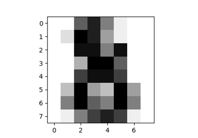   [Digit数据集](https://scikit-learn.org/stable/auto_examples/datasets/plot_digits_last_image.html#sphx-glr-auto-examples-datasets-plot-digits-last-image-py) | 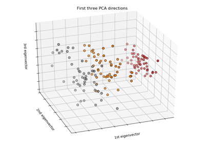   [虹膜数据集](https://scikit-learn.org/stable/auto_examples/datasets/plot_iris_dataset.html#sphx-glr-auto-examples-datasets-plot-iris-dataset-py) | 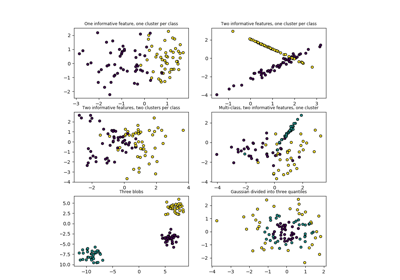   [绘制随机生成的分类数据集](https://scikit-learn.org/stable/auto_examples/datasets/plot_random_dataset.html#sphx-glr-auto-examples-datasets-plot-random-dataset-py) |    [绘制随机生成的多标签数据集](https://scikit-learn.org/stable/auto_examples/datasets/plot_random_multilabel_dataset.html#sphx-glr-auto-examples-datasets-plot-random-multilabel-dataset-py) |

## 决策树

有关[`sklearn.tree`](https://scikit-learn.org/stable/modules/classes.html#module-sklearn.tree "sklearn.tree")模块的示例。

| | | | |
| -- | -- | -- | -- |
|    [决策树回归](https://scikit-learn.org/stable/auto_examples/tree/plot_tree_regression.html#sphx-glr-auto-examples-tree-plot-tree-regression-py) |    [多路输出决策树回归](https://scikit-learn.org/stable/auto_examples/tree/plot_tree_regression_multioutput.html#sphx-glr-auto-examples-tree-plot-tree-regression-multioutput-py) |    [在虹膜数据集上绘制决策树的决策面](https://scikit-learn.org/stable/auto_examples/tree/plot_iris_dtc.html#sphx-glr-auto-examples-tree-plot-iris-dtc-py) |    [使用成本复杂度修剪来修剪修剪决策树](https://scikit-learn.org/stable/auto_examples/tree/plot_cost_complexity_pruning.html#sphx-glr-auto-examples-tree-plot-cost-complexity-pruning-py) |
|    [了解决策树结构](https://scikit-learn.org/stable/auto_examples/tree/plot_unveil_tree_structure.html#sphx-glr-auto-examples-tree-plot-unveil-tree-structure-py) |

## 分解

有关[`sklearn.decomposition`](https://scikit-learn.org/stable/modules/classes.html#module-sklearn.decomposition "sklearn。分解")模块的示例。

| | | | |
| -- | -- | -- | -- |
|    [β-发散损失函数](https://scikit-learn.org/stable/auto_examples/decomposition/plot_beta_divergence.html#sphx-glr-auto-examples-decomposition-plot-beta-divergence-py) |    [具有虹膜数据集的PCA示例](https://scikit-learn.org/stable/auto_examples/decomposition/plot_pca_iris.html#sphx-glr-auto-examples-decomposition-plot-pca-iris-py) |    [增量](https://scikit-learn.org/stable/auto_examples/decomposition/plot_incremental_pca.html#sphx-glr-auto-examples-decomposition-plot-incremental-pca-py) |    [Iris数据集的LDA和PCA二维投影的比较](https://scikit-learn.org/stable/auto_examples/decomposition/plot_pca_vs_lda.html#sphx-glr-auto-examples-decomposition-plot-pca-vs-lda-py) |
|    [使用FastICA进行盲源分离](https://scikit-learn.org/stable/auto_examples/decomposition/plot_ica_blind_source_separation.html#sphx-glr-auto-examples-decomposition-plot-ica-blind-source-separation-py) |    [主成分分析（PCA）](https://scikit-learn.org/stable/auto_examples/decomposition/plot_pca_3d.html#sphx-glr-auto-examples-decomposition-plot-pca-3d-py) |    [2D点云上的](https://scikit-learn.org/stable/auto_examples/decomposition/plot_ica_vs_pca.html#sphx-glr-auto-examples-decomposition-plot-ica-vs-pca-py) |    [内核](https://scikit-learn.org/stable/auto_examples/decomposition/plot_kernel_pca.html#sphx-glr-auto-examples-decomposition-plot-kernel-pca-py) |
|    [概率PCA和因子分析（FA）进行模型选择](https://scikit-learn.org/stable/auto_examples/decomposition/plot_pca_vs_fa_model_selection.html#sphx-glr-auto-examples-decomposition-plot-pca-vs-fa-model-selection-py) |    [使用预先计算的字典进行稀疏编码](https://scikit-learn.org/stable/auto_examples/decomposition/plot_sparse_coding.html#sphx-glr-auto-examples-decomposition-plot-sparse-coding-py) |    [图片使用字典学习去噪](https://scikit-learn.org/stable/auto_examples/decomposition/plot_image_denoising.html#sphx-glr-auto-examples-decomposition-plot-image-denoising-py) |    [Faces数据集分解](https://scikit-learn.org/stable/auto_examples/decomposition/plot_faces_decomposition.html#sphx-glr-auto-examples-decomposition-plot-faces-decomposition-py) |

## 集成方法

有关[`sklearn.ensemble`](https://scikit-learn.org/stable/modules/classes.html#module-sklearn.ensemble "sklearn.ensemble")模块的示例。

| | | | |
| -- | -- | -- | -- |
|    [并行树木森林的像素重要性](https://scikit-learn.org/stable/auto_examples/ensemble/plot_forest_importances_faces.html#sphx-glr-auto-examples-ensemble-plot-forest-importances-faces-py) |    [使用AdaBoost进行决策树回归](https://scikit-learn.org/stable/auto_examples/ensemble/plot_adaboost_regression.html#sphx-glr-auto-examples-ensemble-plot-adaboost-regression-py) |    [绘制个人和投票回归预测](https://scikit-learn.org/stable/auto_examples/ensemble/plot_voting_regressor.html#sphx-glr-auto-examples-ensemble-plot-voting-regressor-py) |    [树木森林的功能重要性](https://scikit-learn.org/stable/auto_examples/ensemble/plot_forest_importances.html#sphx-glr-auto-examples-ensemble-plot-forest-importances-py) |
|    [IsolationForest示例](https://scikit-learn.org/stable/auto_examples/ensemble/plot_isolation_forest.html#sphx-glr-auto-examples-ensemble-plot-isolation-forest-py) |    [绘制VotingClassifier的决策边界](https://scikit-learn.org/stable/auto_examples/ensemble/plot_voting_decision_regions.html#sphx-glr-auto-examples-ensemble-plot-voting-decision-regions-py) |    [比较随机森林和多输出元估计器](https://scikit-learn.org/stable/auto_examples/ensemble/plot_random_forest_regression_multioutput.html#sphx-glr-auto-examples-ensemble-plot-random-forest-regression-multioutput-py) |    [梯度提升回归的预测间隔](https://scikit-learn.org/stable/auto_examples/ensemble/plot_gradient_boosting_quantile.html#sphx-glr-auto-examples-ensemble-plot-gradient-boosting-quantile-py) |
|    [梯度提升正则化](https://scikit-learn.org/stable/auto_examples/ensemble/plot_gradient_boosting_regularization.html#sphx-glr-auto-examples-ensemble-plot-gradient-boosting-regularization-py) |    [绘制由VotingClassifier计算的类概率](https://scikit-learn.org/stable/auto_examples/ensemble/plot_voting_probas.html#sphx-glr-auto-examples-ensemble-plot-voting-probas-py) |    [梯度推进回归](https://scikit-learn.org/stable/auto_examples/ensemble/plot_gradient_boosting_regression.html#sphx-glr-auto-examples-ensemble-plot-gradient-boosting-regression-py) |    [随机森林的OOB错误](https://scikit-learn.org/stable/auto_examples/ensemble/plot_ensemble_oob.html#sphx-glr-auto-examples-ensemble-plot-ensemble-oob-py) |
|    [两个级的AdaBoost](https://scikit-learn.org/stable/auto_examples/ensemble/plot_adaboost_twoclass.html#sphx-glr-auto-examples-ensemble-plot-adaboost-twoclass-py) |    [使用完全随机树的哈希特征转换](https://scikit-learn.org/stable/auto_examples/ensemble/plot_random_forest_embedding.html#sphx-glr-auto-examples-ensemble-plot-random-forest-embedding-py) |    [多类AdaBoosted决策树](https://scikit-learn.org/stable/auto_examples/ensemble/plot_adaboost_multiclass.html#sphx-glr-auto-examples-ensemble-plot-adaboost-multiclass-py) |    [离散相对真正的AdaBoost](https://scikit-learn.org/stable/auto_examples/ensemble/plot_adaboost_hastie_10_2.html#sphx-glr-auto-examples-ensemble-plot-adaboost-hastie-10-2-py) |
|    [使用堆叠组合预测](https://scikit-learn.org/stable/auto_examples/ensemble/plot_stack_predictors.html#sphx-glr-auto-examples-ensemble-plot-stack-predictors-py) |    [提前终止的梯度推进](https://scikit-learn.org/stable/auto_examples/ensemble/plot_gradient_boosting_early_stopping.html#sphx-glr-auto-examples-ensemble-plot-gradient-boosting-early-stopping-py) |    [带有树群的特征变换](https://scikit-learn.org/stable/auto_examples/ensemble/plot_feature_transformation.html#sphx-glr-auto-examples-ensemble-plot-feature-transformation-py) |    [梯度提升袋外估计](https://scikit-learn.org/stable/auto_examples/ensemble/plot_gradient_boosting_oob.html#sphx-glr-auto-examples-ensemble-plot-gradient-boosting-oob-py) |
|    [单一估计器与装袋：偏差方差分解](https://scikit-learn.org/stable/auto_examples/ensemble/plot_bias_variance.html#sphx-glr-auto-examples-ensemble-plot-bias-variance-py) |    [在虹膜数据集上绘制树木合奏的决策面](https://scikit-learn.org/stable/auto_examples/ensemble/plot_forest_iris.html#sphx-glr-auto-examples-ensemble-plot-forest-iris-py) |

## 基于真实数据集的示例

具有一些中等大小的数据集或交互式用户界面的现实问题的应用程序。

| | | | |
| -- | -- | -- | -- |
|    [真实数据集的异常值检测](https://scikit-learn.org/stable/auto_examples/applications/plot_outlier_detection_housing.html#sphx-glr-auto-examples-applications-plot-outlier-detection-housing-py) |    [压缩感测：使用L1先验（Lasso）进行层析成像重建](https://scikit-learn.org/stable/auto_examples/applications/plot_tomography_l1_reconstruction.html#sphx-glr-auto-examples-applications-plot-tomography-l1-reconstruction-py) |    [非负矩阵分解和隐含狄利克雷分布话题提取](https://scikit-learn.org/stable/auto_examples/applications/plot_topics_extraction_with_nmf_lda.html#sphx-glr-auto-examples-applications-plot-topics-extraction-with-nmf-lda-py) |    [使用特征脸和支持向量机的](https://scikit-learn.org/stable/auto_examples/applications/plot_face_recognition.html#sphx-glr-auto-examples-applications-plot-face-recognition-py)[识别示例](https://scikit-learn.org/stable/auto_examples/applications/plot_face_recognition.html#sphx-glr-auto-examples-applications-plot-face-recognition-py) |
|    [模型复杂度影响](https://scikit-learn.org/stable/auto_examples/applications/plot_model_complexity_influence.html#sphx-glr-auto-examples-applications-plot-model-complexity-influence-py) |    [可视化的股市结构](https://scikit-learn.org/stable/auto_examples/applications/plot_stock_market.html#sphx-glr-auto-examples-applications-plot-stock-market-py) |    [维基百科的主要特征向量](https://scikit-learn.org/stable/auto_examples/applications/wikipedia_principal_eigenvector.html#sphx-glr-auto-examples-applications-wikipedia-principal-eigenvector-py) |    [物种分布建模](https://scikit-learn.org/stable/auto_examples/applications/plot_species_distribution_modeling.html#sphx-glr-auto-examples-applications-plot-species-distribution-modeling-py) |
|    [Libsvm](https://scikit-learn.org/stable/auto_examples/applications/svm_gui.html#sphx-glr-auto-examples-applications-svm-gui-py) |    [预测延迟](https://scikit-learn.org/stable/auto_examples/applications/plot_prediction_latency.html#sphx-glr-auto-examples-applications-plot-prediction-latency-py) |    [文本文档的核心分类](https://scikit-learn.org/stable/auto_examples/applications/plot_out_of_core_classification.html#sphx-glr-auto-examples-applications-plot-out-of-core-classification-py) |

## 特征选择

有关[`sklearn.feature_selection`](https://scikit-learn.org/stable/modules/classes.html#module-sklearn.feature_selection "sklearn.feature_selection")模块的示例。

| | | | |
| -- | -- | -- | -- |
|    [递归特征消除](https://scikit-learn.org/stable/auto_examples/feature_selection/plot_rfe_digits.html#sphx-glr-auto-examples-feature-selection-plot-rfe-digits-py) |    [F检验和相互信息的比较](https://scikit-learn.org/stable/auto_examples/feature_selection/plot_f_test_vs_mi.html#sphx-glr-auto-examples-feature-selection-plot-f-test-vs-mi-py) |    [管道Anova](https://scikit-learn.org/stable/auto_examples/feature_selection/plot_feature_selection_pipeline.html#sphx-glr-auto-examples-feature-selection-plot-feature-selection-pipeline-py) |    [通过交叉验证消除递归特征](https://scikit-learn.org/stable/auto_examples/feature_selection/plot_rfe_with_cross_validation.html#sphx-glr-auto-examples-feature-selection-plot-rfe-with-cross-validation-py) |
|    [使用SelectFromModel和LassoCV特征选择](https://scikit-learn.org/stable/auto_examples/feature_selection/plot_select_from_model_boston.html#sphx-glr-auto-examples-feature-selection-plot-select-from-model-boston-py) |    [与排列测试的分类评分的意义](https://scikit-learn.org/stable/auto_examples/feature_selection/plot_permutation_test_for_classification.html#sphx-glr-auto-examples-feature-selection-plot-permutation-test-for-classification-py) |    [单变量特征选择](https://scikit-learn.org/stable/auto_examples/feature_selection/plot_feature_selection.html#sphx-glr-auto-examples-feature-selection-plot-feature-selection-py) |

## 高斯混合模型

有关[`sklearn.mixture`](https://scikit-learn.org/stable/modules/classes.html#module-sklearn.mixture "sklearn.mixture")模块的示例。

| | | | |
| -- | -- | -- | -- |
|    [高斯混合的密度估计](https://scikit-learn.org/stable/auto_examples/mixture/plot_gmm_pdf.html#sphx-glr-auto-examples-mixture-plot-gmm-pdf-py) |    [高斯混合模型椭球](https://scikit-learn.org/stable/auto_examples/mixture/plot_gmm.html#sphx-glr-auto-examples-mixture-plot-gmm-py) |    [高斯混合模型选择](https://scikit-learn.org/stable/auto_examples/mixture/plot_gmm_selection.html#sphx-glr-auto-examples-mixture-plot-gmm-selection-py) |    [GMM协方差](https://scikit-learn.org/stable/auto_examples/mixture/plot_gmm_covariances.html#sphx-glr-auto-examples-mixture-plot-gmm-covariances-py) |
|    [高斯混合模型正弦曲线](https://scikit-learn.org/stable/auto_examples/mixture/plot_gmm_sin.html#sphx-glr-auto-examples-mixture-plot-gmm-sin-py) |    [贝叶斯高斯混合变量的浓度先验类型分析](https://scikit-learn.org/stable/auto_examples/mixture/plot_concentration_prior.html#sphx-glr-auto-examples-mixture-plot-concentration-prior-py) |

## 高斯机器学习过程

有关[`sklearn.gaussian_process`](https://scikit-learn.org/stable/modules/classes.html#module-sklearn.gaussian_process "sklearn.gaussian_process")模块的示例。

| | | | |
| -- | -- | -- | -- |
|    [XOR数据集上的高斯过程分类（GPC）的图示](https://scikit-learn.org/stable/auto_examples/gaussian_process/plot_gpc_xor.html#sphx-glr-auto-examples-gaussian-process-plot-gpc-xor-py) |    [虹膜数据集上的高斯过程分类（GPC）](https://scikit-learn.org/stable/auto_examples/gaussian_process/plot_gpc_iris.html#sphx-glr-auto-examples-gaussian-process-plot-gpc-iris-py) |    [核岭和高斯过程回归的比较](https://scikit-learn.org/stable/auto_examples/gaussian_process/plot_compare_gpr_krr.html#sphx-glr-auto-examples-gaussian-process-plot-compare-gpr-krr-py) |    [不同内核的先验和后验高斯过程的图示](https://scikit-learn.org/stable/auto_examples/gaussian_process/plot_gpr_prior_posterior.html#sphx-glr-auto-examples-gaussian-process-plot-gpr-prior-posterior-py) |
|    [高斯过程分类（GPC）的等概率线](https://scikit-learn.org/stable/auto_examples/gaussian_process/plot_gpc_isoprobability.html#sphx-glr-auto-examples-gaussian-process-plot-gpc-isoprobability-py) |    [概率预测的结果与高斯过程分类（GPC）](https://scikit-learn.org/stable/auto_examples/gaussian_process/plot_gpc.html#sphx-glr-auto-examples-gaussian-process-plot-gpc-py) |    [具有噪声水平估计的高斯过程回归（GPR）](https://scikit-learn.org/stable/auto_examples/gaussian_process/plot_gpr_noisy.html#sphx-glr-auto-examples-gaussian-process-plot-gpr-noisy-py) |    [高斯过程回归：基本入门示例](https://scikit-learn.org/stable/auto_examples/gaussian_process/plot_gpr_noisy_targets.html#sphx-glr-auto-examples-gaussian-process-plot-gpr-noisy-targets-py) |
|    [基于Mauna Loa CO2数据的高斯过程回归（GPR）。](https://scikit-learn.org/stable/auto_examples/gaussian_process/plot_gpr_co2.html#sphx-glr-auto-examples-gaussian-process-plot-gpr-co2-py) |    [离散数据结构上的高斯过程](https://scikit-learn.org/stable/auto_examples/gaussian_process/plot_gpr_on_structured_data.html#sphx-glr-auto-examples-gaussian-process-plot-gpr-on-structured-data-py) |

## 广义线性模型

有关[`sklearn.linear_model`](https://scikit-learn.org/stable/modules/classes.html#module-sklearn.linear_model "sklearn.linear_model")模块的示例。

| | | | |
| -- | -- | -- | -- |
|    [使用LARS的套索路径](https://scikit-learn.org/stable/auto_examples/linear_model/plot_lasso_lars.html#sphx-glr-auto-examples-linear-model-plot-lasso-lars-py) |    [绘制岭系数作为正则化的函数](https://scikit-learn.org/stable/auto_examples/linear_model/plot_ridge_path.html#sphx-glr-auto-examples-linear-model-plot-ridge-path-py) |    [SGD：最大余量分隔超平面](https://scikit-learn.org/stable/auto_examples/linear_model/plot_sgd_separating_hyperplane.html#sphx-glr-auto-examples-linear-model-plot-sgd-separating-hyperplane-py) |    [SGD：凸损失函数](https://scikit-learn.org/stable/auto_examples/linear_model/plot_sgd_loss_functions.html#sphx-glr-auto-examples-linear-model-plot-sgd-loss-functions-py) |
|    [普通最小二乘法和岭回归方差](https://scikit-learn.org/stable/auto_examples/linear_model/plot_ols_ridge_variance.html#sphx-glr-auto-examples-linear-model-plot-ols-ridge-variance-py) |    [绘制Ridge系数作为L2正则化的函数](https://scikit-learn.org/stable/auto_examples/linear_model/plot_ridge_coeffs.html#sphx-glr-auto-examples-linear-model-plot-ridge-coeffs-py) |    [SGD：罚款](https://scikit-learn.org/stable/auto_examples/linear_model/plot_sgd_penalties.html#sphx-glr-auto-examples-linear-model-plot-sgd-penalties-py) |    [多项式插值](https://scikit-learn.org/stable/auto_examples/linear_model/plot_polynomial_interpolation.html#sphx-glr-auto-examples-linear-model-plot-polynomial-interpolation-py) |
|    [物流功能](https://scikit-learn.org/stable/auto_examples/linear_model/plot_logistic.html#sphx-glr-auto-examples-linear-model-plot-logistic-py) |    [L1-Logistic回归的正规化道路](https://scikit-learn.org/stable/auto_examples/linear_model/plot_logistic_path.html#sphx-glr-auto-examples-linear-model-plot-logistic-path-py) |    [Logistic回归3类分类器](https://scikit-learn.org/stable/auto_examples/linear_model/plot_iris_logistic.html#sphx-glr-auto-examples-linear-model-plot-iris-logistic-py) |    [SGD：加权样本](https://scikit-learn.org/stable/auto_examples/linear_model/plot_sgd_weighted_samples.html#sphx-glr-auto-examples-linear-model-plot-sgd-weighted-samples-py) |
|    [线性回归示例](https://scikit-learn.org/stable/auto_examples/linear_model/plot_ols.html#sphx-glr-auto-examples-linear-model-plot-ols-py) |    [使用RANSAC进行稳健的线性模型估计](https://scikit-learn.org/stable/auto_examples/linear_model/plot_ransac.html#sphx-glr-auto-examples-linear-model-plot-ransac-py) |    [稀疏实施例：装修仅设有1和2](https://scikit-learn.org/stable/auto_examples/linear_model/plot_ols_3d.html#sphx-glr-auto-examples-linear-model-plot-ols-3d-py) |    [HuberRegressor VS岭集具有较强的异常](https://scikit-learn.org/stable/auto_examples/linear_model/plot_huber_vs_ridge.html#sphx-glr-auto-examples-linear-model-plot-huber-vs-ridge-py) |
|    [套索上密集和稀疏数据](https://scikit-learn.org/stable/auto_examples/linear_model/plot_lasso_dense_vs_sparse_data.html#sphx-glr-auto-examples-linear-model-plot-lasso-dense-vs-sparse-data-py) |    [比较各种在线求解器](https://scikit-learn.org/stable/auto_examples/linear_model/plot_sgd_comparison.html#sphx-glr-auto-examples-linear-model-plot-sgd-comparison-py) |    [多任务套索的联合特征选择](https://scikit-learn.org/stable/auto_examples/linear_model/plot_multi_task_lasso_support.html#sphx-glr-auto-examples-linear-model-plot-multi-task-lasso-support-py) |    [使用多项式逻辑+ L1的MNIST分类](https://scikit-learn.org/stable/auto_examples/linear_model/plot_sparse_logistic_regression_mnist.html#sphx-glr-auto-examples-linear-model-plot-sparse-logistic-regression-mnist-py) |    [在虹膜数据集上绘制多类](https://scikit-learn.org/stable/auto_examples/linear_model/plot_sgd_iris.html#sphx-glr-auto-examples-linear-model-plot-sgd-iris-py) |
|    [正交匹配追踪](https://scikit-learn.org/stable/auto_examples/linear_model/plot_omp.html#sphx-glr-auto-examples-linear-model-plot-omp-py) |    [套索和弹性网用于稀疏信号](https://scikit-learn.org/stable/auto_examples/linear_model/plot_lasso_and_elasticnet.html#sphx-glr-auto-examples-linear-model-plot-lasso-and-elasticnet-py) |    [贝叶斯岭回归的曲线拟合](https://scikit-learn.org/stable/auto_examples/linear_model/plot_bayesian_ridge_curvefit.html#sphx-glr-auto-examples-linear-model-plot-bayesian-ridge-curvefit-py) |    [Theil-Sen回归](https://scikit-learn.org/stable/auto_examples/linear_model/plot_theilsen.html#sphx-glr-auto-examples-linear-model-plot-theilsen-py) |
|    [绘制多项式和一对一静态Logistic回归](https://scikit-learn.org/stable/auto_examples/linear_model/plot_logistic_multinomial.html#sphx-glr-auto-examples-linear-model-plot-logistic-multinomial-py) |    [稳健的线性估计器拟合](https://scikit-learn.org/stable/auto_examples/linear_model/plot_robust_fit.html#sphx-glr-auto-examples-linear-model-plot-robust-fit-py) |    [Logistic回归中的L1惩罚和稀疏性](https://scikit-learn.org/stable/auto_examples/linear_model/plot_logistic_l1_l2_sparsity.html#sphx-glr-auto-examples-linear-model-plot-logistic-l1-l2-sparsity-py) |    [套索和弹性网络](https://scikit-learn.org/stable/auto_examples/linear_model/plot_lasso_coordinate_descent_path.html#sphx-glr-auto-examples-linear-model-plot-lasso-coordinate-descent-path-py) |
|    [自动相关性确定回归（ARD）](https://scikit-learn.org/stable/auto_examples/linear_model/plot_ard.html#sphx-glr-auto-examples-linear-model-plot-ard-py) |    [贝叶斯岭回归](https://scikit-learn.org/stable/auto_examples/linear_model/plot_bayesian_ridge.html#sphx-glr-auto-examples-linear-model-plot-bayesian-ridge-py) |    [20newgroups上的多类稀疏逻辑回归](https://scikit-learn.org/stable/auto_examples/linear_model/plot_sparse_logistic_regression_20newsgroups.html#sphx-glr-auto-examples-linear-model-plot-sparse-logistic-regression-20newsgroups-py) |    [套索模型选择：交叉验证/ AIC /](https://scikit-learn.org/stable/auto_examples/linear_model/plot_lasso_model_selection.html#sphx-glr-auto-examples-linear-model-plot-lasso-model-selection-py) |
|    [早期停止随机梯度下降的](https://scikit-learn.org/stable/auto_examples/linear_model/plot_sgd_early_stopping.html#sphx-glr-auto-examples-linear-model-plot-sgd-early-stopping-py) |

## 检查

与[`sklearn.inspection`](https://scikit-learn.org/stable/modules/classes.html#module-sklearn.inspection "斯克莱恩检查")模块有关的示例。

| | | | |
| -- | -- | -- | -- |
|    [具有多重共线性或相关特征的置换重要性](https://scikit-learn.org/stable/auto_examples/inspection/plot_permutation_importance_multicollinear.html#sphx-glr-auto-examples-inspection-plot-permutation-importance-multicollinear-py) |    [排列重要性与随机森林特征重要性（MDI）](https://scikit-learn.org/stable/auto_examples/inspection/plot_permutation_importance.html#sphx-glr-auto-examples-inspection-plot-permutation-importance-py) |    [部分依赖图](https://scikit-learn.org/stable/auto_examples/inspection/plot_partial_dependence.html#sphx-glr-auto-examples-inspection-plot-partial-dependence-py) |

## 流形学习

有关[`sklearn.manifold`](https://scikit-learn.org/stable/modules/classes.html#module-sklearn.manifold "sklearn。流形")模块的示例。

| | | | |
| -- | -- | -- | -- |
|    [使用LLE减少瑞士卷](https://scikit-learn.org/stable/auto_examples/manifold/plot_swissroll.html#sphx-glr-auto-examples-manifold-plot-swissroll-py) |    [流形学习方法的比较](https://scikit-learn.org/stable/auto_examples/manifold/plot_compare_methods.html#sphx-glr-auto-examples-manifold-plot-compare-methods-py) |    [多维缩放](https://scikit-learn.org/stable/auto_examples/manifold/plot_mds.html#sphx-glr-auto-examples-manifold-plot-mds-py) |    [叔SNE：各种困惑值对形状的影响](https://scikit-learn.org/stable/auto_examples/manifold/plot_t_sne_perplexity.html#sphx-glr-auto-examples-manifold-plot-t-sne-perplexity-py) |
|    [截断球面上的流形学习方法](https://scikit-learn.org/stable/auto_examples/manifold/plot_manifold_sphere.html#sphx-glr-auto-examples-manifold-plot-manifold-sphere-py) |    [手写数字流形学习：局部线性嵌入，Isomap…](https://scikit-learn.org/stable/auto_examples/manifold/plot_lle_digits.html#sphx-glr-auto-examples-manifold-plot-lle-digits-py) |

## 缺失值插补

有关[`sklearn.impute`](https://scikit-learn.org/stable/modules/classes.html#module-sklearn.impute "sklearn.impute")模块的示例。

| | | | |
| -- | -- | -- | -- |
|    [使用IterativeImputer的变体估算缺失值](https://scikit-learn.org/stable/auto_examples/impute/plot_iterative_imputer_variants_comparison.html#sphx-glr-auto-examples-impute-plot-iterative-imputer-variants-comparison-py) |    [在构建估算器之前估算缺失值](https://scikit-learn.org/stable/auto_examples/impute/plot_missing_values.html#sphx-glr-auto-examples-impute-plot-missing-values-py) |

## 选型

与[`sklearn.model_selection`](https://scikit-learn.org/stable/modules/classes.html#module-sklearn.model_selection "sklearn.model_selection")模块有关的示例。

| | | | |
| -- | -- | -- | -- |
|    [绘制交叉验证的预测](https://scikit-learn.org/stable/auto_examples/model_selection/plot_cv_predict.html#sphx-glr-auto-examples-model-selection-plot-cv-predict-py) |    [混淆矩阵](https://scikit-learn.org/stable/auto_examples/model_selection/plot_confusion_matrix.html#sphx-glr-auto-examples-model-selection-plot-confusion-matrix-py) |    [绘图验证曲线](https://scikit-learn.org/stable/auto_examples/model_selection/plot_validation_curve.html#sphx-glr-auto-examples-model-selection-plot-validation-curve-py) |    [拟合不足与拟合过度](https://scikit-learn.org/stable/auto_examples/model_selection/plot_underfitting_overfitting.html#sphx-glr-auto-examples-model-selection-plot-underfitting-overfitting-py) |
|    [使用带有交叉验证的网格搜索进行参数估计](https://scikit-learn.org/stable/auto_examples/model_selection/plot_grid_search_digits.html#sphx-glr-auto-examples-model-selection-plot-grid-search-digits-py) |    [对于比较估计超参数随机搜索和网格搜索](https://scikit-learn.org/stable/auto_examples/model_selection/plot_randomized_search.html#sphx-glr-auto-examples-model-selection-plot-randomized-search-py) |    [训练错误与测试错误](https://scikit-learn.org/stable/auto_examples/model_selection/plot_train_error_vs_test_error.html#sphx-glr-auto-examples-model-selection-plot-train-error-vs-test-error-py) |    [具有交叉验证的接收器操作特性（ROC）](https://scikit-learn.org/stable/auto_examples/model_selection/plot_roc_crossval.html#sphx-glr-auto-examples-model-selection-plot-roc-crossval-py) |
|    [嵌套与非嵌套交叉验证](https://scikit-learn.org/stable/auto_examples/model_selection/plot_nested_cross_validation_iris.html#sphx-glr-auto-examples-model-selection-plot-nested-cross-validation-iris-py) |    [在cross_val_score和GridSearchCV上进行多指标评估的演示](https://scikit-learn.org/stable/auto_examples/model_selection/plot_multi_metric_evaluation.html#sphx-glr-auto-examples-model-selection-plot-multi-metric-evaluation-py) |    [用于文本特征提取和评估的示例管道](https://scikit-learn.org/stable/auto_examples/model_selection/grid_search_text_feature_extraction.html#sphx-glr-auto-examples-model-selection-grid-search-text-feature-extraction-py) |    [平衡模型的复杂性和交叉验证的分数](https://scikit-learn.org/stable/auto_examples/model_selection/plot_grid_search_refit_callable.html#sphx-glr-auto-examples-model-selection-plot-grid-search-refit-callable-py) |
|    [在scikit-learn中可视化交叉验证行为](https://scikit-learn.org/stable/auto_examples/model_selection/plot_cv_indices.html#sphx-glr-auto-examples-model-selection-plot-cv-indices-py) |    [接收器工作特性（ROC）](https://scikit-learn.org/stable/auto_examples/model_selection/plot_roc.html#sphx-glr-auto-examples-model-selection-plot-roc-py) |    [精密召回](https://scikit-learn.org/stable/auto_examples/model_selection/plot_precision_recall.html#sphx-glr-auto-examples-model-selection-plot-precision-recall-py) |    [绘制学习曲线](https://scikit-learn.org/stable/auto_examples/model_selection/plot_learning_curve.html#sphx-glr-auto-examples-model-selection-plot-learning-curve-py) |

## 多输出方法

有关[`sklearn.multioutput`](https://scikit-learn.org/stable/modules/classes.html#module-sklearn.multioutput "sklearn.multioutput")模块的示例。

| | | | |
| -- | -- | -- | -- |
|    [分类器链](https://scikit-learn.org/stable/auto_examples/multioutput/plot_classifier_chain_yeast.html#sphx-glr-auto-examples-multioutput-plot-classifier-chain-yeast-py) |

## 最近邻

有关[`sklearn.neighbors`](https://scikit-learn.org/stable/modules/classes.html#module-sklearn.neighbors "sklearn.neighbors")模块的示例。

| | | | |
| -- | -- | -- | -- |
|    [最近邻居回归](https://scikit-learn.org/stable/auto_examples/neighbors/plot_regression.html#sphx-glr-auto-examples-neighbors-plot-regression-py) |    [使用局部离群因子（LOF）进行离群检测](https://scikit-learn.org/stable/auto_examples/neighbors/plot_lof_outlier_detection.html#sphx-glr-auto-examples-neighbors-plot-lof-outlier-detection-py) |    [最近邻居分类](https://scikit-learn.org/stable/auto_examples/neighbors/plot_classification.html#sphx-glr-auto-examples-neighbors-plot-classification-py) |    [最近质心分类](https://scikit-learn.org/stable/auto_examples/neighbors/plot_nearest_centroid.html#sphx-glr-auto-examples-neighbors-plot-nearest-centroid-py) |
|    [核密度估计](https://scikit-learn.org/stable/auto_examples/neighbors/plot_digits_kde_sampling.html#sphx-glr-auto-examples-neighbors-plot-digits-kde-sampling-py) |    [缓存最近的邻居](https://scikit-learn.org/stable/auto_examples/neighbors/plot_caching_nearest_neighbors.html#sphx-glr-auto-examples-neighbors-plot-caching-nearest-neighbors-py) |    [邻域成分分析图](https://scikit-learn.org/stable/auto_examples/neighbors/plot_nca_illustration.html#sphx-glr-auto-examples-neighbors-plot-nca-illustration-py) |    [具有局部异常值（LOF）的新颖性检测](https://scikit-learn.org/stable/auto_examples/neighbors/plot_lof_novelty_detection.html#sphx-glr-auto-examples-neighbors-plot-lof-novelty-detection-py) |
|    [比较具有和不具有邻域分量分析的最近邻域](https://scikit-learn.org/stable/auto_examples/neighbors/plot_nca_classification.html#sphx-glr-auto-examples-neighbors-plot-nca-classification-py) |    [使用邻域分量分析进行](https://scikit-learn.org/stable/auto_examples/neighbors/plot_nca_dim_reduction.html#sphx-glr-auto-examples-neighbors-plot-nca-dim-reduction-py)[维](https://scikit-learn.org/stable/auto_examples/neighbors/plot_nca_dim_reduction.html#sphx-glr-auto-examples-neighbors-plot-nca-dim-reduction-py) |    [物种分布的核密度估计](https://scikit-learn.org/stable/auto_examples/neighbors/plot_species_kde.html#sphx-glr-auto-examples-neighbors-plot-species-kde-py) |    [简单的1D内核密度估计](https://scikit-learn.org/stable/auto_examples/neighbors/plot_kde_1d.html#sphx-glr-auto-examples-neighbors-plot-kde-1d-py) |
|    [TSNE中的近似最近邻居](https://scikit-learn.org/stable/auto_examples/neighbors/approximate_nearest_neighbors.html#sphx-glr-auto-examples-neighbors-approximate-nearest-neighbors-py) |

## 神经网络

有关[`sklearn.neural_network`](https://scikit-learn.org/stable/modules/classes.html#module-sklearn.neural_network "sklearn.neural_network")模块的示例。

| | | | |
| -- | -- | -- | -- |
|    [在MNIST上可视化MLP权重](https://scikit-learn.org/stable/auto_examples/neural_networks/plot_mnist_filters.html#sphx-glr-auto-examples-neural-networks-plot-mnist-filters-py) |    [用于数字分类的受限玻尔兹曼机功能](https://scikit-learn.org/stable/auto_examples/neural_networks/plot_rbm_logistic_classification.html#sphx-glr-auto-examples-neural-networks-plot-rbm-logistic-classification-py) |    [在多层感知变化正规化](https://scikit-learn.org/stable/auto_examples/neural_networks/plot_mlp_alpha.html#sphx-glr-auto-examples-neural-networks-plot-mlp-alpha-py) |    [比较随机学习策略MLPClassifier](https://scikit-learn.org/stable/auto_examples/neural_networks/plot_mlp_training_curves.html#sphx-glr-auto-examples-neural-networks-plot-mlp-training-curves-py) |

## 管道和复合估计器

由其他估算器组成变压器和管道的示例。请参阅《[用户指南》](https://scikit-learn.org/stable/modules/compose.html#combining-estimators)。

| | | | |
| -- | -- | -- | -- |
|    [连结多个特征提取方法](https://scikit-learn.org/stable/auto_examples/compose/plot_feature_union.html#sphx-glr-auto-examples-compose-plot-feature-union-py) |    [流水线：链接PCA和逻辑回归](https://scikit-learn.org/stable/auto_examples/compose/plot_digits_pipe.html#sphx-glr-auto-examples-compose-plot-digits-pipe-py) |    [混合类型的列转换器](https://scikit-learn.org/stable/auto_examples/compose/plot_column_transformer_mixed_types.html#sphx-glr-auto-examples-compose-plot-column-transformer-mixed-types-py) |    [使用Pipeline和GridSearchCV选择降维](https://scikit-learn.org/stable/auto_examples/compose/plot_compare_reduction.html#sphx-glr-auto-examples-compose-plot-compare-reduction-py) |
|    [具有异构数据源的列转换器](https://scikit-learn.org/stable/auto_examples/compose/plot_column_transformer.html#sphx-glr-auto-examples-compose-plot-column-transformer-py) |    [在回归模型中转换目标的效果](https://scikit-learn.org/stable/auto_examples/compose/plot_transformed_target.html#sphx-glr-auto-examples-compose-plot-transformed-target-py) |

## 预处理

有关[`sklearn.preprocessing`](https://scikit-learn.org/stable/modules/classes.html#module-sklearn.preprocessing "sklearn。预处理")模块的示例。

| | | | |
| -- | -- | -- | -- |
|    [使用FunctionTransformer选择列](https://scikit-learn.org/stable/auto_examples/preprocessing/plot_function_transformer.html#sphx-glr-auto-examples-preprocessing-plot-function-transformer-py) |    [使用KBinsDiscretizer离散化连续特征](https://scikit-learn.org/stable/auto_examples/preprocessing/plot_discretization.html#sphx-glr-auto-examples-preprocessing-plot-discretization-py) |    [演示KBinsDiscretizer的不同策略](https://scikit-learn.org/stable/auto_examples/preprocessing/plot_discretization_strategies.html#sphx-glr-auto-examples-preprocessing-plot-discretization-strategies-py) |    [特征缩放的重要性](https://scikit-learn.org/stable/auto_examples/preprocessing/plot_scaling_importance.html#sphx-glr-auto-examples-preprocessing-plot-scaling-importance-py) |
|    [地图数据正态分布](https://scikit-learn.org/stable/auto_examples/preprocessing/plot_map_data_to_normal.html#sphx-glr-auto-examples-preprocessing-plot-map-data-to-normal-py) |    [功能离散](https://scikit-learn.org/stable/auto_examples/preprocessing/plot_discretization_classification.html#sphx-glr-auto-examples-preprocessing-plot-discretization-classification-py) |    [比较不同缩放器对数据与异常值的影响](https://scikit-learn.org/stable/auto_examples/preprocessing/plot_all_scaling.html#sphx-glr-auto-examples-preprocessing-plot-all-scaling-py) |

## 发布要点

这些示例说明了scikit-learn发行版的主要功能。

| | | | |
| -- | -- | -- | -- |
|    [scikit-learn 0.22的发行要点](https://scikit-learn.org/stable/auto_examples/release_highlights/plot_release_highlights_0_22_0.html#sphx-glr-auto-examples-release-highlights-plot-release-highlights-0-22-0-py) |

## 半监督分类

有关[`sklearn.semi_supervised`](https://scikit-learn.org/stable/modules/classes.html#module-sklearn.semi_supervised "sklearn.semi_supervised")模块的示例。

| | | | |
| -- | -- | -- | -- |
|    [Iris数据集上标签传播与SVM的决策边界](https://scikit-learn.org/stable/auto_examples/semi_supervised/plot_label_propagation_versus_svm_iris.html#sphx-glr-auto-examples-semi-supervised-plot-label-propagation-versus-svm-iris-py) |    [标签传播学习复杂的结构](https://scikit-learn.org/stable/auto_examples/semi_supervised/plot_label_propagation_structure.html#sphx-glr-auto-examples-semi-supervised-plot-label-propagation-structure-py) |    [标签传播数字：演示性能](https://scikit-learn.org/stable/auto_examples/semi_supervised/plot_label_propagation_digits.html#sphx-glr-auto-examples-semi-supervised-plot-label-propagation-digits-py) |    [标签传播数字主动学习](https://scikit-learn.org/stable/auto_examples/semi_supervised/plot_label_propagation_digits_active_learning.html#sphx-glr-auto-examples-semi-supervised-plot-label-propagation-digits-active-learning-py) |

## 支持向量机

有关[`sklearn.svm`](https://scikit-learn.org/stable/modules/classes.html#module-sklearn.svm "sklearn.svm")模块的示例。

| | | | |
| -- | -- | -- | -- |
|    [非线性](https://scikit-learn.org/stable/auto_examples/svm/plot_svm_nonlinear.html#sphx-glr-auto-examples-svm-plot-svm-nonlinear-py) |    [SVM：最大余量分隔超平面](https://scikit-learn.org/stable/auto_examples/svm/plot_separating_hyperplane.html#sphx-glr-auto-examples-svm-plot-separating-hyperplane-py) |    [具有自定义内核的](https://scikit-learn.org/stable/auto_examples/svm/plot_custom_kernel.html#sphx-glr-auto-examples-svm-plot-custom-kernel-py) |    [在LinearSVC中绘制支持向量](https://scikit-learn.org/stable/auto_examples/svm/plot_linearsvc_support_vectors.html#sphx-glr-auto-examples-svm-plot-linearsvc-support-vectors-py) |
|    [SVM中断示例](https://scikit-learn.org/stable/auto_examples/svm/plot_svm_tie_breaking.html#sphx-glr-auto-examples-svm-plot-svm-tie-breaking-py) |    [SVM：加权样本](https://scikit-learn.org/stable/auto_examples/svm/plot_weighted_samples.html#sphx-glr-auto-examples-svm-plot-weighted-samples-py) |    [SVM：为不平衡的类分离超平面](https://scikit-learn.org/stable/auto_examples/svm/plot_separating_hyperplane_unbalanced.html#sphx-glr-auto-examples-svm-plot-separating-hyperplane-unbalanced-py) |    [SVM内核](https://scikit-learn.org/stable/auto_examples/svm/plot_svm_kernels.html#sphx-glr-auto-examples-svm-plot-svm-kernels-py) |
|    [SVM-Anova：具有单变量特征选择的](https://scikit-learn.org/stable/auto_examples/svm/plot_svm_anova.html#sphx-glr-auto-examples-svm-plot-svm-anova-py) |    [使用线性和非线性内核支持向量回归（SVR）](https://scikit-learn.org/stable/auto_examples/svm/plot_svm_regression.html#sphx-glr-auto-examples-svm-plot-svm-regression-py) |    [SVM保证金示例](https://scikit-learn.org/stable/auto_examples/svm/plot_svm_margin.html#sphx-glr-auto-examples-svm-plot-svm-margin-py) |    [具有非线性内核（RBF）的一类](https://scikit-learn.org/stable/auto_examples/svm/plot_oneclass.html#sphx-glr-auto-examples-svm-plot-oneclass-py) |
|    [在虹膜数据集中绘制不同的SVM分类器](https://scikit-learn.org/stable/auto_examples/svm/plot_iris_svc.html#sphx-glr-auto-examples-svm-plot-iris-svc-py) |    [扩展SVC的正则化参数](https://scikit-learn.org/stable/auto_examples/svm/plot_svm_scale_c.html#sphx-glr-auto-examples-svm-plot-svm-scale-c-py) |    [RBF SVM参数](https://scikit-learn.org/stable/auto_examples/svm/plot_rbf_parameters.html#sphx-glr-auto-examples-svm-plot-rbf-parameters-py) |

## 教程练习

教程练习。

| | | | |
| -- | -- | -- | -- |
|    [数字分类练习](https://scikit-learn.org/stable/auto_examples/exercises/plot_digits_classification_exercise.html#sphx-glr-auto-examples-exercises-plot-digits-classification-exercise-py) |    [交叉验证数字数据集练习](https://scikit-learn.org/stable/auto_examples/exercises/plot_cv_digits.html#sphx-glr-auto-examples-exercises-plot-cv-digits-py) |    [SVM练习](https://scikit-learn.org/stable/auto_examples/exercises/plot_iris_exercise.html#sphx-glr-auto-examples-exercises-plot-iris-exercise-py) |    [糖尿病运动数据集交叉验证](https://scikit-learn.org/stable/auto_examples/exercises/plot_cv_diabetes.html#sphx-glr-auto-examples-exercises-plot-cv-diabetes-py) |

## 文本文档工作

有关[`sklearn.feature_extraction.text`](https://scikit-learn.org/stable/modules/classes.html#module-sklearn.feature_extraction.text "sklearn.feature_extraction.text")模块的示例。

| | | | |
| -- | -- | -- | -- |
|    [FeatureHasher和DictVectorizer比较](https://scikit-learn.org/stable/auto_examples/text/plot_hashing_vs_dict_vectorizer.html#sphx-glr-auto-examples-text-plot-hashing-vs-dict-vectorizer-py) |    [使用k-means聚类文本文档](https://scikit-learn.org/stable/auto_examples/text/plot_document_clustering.html#sphx-glr-auto-examples-text-plot-document-clustering-py) |    [使用稀疏特征对文本文档进行分类](https://scikit-learn.org/stable/auto_examples/text/plot_document_classification_20newsgroups.html#sphx-glr-auto-examples-text-plot-document-classification-20newsgroups-py)
