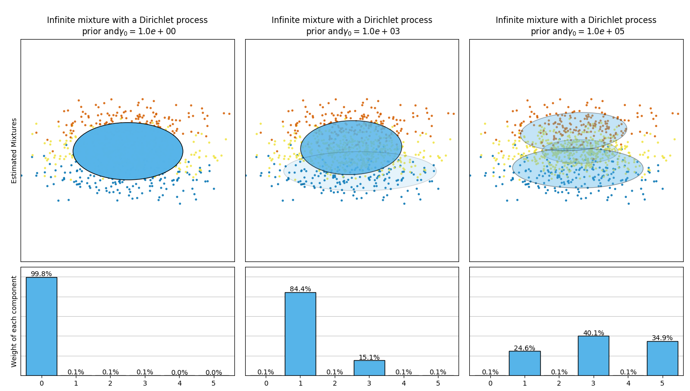

# 2.1. 高斯混合模型

校验者:
        [@why2lyj](https://github.com/why2lyj)
        [@Shao Y.](https://github.com/apachecn/scikit-learn-doc-zh)
        [@Loopy](https://github.com/loopyme)
        [@barrycg](https://github.com/barrycg)
翻译者:
        [@glassy](https://github.com/apachecn/scikit-learn-doc-zh)

`sklearn.mixture` 是一个应用高斯混合模型进行非监督学习的包(支持 diagonal，spherical，tied，full 四种协方差矩阵), _（注：diagonal 指每个分量有各自独立的对角协方差矩阵， spherical 指每个分量有各自独立的方差(再注:spherical是一种特殊的 diagonal, 对角的元素相等)， tied 指所有分量共享一个标准协方差矩阵， full 指每个分量有各自独立的标准协方差矩阵）_，它可以对数据进行抽样，并且根据数据来估计模型。同时该包也支持由用户来决定模型内混合的分量数量。 _（译注：在高斯混合模型中，我们将每一个高斯分布称为一个分量，即 component）_

 

**二分量高斯混合模型:** _数据点，以及模型的等概率线。_

高斯混合模型是一个假设所有的数据点都是生成于有限个带有未知参数的高斯分布所混合的概率模型。 我们可以将这种混合模型看作是 k-means 聚类算法的一种扩展使用 _(注:kmeans必须要求cluster的模型是圆形的,不能是椭圆的)_ ，它包含了数据的协方差结构以及隐高斯模型的中心信息。

对应不同的估算策略,Scikit-learn 实现了不同的类来估算高斯混合模型。详细描述如下:

## 2.1.1. 高斯混合

 [`GaussianMixture`](https://scikit-learn.org/stable/modules/generated/sklearn.mixture.GaussianMixture.html#sklearn.mixture.GaussianMixture "sklearn.mixture.GaussianMixture") 对象实现了用来拟合高斯混合模型的 [期望最大化](#expectation-maximization) (EM) 算法。它还可以为多变量模型绘制置信椭圆体，同时计算 BIC（Bayesian Information Criterion，贝叶斯信息准则）来评估数据中聚类的数量。而其中的[`GaussianMixture.fit`](https://scikit-learn.org/stable/modules/generated/sklearn.mixture.GaussianMixture.html#sklearn.mixture.GaussianMixture.fit "sklearn.mixture.GaussianMixture.fit") 方法可以从训练数据中拟合出一个高斯混合模型。

如果给定测试数据，通过使用 [`GaussianMixture.predict`](https://scikit-learn.org/stable/modules/generated/sklearn.mixture.GaussianMixture.html#sklearn.mixture.GaussianMixture.predict "sklearn.mixture.GaussianMixture.predict") 方法，可以为每个样本分配最适合的高斯分布模型。

[`GaussianMixture`](https://scikit-learn.org/stable/modules/generated/sklearn.mixture.GaussianMixture.html#sklearn.mixture.GaussianMixture "sklearn.mixture.GaussianMixture") 方法中自带了不同的选项来约束不同估类的协方差：spherical，diagonal，tied 或 full 协方差。

> **示例**:
>*   一个利用高斯混合模型在鸢尾花卉数据集（IRIS 数据集）上做聚类的协方差实例，请查阅 [GMM covariances](https://scikit-learn.org/stable/auto_examples/mixture/plot_gmm_covariances.html#sphx-glr-auto-examples-mixture-plot-gmm-covariances-py)
>*   一个绘制密度估计的例子，请查阅 [Density Estimation for a Gaussian mixture](https://scikit-learn.org/stable/auto_examples/mixture/plot_gmm_pdf.html#sphx-glr-auto-examples-mixture-plot-gmm-pdf-py)

### 2.1.1.1. 优缺点 [`GaussianMixture`](https://scikit-learn.org/stable/modules/generated/sklearn.mixture.GaussianMixture.html#sklearn.mixture.GaussianMixture "sklearn.mixture.GaussianMixture")

#### 2.1.1.1.1. 优点
* **速度:** 是混合模型学习算法中最快的算法．
* **无偏差性:**  这个算法仅仅只是最大化可能性，并不会使均值偏向于0，或是使聚类大小偏向于可能适用或者可能不适用的特殊结构。

#### 2.1.1.1.2. 缺点
* **奇异性:**   当每个混合模型没有足够多的点时，会很难去估算对应的协方差矩阵，同时该算法会发散并且去寻找具有无穷大似然函数值的解，除非人为地正则化相应的协方差。
* **分量的数量:**  这个算法总是会使用它所能用的全部分量，所以在缺失外部线索的情况下，需要留存数据或者信息理论标准来决定用多少个分量。

### 2.1.1.2. 选择经典高斯混合模型中分量的个数

通过BIC（贝叶斯信息准则）来选择高斯混合的分量数是一种高效的方法。 理论上，它仅当在近似状态下可以恢复正确的分量数（即如果有大量数据可用，并且假设这些数据（具有独立同分布属性）实际上是一个混合高斯模型生成的）。注意：使用 [变分贝叶斯高斯混合](#bgmm) 可以避免高斯混合模型中分量数量的选择。

> **示例**:
>*   一个用典型的高斯混合进行的模型选择的例子，请查阅 [Gaussian Mixture Model Selection](https://scikit-learn.org/stable/auto_examples/mixture/plot_gmm_selection.html#sphx-glr-auto-examples-mixture-plot-gmm-selection-py)

### 2.1.1.3. 估计算法期望最大化（EM）

在从无标记的数据中应用高斯混合模型主要的困难在于：通常不知道哪个点来自哪个隐分量 （如果可以获取到这些信息，就可以很容易通过相应的数据点，拟合每个独立的高斯分布）。 [期望最大化（Expectation-maximization，EM）](https://en.wikipedia.org/wiki/Expectation%E2%80%93maximization_algorithm) 是一个理论完善的统计算法，其通过迭代方式来解决这个问题。首先，假设一个随机分量 （随机地选择一个中心点，该点可以由 k-means 算法得到，或者甚至可以在原点周围随意选取一个点）,并为每个点分别计算由该混合模型内的每个分量生成的概率。然后，调整模型参数以最大化模型生成这些参数的可能性。重复这个过程，该算法保证该过程内的参数总会收敛到一个局部最优解。

## 2.1.2. 变分贝叶斯高斯混合

 [`BayesianGaussianMixture`](https://scikit-learn.org/stable/modules/generated/sklearn.mixture.BayesianGaussianMixture.html#sklearn.mixture.BayesianGaussianMixture "sklearn.mixture.BayesianGaussianMixture") 对象实现了具有变分推理算法的高斯混合模型的变体。 这个对象的API和 [`GaussianMixture`](https://scikit-learn.org/stable/modules/generated/sklearn.mixture.GaussianMixture.html#sklearn.mixture.GaussianMixture "sklearn.mixture.GaussianMixture") 所定义的API类似。

### 2.1.2.1. 估计算法: 变分推断（variational inference）

变分推断是期望最大化（EM）的扩展，它最大化了模型证据（包括先验）的下界，而不是数据的似然性。 变分方法的原理与期望最大化相同（二者都是迭代算法，在寻找由每种模型的混合所产生的每个点的概率和根据所分配的点拟合之间两步交替），但是变分方法通过整合先验分布信息来增加正则化限制。 这避免了期望最大化解决方案中常出现的奇异性，但是也给模型带来了微小的偏差。变分的计算过程通常比较慢，但不会慢到无法使用。

由于它的贝叶斯特性，变分算法比预期最大化（EM）需要更多的超参数（即先验分布中的参数），其中最重要的就是浓度参数 `weight_concentration_prior` 。指定一个低浓度先验，将会使模型将大部分的权重分配到少数分量上，而其余分量的权重则趋近 0。而高浓度先验将会使混合模型中的更多的分量在混合模型中都有相当比列的权重。

 [`BayesianGaussianMixture`](https://scikit-learn.org/stable/modules/generated/sklearn.mixture.BayesianGaussianMixture.html#sklearn.mixture.BayesianGaussianMixture "sklearn.mixture.BayesianGaussianMixture") 类的参数实现提出了两种权重分布先验： 一种是利用 Dirichlet distribution（狄利克雷分布）的有限混合模型，另一种是利用 Dirichlet Process（狄利克雷过程）的无限混合模型。在实际应用中，狄利克雷过程推理算法是近似的，并且使用具有固定最大分量数的截断分布（称之为 Stick-breaking representation）, 而其使用的分量数实际上总是依赖数据。

下图比较了不同类型的权重浓度先验（参数 `weight_concentration_prior_type` ）组合不同的 `weight_concentration_prior` 的值时，所获得的结果。在此处，我们可以发现 `weight_concentration_prior` 参数的值对获得的有效激活的分量数（即权重较大的分量的数量）有很大影响。 我们也能注意到当先验类型是 ‘dirichlet_distribution’ 时，大的浓度权重先验会导致更均匀的权重，然而这种情况却并不必然适用于 ‘dirichlet_process’ 类型（默认类型）。

** **

下面的例子将具有固定数量分量的高斯混合模型与具有Dirichlet process prior（狄利克雷过程先验）的变分高斯混合模型进行了比较。此处，一个经典高斯混合模型被指定由 5 个分量（其中两个是聚类）在某个数据集上拟合而成。 我们可以看到，具有狄利克雷过程的变分高斯混合模型 在相同的数据上进行拟合时,可以将自身分量数量制在 2 。在该例子中，用户选择了 `n_components=5` ，这与真正的试用数据集（toy dataset）的生成分量数量不符。很容易注意到, 狄利克雷过程先验的变分高斯混合模型可以采取保守的策略，仅拟合生成一个分量。

在下图中，我们将拟合一个并不能被高斯混合模型很好描述的数据集。 调整 [`BayesianGaussianMixture`](https://scikit-learn.org/stable/modules/generated/sklearn.mixture.BayesianGaussianMixture.html#sklearn.mixture.BayesianGaussianMixture "sklearn.mixture.BayesianGaussianMixture") 类的参数 `weight_concentration_prior` ，这个参数决定了用来拟合数据的分量数量。我们在最后两个图上展示了从两个混合结果中产生的随机抽样。

> **示例**:
> *   一个用 [`GaussianMixture`](https://scikit-learn.org/stable/modules/generated/sklearn.mixture.GaussianMixture.html#sklearn.mixture.GaussianMixture "sklearn.mixture.GaussianMixture") 和 [`BayesianGaussianMixture`](https://scikit-learn.org/stable/modules/generated/sklearn.mixture.BayesianGaussianMixture.html#sklearn.mixture.BayesianGaussianMixture "sklearn.mixture.BayesianGaussianMixture") 绘制置信椭圆体的例子， 请查阅 [Gaussian Mixture Model Ellipsoids](https://scikit-learn.org/stable/auto_examples/mixture/plot_gmm.html#sphx-glr-auto-examples-mixture-plot-gmm-py)
> *   [Gaussian Mixture Model Sine Curve](https://scikit-learn.org/stable/auto_examples/mixture/plot_gmm_sin.html#sphx-glr-auto-examples-mixture-plot-gmm-sin-py) 这个例子展示了用 [`GaussianMixture`](https://scikit-learn.org/stable/modules/generated/sklearn.mixture.GaussianMixture.html#sklearn.mixture.GaussianMixture "sklearn.mixture.GaussianMixture") 和 [`BayesianGaussianMixture`](https://scikit-learn.org/stable/modules/generated/sklearn.mixture.BayesianGaussianMixture.html#sklearn.mixture.BayesianGaussianMixture "sklearn.mixture.BayesianGaussianMixture") 来拟合正弦波。
> *   一个使用不同的 `weight_concentration_prior_type` 用以不同的 `weight_concentration_prior` 参数值的 *BayesianGaussianMixture* 来绘制置信椭圆体的例子。 请查阅 [Concentration Prior Type Analysis of Variation Bayesian Gaussian Mixture](https://scikit-learn.org/stable/auto_examples/mixture/plot_concentration_prior.html#sphx-glr-auto-examples-mixture-plot-concentration-prior-py)

### 2.1.2.2. [`BayesianGaussianMixture`](https://scikit-learn.org/stable/modules/generated/sklearn.mixture.BayesianGaussianMixture.html#sklearn.mixture.BayesianGaussianMixture "sklearn.mixture.BayesianGaussianMixture") 下的变分推理的优缺点

#### 2.1.2.2.1. 优点

* **自动选择:** 当 `weight_concentration_prior` 足够小以及 `n_components` 比模型需要的数量更大时，变分贝叶斯混合模型计算的结果可以让一些混合权重值趋近 0。 这让模型可以自动选择合适的有效分量数量。这过程仅仅需要提供分量的数量上限。但是请注意，“理想” 的激活分量数量具有应用独特性，在数据挖掘参数设置中通常并不明确。
* **对参数数量的敏感度较低:**  
 和总是使用全部能用分量，因而由不同数量的分量来组合过量解决方案的有限模型不同, 带有狄利克雷过程先验的变分推理（`weight_concentration_prior_type='dirichlet_process'` ）的输出并不总拥有和参数一致的变化, 因此该变分推理更加稳定和需要更少的调优。
* **正则化:**  由于结合了先验信息，变分的解比期望最大化（EM）的解有更少的病理特征（pathological special cases）。

#### 2.1.2.2.2. 缺点

* **速度:**  变分推理所需要的额外参数化使推理速度变慢，尽管慢得不多。
* **超参数:**  这个算法需要一个额外的可能需要交叉验证进行实验调优的超参数。
* **偏差:**  在推理算法存在许多隐含的偏差（如果用到狄利克雷过程也会有偏差）， 每当这些偏差和数据之间不匹配时，用有限模型可能会拟合出更好的模型。

### 2.1.2.3. The Dirichlet Process（狄利克雷过程）

此处，我们描述了基于狄利克雷过程混合的变分推理算法。狄利克雷过程是在 _具有无限大，无限制的分区数的聚类_ 上的先验概率分布。相比于有限高斯混合模型，变分技术让我们在推理时间几乎没有惩罚（penalty）的情况下纳入了高斯混合模型的先验结构。

一个重要的问题是狄利克雷过程是如何实现用无限的，无限制的聚类数，并且结果仍然是一致的。 本文档不做出完整的解释，但是你可以看这里 [stick breaking process](https://en.wikipedia.org/wiki/Dirichlet_process#The_stick-breaking_process) 来帮助你理解它。折棍（stick breaking）过程是狄利克雷过程的衍生。我们每次从一个单位长度的 stick 开始，且每一步都折断剩余部分的一部分。每次，我们把每个 stick 的长度联想成所有点里落入一组混合的点的比例。 最后，为了表示无限混合，我们把 stick 的最后剩余部分联想成没有落入其他所有组的点的比例。每段的长度是一个随机变量, 与浓度参数成概率比例。较小的浓度值将单位长度分成较大的 stick 段（即定义更集中的分布）。较高的浓度值将生成更小的 stick 段（即增加非零权重的分量数量）。

狄利克雷过程的变分推理技术，在对该无限混合模型进行有限近似的情形下，仍然可以运用。用户不必事先指定想要的分量数量，只需要指定浓度参数和混合分量数的上界（假定上界高于“真实”的分量数，这仅仅影响算法复杂度，而不是实际使用的分量数量）。
