# 2.2. 流形学习

校验者:
        [@XuJianzhi](https://github.com/XuJianzhi)
        [@RyanZhiNie](https://github.com/RyanZhiNie)
        [@羊三](https://github.com/apachecn/scikit-learn-doc-zh)
        [@Loopy](https://github.com/loopyme)
        [@barrycg](https://github.com/barrycg)
翻译者:
        [@XuJianzhi](https://github.com/XuJianzhi)
        [@羊三](https://github.com/apachecn/scikit-learn-doc-zh)

>&nbsp;&nbsp;Look for the bare necessities

>&nbsp;&nbsp;The simple bare necessities

>&nbsp;&nbsp;Forget about your worries and your strife

>&nbsp;&nbsp;I mean the bare necessitiesOld Mother Nature’s recipes

>&nbsp;&nbsp;That bring the bare necessities of life

>– Baloo的歌 [奇幻森林]

[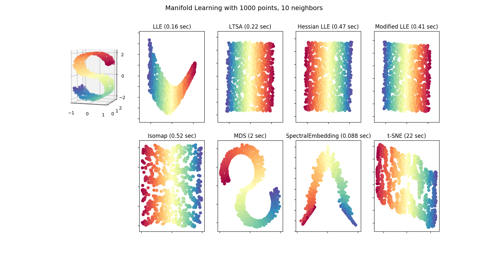](https://scikit-learn.org/stable/auto_examples/manifold/plot_compare_methods.html)

流形学习是一种非线性降维方法。其算法基于的思想是：许多数据集维度过高的现象完全是人为导致得。

## 2.2.1. 介绍

高维数据集通常难以可视化。虽然,可以通过绘制两维或三维的数据来显示高维数据的固有结构，但与之等效的高维图不太直观。为了促进高维数据集结构的可视化，必须以某种方式降低维度。

通过对数据的随机投影来实现降维是最简单的方法。虽然这样做能实现数据结构一定程度的可视化，但这种随机选择方式仍有许多有待改进之处。在随机投影过程中，数据中更有趣的结构很可能会丢失。

** **

为了解决这一问题，一些监督和无监督的线性降维框架被设计出来，如主成分分析（PCA），独立成分分析以及线性判别分析等。这些算法明确规定了如何来选择数据的“有趣的”线性投影。它们虽然高效，但是经常错失数据中重要的非线性结构。

** **

流形学习可以被认为是将线性框架（如 PCA ）推广到对数据中非线性结构敏感的一次尝试。虽然存在监督变量，但是典型的流形学习问题是无监督的：它从数据本身学习数据的高维结构，而不使用预定的分类。

> **示例**:
>*   参见 [Manifold learning on handwritten digits: Locally Linear Embedding, Isomap…](https://scikit-learn.org/stable/auto_examples/manifold/plot_lle_digits.html#sphx-glr-auto-examples-manifold-plot-lle-digits-py) ,手写数字降维的例子。
>*   参见 [Comparison of Manifold Learning methods](https://scikit-learn.org/stable/auto_examples/manifold/plot_compare_methods.html#sphx-glr-auto-examples-manifold-plot-compare-methods-py) ,玩具 “S曲线” 数据集降维的例子。

以下概述了 scikit-learn 中可用的流形学习实现

## 2.2.2. Isomap

流形学习的最早方法之一是 Isomap 算法，等距映射（Isometric Mapping）的缩写。Isomap 可以被视为多维缩放（Multi-dimensional Scaling：MDS）或核主成分分析（Kernel PCA）的扩展。Isomap 寻求一个较低维度的嵌入( _译注：嵌入(embedding)，在此处，可以理解为高维数据到低维数据的一种映射转换，数据间的固有结构不变化_ )，它保持了所有点之间的原有的测地距离( _译注:测地距离（geodesic distance）是指在图中连接某两个顶点的最短距离(shortest path)_ )。Isomap 可以通过 [`Isomap`](https://scikit-learn.org/stable/modules/generated/sklearn.manifold.Isomap.html#sklearn.manifold.Isomap "sklearn.manifold.Isomap") 对象执行。

### 2.2.2.1. 复杂度

Isomap 算法包括三个阶段:

1.  **最近邻搜索.** Isomap 使用 [`sklearn.neighbors.BallTree`](https://scikit-learn.org/stable/modules/generated/sklearn.neighbors.BallTree.html#sklearn.neighbors.BallTree "sklearn.neighbors.BallTree") 进行有效的近邻搜索。 对于  维中  个点的 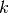 个最近邻，代价约为 ![O[D \log(k) N \log(N)]](img/7b0e2ed0273c0a1650cc9f78eabe93c4.jpg)
2.  **最短路径图搜索.** 该类算法中已知最有效的算法是 Dijkstra 算法或 Floyd-Warshall 算法，其复杂度分别是约 ![O[N^2(k + \log(N))]](img/d459482314974b92f7f44cc36d6eae3e.jpg) 和 ![O[N^3]](img/1a1bc66f06af187108d4250f068748c9.jpg) 。 用户可通过使用 isomap 的 path_method 关键字来选择该算法。 如果未指定，则代码自行尝试为输入数据选择最佳算法。
3.  **部分特征值分解.** 对应于  isomap核中 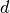 个最大特征值的特征向量，进行嵌入编码。 对于密集求解器，代价约为 ![O[d N^2]](img/9642d01a97f06869baba6159e3438677.jpg) 。 通常可以使用 ARPACK 求解器来减少代价。 用户可通过使用 isomap 的 path_method 关键字指定特征求解器。 如果未指定，则代码自行尝试为输入数据选择最佳算法。

Isomap 的整体复杂度是 ![O[D \log(k) N \log(N)] + O[N^2(k + \log(N))] + O[d N^2]](img/ccd727d4b039d28f8146546bd5f614b3.jpg).

*    : 训练数据点的个数
*    : 输入维度
*    : 最近邻的个数
*    : 输出维度

> **参考资料**:
>*   [“A global geometric framework for nonlinear dimensionality reduction”](http://science.sciencemag.org/content/290/5500/2319.full) Tenenbaum, J.B.; De Silva, V.; & Langford, J.C. Science 290 (5500)

## 2.2.3. 局部线性嵌入

局部线性嵌入（LLE）通过保留局部邻域内的距离来寻求数据的低维投影。 它可以被认为是一系列的局部主成分分析在全局范围内的相互比较，找到最优的局部非线性嵌入。

局部线性嵌入可以使用 [`locally_linear_embedding`](https://scikit-learn.org/stable/modules/generated/sklearn.manifold.locally_linear_embedding.html#sklearn.manifold.locally_linear_embedding "sklearn.manifold.locally_linear_embedding") 函数或其面向对象的等效方法 [`LocallyLinearEmbedding`](https://scikit-learn.org/stable/modules/generated/sklearn.manifold.LocallyLinearEmbedding.html#sklearn.manifold.LocallyLinearEmbedding "sklearn.manifold.LocallyLinearEmbedding") 来实现。

### 2.2.3.1. 复杂度

标准的 LLE 算法包括三个阶段:

1.  **最邻近搜索**. 参见上述 Isomap 讨论。
2.  **构造权重矩阵**. ![O[D N k^3]](img/ca22762150e0516b4847c03efd5ebf6d.jpg). LLE 权重矩阵的构造包括每个  局部邻域的  线性方程的解。
3.  **部分特征值分解**. 参见上述 Isomap 讨论。

标准 LLE 的整体复杂度是 ![O[D \log(k) N \log(N)] + O[D N k^3] + O[d N^2]](img/5daa1b5d6a3d63020722cb0f4b41eee2.jpg).

*    : 训练数据点的个数
*    : 输入维度
*    : 最近邻的个数
*    : 输出维度

> **参考资料**:
>*   [“Nonlinear dimensionality reduction by locally linear embedding”](http://www.sciencemag.org/content/290/5500/2323.full) Roweis, S. & Saul, L. Science 290:2323 (2000)

## 2.2.4. 改进型局部线性嵌入（MLLE）

局部线性嵌入（LLE）的一个众所周知的问题是正则化问题。当 neighbors（邻域）的数量多于输入的维度数量时，定义每个局部邻域的矩阵是不满秩的。为解决这个问题，标准的局部线性嵌入算法使用一个任意正则化参数  ，它的取值受局部权重矩阵的迹的影响。虽然我们普遍认为，当正则化参数 ,解向目标嵌入情况收敛,但是当 时,并不保证得到最优解。以上说明了,在嵌入过程中的正则化问题会扭曲流形的内部几何形状，使其失真。

解决正则化问题的一种方法是对邻域使用多个权重向量。这就是改进型局部线性嵌入（MLLE）算法的精髓。MLLE 可被执行于函数 [`locally_linear_embedding`](https://scikit-learn.org/stable/modules/generated/sklearn.manifold.locally_linear_embedding.html#sklearn.manifold.locally_linear_embedding "sklearn.manifold.locally_linear_embedding") ，或者面向对象的副本 [`LocallyLinearEmbedding`](https://scikit-learn.org/stable/modules/generated/sklearn.manifold.LocallyLinearEmbedding.html#sklearn.manifold.LocallyLinearEmbedding "sklearn.manifold.LocallyLinearEmbedding") ，附带关键词 `method = 'modified'` 。它需要满足 `n_neighbors > n_components`。

[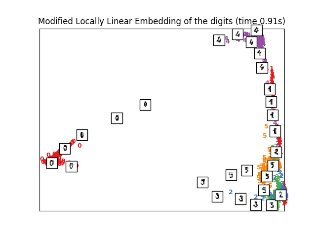](https://scikit-learn.org/stable/auto_examples/manifold/plot_lle_digits.html)

### 2.2.4.1. 复杂度

MLLE 算法分为三部分:

1.  **近邻搜索**。与标准 LLE 的相同。
2.  **权重矩阵构造**。大约是 ![O[D N k^3] + O[N (k-D) k^2]](img/d7f26dee1f8849176f6438863fb775fb.jpg) 。该式第一项恰好等于标准 LLE 算法的复杂度。该式第二项与由多个权重来构造权重矩阵相关。在实践中，构造 MLLE 权重矩阵所增加的损耗（就复杂度而言），比其它两部分要小。
3.  **部分特征值分解**。与标准 LLE 的相同。

综上，MLLE 的复杂度为 ![O[D \log(k) N \log(N)] + O[D N k^3] + O[N (k-D) k^2] + O[d N^2]](img/efb0c43ded3d4bdfb4b1d2092c8ee446.jpg) 。

*    : 训练集数据点的个数
*    : 输入维度
*    : 最近邻域的个数
*    : 输出的维度

> **参考资料**:
>*   [“MLLE: Modified Locally Linear Embedding Using Multiple Weights”](http://citeseerx.ist.psu.edu/viewdoc/summary?doi=10.1.1.70.382) Zhang, Z. & Wang, J.

## 2.2.5. 黑塞特征映射（HE）

黑塞特征映射 (也称作基于黑塞的 LLE: HLLE ）是解决 LLE 正则化问题的另一种方法。在每个用于恢复局部线性结构的邻域内，它会围绕一个基于黑塞的二次型展开。虽然其它的实现表明它对数据大小进行缩放的能力较差，但是 sklearn 实现了一些算法改进，使得在输出低维度时它的损耗可与其他 LLE 变体相媲美。HLLE 可实现为函数 [`locally_linear_embedding`](https://scikit-learn.org/stable/modules/generated/sklearn.manifold.locally_linear_embedding.html#sklearn.manifold.locally_linear_embedding "sklearn.manifold.locally_linear_embedding") 或其面向对象的形式 [`LocallyLinearEmbedding`](https://scikit-learn.org/stable/modules/generated/sklearn.manifold.LocallyLinearEmbedding.html#sklearn.manifold.LocallyLinearEmbedding "sklearn.manifold.LocallyLinearEmbedding") ，附带关键词 `method = 'hessian'` 。它需满足 `n_neighbors > n_components * (n_components + 3) / 2` 。

### 2.2.5.1. 复杂度

HLLE 算法分为三部分:

1.  **近邻搜索**。与标准 LLE 的相同。
2.  **权重矩阵构造**. 大约是 ![O[D N k^3] + O[N d^6]](img/f8e0c6c9a82bcbf369e2d0b7fc7aba8d.jpg) 。其中第一项与标准 LLE 相似。第二项来自于局部黑塞估计量的一个 QR 分解。
3.  **部分特征值分解**。与标准 LLE 的相同。

综上，HLLE 的复杂度为 ![O[D \log(k) N \log(N)] + O[D N k^3] + O[N d^6] + O[d N^2]](img/2ad6b07024498864a0ce275913a42d9f.jpg) 。

*    : 训练集数据点的个数
*    : 输入维度
*    : 最近邻域的个数
*    : 输出的维度

> **参考资料**:
>*   [“Hessian Eigenmaps: Locally linear embedding techniques for high-dimensional data”](http://www.pnas.org/content/100/10/5591) Donoho, D. & Grimes, C. Proc Natl Acad Sci USA. 100:5591 (2003)

## 2.2.6. 谱嵌入

谱嵌入是计算非线性嵌入的一种方法。scikit-learn 执行拉普拉斯特征映射，该映射是用图拉普拉斯的谱分解的方法把数据进行低维表达。这个生成的图可认为是低维流形在高维空间里的离散近似值。基于图的代价函数最小化确保了流形上彼此临近的点被映射后在低维空间也彼此临近，低维空间保持了局部距离。谱嵌入可执行为函数 [`spectral_embedding`](https://scikit-learn.org/stable/modules/generated/sklearn.manifold.spectral_embedding.html#sklearn.manifold.spectral_embedding "sklearn.manifold.spectral_embedding") 或它的面向对象的对应形式 [`SpectralEmbedding`](https://scikit-learn.org/stable/modules/generated/sklearn.manifold.SpectralEmbedding.html#sklearn.manifold.SpectralEmbedding "sklearn.manifold.SpectralEmbedding") 。

### 2.2.6.1. 复杂度

谱嵌入（拉普拉斯特征映射）算法含三部分：

1.  **加权图结构**。把原始输入数据转换为用相似（邻接）矩阵表达的图表达。
2.  **图拉普拉斯结构**。非规格化的图拉普拉斯是按 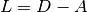 构造，并按  规格化的。
3.  **部分特征值分解**。在图拉普拉斯上进行特征值分解。

综上，谱嵌入的复杂度是 ![O[D \log(k) N \log(N)] + O[D N k^3] + O[d N^2]](img/5daa1b5d6a3d63020722cb0f4b41eee2.jpg) 。

*    : 训练集数据点的个数
*    : 输入维度
*    : 最近邻域的个数
*    : 输出的维度

> **参考资料**:
>*   [“Laplacian Eigenmaps for Dimensionality Reduction and Data Representation”](http://web.cse.ohio-state.edu/~mbelkin/papers/LEM_NC_03.pdf) M. Belkin, P. Niyogi, Neural Computation, June 2003; 15 (6):1373-1396

## 2.2.7. 局部切空间对齐（LTSA）

尽管，严格意义上来说，局部切空间对齐(LTSA) 并不是LLE的变体，但是，从算法角度来说，它们俩又是足够接近的，所以把它放在该目录下。与 LLE 算法关注于保持临点距离不同，LTSA 寻求通过切空间来描述局部几何形状，并（通过）实现全局最优化来对其这些局部切空间，从而得知对应的嵌入。 LTSA 可执行为函数 [`locally_linear_embedding`](https://scikit-learn.org/stable/modules/generated/sklearn.manifold.locally_linear_embedding.html#sklearn.manifold.locally_linear_embedding "sklearn.manifold.locally_linear_embedding") 或它的面向对象的对应形式 [`LocallyLinearEmbedding`](https://scikit-learn.org/stable/modules/generated/sklearn.manifold.LocallyLinearEmbedding.html#sklearn.manifold.LocallyLinearEmbedding "sklearn.manifold.LocallyLinearEmbedding") ，附带关键词 `method = 'ltsa'` 。

[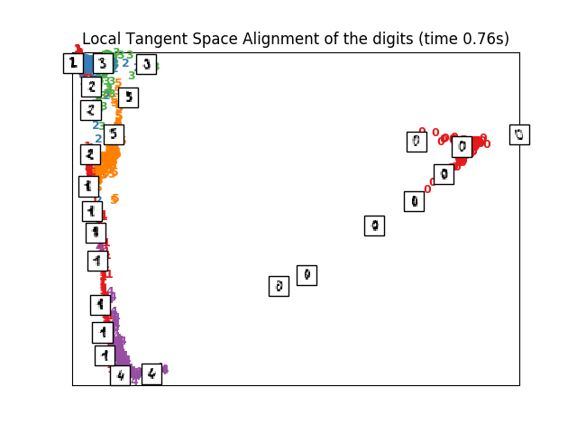](https://scikit-learn.org/stable/auto_examples/manifold/plot_lle_digits.html)

### 2.2.7.1. 复杂度

LTSA 算法含三部分:

1.  **近邻搜索**。与标准 LLE 的相同。
2.  **加权矩阵构造**。大约是 ![O[D N k^3] + O[k^2 d]](img/8c187292cd29fea23a4983db349e7545.jpg) 。其中第一项与标准 LLE 相似。
3.  **部分特征值分解**。同于标准 LLE 。

综上，复杂度是 ![O[D \log(k) N \log(N)] + O[D N k^3] + O[k^2 d] + O[d N^2]](img/fa48fa696e5242bb078fb786e6dc24c3.jpg) 。

*    : 训练集数据点的个数
*    : 输入维度
*    : 最近邻域的个数
*    : 输出的维度

> **参考资料**:
>*   [“Principal manifolds and nonlinear dimensionality reduction via tangent space alignment”](http://citeseer.ist.psu.edu/viewdoc/summary?doi=10.1.1.4.3693) Zhang, Z. & Zha, H. Journal of Shanghai Univ. 8:406 (2004)

## 2.2.8. 多维尺度分析（MDS）

[多维尺度分析 Multidimensional scaling](https://en.wikipedia.org/wiki/Multidimensional_scaling) （ [`MDS`](https://scikit-learn.org/stable/modules/generated/sklearn.manifold.MDS.html#sklearn.manifold.MDS "sklearn.manifold.MDS") ） 寻求数据的低维表示，而这些低维数据间的距离保持了它们在初始高维空间中的距离。

一般来说，（MDS）是一种用来分析在几何空间距离相似或相异数据的技术。MDS 尝试在几何空间上将相似或相异的数据进行建模。这些数据可以是物体间的相似等级，也可是分子的作用频率，还可以是国家简单贸易指数。

MDS算法有2类：度量和非度量。在 scikit-learn 中， [`MDS`](https://scikit-learn.org/stable/modules/generated/sklearn.manifold.MDS.html#sklearn.manifold.MDS "sklearn.manifold.MDS") 类具有上述两者的实现。在度量 MDS 中，输入相似度矩阵源自度量(并因此遵从三角形不等式)，输出两点之间的距离被设置为尽可能接近相似度或相异度的数据。在非度量版本中，算法尝试保持距离的控制，并因此寻找在所嵌入空间中的距离和相似/相异之间的单调关系。

设  是相似度矩阵， 是 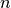 个输入点的坐标。差异 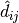 是某些最优方式所选择的相似度转换。然后，通过 $$\sum_{i < j} d_{ij}(X) - \hat{d}_{ij}(X)$$ 定义称为 Stress （应力值）的对象。

### 2.2.8.1. 度量 MDS

最简单的度量 [`MDS`](https://scikit-learn.org/stable/modules/generated/sklearn.manifold.MDS.html#sklearn.manifold.MDS "sklearn.manifold.MDS") 模型称为 _absolute MDS（绝对MDS）_，差异由 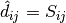 定义。对于绝对 MDS，值  应精确地对应于嵌入点的点  和  之间的距离。

大多数情况下，差异应设置为 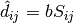 。

### 2.2.8.2. 非度量 MDS

非度量 [`MDS`](https://scikit-learn.org/stable/modules/generated/sklearn.manifold.MDS.html#sklearn.manifold.MDS "sklearn.manifold.MDS") 关注数据的排序。如果 $$S_{ij} < S_{jk}$$ ，则嵌入应执行  。这样执行的一个简单算法是在  上使用 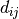 的单调回归，产生与  相同顺序的差异  。

此问题的 a trivial solution（一个平凡解）是把所有点设置到原点上。为了避免这种情况，将差异  标准化。

> **参考资料**:
>*   [“Modern Multidimensional Scaling - Theory and Applications”](http://www.springer.com/fr/book/9780387251509) Borg, I.; Groenen P. Springer Series in Statistics (1997)
>*   [“Nonmetric multidimensional scaling: a numerical method”](http://link.springer.com/article/10.1007%2FBF02289694) Kruskal, J. Psychometrika, 29 (1964)
>*   [“Multidimensional scaling by optimizing goodness of fit to a nonmetric hypothesis”](http://link.springer.com/article/10.1007%2FBF02289565) Kruskal, J. Psychometrika, 29, (1964)

## 2.2.9. t 分布随机邻域嵌入（t-SNE）

t-SNE（ [`TSNE`](https://scikit-learn.org/stable/modules/generated/sklearn.manifold.TSNE.html#sklearn.manifold.TSNE "sklearn.manifold.TSNE") ）将数据点的相似性转换为概率。原始空间中的相似性表示为高斯联合概率，嵌入空间中的相似性表示为 “学生” 的 t 分布。这允许 t-SNE 对局部结构特别敏感，并且有超过现有技术的一些其它优点:

*   在一个单一映射上按多种比例显示结构
*   显示位于多个、不同的流形或聚类中的数据
*   减轻在中心聚集的趋势

Isomap、LLE 和其它变体最适合展开单个连续低维流形，而 t-SNE 将侧重于数据的局部结构，并倾向于提取聚类的局部样本组，就像S曲线示例中突出显示的那样。这种基于局部结构对样本进行分组的能力可能有助于在视觉上同时解开包含多个流形的数据集，如数字数据集中的情况。

原始空间和嵌入空间中的联合概率的 Kullback-Leibler（KL） 散度将通过梯度下降而最小化。注意，KL 发散不是凸的，即具有不同初始化的多次重新开始将以KL发散的局部最小值结束。因此，有时候，通过尝试不同的开始值来选择具有最低KL散度的嵌入是非常有用的。

使用 t - SNE 的缺点大致如下:

*   t-SNE 的计算成本很高，在百万样本数据集上可能需要几个小时，而PCA将在几秒或几分钟内完成同样工作。
*   Barnes-Hut t-SNE 方法仅限于二维或三维嵌入。
*   该算法是随机的，不同种子的多次重新开始可以产生不同的嵌入。然而，以最小的误差选择嵌入是完全合理的。
*   未明确保留全局结构。用PCA初始化点(使用 *init=’pca’* )，可以减轻此问题。

### 2.2.9.1. 优化 t-SNE

t-SNE 的主要目的是实现高维数据的可视化。因此，当数据将嵌入到二维或三维时，它效果最好。

优化KL发散有时可能有点棘手。有五个参数控制 t-SNE 的优化，因此可能也控制最终嵌入的质量:

*   困惑度
*   早期增长因子
*   学习率
*   最大迭代次数
*   角度（不在精确方法中使用）

困惑度（perplexity _译注:有时也作混乱度_）定义为 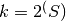 ，其中  是条件概率分布的香农熵。k 面色子的复杂度是 k ，因此 k 实际上是生成条件概率时 t-SNE 考虑的最近邻域的个数。复杂度越大导致有越多的近邻域，则对小结构越不敏感。相反地，越低的困惑度考虑越少的邻域，并因此忽略越多的全局信息而越关注局部邻域。当数据集的大小变大时，需要更多的点来获得局部邻域的合理样本，因此可能需要更大的困惑度。类似地，噪声越大的数据集需要越大的困惑度来包含足够的局部邻域，以超出背景噪声。

最大迭代次数通常足够高，并不需要任何调整。优化分为两个阶段:早期增长阶段和最终优化阶段。在早期增长阶段，原始空间中的联合概率将通过与给定因子相乘而被人为地增加。越大的因子导致数据中的自然聚类之间的差距越大。如果因子过高，KL 发散可能在此阶段增加。通常不需要对其进行调谐。学习率是一个关键参数。如果梯度太低，下降会陷入局部极小值;如果过高，KL发散将在优化阶段增加。可以在 Laurens van derMaaten 的常见问题解答中找到更多提示(见参考资料)。最后一个参数角度是性能和精度之间的折衷。角度越大意味着我们可以通过单个点来近似的区域越大，从而导致越快的速度，但结果越不准确。

[“如何高效使用 t-SNE”](http://distill.pub/2016/misread-tsne/) 提供了一个关于各种参数效果的讨论，以及用来探索不同参数效果的交互式绘图。

### 2.2.9.2. Barnes-Hut t-SNE

在此实现的 Barnes-Hut t-SNE 通常比其他流形学习算法慢得多。优化是很困难的，梯度的计算是 ![O[d N log(N)]](img/f60c0101ae8f649bb02ed8b24b30fd83.jpg) ，其中  是输出维数， 是样本个数。Barnes-Hut 方法在 t-SNE 复杂度为 ![O[d N^2]](img/9642d01a97f06869baba6159e3438677.jpg) 的精确方法之上进行了改进，但有其他几个显著区别:

*   Barnes-Hut 仅在目标维度为3或更小时,才有效。构建可视化时，基于2-D的案例是典型的案例。
*   Barnes-Hut 仅适用于密集的输入数据。稀疏数据矩阵只能用精确方法嵌入，或者可以通过密集的低阶投影来近似，例如使用 [`sklearn.decomposition.TruncatedSVD`](https://scikit-learn.org/stable/modules/generated/sklearn.decomposition.TruncatedSVD.html#sklearn.decomposition.TruncatedSVD "sklearn.decomposition.TruncatedSVD")
*   Barnes-Hut 是精确方法的一种近似。这种近似方法使用 angle 作为参数，因此当参数 method=”exact” 时，angle 参数无效。
*   Barnes-Hut 的拓展性很高。Barnes-Hut 可用于嵌入数十万个数据点，而精确方法只能处理数千个样本，再多就很困难了。

出于可视化目的（ t-SNE 的主要使用情况），强烈建议使用 Barnes-Hut 方法。精确的 t-SNE 方法可用于检验高维空间中嵌入的理论性质，但由于计算能力的约束而仅限于小数据集。

同时可以注意到，数字 label 与 t-SNE 发现的自然聚类大致匹配，而 PCA 模型的线性 2D 投影产生了标签区域在很大程度上重叠的表示。这是一个强有力的线索，表明该数据可以通过关注局部结构的非线性方法（例如，具有高斯 RBF 核的 SVM ）很好地分离。然而，如果不能在二维中用 t-SNE 来可视化分离良好的均匀标记组，并不一定意味着数据不能被监督模型正确地分类。可能是因为 2 维还不够低，无法准确表示数据的内部结构。

> **参考资料**:
>*   [“Visualizing High-Dimensional Data Using t-SNE”](http://jmlr.org/papers/v9/vandermaaten08a.html) van der Maaten, L.J.P.; Hinton, G. Journal of Machine Learning Research (2008)
>*   [“t-Distributed Stochastic Neighbor Embedding”](http://lvdmaaten.github.io/tsne/) van der Maaten, L.J.P.
>*   [“Accelerating t-SNE using Tree-Based Algorithms.”](https://lvdmaaten.github.io/publications/papers/JMLR_2014.pdf) L.J.P. van der Maaten. Journal of Machine Learning Research 15(Oct):3221-3245, 2014.

## 2.2.10. 实用技巧

*   确保对所有特征使用相同的缩放。因为流形学习方法是基于最近邻搜索的，否则算法的性能可能很差。有关缩放异构数据的方便方法，请参阅 [StandardScaler](preprocessing.html#preprocessing-scaler) 。
*   由每个例程计算的重构误差可用于选择最佳输出维度。对于嵌入在  维参数空间中的  维流形，重构误差将随着 `n_components` 的增加而减小，直到 `n_components == d` 。
*   注意，噪声数据可以对流形造成“短路”，其实质上充当了一个桥梁，用于连接流形的不同部分，否则（没有这样的“桥梁”）这些流形将被很好地划分开。基于噪声和/或不完全数据的流形学习是一个活跃的研究领域。
*   某些输入配置可能导致奇异加权矩阵，例如，当数据集中的两个以上点完全相同时，或者当数据被分割成不连续的组时。在这种情况下， `solver='arpack'` 将无法找到零空间(null space)。解决这一问题的最简单方法是使用 `solver='dense'` ，它将在一个奇异矩阵上进行，尽管它可能因为输入点的数量而非常缓慢。或者，人们可以尝试理解奇异性的来源:如果它是由于不相交的集合，增加 `n_neighbors` 可能有所帮助；如果是由于数据集中的相同点，则删除这些点可能有所帮助。

>See also:[完全随机树嵌入](ensemble.html#random-trees-embedding) 也可以用于得到特征空间的非线性表示，另外它不用降维。
