# 2.3. 聚类

校验者:
        [@花开无声](https://github.com/apachecn/scikit-learn-doc-zh)
        [@小瑶](https://github.com/apachecn/scikit-learn-doc-zh)
        [@Loopy](https://github.com/loopyme)
        [@barrycg](https://github.com/barrycg)
翻译者:
        [@小瑶](https://github.com/apachecn/scikit-learn-doc-zh)
        [@krokyin](https://github.com/apachecn/scikit-learn-doc-zh)

未标记的数据的 [聚类(Clustering)](https://en.wikipedia.org/wiki/Cluster_analysis) 可以使用模块 [`sklearn.cluster`](classes.html#module-sklearn.cluster "sklearn.cluster") 来实现。

每个聚类算法(clustering algorithm)都有两个变体: 一个是 类（class）, 它实现了 `fit` 方法来学习训练数据的簇（cluster），还有一个 函数（function），当给定训练数据，返回与不同簇对应的整数标签数组（array）。对于类来说，训练数据上的标签可以在 `labels_` 属性中找到。

>**输入数据**
>
>需要注意的一点是，该模块中实现的算法可以采用不同种类的矩阵作为输入。所有算法的调用接口都接受 shape `[n_samples, n_features]` 的标准数据矩阵。 这些矩阵可以通过使用 [`sklearn.feature_extraction`](classes.html#module-sklearn.feature_extraction "sklearn.feature_extraction") 模块中的类获得。对于 [`AffinityPropagation`](https://scikit-learn.org/stable/modules/generated/sklearn.cluster.AffinityPropagation.html#sklearn.cluster.AffinityPropagation "sklearn.cluster.AffinityPropagation"), [`SpectralClustering`](https://scikit-learn.org/stable/modules/generated/sklearn.cluster.SpectralClustering.html#sklearn.cluster.SpectralClustering "sklearn.cluster.SpectralClustering") 和 [`DBSCAN`](https://scikit-learn.org/stable/modules/generated/sklearn.cluster.DBSCAN.html#sklearn.cluster.DBSCAN "sklearn.cluster.DBSCAN") 也可以输入 shape `[n_samples, n_samples]` 的相似矩阵。这些可以通过 [`sklearn.metrics.pairwise`](classes.html#module-sklearn.metrics.pairwise "sklearn.metrics.pairwise") 模块中的函数获得。

## 2.3.1. 聚类方法概述

[](https://scikit-learn.org/stable/auto_examples/cluster/plot_cluster_comparison.html)

 scikit-learn 中的 聚类算法 的比较

| Method name（方法名称） | Parameters（参数） | Scalability（可扩展性） | Usecase（使用场景） | Geometry (metric used)（几何图形（公制使用）） |
| --- | --- | --- | --- | --- |
| [K-Means（K-均值）](#k-means) | number of clusters（聚类形成的簇的个数） | 非常大的 `n_samples`, 中等的 `n_clusters` 使用 [MiniBatch 代码）](#mini-batch-kmeans) | 通用, 均匀的 cluster size（簇大小）, flat geometry（平面几何）, 不是太多的 clusters（簇） | Distances between points（点之间的距离） |
| [Affinity propagation](#affinity-propagation) | damping（阻尼）, sample preference（样本偏好） | Not scalable with n_samples（n_samples 不可扩展） | Many clusters, uneven cluster size, non-flat geometry（许多簇，不均匀的簇大小，非平面几何） | Graph distance (e.g. nearest-neighbor graph)（图距离（例如，最近邻图）） |
| [Mean-shift](#mean-shift) | bandwidth（带宽） | Not scalable with `n_samples` （`n_samples`不可扩展） | Many clusters, uneven cluster size, non-flat geometry（许多簇，不均匀的簇大小，非平面几何） | Distances between points（点之间的距离） |
| [Spectral clustering](#spectral-clustering) | number of clusters（簇的个数） | 中等的 `n_samples`, 小的 `n_clusters` | Few clusters, even cluster size, non-flat geometry（几个簇，均匀的簇大小，非平面几何） | Graph distance (e.g. nearest-neighbor graph)（图距离（例如最近邻图）） |
| [Ward hierarchical clustering](#hierarchical-clustering) | number of clusters（簇的个数） | 大的 `n_samples` 和 `n_clusters` | Many clusters, possibly connectivity constraints（很多的簇，可能连接限制） | Distances between points（点之间的距离） |
| [Agglomerative clustering](#hierarchical-clustering) | number of clusters（簇的个数）, linkage type（链接类型）, distance（距离） | 大的 `n_samples` 和 `n_clusters` | Many clusters, possibly connectivity constraints, non Euclidean distances（很多簇，可能连接限制，非欧氏距离） | Any pairwise distance（任意成对距离） |
| [DBSCAN](#dbscan) | neighborhood size（neighborhood 的大小） | 非常大的 `n_samples`, 中等的 `n_clusters` | Non-flat geometry, uneven cluster sizes（非平面几何，不均匀的簇大小） | Distances between nearest points（最近点之间的距离） |
| [Gaussian mixtures（高斯混合）](mixture.html#mixture) | many（很多） | Not scalable（不可扩展） | Flat geometry, good for density estimation（平面几何，适用于密度估计） | Mahalanobis distances to centers（ 与中心的马氏距离） |
| [Birch](#birch) | branching factor（分支因子）, threshold（阈值）, optional global clusterer（可选全局簇）. | 大的 `n_clusters` 和 `n_samples` | Large dataset, outlier removal, data reduction.（大型数据集，异常值去除，数据简化） | Euclidean distance between points（点之间的欧氏距离） |

当簇具有特殊的形状，即非平面流体（_译注：即该流体的高斯曲率非0_），并且标准欧氏距离不是正确的度量标准（metric）时，非平面几何聚类(Non-flat geometry clustering)是非常有用的。这种情况出现在上图的两个顶行中。

用于聚类（clustering）的高斯混合模型（Gaussian mixture models），专用于混合模型描述在 [文档的另一章节](mixture.html#mixture) 。可以将 KMeans 视为具有每个分量的协方差(equal covariance per component)相等的高斯混合模型的特殊情况。

## 2.3.2. K-means

[`KMeans`](https://scikit-learn.org/stable/modules/generated/sklearn.cluster.KMeans.html#sklearn.cluster.KMeans "sklearn.cluster.KMeans") 算法通过把样本分离成 n 个具有相同方差的类的方式来聚集数据，最小化称为 惯量([inertia](inertia)) 或 簇内平方和(within-cluster sum-of-squares)的标准（criterion）。该算法需要指定簇的数量。它可以很好地扩展到大量样本(large number of samples)，并已经被广泛应用于许多不同领域的应用领域。

k-means 算法将一组  样本  划分成  不相交的簇 , 每个都用该簇中的样本的均值  描述。 这个均值(means)通常被称为簇的 “质心(centroids)”; 注意，它们一般不是从  中挑选出的点，虽然它们是处在同一个空间。

K-means（K-均值）算法旨在选择一个质心, 能够最小化惯性或簇内平方和的标准:


惯性被认为是测量簇内聚程度的度量(measure)。 它有各种缺点:

*   惯性假设簇是凸(convex)的和各项同性(isotropic)，这并不是总是对的。它对 细长的簇或具有不规则形状的流行反应不佳。
*   惯性不是一个归一化度量(normalized metric): 我们只知道当惯量的值较低是较好的，并且零是最优的。但是在非常高维的空间中，欧氏距离往往会膨胀（这就是所谓的 “维度诅咒/维度惩罚”(curse of dimensionality)）。在 k-means 聚类算法之前运行诸如 [PCA](PCA) 之类的降维算法可以减轻这个问题并加快计算速度。

[](https://scikit-learn.org/stable/auto_examples/cluster/plot_kmeans_assumptions.html)

K-means 通常被称为劳埃德算法(Lloyd’s algorithm)。简而言之，该算法可分为三个步骤。第一步是选择初始质心，最基本的方法是从  数据集中选择  个样本。初始化完成后，K-means 由接下来两个步骤之间的循环组成。 第一步将每个样本分配到其最近的质心。第二步通过取分配给每个先前质心的所有样本的平均值来创建新的质心。计算旧的和新的质心之间的差异，并且算法重复这些最后的两个步骤，直到该值小于阈值。换句话说，算法重复这个步骤，直到质心不再显著移动。

[](https://scikit-learn.org/stable/auto_examples/cluster/plot_kmeans_digits.html)

K-means 相当于具有小的全对称协方差矩阵(small, all-equal, diagonal covariance matrix)的期望最大化算法(expectation-maximization algorithm)。

该算法也可以通过 [`Voronoi diagrams（Voronoi图）`](https://en.wikipedia.org/wiki/Voronoi_diagram) 的概念来理解。首先,使用当前质心计算点的 Voronoi 图。 Voronoi 图中的每个段(segment)都成为一个单独分离的簇。其次，质心被更新为每个段的平均值。然后，该算法重复此操作，直到满足停止条件。 通常情况下，当迭代之间的目标函数(objective function)的相对减小小于给定的公差值(tolerance value)时，算法停止。在此实现中不是这样: 当质心移动小于公差时，迭代停止。

给定足够的时间，K-means 将总是收敛的，但这可能是局部最小。这很大程度上取决于质心的初始化。 因此，通常会进行几次初始化不同质心的计算。帮助解决这个问题的一种方法是 k-means++ 初始化方案，它已经在 scikit-learn 中实现（使用 `init='k-means++'` 参数）。 这将初始化质心（通常）彼此远离，导致比随机初始化更好的结果，如参考文献所示。

该算法支持样本权重功能，该功能可以通过参数`sample_weight`实现。该功能允许在计算簇心和惯性值的过程中，给部分样本分配更多的权重。 例如，给某个样本分配一个权重值2，相当于在dataset X 中增加一个该样本的拷贝。

存在一个参数，以允许 K-means 并行运行，称为 `n_jobs`。给这个参数赋予一个正值指定使用处理器的数量（默认值: 1）。值 -1 使用所有可用的处理器，-2 使用全部可用处理器减一，等等。并行化(Parallelization)通常以内存的代价(cost of memory)加速计算（在这种情况下，需要存储多个质心副本，每个作业(job)使用一个副本）。

>**警告**
>
> K-Means 的并行版本不能在 OS X 上运行, 当内部的 *numpy* 使用 *Accelerate* 框架。这是预期的行为: *Accelerate* 可以在 fork 之后调用，但是您需要使用 Python binary 来执行子进程（posix 并不支持多进程处理 ）。

K-means 可用于矢量量化(vector quantization)。这是使用以下类型的训练模型的变换方法实现的 [`KMeans`](https://scikit-learn.org/stable/modules/generated/sklearn.cluster.KMeans.html#sklearn.cluster.KMeans "sklearn.cluster.KMeans") 。

> **示例**:
>*   [Demonstration of k-means assumptions](https://scikit-learn.org/stable/auto_examples/cluster/plot_kmeans_assumptions.html#sphx-glr-auto-examples-cluster-plot-kmeans-assumptions-py): 演示 k-means 是否直观地执行（performs intuitively），何时不执行
>*   [A demo of K-Means clustering on the handwritten digits data](https://scikit-learn.org/stable/auto_examples/cluster/plot_kmeans_digits.html#sphx-glr-auto-examples-cluster-plot-kmeans-digits-py): 聚类手写数字

> **参考资料**:
>*   [“k-means++: The advantages of careful seeding”](http://ilpubs.stanford.edu:8090/778/1/2006-13.pdf) Arthur, David, and Sergei Vassilvitskii, _Proceedings of the eighteenth annual ACM-SIAM symposium on Discrete algorithms_, Society for Industrial and Applied Mathematics (2007)

### 2.3.2.1. 小批量 K-Means

[`MiniBatchKMeans`](https://scikit-learn.org/stable/modules/generated/sklearn.cluster.MiniBatchKMeans.html#sklearn.cluster.MiniBatchKMeans "sklearn.cluster.MiniBatchKMeans") 是 [`KMeans`](https://scikit-learn.org/stable/modules/generated/sklearn.cluster.KMeans.html#sklearn.cluster.KMeans "sklearn.cluster.KMeans") 算法的一个变种，它使用小批量(mini-batches)来减少计算时间，而这多个批次仍然尝试优化相同的目标函数。小批量是输入数据的子集，在每次训练迭代中随机抽样。这些小批量大大减少了收敛到局部解所需的计算量。 与其他降低 k-means 收敛时间的算法不同，小批量 k-means 产生的结果通常只比标准算法略差。

该算法在两个步骤之间进行迭代，类似于 vanilla k-means 。在第一步，  样本是从数据集中随机抽取的，形成一个小批量。然后将它们分配到最近的质心。 在第二步，质心被更新。与 k-means 不同, 该变种算法是基于每个样本(per-sample)。对于小批量中的每个样本，通过取样本的流平均值(streaming average)和分配给该质心的所有先前样本来更新分配的质心。 这具有随时间降低质心的变化率（rate of change）的效果。执行这些步骤直到达到收敛或达到预定次数的迭代。

[`MiniBatchKMeans`](https://scikit-learn.org/stable/modules/generated/sklearn.cluster.MiniBatchKMeans.html#sklearn.cluster.MiniBatchKMeans "sklearn.cluster.MiniBatchKMeans") 收敛速度比 [`KMeans`](https://scikit-learn.org/stable/modules/generated/sklearn.cluster.KMeans.html#sklearn.cluster.KMeans "sklearn.cluster.KMeans")快 ，但是结果的质量会降低。在实践中，质量差异可能相当小，如示例和引用的参考。

[](https://scikit-learn.org/stable/auto_examples/cluster/plot_mini_batch_kmeans.html)

> **示例**:
>*   [Comparison of the K-Means and MiniBatchKMeans clustering algorithms](https://scikit-learn.org/stable/auto_examples/cluster/plot_mini_batch_kmeans.html#sphx-glr-auto-examples-cluster-plot-mini-batch-kmeans-py): KMeans 与 MiniBatchKMeans 的比较
>*   [Clustering text documents using k-means](https://scikit-learn.org/stable/auto_examples/text/document_clustering.html#sphx-glr-auto-examples-text-document-clustering-py): 使用 稀疏 MiniBatchKMeans的文档聚类
>*   [Online learning of a dictionary of parts of faces](https://scikit-learn.org/stable/auto_examples/cluster/plot_dict_face_patches.html#sphx-glr-auto-examples-cluster-plot-dict-face-patches-py)

> **参考资料**:
>*   [“Web Scale K-Means clustering”](http://www.eecs.tufts.edu/~dsculley/papers/fastkmeans.pdf) D. Sculley, _Proceedings of the 19th international conference on World wide web_ (2010)

## 2.3.3. Affinity Propagation

[`AffinityPropagation`](https://scikit-learn.org/stable/modules/generated/sklearn.cluster.AffinityPropagation.html#sklearn.cluster.AffinityPropagation "sklearn.cluster.AffinityPropagation") AP聚类是通过在样本对之间发送消息直到收敛的方式来创建聚类。然后使用少量模范样本作为聚类中心来描述数据集，而这些模范样本可以被认为是最能代表数据集中其它数据的样本。在样本对之间发送的消息表示一个样本作为另一个样本的模范样本的 适合程度，适合程度值在根据通信的反馈不断更新。更新迭代直到收敛，完成聚类中心的选取，因此也给出了最终聚类。

[](https://scikit-learn.org/stable/auto_examples/cluster/plot_affinity_propagation.html)

Affinity Propagation 算法比较有趣的点是可以根据提供的数据决定聚类的数目。 因此有两个比较重要的参数_preference_, 决定使用多少个模范样本 *阻尼因子(damping factor)* 减少吸引信息和归属信息以减少更新这些信息时的数据振荡。

AP聚类算法主要的缺点是算法的复杂度. AP聚类算法的时间复杂度是 , 其中  是样本的个数 ， 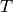 是收敛之前迭代的次数. 如果使用密集的相似性矩阵空间复杂度是  如果使用稀疏的相似性矩阵空间复杂度可以降低。 这使得AP聚类最适合中小型数据集。

> **示例**:
>*   [Demo of affinity propagation clustering algorithm](https://scikit-learn.org/stable/auto_examples/cluster/plot_affinity_propagation.html#sphx-glr-auto-examples-cluster-plot-affinity-propagation-py): Affinity Propagation on a synthetic 2D datasets with 3 classes.
>*   [Visualizing the stock market structure](https://scikit-learn.org/stable/auto_examples/applications/plot_stock_market.html#sphx-glr-auto-examples-applications-plot-stock-market-py) Affinity Propagation on Financial time series to find groups of companies

**Algorithm description(算法描述):** 样本之间传递的信息有两种。 第一种是吸引信息 (responsibility) , 样本  适合作为样本  的聚类中心(_译注:原文中exemplar,即前面所示的模范样本_)的程度。

第二种是 归属信息(availability) , 样本  选择样本  作为聚类中心的适合程度,并且考虑其他所有样本选取  做为聚类中心的合适程度。 通过这个方法，选取示例样本作为聚类中心, 如果 (1) 该样本与其许多样本相似，并且 (2) 被许多样本选取为可以代表它们自身的模范样本。

样本  对样本  吸引度计算公式:

![r(i, k) \leftarrow s(i, k) - max [ a(i, k') + s(i, k') \forall k' \neq k ]](img/8dab78bd2e80188f99e0c88c4c83472a.jpg)

其中  是样本  和样本  之间的相似度。样本  作为样本  的示例样本的合适程度:

![a(i, k) \leftarrow min [0, r(k, k) + \sum_{i'~s.t.~i' \notin \{i, k\}}{r(i', k)}]](img/851c667ab0811688c25c6819aafacba0.jpg)

算法开始时  和 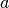 都被置 0,然后开始迭代计算直到收敛。 为了防止更新数据时出现数据振荡，在迭代过程中引入阻尼因子  :


其中 是迭代的次数。

## 2.3.4. Mean Shift

[`MeanShift`](https://scikit-learn.org/stable/modules/generated/sklearn.cluster.MeanShift.html#sklearn.cluster.MeanShift "sklearn.cluster.MeanShift") 算法旨在于发现一个样本密度平滑的 _blobs_ 。均值漂移(Mean Shift)算法是基于质心的算法，通过更新质心的候选位置，这些侯选位置通常是所选定区域内点的均值。然后，这些候选位置在后处理阶段被过滤以消除近似重复，从而形成最终质心集合。

给定第  次迭代中的候选质心  , 候选质心的位置将被按照如下公式更新:


其中 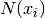 是围绕  周围一个给定距离范围内的样本邻域, 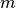 是均值偏移向量(mean shift vector), 该向量是所有质心中指向 点密度增加最多的区域的偏移向量。使用以下等式计算，有效地将质心更新为其邻域内样本的平均值:


算法自动设定聚类的数目，而不是依赖参数 `带宽（bandwidth）`,带宽是决定搜索区域的size的参数。 这个参数可以手动设置，但是如果没有设置，可以使用提供的函数 `estimate_bandwidth` 获取 一个估算值。

该算法不是高度可扩展的，因为在执行算法期间需要执行多个最近邻搜索。 该算法保证收敛，但是当 质心的变化较小时，算法将停止迭代。

通过找到给定样本的最近质心来给新样本打上标签。

[](https://scikit-learn.org/stable/auto_examples/cluster/plot_mean_shift.html)

> **示例**:
>*   [A demo of the mean-shift clustering algorithm](https://scikit-learn.org/stable/auto_examples/cluster/plot_mean_shift.html#sphx-glr-auto-examples-cluster-plot-mean-shift-py): Mean Shift clustering on a synthetic 2D datasets with 3 classes.

> **参考资料**:
>*   [“Mean shift: A robust approach toward feature space analysis.”](http://citeseerx.ist.psu.edu/viewdoc/download?doi=10.1.1.76.8968&rep=rep1&type=pdf) D. Comaniciu and P. Meer, _IEEE Transactions on Pattern Analysis and Machine Intelligence_ (2002)

## 2.3.5. Spectral clustering

[`SpectralClustering(谱聚类)`](https://scikit-learn.org/stable/modules/generated/sklearn.cluster.SpectralClustering.html#sklearn.cluster.SpectralClustering "sklearn.cluster.SpectralClustering") 是在样本之间进行关联矩阵的低维度嵌入，然后在低维空间中使用 KMeans 算法。 如果关联矩阵稀疏并且 [pyamg](http://pyamg.org/) 模块已经被安装，则这是非常有效的。 谱聚类 需要指定簇的数量。这个算法适用于簇数量少时，在簇数量多时是不建议使用。

对于两个簇，它解决了相似图形上的 [归一化切割(normalised cuts)](http://people.eecs.berkeley.edu/~malik/papers/SM-ncut.pdf)的凸松弛问题: 将图形切割成两个，使得切割的边缘的权重比每个簇内的边缘的权重小。在图像处理时，这个标准是特别有趣的: 图像的顶点是像素，相似图形的边缘是图像的渐变函数。

**[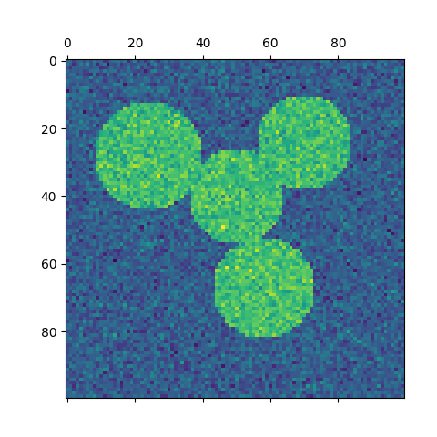](https://scikit-learn.org/stable/auto_examples/cluster/plot_segmentation_toy.html) [](https://scikit-learn.org/stable/auto_examples/cluster/plot_segmentation_toy.html)**

>**警告:将距离转换为良好的相似性**
>
>请注意，如果你的相似矩阵的值分布不均匀，例如:存在负值或者距离矩阵并不表示相似性， spectral problem 将会变得奇异，并且不能解决。 在这种情况下，建议对矩阵的 entries 进行转换。比如在有向距离矩阵上应用 heat kernel:
```py
similarity = np.exp(-beta * distance / distance.std())
```
请看这样一个应用程序的例子。

> **示例**:
>*   [Spectral clustering for image segmentation](https://scikit-learn.org/stable/auto_examples/cluster/plot_segmentation_toy.html#sphx-glr-auto-examples-cluster-plot-segmentation-toy-py): Segmenting objects from a noisy background using spectral clustering.
>*   [Segmenting the picture of a raccoon face in regions](https://scikit-learn.org/stable/auto_examples/cluster/plot_face_segmentation.html#sphx-glr-auto-examples-cluster-plot-face-segmentation-py): Spectral clustering to split the image of the raccoon face in regions.

### 2.3.5.1. 不同的标记分配策略

[`SpectralClustering`](https://scikit-learn.org/stable/modules/generated/sklearn.cluster.SpectralClustering.html#sklearn.cluster.SpectralClustering "sklearn.cluster.SpectralClustering") 的`assign_labels` 参数代表着可以使用不同的分配策略。 `"kmeans"` 可以匹配更精细的数据细节，但是可能更加不稳定。 特别是，除非你可以控制 `random_state` 否则可能无法复现运行的结果 ，因为它取决于随机初始化。另一方， 使用 `"discretize"` 策略是 100% 可以复现的，但是它往往会产生相当均匀的几何形状的闭合块。

| `assign_labels="kmeans"` | `assign_labels="discretize"` |
| --- | --- |
| [](https://scikit-learn.org/stable/auto_examples/cluster/plot_face_segmentation.html) | [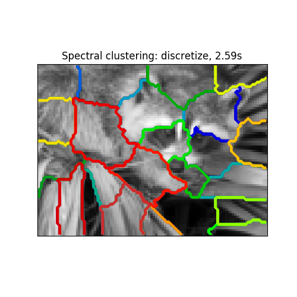](https://scikit-learn.org/stable/auto_examples/cluster/plot_face_segmentation.html) |

### 2.3.5.2. 谱聚类用于图聚类问题
谱聚类还可以通过谱嵌入对图进行聚类。在这种情况下，关联矩阵(affinity matrix) 是图形的邻接矩阵，谱聚类可以由 affinity=’precomputed’ 进行初始化。

``` py
>>> from sklearn.cluster import SpectralClustering
>>> sc = SpectralClustering(3, affinity='precomputed', n_init=100,
...                         assign_labels='discretize')
>>> sc.fit_predict(adjacency_matrix)  
```

> **参考资料**:
>*   [“A Tutorial on Spectral Clustering”](http://citeseerx.ist.psu.edu/viewdoc/summary?doi=10.1.1.165.9323) Ulrike von Luxburg, 2007
>*   [“Normalized cuts and image segmentation”](http://citeseer.ist.psu.edu/viewdoc/summary?doi=10.1.1.160.2324) Jianbo Shi, Jitendra Malik, 2000
>*   [“A Random Walks View of Spectral Segmentation”](http://citeseer.ist.psu.edu/viewdoc/summary?doi=10.1.1.33.1501) Marina Meila, Jianbo Shi, 2001
>*   [“On Spectral Clustering: Analysis and an algorithm”](http://citeseerx.ist.psu.edu/viewdoc/summary?doi=10.1.1.19.8100) Andrew Y. Ng, Michael I. Jordan, Yair Weiss, 2001

## 2.3.6. 层次聚类

 层次聚类(Hierarchical clustering)代表着一类的聚类算法，这种类别的算法通过不断的合并或者分割内置聚类来构建最终聚类。 聚类的层次可以被表示成树（或者树形图(dendrogram)）。树根是拥有所有样本的唯一聚类，叶子是仅有一个样本的聚类。 请参照 [Wikipedia page](https://en.wikipedia.org/wiki/Hierarchical_clustering) 查看更多细节。

The [`AgglomerativeClustering`](https://scikit-learn.org/stable/modules/generated/sklearn.cluster.AgglomerativeClustering.html#sklearn.cluster.AgglomerativeClustering "sklearn.cluster.AgglomerativeClustering") 使用自下而上的方法进行层次聚类:开始是每一个对象是一个聚类， 并且聚类别相继合并在一起。 连接标准(linkage criteria _译注:  该词似乎尚未有公认的翻译标准_) 决定用于合并策略的度量:

*   **Ward** 最小化所有聚类内的平方差总和。这是一种方差最小化(variance-minimizing )的优化方向， 这是与k-means 的目标函数相似的优化方法，但是用 凝聚分层（agglomerative hierarchical）的方法处理。
*   **Maximum** 或 **complete linkage** 最小化成对聚类间最远样本距离。
*   **Average linkage** 最小化成对聚类间平均样本距离值。
*   **Single linkage** 最小化成对聚类间最近样本距离值。

[`AgglomerativeClustering`](https://scikit-learn.org/stable/modules/generated/sklearn.cluster.AgglomerativeClustering.html#sklearn.cluster.AgglomerativeClustering "sklearn.cluster.AgglomerativeClustering") 在联合使用同一个连接矩阵(connectivity matrix)时，也可以扩大到大量的样本，但是在样本之间没有添加连接约束时，计算代价很大:每步都要考虑所有可能的合并。

>[**FeatureAgglomeration**](https://scikit-learn.org/stable/modules/generated/sklearn.cluster.FeatureAgglomeration.html#sklearn.cluster.FeatureAgglomeration "sklearn.cluster.FeatureAgglomeration")
>
> [`FeatureAgglomeration`](https://scikit-learn.org/stable/modules/generated/sklearn.cluster.FeatureAgglomeration.html#sklearn.cluster.FeatureAgglomeration "sklearn.cluster.FeatureAgglomeration") 使用 凝聚聚类(agglomerative clustering) 将看上去相似的 特征组合在一起，从而减少特征的数量。这是一个降维工具, 请参照 [无监督降维](60#44-无监督降维)。

### 2.3.6.1. 不同连接类型: Ward, complete,average and single linkage

[`AgglomerativeClustering`](https://scikit-learn.org/stable/modules/generated/sklearn.cluster.AgglomerativeClustering.html#sklearn.cluster.AgglomerativeClustering "sklearn.cluster.AgglomerativeClustering") 支持 Ward, single, average, and complete linkage 策略.

[](https://scikit-learn.org/stable/auto_examples/cluster/plot_linkage_comparison.html)


Agglomerative cluster 存在 “rich get richer” 现象导致聚类大小不均匀。这方面 Single linkage 是最坏的策略，Ward 给出了最规则的大小。然而，在 Ward 中 affinity (or distance used in clustering) 不能被改变，对于 非欧氏度量(non Euclidean metrics) 来说, average linkage 是一个好的选择。Single linkage 虽然对于噪声数据的鲁棒性并不强, 但是对规模较大的dataset提供非常有效的层次聚类算法。 Single linkage 同样对非全局数据有很好的效果。

> **示例**:
>*   [Various Agglomerative Clustering on a 2D embedding of digits](https://scikit-learn.org/stable/auto_examples/cluster/plot_digits_linkage.html#sphx-glr-auto-examples-cluster-plot-digits-linkage-py): exploration of the different linkage strategies in a real dataset.

### 2.3.6.2. 添加连接约束

[`AgglomerativeClustering`](https://scikit-learn.org/stable/modules/generated/sklearn.cluster.AgglomerativeClustering.html#sklearn.cluster.AgglomerativeClustering "sklearn.cluster.AgglomerativeClustering") 中一个有趣的特点是可以使用连接矩阵(connectivity matrix)将连接约束添加到算法中（只有相邻的聚类可以合并到一起），连接矩阵为每一个样本给定了相邻的样本。 例如，在 swiss-roll 的例子中，连接约束禁止在不相邻的 swiss roll 上合并，从而防止形成在 roll 上重复折叠的聚类。

**[](https://scikit-learn.org/stable/auto_examples/cluster/plot_ward_structured_vs_unstructured.html) [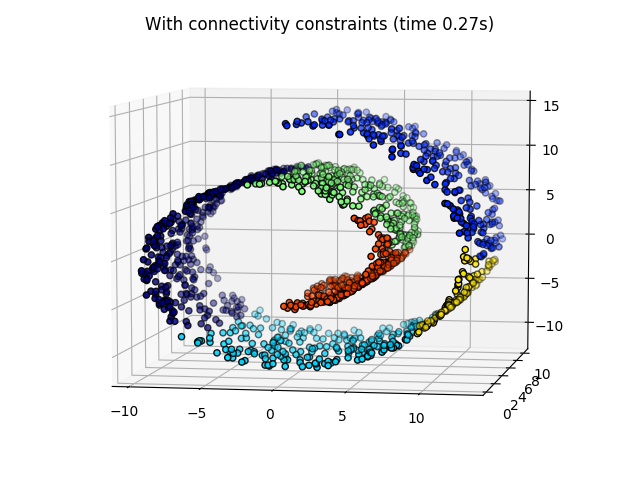](https://scikit-learn.org/stable/auto_examples/cluster/plot_ward_structured_vs_unstructured.html)**

这些约束对塑造局部结构是很有用的，而且这也使得算法更快，特别是当样本数量巨大时。

连通性的限制(connectivity constraint)是通过连接矩阵来实现的: scipy sparse matrix 仅仅在行列的交界处有元素存在，而这些行列记录相连接的数据集的索引。这个矩阵可以通过先验信息构建:例如，你可能通过仅仅将从一个连接指向另一个的链接合并页面来聚类页面。也可以从数据中学习到, 例如使用 [sklearn.neighbors.kneighbors_graph](https://www.studyai.cn/modules/generated/sklearn.neighbors.kneighbors_graph.html#sklearn.neighbors.kneighbors_graph) 限制与最近邻的合并， 就像 [这个例子](https://www.studyai.cn/auto_examples/cluster/plot_agglomerative_clustering.html#sphx-glr-auto-examples-cluster-plot-agglomerative-clustering-py) 中那样, 或者使用 [sklearn.feature_extraction.image.grid_to_graph](https://www.studyai.cn/modules/generated/sklearn.feature_extraction.image.grid_to_graph.html#sklearn.feature_extraction.image.grid_to_graph) 仅合并图像上相邻的像素点， 就像 [这个 coin 例子](https://www.studyai.cn/auto_examples/cluster/plot_coin_ward_segmentation.html#sphx-glr-auto-examples-cluster-plot-coin-ward-segmentation-py) 。

> **示例**:
>*   [A demo of structured Ward hierarchical clustering on a raccoon face image](https://scikit-learn.org/stable/auto_examples/cluster/plot_face_ward_segmentation.html#sphx-glr-auto-examples-cluster-plot-face-ward-segmentation-py): Ward clustering to split the image of a raccoon face in regions.
>*   [Hierarchical clustering: structured vs unstructured ward](https://scikit-learn.org/stable/auto_examples/cluster/plot_ward_structured_vs_unstructured.html#sphx-glr-auto-examples-cluster-plot-ward-structured-vs-unstructured-py): Example of Ward algorithm on a swiss-roll, comparison of structured approaches versus unstructured approaches.
>*   [Feature agglomeration vs. univariate selection](https://scikit-learn.org/stable/auto_examples/cluster/plot_feature_agglomeration_vs_univariate_selection.html#sphx-glr-auto-examples-cluster-plot-feature-agglomeration-vs-univariate-selection-py): Example of dimensionality reduction with feature agglomeration based on Ward hierarchical clustering.
>*   [Agglomerative clustering with and without structure](https://scikit-learn.org/stable/auto_examples/cluster/plot_agglomerative_clustering.html#sphx-glr-auto-examples-cluster-plot-agglomerative-clustering-py)

>**警告：single, average and complete linkage的连接约束**
>
>single, average and complete linkage的连接约束可以增强聚合聚类中的 ‘rich getting richer’ 现象，特别是当它们使用函数 [`sklearn.neighbors.kneighbors_graph`](https://scikit-learn.org/stable/modules/generated/sklearn.neighbors.kneighbors_graph.html#sklearn.neighbors.kneighbors_graph "sklearn.neighbors.kneighbors_graph")进行构建时。 在少量聚类的限制中, 更倾向于给出一些 macroscopically occupied clusters 并且几乎是空的 (讨论内容请查看 [Agglomerative clustering with and without structure](https://scikit-learn.org/stable/auto_examples/cluster/plot_agglomerative_clustering.html#sphx-glr-auto-examples-cluster-plot-agglomerative-clustering-py))。在这个问题上，single是最脆弱的 linkage 选项。

[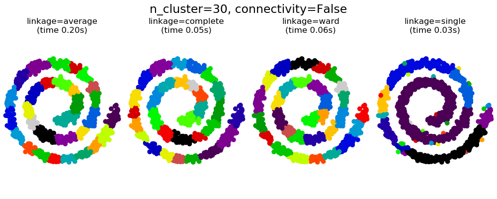](https://www.studyai.cn/auto_examples/cluster/plot_agglomerative_clustering.html)
[](https://www.studyai.cn/auto_examples/cluster/plot_agglomerative_clustering.html)
[](https://www.studyai.cn/auto_examples/cluster/plot_agglomerative_clustering.html)
[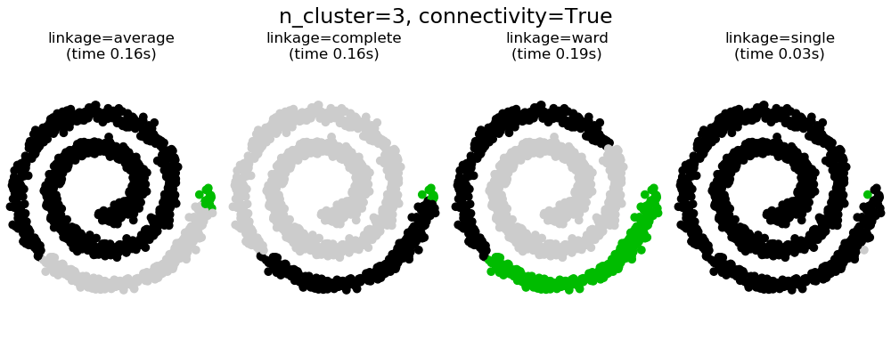](https://www.studyai.cn/auto_examples/cluster/plot_agglomerative_clustering.html)

### 2.3.6.3. Varying the metric

Single, verage and complete linkage 可以使用各种距离 (or affinities), 特别是欧氏距离 (Euclidean distance *l2* 距离), 曼哈顿距离（Manhattan distance）(or 城市区块距离(Cityblock), or *l1* 距离), 余弦距离(cosine distance), 或者任何预先计算的关联矩阵(affinity matrix).

*   *l1* 距离有利于稀疏特征或者稀疏噪声: 例如很多特征都是0，就像在文本挖掘中使用 rare words 一样。
*   *余弦* 距离是非常有趣的，因为它对全局放缩是一样的。

选择度量标准的方针是使得不同类样本之间距离最大化，并且最小化同类样本之间的距离。

[](https://scikit-learn.org/stable/auto_examples/cluster/plot_agglomerative_clustering_metrics.html) [](https://scikit-learn.org/stable/auto_examples/cluster/plot_agglomerative_clustering_metrics.html) [](https://scikit-learn.org/stable/auto_examples/cluster/plot_agglomerative_clustering_metrics.html)

> **示例**:
>*   [Agglomerative clustering with different metrics](https://scikit-learn.org/stable/auto_examples/cluster/plot_agglomerative_clustering_metrics.html#sphx-glr-auto-examples-cluster-plot-agglomerative-clustering-metrics-py)

## 2.3.7. DBSCAN

The [`DBSCAN`](https://scikit-learn.org/stable/modules/generated/sklearn.cluster.DBSCAN.html#sklearn.cluster.DBSCAN "sklearn.cluster.DBSCAN") 算法将簇视为被低密度区域分隔的高密度区域。由于这个相当普遍的观点， DBSCAN发现的簇可以是任何形状的，与假设簇是凸的 K-means 相反。 DBSCAN 的核心概念是 _core samples_, 是指位于高密度区域的样本。 因此一个簇是一组核心样本，每个核心样本彼此靠近（通过某个距离度量测量） 和一组接近核心样本的非核心样本（但本身不是核心样本）。算法中的两个参数, `min_samples` 和 `eps`,正式的定义了我们所说的 _稠密（dense）_。较高的 `min_samples` 或者较低的 `eps` 都表示形成簇所需的较高密度。

更正式的,我们定义核心样本是指数据集中的一个样本的 `eps` 距离范围内，存在 `min_samples` 个其他样本，这些样本被定为为核心样本的邻居( neighbors) 。这告诉我们，核心样本在向量空间的稠密区域。一个簇是一个核心样本的集合，可以通过递归来构建，选取一个核心样本，查找它所有的邻居样本中的核心样本，然后查找新获取的核心样本的邻居样本中的核心样本，递归这个过程。 簇中还具有一组非核心样本，它们是簇中核心样本的邻居的样本，但本身并不是核心样本。 显然，这些样本位于簇的边缘。

根据定义，任何核心样本都是簇的一部分，任何不是核心样本并且和任意一个核心样本距离都大于`eps` 的样本将被视为异常值。

当参数`min_samples` 主要表示算法对噪声的容忍度(当处理大型噪声数据集时, 需要考虑增加该参数的值), 针对具体地数据集和距离函数，参数`eps` 如何进行合适地取值是非常关键，这通常不能使用默认值。参数`eps`控制了点地领域范围。如果取值太小,大部分地数据并不会被聚类(被标注为 `-1` 代表噪声); 如果取值太大，可能会 导致 相近 的多个簇被合并成一个,甚至整个数据集都被分配到一个簇。一些启发式（heuristics）参数选择方法已经在一些文献上讨论过了，例如，在最近邻距离图种，基于Knee的参数选择方式（在下面引用的资料里已讨论过了）.


在下图中，颜色表示簇成员属性，大圆圈表示算法发现的核心样本。较小的圈子表示仍然是簇的一部分的非核心样本。 此外，异常值由下面的黑点表示。

**[](https://scikit-learn.org/stable/auto_examples/cluster/plot_dbscan.html)**

> **示例**:
>*   [Demo of DBSCAN clustering algorithm](https://scikit-learn.org/stable/auto_examples/cluster/plot_dbscan.html#sphx-glr-auto-examples-cluster-plot-dbscan-py)

>**实现**
>
>DBSCAN 算法具有确定性的，当以相同的顺序给出相同的数据时总是形成相同的簇。 然而，当以不同的顺序提供数据时,聚类的结果可能不相同。首先，即使核心样本总是被分配给相同的簇，这些簇的标签将取决于数据中遇到这些样本的顺序。第二个更重要的是，非核心样本的簇可能因数据顺序而有所不同。 当一个非核心样本距离两个核心样本的距离都小于 `eps` 时，就会发生这种情况。 通过三角不等式可知，这两个核心样本距离一定大于 `eps` 或者处于同一个簇中。 非核心样本将被分配到首先查找到该样本的簇，因此结果也将取决于数据的顺序。
>
>当前版本使用 ball trees 和 kd-trees 来确定领域，这样避免了计算全部的距离矩阵 （0.14 之前的 scikit-learn 版本计算全部的距离矩阵）。保留使用 自定义指标(custom metrics)的可能性。更多细节请参照 `NearestNeighbors`。

>**在大规模样本上运行时的内存消耗**
>
>默认的实现方式并没有充分利用内存，因为在不使用 kd-trees 或者 ball-trees 的情况下构建一个完整的相似度矩阵（e.g. 使用稀疏矩阵）。这个矩阵将消耗 n^2 个浮点数。 解决这个问题的几种机制:
>*   使用 [ OPTICS ](https://scikit-learn.org/stable/modules/clustering.html#optics) 聚类算法联合 `extract_dbscan` 方式。 OPTICS 聚类算法同样需要计算全结对矩阵(full pairwise matrix)，但每次仅需要保持一行在内存中(内存复杂度为 n)。
>*   稀疏半径邻域图(A sparse radius neighborhood graph)(其中缺少的样本被假定为距离超出eps) 可以以高效的方式预先编译，并且可以使用 `metric='precomputed'` 来运行 dbscan。
>*   数据可以压缩，当数据中存在准确的重复时，可以删除这些重复的数据，或者使用BIRCH。 任何。然后仅需要使用相对少量的样本来表示大量的点。当训练DBSCAN时，可以提供一个`sample_weight` 参数。

>引用:
>*   “A Density-Based Algorithm for Discovering Clusters in Large Spatial Databases with Noise” Ester, M., H. P. Kriegel, J. Sander, and X. Xu, In Proceedings of the 2nd International Conference on Knowledge Discovery and Data Mining, Portland, OR, AAAI Press, pp. 226–231. 1996
>* “DBSCAN revisited, revisited: why and how you should (still) use DBSCAN. Schubert, E., Sander, J., Ester, M., Kriegel, H. P., & Xu, X. (2017). In ACM Transactions on Database Systems (TODS), 42(3), 19.

## 2.3.8. OPTICS

[OPTICS](https://scikit-learn.org/stable/modules/generated/sklearn.cluster.OPTICS.html#sklearn.cluster.OPTICS)算法与[DBSCAN](https://scikit-learn.org/stable/modules/generated/sklearn.cluster.DBSCAN.html#sklearn.cluster.DBSCAN)算法有许多相似之处，可以认为是[DBSCAN](https://scikit-learn.org/stable/modules/generated/sklearn.cluster.DBSCAN.html#sklearn.cluster.DBSCAN)算法将`eps`要求从一个值放宽到一个值范围的推广。OPTICS与DBSCAN的关键区别在于OPTICS算法建立了一个可达性图，它为每个样本分配了一个`reachability_`(可达性距离)和一个簇`ordering_`属性内的点(spot);这两个属性是在模型拟合时分配的，用于确定簇的成员关系。如果运行OPTICS时`max_eps`设置为默认值`inf`，则可以使用`cluster_optics_dbscan`方法对任意给定的`eps`值在线性时间内重复执行`DBSCAN`样式的簇提取。将`max_eps`设置为一个较低的值将导致较短的运行时间，并可以视为从每个点到找到其他潜在可达点的最大邻域半径。

[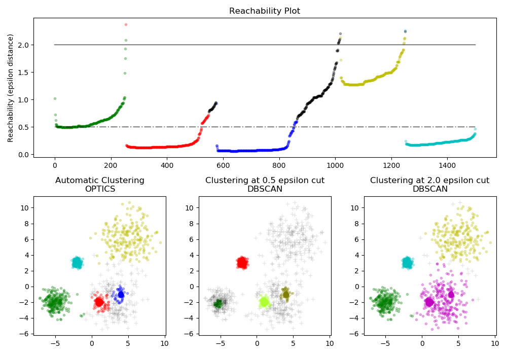](https://scikit-learn.org/stable/auto_examples/cluster/plot_optics.html)

OPTICS生成的可达性距离允许在单个数据集内对进行可变密度的簇提取。如上图所示，结合距离可达性和数据集`ordering_`产生一个可达性图，其中点密度在Y轴上表示，并且点被排序以使得附近点相邻。在单个值处“切割”可达性图会产生类似`DBSCAN`的结果; “切割”上方的所有点都被归类为噪声，每次从左到右读取时都表示新的簇。使用OPTICS的默认簇提取查看图中的陡峭斜率以查找簇，用户可以使用参数`xi`定义什么算作陡峭斜率。对图表本身进行分析还有其他可能性，例如通过可达性树形图生成数据的层次表示，并且可以通过`cluster_hierarchy_`参数访问算法检测到的簇的层次结构。上图是彩色编码的，因此平面空间中的簇颜色与可达性图的线性段簇相匹配。请注意，蓝色和红色聚类在可达性图中是相邻的，并且可以分层次地表示为较大父簇的子代。
>　示例
>* [Demo of OPTICS clustering algorithm](https://scikit-learn.org/stable/auto_examples/cluster/plot_optics.html#sphx-glr-auto-examples-cluster-plot-optics-py)

>**与DBSCAN相比**
>
>OPTICS `cluster_optics_dbscan`方法和DBSCAN的结果非常相似，但并不总是相同; 具体而言，是在标记离群点和噪声点方面。这部分是因为由OPTICS处理的每个密集区域的第一个样本具有大的可达性值，使得接近其区域中的其他点，因此有时将被标记为噪声而不是离群点。当它们被视为被标记为离群点或噪声的候选点时，这会影响相邻点的判断。
>
>请注意，对于任何单个值eps，DBSCAN的运行时间往往比OPTICS短; 但是，对于不同eps 值的重复运行，单次运行OPTICS可能需要比DBSCAN更少的累积运行时间。同样重要的是要注意的是OPTICS的输出接近DBSCAN的只有eps和max_eps接近。

>**计算复杂度**
>
>采用空间索引树以避免计算整个距离矩阵，并允许在大量样本上有效地使用内存。可以通过`metric`关键字提供不同的距离度量。
>
>对于大型数据集，可以通过`HDBSCAN`获得类似（但不相同）的结果 。HDBSCAN实现是多线程的，并且具有比OPTICS更好的算法运行时间复杂性，代价是更高的内存代价。对于使用HDBSCAN将耗尽系统内存的极大数据集，OPTICS将维持n（而不是n^2）内存缩放; 然而，可能需要使用`max_eps`参数的调优来在合理的时间内给出解。

>**参考资料**
>* “OPTICS: ordering points to identify the clustering structure.” Ankerst, Mihael, Markus M. Breunig, Hans-Peter Kriegel, and Jörg Sander. In ACM Sigmod Record, vol. 28, no. 2, pp. 49-60. ACM, 1999.

## 2.3.9. Birch

The [`Birch`](https://scikit-learn.org/stable/modules/generated/sklearn.cluster.Birch.html#sklearn.cluster.Birch "sklearn.cluster.Birch") 为给定数据构建一棵 Characteristic Feature Tree (CFT，聚类特征树)。 数据实质上是被有损压缩成一组 Characteristic Feature nodes (CF Nodes，聚类特征节点)。 CF Nodes 有许多称为 Characteristic Feature subclusters (CF Subclusters) 的子簇，并且这些位于非终结位置的CF Subclusters 可以拥有 CF Nodes 作为子节点。

CF Subclusters 保存用于簇的必要信息，防止将整个输入数据保存在内存中。 这些信息包括:

*   Number of samples in a subcluster（子簇中样本数）.
*   Linear Sum - A n-dimensional vector holding the sum of all samples（保存所有样本和的n维向量）
*   Squared Sum - Sum of the squared L2 norm of all samples（所有样本的L2 norm的平方和）.
*   Centroids - To avoid recalculation linear sum / n_samples（为了防止重复计算 linear sum / n_samples）.
*   Squared norm of the centroids（质心的 Squared norm ）.

Birch 算法有两个参数，即阈值(threshold)和分支因子( branching factor)。分支因子限制了一个节点中的子簇的数量 ，阈值限制了新加入的样本和存在与现有子簇中样本的最大距离。

该算法可以视为将数据简化的一种方法，因为它将输入的数据简化到可以直接从CFT的叶子结点中获取的一组子簇。被简化的数据可以通过将其集合到全局簇(global clusterer)来进一步处理。全局簇可以 通过 ``n_clusters``来设置。

如果 `n_clusters` 被设置为 None，将直接读取叶子结点中的子簇，否则， 一个名为全局聚类的处理步骤将这些子簇全部标记为全局簇，这些样本将被打上距离它们最近的子簇的全局簇的标签。

**算法描述:**

*   一个新的样本作为一个CF Node 被插入到 CF Tree 的根节点。然后将其合并到根节点的子簇中去，使得合并后子簇拥有最小的半径，子簇的选取受阈值和分支因子的约束。如果子簇也拥有孩子节点，则重复执行这个步骤直到到达叶子结点。在叶子结点中找到最近的子簇以后，递归的更新这个子簇及其父簇的属性。
*   如果合并了新样本和最近的子簇获得的子簇半径大于阈值的平方(square of the threshold)， 并且子簇的数量大于分支因子，则将为这个样本分配一个临时空间。 最远的两个子簇被选取，剩下的子簇按照之间的距离分为两组作为被选取的两个子簇的孩子节点。
*   如果拆分的节点有一个父级子簇(parent subcluster)，并且有足够容纳一个新的子簇的空间，那么父簇拆分成两个。如果没有空间容纳一个新的簇，那么这个节点将被再次拆分，依次向上检查父节点是否需要分裂，如果需要, 则按叶子节点方式相同分裂。

**Birch or MiniBatchKMeans?**

*   Birch 在高维数据上表现不好。按经验来说，如果 `n_features` 大于20，通常使用 MiniBatchKMeans 更好。
*   如果需要减少数据实例的数量，或者如果需要大量的子聚类作为预处理步骤或者其他， Birch 比 MiniBatchKMeans 更有用。

**How to use partial_fit?**

为了避免对 global clustering 的计算，每次调用 `partial_fit`，建议进行如下操作:

1.  初始化 `n_clusters=None` 。
2.  通过多次调用 `partial_fit` 训练所有数据。
3.  通过使用 `brc.set_params(n_clusters=n_clusters)` ,设置 `n_clusters` 为所需值。
4.  最后调用无参的 `partial_fit` , 例如 `brc.partial_fit()` 执行全局聚类。

[](https://scikit-learn.org/stable/auto_examples/cluster/plot_birch_vs_minibatchkmeans.html)

> **参考资料**:
>*   Tian Zhang, Raghu Ramakrishnan, Maron Livny BIRCH: An efficient data clustering method for large databases. [http://www.cs.sfu.ca/CourseCentral/459/han/papers/zhang96.pdf](http://www.cs.sfu.ca/CourseCentral/459/han/papers/zhang96.pdf)
>*   Roberto Perdisci JBirch - Java implementation of BIRCH clustering algorithm [https://code.google.com/archive/p/jbirch](https://code.google.com/archive/p/jbirch)

## 2.3.10. 聚类性能度量

度量聚类算法的性能不是简单的统计错误的数量或计算监督分类算法中的 准确率(precision)和 召回率(recall)。 特别地，任何度量指标（evaluation metric）不应该考虑到簇标签的绝对值，而是如果这个聚类方式所分离数据类似于部分真实簇分类 (ground truth set of classes _译注：gorund truth指的是真实值，在这里理解为标准答案_)或者满足某些假设，在同于一个相似性度量（similarity metric）之下,使得属于同一个类内的成员比不同类的成员更加类似。

### 2.3.10.1. 调整后的兰德指数

在已知真实簇标签分配(the ground truth class assignment) `labels_true` 和我们的聚类算法基于相同样本所得到的 `labels_pred`，**调整后的兰德指数(adjusted Rand index)** 是一个函数，用于测量两个簇标签分配的值的 **相似度** ，忽略排列(permutations)和 **with chance normalization**:

```py
>>> from sklearn import metrics
>>> labels_true = [0, 0, 0, 1, 1, 1]
>>> labels_pred = [0, 0, 1, 1, 2, 2]

>>> metrics.adjusted_rand_score(labels_true, labels_pred)  
0.24...

```

在预测的标签列表中重新排列 0 和 1, 把 2 重命名为 3, 得到相同的得分:

```py
>>> labels_pred = [1, 1, 0, 0, 3, 3]
>>> metrics.adjusted_rand_score(labels_true, labels_pred)  
0.24...

```

另外， [`adjusted_rand_score`](https://scikit-learn.org/stable/modules/generated/sklearn.metrics.adjusted_rand_score.html#sklearn.metrics.adjusted_rand_score "sklearn.metrics.adjusted_rand_score") 是 **对称的(symmetric)** : 交换参数不会改变得分。它可以作为 **共识度量(consensus measure)**:

```py
>>> metrics.adjusted_rand_score(labels_pred, labels_true)  
0.24...

```

完美的标签的得分为 1.0

```py
>>> labels_pred = labels_true[:]
>>> metrics.adjusted_rand_score(labels_true, labels_pred)
1.0

```

 不良标签 (e.g. 无相关标签(independent labelings))的得分是负数 或 接近于 0.0 分:

```py
>>> labels_true = [0, 1, 2, 0, 3, 4, 5, 1]
>>> labels_pred = [1, 1, 0, 0, 2, 2, 2, 2]
>>> metrics.adjusted_rand_score(labels_true, labels_pred)  
-0.12...

```

#### 2.3.10.1.1. 优点

*   **Random (uniform) label assignments have a ARI score close to 0.0（随机（统一）标签分配的 ARI 得分接近于 0.0）**  适用于 `n_clusters` 和 `n_samples` 取任何值（这并不适用于原始的 Rand index 或者 V-measure 的情况）。
*   **Bounded range（有界范围） [-1, 1]**: 负值是不良标签(例如:无关联标签)的得分, 类似的聚类结果有一个正的 ARI 值， 1.0 是完美的匹配得分。
*   **No assumption is made on the cluster structure（对簇的结构不需作出任何假设）**: 可以用于比较不同类的聚类算法，例如: k-means 和 谱聚类算法 间的比较。虽然，前者的簇是isotropic blob shapes, 后者的簇是 folded shapes。

#### 2.3.10.1.2. 缺点

*   与惯量相反，**ARI 要求先得知真实簇信息(ground truth classes)** ，而在实践中几乎不可用，或者需要人工标注者手动分配（如在监督学习环境中）。

    然而，ARI 在纯粹的非监督学习的环境下, 作为聚类模型选择过程中共识索引(Consensus Index)的一个构建模块是非常有用的（TODO）。

> **示例**:
>*   [Adjustment for chance in clustering performance evaluation](https://scikit-learn.org/stable/auto_examples/cluster/plot_adjusted_for_chance_measures.html#sphx-glr-auto-examples-cluster-plot-adjusted-for-chance-measures-py): 分析数据集大小对随机分配聚类度量值的影响。

#### 2.3.10.1.3. 数学表达

如果 C 是一个真实簇的标签分配， K 是簇的个数，我们定义  和  如:

*   , 在 C 中的相同集合的与 K 中的相同集合中的元素对数
*   , 在 C 中的不同集合与 K 中的不同集合中的元素对数

原始（未排序）的 Rand index 则由下式给出:


其中  是数据集中可能的数据对(pairs)的总数（不排序）。

然而，RI 得分不能保证 随机标签分配(random label assignments)会获得接近零的值（特别是如果簇的数量与样本数量有着相同的规模排序）。

为了抵消这种影响，我们可以通过定义 adjusted Rand index 来低估(discount)随机标签的预期 RI ![E[\text{RI}]](img/7881dd425f1090aadc25eca46dc0daec.jpg) ,如下所示:

![\text{ARI} = \frac{\text{RI} - E[\text{RI}]}{\max(\text{RI}) - E[\text{RI}]}](img/8f4f76678eb50ebccaba25e86961ff3e.jpg)

> **参考资料**
>*   [Comparing Partitions](http://link.springer.com/article/10.1007%2FBF01908075) L. Hubert and P. Arabie, Journal of Classification 1985
>*   [Wikipedia entry for the adjusted Rand index](https://en.wikipedia.org/wiki/Rand_index#Adjusted_Rand_index)

### 2.3.10.2. 基于互信息(mutual information)的得分

在已知 真实簇的标签分配 `labels_true` 和我们的聚类算法基于相同样本所得到的 `labels_pred`， **互信息** 是测量两个标签分配的 **一致性(agreement)**，忽略排列(permutations)。这种测量方案有两个不同的标准化版本可用，**Normalized Mutual Information(NMI)** 和 **Adjusted Mutual Information(AMI)**。NMI 经常在文献中使用，而 AMI 最近被提出，并且 **normalized against chance** :

```py
>>> from sklearn import metrics
>>> labels_true = [0, 0, 0, 1, 1, 1]
>>> labels_pred = [0, 0, 1, 1, 2, 2]

>>> metrics.adjusted_mutual_info_score(labels_true, labels_pred)  
0.22504...

```

在预测的标签列表中重新排列 0 和 1, 把 2 重命名为 3, 得到相同的得分:

```py
>>> labels_pred = [1, 1, 0, 0, 3, 3]
>>> metrics.adjusted_mutual_info_score(labels_true, labels_pred)  
0.22504...

```

全部的，[`mutual_info_score`](https://scikit-learn.org/stable/modules/generated/sklearn.metrics.mutual_info_score.html#sklearn.metrics.mutual_info_score "sklearn.metrics.mutual_info_score"), [`adjusted_mutual_info_score`](https://scikit-learn.org/stable/modules/generated/sklearn.metrics.adjusted_mutual_info_score.html#sklearn.metrics.adjusted_mutual_info_score "sklearn.metrics.adjusted_mutual_info_score") 和 [`normalized_mutual_info_score`](https://scikit-learn.org/stable/modules/generated/sklearn.metrics.normalized_mutual_info_score.html#sklearn.metrics.normalized_mutual_info_score "sklearn.metrics.normalized_mutual_info_score") 是对称的: 交换参数不会更改分数。因此，它们可以用作 **共识度量**:

```py
>>> metrics.adjusted_mutual_info_score(labels_pred, labels_true)  
0.22504...

```

完美标签得分是 1.0:

```py
>>> labels_pred = labels_true[:]
>>> metrics.adjusted_mutual_info_score(labels_true, labels_pred)
1.0

>>> metrics.normalized_mutual_info_score(labels_true, labels_pred)
1.0

```

这对于 `mutual_info_score` 是不正确的，因此更难判断:

```py
>>> metrics.mutual_info_score(labels_true, labels_pred)  
0.69...

```

不良标签 (例如, 无相关标签) 具有非正分数:

```py
>>> labels_true = [0, 1, 2, 0, 3, 4, 5, 1]
>>> labels_pred = [1, 1, 0, 0, 2, 2, 2, 2]
>>> metrics.adjusted_mutual_info_score(labels_true, labels_pred)  
-0.10526...

```

#### 2.3.10.2.1. 优点

*   **Random (uniform) label assignments have a AMI score close to 0.0（随机（统一）标签分配的AMI评分接近0.0）** 适用于 `n_clusters` 和 `n_samples` 取任何值（这并不适用于原始的 Rand index 或者 V-measure 的情况）。
*   **Upper Bound of 1**: 数值趋近于零，是说明两个标签分配之间是独立，无关联；而数值趋近于一时, 表示两者之间有着极高的一致性(significant agreement)。 甚至，当AMI的取值正好是 1 时, 说明两个标签分配时完全相等的(无论是否排列过)。

#### 2.3.10.2.2. 缺点

*   与惯量相反，**MI-based measures 需要先得知 ground truth classes** ，而在实践中几乎不可用，或者需要人工标注者手动分配（如在监督学习环境中）。

    然而，基于 MI 的测量方式(MI-based measures)也可用于纯无人监控的环境， 作为聚类模型选择过程中共识索引的一个构建模块。

*   NMI 和 MI 不能进行使得随机标签度量的得分为0的调整。

> **示例**:
>*   [Adjustment for chance in clustering performance evaluation](https://scikit-learn.org/stable/auto_examples/cluster/plot_adjusted_for_chance_measures.html#sphx-glr-auto-examples-cluster-plot-adjusted-for-chance-measures-py): 分析数据集大小对随机分配聚类度量值的影响。 此示例还包括 Adjusted Rand Index。

#### 2.3.10.2.3. 数学公式
假设两个标签分配（在相同的 N 个对象中进行）， 和 。 它们的 熵(entropy)是一个分区集合(partition set)的不确定性量，定义如下:


其中  是从  中随机选取的对象,  选取对象落入到类  的概率。同样对于 :


使用 .  和  之间的 mutual information (MI) 由下式计算:


其中  是随机选择的对象同时落入两个类的概率  和  。

也可以用设定的基数表达式表示:

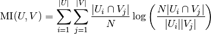

归一化(normalized) mutual information 被定义为

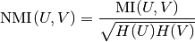

mutual information 的值以及 归一化变量(normalized variant )的值都不会为随机标签度量而调整，但是会随着不同的簇标签数量的增加，不管标签分配之间的 “mutual information” 的实际数量如何，都会趋向于增加。

mutual information 的期望值可以用 Vinh, Epps 和 Bailey,(2009) 的以下公式来计算。在这个方程式中,  ( 中元素的数量) 和  ( 中元素的数量).


![E[\text{MI}(U,V)]=\sum_{i=1}^|U| \sum_{j=1}^|V| \sum_{n_{ij}=(a_i+b_j-N)^+}^{\min(a_i, b_j)} \frac{n_{ij}}{N}\log \left( \frac{ N.n_{ij}}{a_i b_j}\right)\frac{a_i!b_j!(N-a_i)!(N-b_j)!}{N!n_{ij}!(a_i-n_{ij})!(b_j-n_{ij})!(N-a_i-b_j+n_{ij})!}](img/942734d190e4b1d2c51b0e2ee6c24428.jpg)


使用期望值, 然后可以使用与 adjusted Rand index 相似的形式来计算调整后的 mutual information:

![\text{AMI} = \frac{\text{MI} - E[\text{MI}]}{\max(H(U), H(V)) - E[\text{MI}]}](img/17689bafe240fb42feab1cca674b5b88.jpg)

对于归一化互信息和调整互信息，归一化值通常是各聚类熵的某种广义均值。存在各种广义的方法，没有确定的规则来确定哪种方法优于其他方法。这个决定很大程度上是以领域为基础(即不同的领域中，有不同的最优方法);例如，在社区发现算法（Community Detection）中，算术平均是最常见的。每一种归一化方法都提供了“qualitatively similar behaviours”[YAT2016]。在我们的实现中，这是由`average_method`参数控制的。

Vinh等(2010)用平均法命名NMI和AMI的变体[VEB2010]。它们的“平方根”和“和”平均值是几何和算术平均值;我们使用了这些更广泛的通用名称。

> **参考资料**
>*   Strehl, Alexander, and Joydeep Ghosh (2002). “Cluster ensembles – a knowledge reuse framework for combining multiple partitions”. Journal of Machine Learning Research 3: 583–617. [doi:10.1162/153244303321897735](http://strehl.com/download/strehl-jmlr02.pdf).
>*   [Wikipedia entry for the (normalized) Mutual Information](https://en.wikipedia.org/wiki/Mutual_Information)
>*   [Wikipedia entry for the Adjusted Mutual Information](https://en.wikipedia.org/wiki/Adjusted_Mutual_Information)
* [VEB2009]	Vinh, Epps, and Bailey, (2009). “Information theoretic measures for clusterings comparison”. Proceedings of the 26th Annual International Conference on Machine Learning - ICML ‘09. [doi:10.1145/1553374.1553511](https://dl.acm.org/citation.cfm?doid=1553374.1553511). ISBN 9781605585161.
* [VEB2010]	Vinh, Epps, and Bailey, (2010). “Information Theoretic Measures for Clusterings Comparison: Variants, Properties, Normalization and Correction for Chance”. JMLR <http://jmlr.csail.mit.edu/papers/volume11/vinh10a/vinh10a.pdf>
* [YAT2016]	Yang, Algesheimer, and Tessone, (2016). “A comparative analysis of community detection algorithms on artificial networks”. Scientific Reports 6: 30750. [doi:10.1038/srep30750](https://www.nature.com/articles/srep30750).


### 2.3.10.3. 同质性，完整性和 V-measure

已知真实簇标签分配，可以使用 条件熵(conditional entropy)分析来定义一些直观的度量（intuitive metric）。

特别是 Rosenberg 和 Hirschberg (2007) 为任何簇分配定义了以下两个理想的目标:

*   **同质性(homogeneity)**: 每个簇只包含一个类的成员
*   **完整性(completeness)**: 给定类的所有成员都分配给同一个簇。

我们可以把这些概念作为分数 [`homogeneity_score`](https://scikit-learn.org/stable/modules/generated/sklearn.metrics.homogeneity_score.html#sklearn.metrics.homogeneity_score "sklearn.metrics.homogeneity_score") 和 [`completeness_score`](https://scikit-learn.org/stable/modules/generated/sklearn.metrics.completeness_score.html#sklearn.metrics.completeness_score "sklearn.metrics.completeness_score") 。两者均在 0.0 以下 和 1.0 以上（越高越好）:

```py
>>> from sklearn import metrics
>>> labels_true = [0, 0, 0, 1, 1, 1]
>>> labels_pred = [0, 0, 1, 1, 2, 2]

>>> metrics.homogeneity_score(labels_true, labels_pred)  
0.66...

>>> metrics.completeness_score(labels_true, labels_pred)
0.42...

```

称为 **V-measure** 的调和平均数(harmonic mean)由以下函数计算 [`v_measure_score`](https://scikit-learn.org/stable/modules/generated/sklearn.metrics.v_measure_score.html#sklearn.metrics.v_measure_score "sklearn.metrics.v_measure_score"):

该函数公式如下:

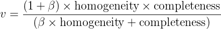

`beta`默认值为1.0，但如果beta值小于1，则为:

```py
>>> metrics.v_measure_score(labels_true, labels_pred, beta=0.6)    
0.54...
```
更大的`beta`权重将提高同质性，当使用大于1的`beta`值时:
``` py
>>> metrics.v_measure_score(labels_true, labels_pred, beta=1.8)    
0.48...
```

更大的`beta`权重将提高完整性。

V-measure 实际上等于上面讨论的 mutual information (NMI) , 仅仅是聚合函数（aggregation function）是算术均值[[B2011]](https://scikit-learn.org/stable/modules/clustering.html#b2011)。

同质性, 完整性 and V-measure 可以使用 [`homogeneity_completeness_v_measure`](https://scikit-learn.org/stable/modules/generated/sklearn.metrics.homogeneity_completeness_v_measure.html#sklearn.metrics.homogeneity_completeness_v_measure "sklearn.metrics.homogeneity_completeness_v_measure")进行计算 如下:

```py
>>> metrics.homogeneity_completeness_v_measure(labels_true, labels_pred)
...                                                      
(0.66..., 0.42..., 0.51...)

```

以下聚类分配稍微好一些，因为它是同质但并不完整:

```py
>>> labels_pred = [0, 0, 0, 1, 2, 2]
>>> metrics.homogeneity_completeness_v_measure(labels_true, labels_pred)
...                                                      
(1.0, 0.68..., 0.81...)

```

> 注意：
>* [`v_measure_score`](https://scikit-learn.org/stable/modules/generated/sklearn.metrics.v_measure_score.html#sklearn.metrics.v_measure_score "sklearn.metrics.v_measure_score") 是 **对称的**: 它可以用于评估同一数据集上两个 无相关标签分配(independent assignments)的 **一致性**。
>*  [`completeness_score`](https://scikit-learn.org/stable/modules/generated/sklearn.metrics.completeness_score.html#sklearn.metrics.completeness_score "sklearn.metrics.completeness_score") 和 [`homogeneity_score`](https://scikit-learn.org/stable/modules/generated/sklearn.metrics.homogeneity_score.html#sklearn.metrics.homogeneity_score "sklearn.metrics.homogeneity_score") 却不适用于上述情况: 两者间存在下述约束:
> ```py
>  homogeneity_score(a, b) == completeness_score(b, a)
>  ```

#### 2.3.10.3.1. 优点

*   **Bounded scores（有界的分数）**: 0.0 是最坏的, 1.0 是一个完美的分数.
*   Intuitive interpretation（直观解释）: 具有不良 V-measure 的聚类可以在 **在同质性和完整性方面进行定性分析** 以更好地感知到标签分配过程中的错误类型。
*   **No assumption is made on the cluster structure（对簇的结构没有作出任何假设）**: 可以用于比较不同类的聚类算法，例如: k-means 和 spectral clustering algorithms（谱聚类算法）间的比较。虽然，前者的簇是isotropic blob shapes, 后者的簇是 folded shapes。

#### 2.3.10.3.2. 缺点

*   之前介绍的度量标准(metrics)**并不针对随机标记进行标准化(not normalized with regards to random labeling)**: 这意味着，依赖样本数量，簇数量和 标定过的真实数据类数量，完全随机的标注方式并不总是产生 同质性，完整性 和 v-measure 的相同值。特别是 **随机标注不会产生零分，特别是当簇数量大时**。

    当样本数量超过 1000，簇的数量小于 10 时，可以安全地忽略此问题。**对于较小的样本数量或者较大数量的簇，使用 adjusted index 例如 Adjusted Rand Index (ARI)）**。

[](https://scikit-learn.org/stable/auto_examples/cluster/plot_adjusted_for_chance_measures.html)

*   这些度量标准 **要求先得知真实数据簇**，而在实践中几乎不可用，或需要人工标注者人工分配（如在受监督的学习环境中）。

> **示例**:
>*   [Adjustment for chance in clustering performance evaluation](https://scikit-learn.org/stable/auto_examples/cluster/plot_adjusted_for_chance_measures.html#sphx-glr-auto-examples-cluster-plot-adjusted-for-chance-measures-py): 分析数据集大小对随机分配聚类度量值的影响。

#### 2.3.10.3.3. 数学表达

 同质性 和 完整性 的得分由下面公式给出:


其中  是 **给定簇分配的类的条件熵** ，由下式给出:


并且  是 **已聚合的类的熵 (entropy of the classes)**，并且由下式给出:

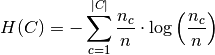

 个样本总数，  和  分别属于  类和簇  的样本数，最后 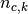 分配给簇  的类  的样本数。

**给定类分配的簇的条件熵（conditional entropy of clusters given class）**  和 **簇的熵** 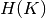 以 对称的形式 定义。

Rosenberg 和 Hirschberg 进一步定义 **V-measure** 作为 **同质性和完整性的调和均值**:


> **参考资料**
>* [V-Measure: A conditional entropy-based external cluster evaluation measure](http://aclweb.org/anthology/D/D07/D07-1043.pdf) Andrew Rosenberg and Julia Hirschberg, 2007
>* [B2011] [Identication and Characterization of Events in Social Media](http://www.cs.columbia.edu/~hila/hila-thesis-distributed.pdf), Hila Becker, PhD Thesis.

### 2.3.10.4. Fowlkes-Mallows 得分

当样本的已标定的真实类分配已知时，可以使用 Fowlkes-Mallows 指数 ([`sklearn.metrics.fowlkes_mallows_score`](https://scikit-learn.org/stable/modules/generated/sklearn.metrics.fowlkes_mallows_score.html#sklearn.metrics.fowlkes_mallows_score "sklearn.metrics.fowlkes_mallows_score")) 。Fowlkes-Mallows 得分 FMI 被定义为 成对的准确率和召回率的几何平均值:


其中的 `TP` 是 **真正例(True Positive)** 的数量（即，真实标签组和预测标签组中属于相同簇的点对数），`FP` 是 **假正例(False Positive)** （即，在真实标签组中属于同一簇的点对数，而不在预测标签组中），`FN` 是 **假负例(False Negative)** 的数量（即，预测标签组中属于同一簇的点对数，而不在真实标签组中）。

得分范围为 0 到 1。较高的值表示两个簇之间的良好相似性。

```py
>>> from sklearn import metrics
>>> labels_true = [0, 0, 0, 1, 1, 1]
>>> labels_pred = [0, 0, 1, 1, 2, 2]

```

```py
>>> metrics.fowlkes_mallows_score(labels_true, labels_pred)  
0.47140...

```

在预测的标签列表中重新排列 0 和 1, 把 2 重命名为 3, 得到相同的得分:

```py
>>> labels_pred = [1, 1, 0, 0, 3, 3]

>>> metrics.fowlkes_mallows_score(labels_true, labels_pred)  
0.47140...

```

完美的标签得分是 1.0:

```py
>>> labels_pred = labels_true[:]
>>> metrics.fowlkes_mallows_score(labels_true, labels_pred)  
1.0

```

 不良标签（例如,无相关标签）的得分为 0:

```py
>>> labels_true = [0, 1, 2, 0, 3, 4, 5, 1]
>>> labels_pred = [1, 1, 0, 0, 2, 2, 2, 2]
>>> metrics.fowlkes_mallows_score(labels_true, labels_pred)  
0.0

```

#### 2.3.10.4.1. 优点

*   **Random (uniform) label assignments have a AMI score close to 0.0（随机（统一）标签分配的AMI评分接近0.0）** 适用于 `n_clusters` 和 `n_samples` 取任何值（这并不适用于原始的 Rand index 或者 V-measure 的情况）。
*   **Upper Bound of 1**: 数值趋近于零，是说明两个标签分配之间是独立，无关联；而数值趋近于一时, 表示两者之间有着极高的相似度(significant agreement)。 甚至，当AMI的取值正好是 1 时, 说明两个标签分配时完全相等的(无论是否排列过)。
*   **No assumption is made on the cluster structure（对簇的结构没有作出任何假设）**: 可以用于比较不同类的聚类算法，例如: k-means 和 spectral clustering algorithms（谱聚类算法）间的比较。虽然，前者的簇是isotropic blob shapes, 后者的簇是 folded shapes。

#### 2.3.10.4.2. 缺点

*   与惯量相反，**基于 FMI 的测量方案需要先了解已标注的真数据类** ，而在实践中几乎不可用，或者需要人工标注者手动分配（如在监督学习的学习环境中）。

> **参考资料**
>*   E. B. Fowkles and C. L. Mallows, 1983. “A method for comparing two hierarchical clusterings”. Journal of the American Statistical Association. [http://wildfire.stat.ucla.edu/pdflibrary/fowlkes.pdf](http://wildfire.stat.ucla.edu/pdflibrary/fowlkes.pdf)
>*   [Wikipedia entry for the Fowlkes-Mallows Index](https://en.wikipedia.org/wiki/Fowlkes-Mallows_index)

### 2.3.10.5. Silhouette 系数

如果不知道真实簇标签，则必须使用模型本身进行度量。Silhouette 系数 ([`sklearn.metrics.silhouette_score`](https://scikit-learn.org/stable/modules/generated/sklearn.metrics.silhouette_score.html#sklearn.metrics.silhouette_score "sklearn.metrics.silhouette_score")) 是一个这样的评估例子，其中较高的 Silhouette 系数得分和能够更好定义的聚类的模型相关联。Silhouette 系数 是依据每个样本进行定义，由两个得分组成:

*   **a**: 样本与同一类别中所有其他点之间的平均距离。
*   **b**: 样本与 _下一个距离最近的簇_ 中的所有其他点之间的平均距离。

然后将单个样本的 Silhouette 系数 _s_ 给出为:


一组样本的 Silhouette 系数可以作为其中每个样本的 Silhouette 系数的平均值。
```py
>>> from sklearn import metrics
>>> from sklearn.metrics import pairwise_distances
>>> from sklearn import datasets
>>> dataset = datasets.load_iris()
>>> X = dataset.data
>>> y = dataset.target

```

在正常使用情况下，将 Silhouette 系数应用于聚类结果的分析。
```py
>>> import numpy as np
>>> from sklearn.cluster import KMeans
>>> kmeans_model = KMeans(n_clusters=3, random_state=1).fit(X)
>>> labels = kmeans_model.labels_
>>> metrics.silhouette_score(X, labels, metric='euclidean')
...                                                      
0.55...

```

> **参考资料**
>*   Peter J. Rousseeuw (1987). “Silhouettes: a Graphical Aid to the Interpretation and Validation of Cluster Analysis”. Computational and Applied Mathematics 20: 53–65. [doi:10.1016/0377-0427(87)90125-7](http://dx.doi.org/10.1016/0377-0427(87)90125-7).

#### 2.3.10.5.1. 优点

*   对于不正确的聚类，分数为 -1 ，高密度聚类为 +1 。零点附近的分数表示 重叠的聚类。
*   当簇密集且分离较好时，分数更高，这关联到了簇的标准概念。

#### 2.3.10.5.2. 缺点

*   凸簇的 Silhouette 系数通常比其他类型的簇更高，例如通过 DBSCAN 获得的基于密度的簇。

> **示例**:
>*   [Selecting the number of clusters with silhouette analysis on KMeans clustering](https://scikit-learn.org/stable/auto_examples/cluster/plot_kmeans_silhouette_analysis.html#sphx-glr-auto-examples-cluster-plot-kmeans-silhouette-analysis-py) : 在这个例子中，silhouette 分析用于为 n_clusters 选择最佳值.

### 2.3.10.6. Calinski-Harabaz 指数

如果不知道真实簇标签，则可以使用 Calinski-Harabaz 指数 ([`sklearn.metrics.calinski_harabaz_score`](https://scikit-learn.org/stable/modules/generated/sklearn.metrics.calinski_harabaz_score.html#sklearn.metrics.calinski_harabaz_score "sklearn.metrics.calinski_harabaz_score"))-或被称为方差比准则(Variance Ratio Criterion)-来评估模型，其中较高的 Calinski-Harabaz 的得分和能够更好定义的聚类的模型相关联。  

对于  簇，Calinski-Harabaz 得分 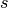 是通过簇间色散平均值(between-clusters dispersion mean)与 簇内色散之间(within-cluster dispersion)的比值给出的:


其中  是组间色散矩阵(between group dispersion matrix)，  是由以下定义的簇内色散矩阵(within-cluster dispersion matrix):


 为数据中的点数，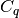 为簇  中的点集，  为簇 的中心，  为  的中心，  为簇  中的点数。

```py
>>> from sklearn import metrics
>>> from sklearn.metrics import pairwise_distances
>>> from sklearn import datasets
>>> dataset = datasets.load_iris()
>>> X = dataset.data
>>> y = dataset.target

```

在正常使用情况下，将 Calinski-Harabaz指数应用于聚类结果的分析。

```py
>>> import numpy as np
>>> from sklearn.cluster import KMeans
>>> kmeans_model = KMeans(n_clusters=3, random_state=1).fit(X)
>>> labels = kmeans_model.labels_
>>> metrics.calinski_harabaz_score(X, labels)  
560.39...

```

#### 2.3.10.6.1. 优点

*   当簇密集且分离较好时，分数更高，这关联到了簇的标准概念。
*   得分计算很快。

#### 2.3.10.6.2. 缺点

*   凸簇的 Calinski-Harabaz 指数通常高于其他类型的簇，例如通过 DBSCAN 获得的基于密度的簇。

> **参考资料**
>*   Caliński, T., & Harabasz, J. (1974). “A dendrite method for cluster analysis”. Communications in Statistics-theory and Methods 3: 1-27. [doi:10.1080/03610926.2011.560741](http://dx.doi.org/10.1080/03610926.2011.560741).

### 2.3.10.7. Davies-Bouldin Index

如果不知道真实簇标签，则可以使用 Davies-Bouldin Index（简称: DBI）([sklearn.metrics.davies_bouldin_score](https://scikit-learn.org/stable/modules/generated/sklearn.metrics.davies_bouldin_score.html#sklearn.metrics.davies_bouldin_score)) 去度量模型, 这里，一个较低的DBI值总是意味着一个具有更好簇间分割表现的模型。
该指数(Index) 每个簇 $$ C_i $$ ，其中$$ i=0,...,k $$和最大相似值的$$ C_j $$之间的相似度均值。在该指数的上下文里，相似度被定义一个用于协调的度量:

*   $$ S_i $$ , 簇 $$ i $$ 内每个点和簇心(centroid of cluster)的平均距离 -- 也称簇直径。
*   $$ d_{ij} $$, 簇心 $$ i $$ 和 $$ j $$ 之间的距离。

 以下是一个简单构建 $$ R_{ij} $$ 的方法，使得它具有非负性和对称性:

  $$ R_{ij} = \frac{s_i + s_j}{d_{ij}} $$

 接着， DBI 就可以如下定义:

 $$ DB = \frac{1}{k} \sum_{i=1}^k \max_{i \ne j} R_{ij} $$

 零是最低得得分. 当 该值越接近零，意味着一个更好的分割表现。

 在一般的情况下， DBI 总是应用于如下得簇分析结果:

```py
 >>> from sklearn import datasets
 >>> iris = datasets.load_iris()
 >>> X = iris.data
 >>> from sklearn.cluster import KMeans
 >>> from sklearn.metrics import davies_bouldin_score
 >>> kmeans = KMeans(n_clusters=3, random_state=1).fit(X)
 >>> labels = kmeans.labels_
 >>> davies_bouldin_score(X, labels)  
 0.6619...
```

#### 2.3.10.7.1. 优点

*    BDI 的计算 比 Silhouette scores 要简单。
*    该指数仅仅只计算数据集内的数量和特征。

#### 2.3.10.7.2. 缺点

*    凸簇(convex clusters)的 DBI 通常比其他类型的簇更高，例如通过 DBSCAN 获得的基于密度的簇。
*    在一般情况下, 质心距离只能使用欧氏空间内的距离度量来衡量。
*    该方法得出的一个好的值并不意味着这是最好的信息检测技术。

> **参考资料**
> * Davies, David L.; Bouldin, Donald W. (1979). “A Cluster Separation Measure” IEEE Transactions on Pattern Analysis and Machine Intelligence. PAMI-1 (2): 224-227. [doi:10.1109/TPAMI.1979.4766909](https://doi.org/10.1109/TPAMI.1979.4766909).
> * Halkidi, Maria; Batistakis, Yannis; Vazirgiannis, Michalis (2001). “On Clustering Validation Techniques” Journal of Intelligent Information Systems, 17(2-3), 107-145. [doi:10.1023/A:1012801612483](https://doi.org/10.1023/A:1012801612483).
> * [Wikipedia entry for Davies-Bouldin index](https://en.wikipedia.org/wiki/Davies%E2%80%93Bouldin_index).

### 2.3.10.8. Contingency Matrix

列联矩阵（Contingency Matrix）([sklearn.metrics.cluster.contingency_matrix](https://scikit-learn.org/stable/modules/generated/sklearn.metrics.cluster.contingency_matrix.html#sklearn.metrics.cluster.contingency_matrix)) 记录了每个真实/预测簇对之间的交叉基数。 列联矩阵为所有的聚合度量提供了足量的统计数据，而其中样本都是独立和相同分布，并不考虑没有被聚合的实例。

一个实例如下:
```py
>>> from sklearn.metrics.cluster import contingency_matrix
>>> x = ["a", "a", "a", "b", "b", "b"]
>>> y = [0, 0, 1, 1, 2, 2]
>>> contingency_matrix(x, y)
array([[2, 1, 0],
       [0, 1, 2]])
```
输出array的第一行 意味着有三个样本的真实簇是'a'. 而在这三个样本中, 两个的预测簇是 0,一个是 1, 没有一个是 2。而第二行意味着有三个样本的真实簇 是'b'。 而其中，没有一个样本的预测簇是 0, 一个是 1, 两个是 2。

这种 分类方式的混淆矩阵([confusion matrix](https://scikit-learn.org/stable/modules/model_evaluation.html#confusion-matrix)) 是一个方块(行数和列数相等)列联矩阵，该矩阵的行列分别对应样本的分类。

#### 2.3.10.8.1. 优点

*    允许 测试每个真实 簇在预测簇上的散布,反之亦然。
*    列联矩阵的计算利用了两个聚类方式之间的相似度统计数据（就像本文档中记录其它方式一样）

#### 2.3.10.8.2. 缺点

*    列联矩阵易用于描述小数量的簇，但是当簇的数量变得很大时，矩阵的描述就会变得异常艰难。
*    该方法并不能用于聚类优化的一个度量手段。

> **参考资料**
> * [Wikipedia entry for contingency matrix](https://en.wikipedia.org/wiki/Contingency_table)
