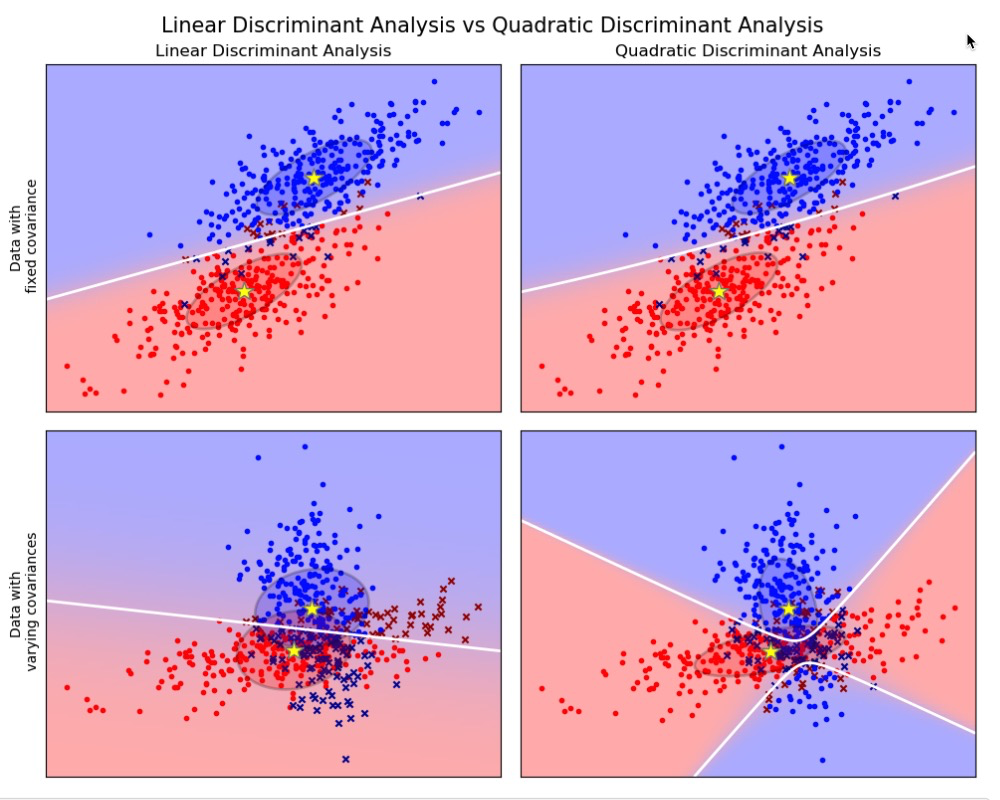
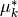
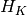
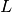

# 1.2. 线性和二次判别分析

校验者:
        [@AnybodyHome](https://github.com/AnybodyHome)
        [@numpy](https://github.com/apachecn/scikit-learn-doc-zh)
        [@Loopy](https://github.com/loopyme)
翻译者:
        [@FAME](https://github.com/apachecn/scikit-learn-doc-zh)

Linear Discriminant Analysis（线性判别分析）([`discriminant_analysis.LinearDiscriminantAnalysis`](https://scikit-learn.org/stable/modules/generated/sklearn.discriminant_analysis.LinearDiscriminantAnalysis.html#sklearn.discriminant_analysis.LinearDiscriminantAnalysis)) 和 Quadratic Discriminant Analysis （二次判别分析）([`discriminant_analysis.QuadraticDiscriminantAnalysis`](https://scikit-learn.org/stable/modules/generated/sklearn.discriminant_analysis.QuadraticDiscriminantAnalysis.html#sklearn.discriminant_analysis.QuadraticDiscriminantAnalysis)) 是两个经典的分类器。 正如他们名字所描述的那样，他们分别代表了线性决策平面和二次决策平面。

这些分类器十分具有吸引力，因为他们可以很容易计算得到闭式解(即解析解)，其天生具有多分类的特性，在实践中已经被证明很有效，并且无需调参。

****

以上这些图像展示了 Linear Discriminant Analysis （线性判别分析）以及 Quadratic Discriminant Analysis （二次判别分析）的决策边界。其中，最后一行表明了线性判别分析只能学习线性边界， 而二次判别分析则可以学习二次边界，因此它相对而言更加灵活。

> 示例:
>* [Linear and Quadratic Discriminant Analysis with covariance ellipsoid](https://scikit-learn.org/stable/auto_examples/classification/plot_lda_qda.html): LDA和QDA在特定数据上的对比

## 1.2.1. 使用线性判别分析来降维

[`discriminant_analysis.LinearDiscriminantAnalysis`](https://scikit-learn.org/stable/modules/generated/sklearn.discriminant_analysis.LinearDiscriminantAnalysis.html#sklearn.discriminant_analysis.LinearDiscriminantAnalysis) 通过把输入的数据投影到由最大化类之间分离的方向所组成的线性子空间，可以执行有监督降维（详细的内容见下面的数学推导）。输出的维度必然会比原来的类别数量更少的。因此它总体而言是十分强大的降维方式，同样也仅仅在多分类环境下才能感觉到。

实现方式在 [`discriminant_analysis.LinearDiscriminantAnalysis.transform`](https://scikit-learn.org/stable/modules/generated/sklearn.discriminant_analysis.LinearDiscriminantAnalysis.html#sklearn.discriminant_analysis.LinearDiscriminantAnalysis.transform) 中。关于维度的数量可以通过 `n_components` 参数来调节。 值得注意的是，这个参数不会对 [`discriminant_analysis.LinearDiscriminantAnalysis.fit`](https://scikit-learn.org/stable/modules/generated/sklearn.discriminant_analysis.LinearDiscriminantAnalysis.html#sklearn.discriminant_analysis.LinearDiscriminantAnalysis.fit) 或者 [`discriminant_analysis.LinearDiscriminantAnalysis.predict`](https://scikit-learn.org/stable/modules/generated/sklearn.discriminant_analysis.LinearDiscriminantAnalysis.html#sklearn.discriminant_analysis.LinearDiscriminantAnalysis.predict) 产生影响。

> **示例**:
>
>[Comparison of LDA and PCA 2D projection of Iris dataset](https://scikit-learn.org/stable/auto_examples/decomposition/plot_pca_vs_lda.html#sphx-glr-auto-examples-decomposition-plot-pca-vs-lda-py): 在 Iris 数据集对比 LDA 和 PCA 之间的降维差异

## 1.2.2. LDA 和 QDA 分类器的数学公式

LDA 和 QDA 都是源于简单的概率模型，这些模型对于每一个类别  的相关分布 都可以通过贝叶斯定理所获得。

我们选择最大化条件概率的类别 .

更具体地说，对于线性以及二次判别分析，  被建模成密度多变量高斯分布:

其中的d是特征数量

为了把该模型作为分类器使用，我们只需要从训练数据中估计出类的先验概率  （通过每个类  的实例的比例得到） 类别均值  （通过经验样本的类别均值得到）以及协方差矩阵（通过经验样本的类别协方差或者正则化的估计器 estimator 得到: 见下面的 shrinkage 章节）。

在 LDA 中，每个类别k的高斯分布共享相同的协方差矩阵:。这导致了两者之间的线性决策面，这可以通过比较对数概率比看出来

![\log[P(y=k | X) / P(y=l | X)]](img/fd132d0faf19fdc76254a6317ed1acfd.jpg) 

在 QDA 中，没有关于高斯协方差矩阵  的假设，因此有了二次决策平面. 更多细节见 参考文献[3].

> **注意:与高斯朴素贝叶斯的关系**
>
>如果在QDA模型中假设协方差矩阵是对角的，则输入被假设为在每个类中是条件独立的，所得的分类器等同于高斯朴素贝叶斯分类器 [`naive_bayes.GaussianNB`](https://scikit-learn.org/stable/modules/generated/sklearn.naive_bayes.GaussianNB.html#sklearn.naive_bayes.GaussianNB) 相同。

## 1.2.3. LDA 的降维数学公式

为了理解 LDA 在降维上的应用，从上面解释的 LDA 分类规则的几何重构开始是十分有用的。我们用  表示目标类别的总数。 由于在 LDA 中我们假设所有类别都有相同估计的协方差  ,所以我们可重新调节数据从而让协方差相同。

在缩放之后对数据点进行分类相当于找到与欧几里得距离中的数据点最接近的估计类别均值。但是它也可以在投影到K-1个由所有类中的所有 生成的仿射子空间 之后完成。这也表明，LDA 分类器中存在一个利用线性投影到  个维度空间的降维工具。

通过投影到线性子空间  上，我们可以进一步将维数减少到一个选定的  ，从而使投影后的  的方差最大化（实际上，为了实现转换类均值 ，我们正在做一种形式的 PCA）。 这里的  对应于 [`discriminant_analysis.LinearDiscriminantAnalysis.transform`](https://scikit-learn.org/stable/modules/generated/sklearn.discriminant_analysis.LinearDiscriminantAnalysis.html#sklearn.discriminant_analysis.LinearDiscriminantAnalysis.transform) 方法中使用的 `n_components` 参数。 详情参考 参考文献[3] 。

## 1.2.4. Shrinkage（收缩）

收缩是一种在训练样本数量相比特征而言很小的情况下可以提升的协方差矩阵预测（准确性）的工具。 在这个情况下，经验样本协方差是一个很差的预测器。收缩 LDA 可以通过设置 [`discriminant_analysis.LinearDiscriminantAnalysis`](https://scikit-learn.org/stable/modules/generated/sklearn.discriminant_analysis.LinearDiscriminantAnalysis.html#sklearn.discriminant_analysis.LinearDiscriminantAnalysis) 类的 `shrinkage` 参数为 ‘auto’ 来实现。

`shrinkage` parameter （收缩参数）的值同样也可以手动被设置为 0-1 之间。特别地，0 值对应着没有收缩（这意味着经验协方差矩阵将会被使用）， 而 1 值则对应着完全使用收缩（意味着方差的对角矩阵将被当作协方差矩阵的估计）。设置该参数在两个极端值之间会估计一个（特定的）协方差矩阵的收缩形式

****

## 1.2.5. 预估算法

默认的 solver 是 ‘svd’。它可以进行classification (分类) 以及 transform (转换),而且它不会依赖于协方差矩阵的计算（结果）。这在特征数量特别大的时候十分具有优势。然而，’svd’ solver 无法与 shrinkage （收缩）同时使用。

`lsqr` solver 则是一个高效的算法，它仅用于分类使用。它支持 shrinkage （收缩）。

`eigen`（特征） solver 是基于 class scatter （类散度）与 class scatter ratio （类内离散率）之间的优化。 它可以被用于 classification （分类）以及 transform （转换），此外它还同时支持收缩。然而，该解决方案需要计算协方差矩阵，因此它可能不适用于具有大量特征的情况。

> 示例:
>
>* [Normal and Shrinkage Linear Discriminant Analysis for classification](https://scikit-learn.org/stable/auto_examples/classification/plot_lda.html#sphx-glr-auto-examples-classification-plot-lda-py): Comparison of LDA classifiers with and without shrinkage.

> **参考资料**:
> * [3] “The Elements of Statistical Learning”, Hastie T., Tibshirani R., Friedman J., Section 4.3, p.106-119, 2008.
> * [4] Ledoit O, Wolf M. Honey, I Shrunk the Sample Covariance Matrix. The Journal of Portfolio Management 30(4), 110-119, 2004.
