# 3.3. 模型评估: 量化预测的质量

校验者:
        [@飓风](https://github.com/apachecn/scikit-learn-doc-zh)
        [@小瑶](https://github.com/apachecn/scikit-learn-doc-zh)
        [@FAME](https://github.com/apachecn/scikit-learn-doc-zh)
        [@v](https://github.com/apachecn/scikit-learn-doc-zh)
        [@Loopy](https://github.com/loopyme)
翻译者:
        [@小瑶](https://github.com/apachecn/scikit-learn-doc-zh)
        [@片刻](https://github.com/apachecn/scikit-learn-doc-zh)
        [@那伊抹微笑](https://github.com/apachecn/scikit-learn-doc-zh)

有 3 种不同的 API 用于评估模型预测的质量:

*   **Estimator score method（估计器得分的方法）**: Estimators（估计器）有一个 `score（得分）` 方法，为其解决的问题提供了默认的 evaluation criterion （评估标准）。 在这个页面上没有相关讨论，但是在每个 estimator （估计器）的文档中会有相关的讨论。
*   **Scoring parameter（评分参数）**: Model-evaluation tools （模型评估工具）使用 [cross-validation](cross_validation.html#cross-validation) (如 [`model_selection.cross_val_score`](https://scikit-learn.org/stable/modules/generated/sklearn.model_selection.cross_val_score.html#sklearn.model_selection.cross_val_score "sklearn.model_selection.cross_val_score") 和 [`model_selection.GridSearchCV`](https://scikit-learn.org/stable/modules/generated/sklearn.model_selection.GridSearchCV.html#sklearn.model_selection.GridSearchCV "sklearn.model_selection.GridSearchCV")) 依靠 internal _scoring_ strategy （内部 _scoring（得分）_ 策略）。这在 [scoring 参数: 定义模型评估规则](#scoring-parameter) 部分讨论。
*   **Metric functions（指标函数）**: `metrics` 模块实现了针对特定目的评估预测误差的函数。这些指标在以下部分部分详细介绍 [分类指标](#332-分类指标), [多标签排名指标](#333-多标签排名指标), [回归指标](#334-回归指标) 和 [聚类指标](#335-聚类指标) 。

最后， [虚拟估计](#336-虚拟估计) 用于获取随机预测的这些指标的基准值。

>See also:对于 “pairwise（成对）” metrics（指标），_samples（样本）_ 之间而不是 estimators （估计量）或者 predictions（预测值），请参阅 [成对的矩阵, 类别和核函数](?) 部分。dr

## 3.3.1. `scoring` 参数: 定义模型评估规则

Model selection （模型选择）和 evaluation （评估）使用工具，例如 [`model_selection.GridSearchCV`](https://scikit-learn.org/stable/modules/generated/sklearn.model_selection.GridSearchCV.html#sklearn.model_selection.GridSearchCV "sklearn.model_selection.GridSearchCV") 和 [`model_selection.cross_val_score`](https://scikit-learn.org/stable/modules/generated/sklearn.model_selection.cross_val_score.html#sklearn.model_selection.cross_val_score "sklearn.model_selection.cross_val_score") ，采用 `scoring` 参数来控制它们对 estimators evaluated （评估的估计量）应用的指标。

### 3.3.1.1. 常见场景: 预定义值

对于最常见的用例, 您可以使用 `scoring` 参数指定一个 scorer object （记分对象）; 下表显示了所有可能的值。 所有 scorer objects （记分对象）遵循惯例 **higher return values are better than lower return values（较高的返回值优于较低的返回值）** 。因此，测量模型和数据之间距离的 metrics （度量），如 [`metrics.mean_squared_error`](https://scikit-learn.org/stable/modules/generated/sklearn.metrics.mean_squared_error.html#sklearn.metrics.mean_squared_error "sklearn.metrics.mean_squared_error") 可用作返回 metric （指数）的 negated value （否定值）的 neg_mean_squared_error 。

| Scoring（得分） | Function（函数） | Comment（注解） |
| --- | --- | --- |
| **Classification（分类）** |   |   |
| ‘accuracy’ | [`metrics.accuracy_score`](https://scikit-learn.org/stable/modules/generated/sklearn.metrics.accuracy_score.html#sklearn.metrics.accuracy_score "sklearn.metrics.accuracy_score") |   |
| ‘average_precision’ | [`metrics.average_precision_score`](https://scikit-learn.org/stable/modules/generated/sklearn.metrics.average_precision_score.html#sklearn.metrics.average_precision_score "sklearn.metrics.average_precision_score") |   |
| ‘f1’ | [`metrics.f1_score`](https://scikit-learn.org/stable/modules/generated/sklearn.metrics.f1_score.html#sklearn.metrics.f1_score "sklearn.metrics.f1_score") | for binary targets（用于二进制目标） |
| ‘f1_micro’ | [`metrics.f1_score`](https://scikit-learn.org/stable/modules/generated/sklearn.metrics.f1_score.html#sklearn.metrics.f1_score "sklearn.metrics.f1_score") | micro-averaged（微平均） |
| ‘f1_macro’ | [`metrics.f1_score`](https://scikit-learn.org/stable/modules/generated/sklearn.metrics.f1_score.html#sklearn.metrics.f1_score "sklearn.metrics.f1_score") | macro-averaged（宏平均） |
| ‘f1_weighted’ | [`metrics.f1_score`](https://scikit-learn.org/stable/modules/generated/sklearn.metrics.f1_score.html#sklearn.metrics.f1_score "sklearn.metrics.f1_score") | weighted average（加权平均） |
| ‘f1_samples’ | [`metrics.f1_score`](https://scikit-learn.org/stable/modules/generated/sklearn.metrics.f1_score.html#sklearn.metrics.f1_score "sklearn.metrics.f1_score") | by multilabel sample（通过 multilabel 样本） |
| ‘neg_log_loss’ | [`metrics.log_loss`](https://scikit-learn.org/stable/modules/generated/sklearn.metrics.log_loss.html#sklearn.metrics.log_loss "sklearn.metrics.log_loss") | requires `predict_proba` support（需要 `predict_proba` 支持） |
| ‘precision’ etc. | [`metrics.precision_score`](https://scikit-learn.org/stable/modules/generated/sklearn.metrics.precision_score.html#sklearn.metrics.precision_score "sklearn.metrics.precision_score") | suffixes apply as with ‘f1’（后缀适用于 ‘f1’） |
| ‘recall’ etc. | [`metrics.recall_score`](https://scikit-learn.org/stable/modules/generated/sklearn.metrics.recall_score.html#sklearn.metrics.recall_score "sklearn.metrics.recall_score") | suffixes apply as with ‘f1’（后缀适用于 ‘f1’） |
| ‘roc_auc’ | [`metrics.roc_auc_score`](https://scikit-learn.org/stable/modules/generated/sklearn.metrics.roc_auc_score.html#sklearn.metrics.roc_auc_score "sklearn.metrics.roc_auc_score") |   |
| **Clustering（聚类）** |   |   |
| ‘adjusted_mutual_info_score’ | [`metrics.adjusted_mutual_info_score`](https://scikit-learn.org/stable/modules/generated/sklearn.metrics.adjusted_mutual_info_score.html#sklearn.metrics.adjusted_mutual_info_score "sklearn.metrics.adjusted_mutual_info_score") |   |
| ‘adjusted_rand_score’ | [`metrics.adjusted_rand_score`](https://scikit-learn.org/stable/modules/generated/sklearn.metrics.adjusted_rand_score.html#sklearn.metrics.adjusted_rand_score "sklearn.metrics.adjusted_rand_score") |   |
| ‘completeness_score’ | [`metrics.completeness_score`](https://scikit-learn.org/stable/modules/generated/sklearn.metrics.completeness_score.html#sklearn.metrics.completeness_score "sklearn.metrics.completeness_score") |   |
| ‘fowlkes_mallows_score’ | [`metrics.fowlkes_mallows_score`](https://scikit-learn.org/stable/modules/generated/sklearn.metrics.fowlkes_mallows_score.html#sklearn.metrics.fowlkes_mallows_score "sklearn.metrics.fowlkes_mallows_score") |   |
| ‘homogeneity_score’ | [`metrics.homogeneity_score`](https://scikit-learn.org/stable/modules/generated/sklearn.metrics.homogeneity_score.html#sklearn.metrics.homogeneity_score "sklearn.metrics.homogeneity_score") |   |
| ‘mutual_info_score’ | [`metrics.mutual_info_score`](https://scikit-learn.org/stable/modules/generated/sklearn.metrics.mutual_info_score.html#sklearn.metrics.mutual_info_score "sklearn.metrics.mutual_info_score") |   |
| ‘normalized_mutual_info_score’ | [`metrics.normalized_mutual_info_score`](https://scikit-learn.org/stable/modules/generated/sklearn.metrics.normalized_mutual_info_score.html#sklearn.metrics.normalized_mutual_info_score "sklearn.metrics.normalized_mutual_info_score") |   |
| ‘v_measure_score’ | [`metrics.v_measure_score`](https://scikit-learn.org/stable/modules/generated/sklearn.metrics.v_measure_score.html#sklearn.metrics.v_measure_score "sklearn.metrics.v_measure_score") |   |
| **Regression（回归）** |   |   |
| ‘explained_variance’ | [`metrics.explained_variance_score`](https://scikit-learn.org/stable/modules/generated/sklearn.metrics.explained_variance_score.html#sklearn.metrics.explained_variance_score "sklearn.metrics.explained_variance_score") |   |
| ‘neg_mean_absolute_error’ | [`metrics.mean_absolute_error`](https://scikit-learn.org/stable/modules/generated/sklearn.metrics.mean_absolute_error.html#sklearn.metrics.mean_absolute_error "sklearn.metrics.mean_absolute_error") |   |
| ‘neg_mean_squared_error’ | [`metrics.mean_squared_error`](https://scikit-learn.org/stable/modules/generated/sklearn.metrics.mean_squared_error.html#sklearn.metrics.mean_squared_error "sklearn.metrics.mean_squared_error") |   |
| ‘neg_mean_squared_log_error’ | [`metrics.mean_squared_log_error`](https://scikit-learn.org/stable/modules/generated/sklearn.metrics.mean_squared_log_error.html#sklearn.metrics.mean_squared_log_error "sklearn.metrics.mean_squared_log_error") |   |
| ‘neg_median_absolute_error’ | [`metrics.median_absolute_error`](https://scikit-learn.org/stable/modules/generated/sklearn.metrics.median_absolute_error.html#sklearn.metrics.median_absolute_error "sklearn.metrics.median_absolute_error") |   |
| ‘r2’ | [`metrics.r2_score`](https://scikit-learn.org/stable/modules/generated/sklearn.metrics.r2_score.html#sklearn.metrics.r2_score "sklearn.metrics.r2_score") |   |

使用案例:

```py
>>> from sklearn import svm, datasets
>>> from sklearn.model_selection import cross_val_score
>>> iris = datasets.load_iris()
>>> X, y = iris.data, iris.target
>>> clf = svm.SVC(probability=True, random_state=0)
>>> cross_val_score(clf, X, y, scoring='neg_log_loss')
array([-0.07..., -0.16..., -0.06...])
>>> model = svm.SVC()
>>> cross_val_score(model, X, y, scoring='wrong_choice')
Traceback (most recent call last):
ValueError: 'wrong_choice' is not a valid scoring value. Valid options are ['accuracy', 'adjusted_mutual_info_score', 'adjusted_rand_score', 'average_precision', 'completeness_score', 'explained_variance', 'f1', 'f1_macro', 'f1_micro', 'f1_samples', 'f1_weighted', 'fowlkes_mallows_score', 'homogeneity_score', 'mutual_info_score', 'neg_log_loss', 'neg_mean_absolute_error', 'neg_mean_squared_error', 'neg_mean_squared_log_error', 'neg_median_absolute_error', 'normalized_mutual_info_score', 'precision', 'precision_macro', 'precision_micro', 'precision_samples', 'precision_weighted', 'r2', 'recall', 'recall_macro', 'recall_micro', 'recall_samples', 'recall_weighted', 'roc_auc', 'v_measure_score']

```

>**注意**
>
>ValueError exception 列出的值对应于以下部分描述的 functions measuring prediction accuracy （测量预测精度的函数）。 这些函数的 scorer objects （记分对象）存储在 dictionary `sklearn.metrics.SCORERS` 中。

### 3.3.1.2. 根据 metric 函数定义您的评分策略

模块 [`sklearn.metrics`](classes.html#module-sklearn.metrics "sklearn.metrics") 还公开了一组 measuring a prediction error （测量预测误差）的简单函数，给出了基础真实的数据和预测:

*   函数以 `_score` 结尾返回一个值来最大化，越高越好。
*   函数 `_error` 或 `_loss` 结尾返回一个值来 minimize （最小化），越低越好。当使用 [`make_scorer`](https://scikit-learn.org/stable/modules/generated/sklearn.metrics.make_scorer.html#sklearn.metrics.make_scorer "sklearn.metrics.make_scorer") 转换成 scorer object （记分对象）时，将 `greater_is_better` 参数设置为 False（默认为 True; 请参阅下面的参数说明）。

可用于各种机器学习任务的 Metrics （指标）在下面详细介绍。

许多 metrics （指标）没有被用作 `scoring（得分）` 值的名称，有时是因为它们需要额外的参数，例如 [`fbeta_score`](https://scikit-learn.org/stable/modules/generated/sklearn.metrics.fbeta_score.html#sklearn.metrics.fbeta_score "sklearn.metrics.fbeta_score") 。在这种情况下，您需要生成一个适当的 scoring object （评分对象）。生成 callable object for scoring （可评估对象进行评分）的最简单方法是使用 [`make_scorer`](https://scikit-learn.org/stable/modules/generated/sklearn.metrics.make_scorer.html#sklearn.metrics.make_scorer "sklearn.metrics.make_scorer") 。该函数将 metrics （指数）转换为可用于可调用的 model evaluation （模型评估）。

一个典型的用例是从库中包含一个非默认值参数的 existing metric function （现有指数函数），例如 [`fbeta_score`](https://scikit-learn.org/stable/modules/generated/sklearn.metrics.fbeta_score.html#sklearn.metrics.fbeta_score "sklearn.metrics.fbeta_score") 函数的 `beta` 参数:

```py
>>> from sklearn.metrics import fbeta_score, make_scorer
>>> ftwo_scorer = make_scorer(fbeta_score, beta=2)
>>> from sklearn.model_selection import GridSearchCV
>>> from sklearn.svm import LinearSVC
>>> grid = GridSearchCV(LinearSVC(), param_grid={'C': [1, 10]}, scoring=ftwo_scorer)

```

第二个用例是使用 [`make_scorer`](https://scikit-learn.org/stable/modules/generated/sklearn.metrics.make_scorer.html#sklearn.metrics.make_scorer "sklearn.metrics.make_scorer") 从简单的 python 函数构建一个完全 custom scorer object （自定义的记分对象），可以使用几个参数 :

*   你要使用的 python 函数（在下面的例子中是 `my_custom_loss_func`）
*   python 函数是否返回一个分数 (`greater_is_better=True`, 默认值) 或者一个 loss （损失） (`greater_is_better=False`)。 如果是一个 loss （损失），scorer object （记分对象）的 python 函数的输出被 negated （否定），符合 cross validation convention （交叉验证约定），scorers 为更好的模型返回更高的值。
*   仅用于 classification metrics （分类指数）: 您提供的 python 函数是否需要连续的 continuous decision certainties （判断确定性）（`needs_threshold=True`）。默认值为 False 。
*   任何其他参数，如 `beta` 或者 `labels` 在 函数 [`f1_score`](https://scikit-learn.org/stable/modules/generated/sklearn.metrics.f1_score.html#sklearn.metrics.f1_score "sklearn.metrics.f1_score") 。

以下是建立 custom scorers （自定义记分对象）的示例，并使用 `greater_is_better` 参数:

```py
>>> import numpy as np
>>> def my_custom_loss_func(y_true, y_pred):
...     diff = np.abs(y_true - y_pred).max()
...     return np.log1p(diff)
...
>>> # score will negate the return value of my_custom_loss_func,
>>> # which will be np.log(2), 0.693, given the values for X
>>> # and y defined below.
>>> score = make_scorer(my_custom_loss_func, greater_is_better=False)
>>> X = [[1], [1]]
>>> y = [0, 1]
>>> from sklearn.dummy import DummyClassifier
>>> clf = DummyClassifier(strategy='most_frequent', random_state=0)
>>> clf = clf.fit(X, y)
>>> my_custom_loss_func(clf.predict(X), y)
0.69...
>>> score(clf, X, y)
-0.69...

```

### 3.3.1.3. 实现自己的记分对象

您可以通过从头开始构建自己的 scoring object （记分对象），而不使用 [`make_scorer`](https://scikit-learn.org/stable/modules/generated/sklearn.metrics.make_scorer.html#sklearn.metrics.make_scorer "sklearn.metrics.make_scorer") factory 来生成更加灵活的 model scorers （模型记分对象）。 对于被叫做 scorer 来说，它需要符合以下两个规则所指定的协议:

*   可以使用参数 `(estimator, X, y)` 来调用它，其中 `estimator` 是要被评估的模型，`X` 是验证数据， `y` 是 `X` (在有监督情况下) 或 `None` (在无监督情况下) 已经被标注的真实数据目标。
*   它返回一个浮点数，用于对 `X` 进行量化 `estimator` 的预测质量，参考 `y` 。 再次，按照惯例，更高的数字更好，所以如果你的 scorer 返回 loss ，那么这个值应该被 negated 。

>**注意**:在n_jobs > 1的函数中使用自定义评分器
>
>虽然在调用函数的旁边定义自定义计分函数应该使用默认的joblib后端(loky)，但是从另一个模块导入它将是一种更健壮的方法，并且独立于joblib后端。
>
>例如，在下面的例子中，要使用大于1的`n_jobs`,`custom_scoring_function`函数保存在用户创建的模块中(custom_scorer_module.py)并导入:
  ```py
  >>> from custom_scorer_module import custom_scoring_function
  >>> cross_val_score(model,
  ...  X_train,
  ...  y_train,
  ...  scoring=make_scorer(custom_scoring_function, greater_is_better=False),
  ...  cv=5,
  ...  n_jobs=-1)
  ```

### 3.3.1.4. 使用多个指数评估

Scikit-learn 还允许在 `GridSearchCV`, `RandomizedSearchCV` 和 `cross_validate` 中评估 multiple metric （多个指数）。

为 `scoring` 参数指定多个评分指标有两种方法:

* 作为 string metrics 的迭代:
  ```py
  >>> scoring = ['accuracy', 'precision']
  ```

*  作为 dict ，将 scorer 名称映射到 scoring 函数:
```py
>>> from sklearn.metrics import accuracy_score
>>> from sklearn.metrics import make_scorer
>>> scoring = {'accuracy': make_scorer(accuracy_score),
...            'prec': 'precision'}
```

请注意， dict 值可以是 scorer functions （记分函数）或者 predefined metric strings （预定义 metric 字符串）之一。

目前，只有那些返回 single score （单一分数）的 scorer functions （记分函数）才能在 dict 内传递。不允许返回多个值的 Scorer functions （Scorer 函数），并且需要一个 wrapper 才能返回 single metric（单个指标）:

```py
>>> from sklearn.model_selection import cross_validate
>>> from sklearn.metrics import confusion_matrix
>>> # A sample toy binary classification dataset
>>> X, y = datasets.make_classification(n_classes=2, random_state=0)
>>> svm = LinearSVC(random_state=0)
>>> def tn(y_true, y_pred): return confusion_matrix(y_true, y_pred)[0, 0]
>>> def fp(y_true, y_pred): return confusion_matrix(y_true, y_pred)[0, 1]
>>> def fn(y_true, y_pred): return confusion_matrix(y_true, y_pred)[1, 0]
>>> def tp(y_true, y_pred): return confusion_matrix(y_true, y_pred)[1, 1]
>>> scoring = {'tp': make_scorer(tp), 'tn': make_scorer(tn),
...            'fp': make_scorer(fp), 'fn': make_scorer(fn)}
>>> cv_results = cross_validate(svm.fit(X, y), X, y,
...                             scoring=scoring, cv=5)
>>> # Getting the test set true positive scores
>>> print(cv_results['test_tp'])  
[10  9  8  7  8]
>>> # Getting the test set false negative scores
>>> print(cv_results['test_fn'])  
[0 1 2 3 2]

```

## 3.3.2. 分类指标

[`sklearn.metrics`](classes.html#module-sklearn.metrics "sklearn.metrics") 模块实现了几个 loss, score, 和 utility 函数来衡量 classification （分类）性能。 某些 metrics （指标）可能需要 positive class （正类），confidence values（置信度值）或 binary decisions values （二进制决策值）的概率估计。 大多数的实现允许每个样本通过 `sample_weight` 参数为 overall score （总分）提供 weighted contribution （加权贡献）。

其中一些仅限于二分类案例:

|调用|功能|
|---|---|
| [`precision_recall_curve`](https://scikit-learn.org/stable/modules/generated/sklearn.metrics.precision_recall_curve.html#sklearn.metrics.precision_recall_curve "sklearn.metrics.precision_recall_curve")(y_true, probas_pred) | Compute precision-recall pairs for different probability thresholds |
| [`roc_curve`](https://scikit-learn.org/stable/modules/generated/sklearn.metrics.roc_curve.html#sklearn.metrics.roc_curve "sklearn.metrics.roc_curve")(y_true, y_score[, pos_label, …]) | Compute Receiver operating characteristic (ROC) |

其他也可以在多分类案例中运行:

|调用|功能|
|---|---|
| [`cohen_kappa_score`](https://scikit-learn.org/stable/modules/generated/sklearn.metrics.cohen_kappa_score.html#sklearn.metrics.cohen_kappa_score "sklearn.metrics.cohen_kappa_score")(y1, y2[, labels, weights, …]) | Cohen’s kappa: a statistic that measures inter-annotator agreement. |
| [`confusion_matrix`](https://scikit-learn.org/stable/modules/generated/sklearn.metrics.confusion_matrix.html#sklearn.metrics.confusion_matrix "sklearn.metrics.confusion_matrix")(y_true, y_pred[, labels, …]) | Compute confusion matrix to evaluate the accuracy of a classification |
| [`hinge_loss`](https://scikit-learn.org/stable/modules/generated/sklearn.metrics.hinge_loss.html#sklearn.metrics.hinge_loss "sklearn.metrics.hinge_loss")(y_true, pred_decision[, labels, …]) | Average hinge loss (non-regularized) |
| [`matthews_corrcoef`](https://scikit-learn.org/stable/modules/generated/sklearn.metrics.matthews_corrcoef.html#sklearn.metrics.matthews_corrcoef "sklearn.metrics.matthews_corrcoef")(y_true, y_pred[, …]) | Compute the Matthews correlation coefficient (MCC) |

有些还可以在 multilabel case （多重案例）中工作:

|调用|功能|
|---|---|
| [`accuracy_score`](https://scikit-learn.org/stable/modules/generated/sklearn.metrics.accuracy_score.html#sklearn.metrics.accuracy_score "sklearn.metrics.accuracy_score")(y_true, y_pred[, normalize, …]) | Accuracy classification score. |
| [`classification_report`](https://scikit-learn.org/stable/modules/generated/sklearn.metrics.classification_report.html#sklearn.metrics.classification_report "sklearn.metrics.classification_report")(y_true, y_pred[, …]) | Build a text report showing the main classification metrics |
| [`f1_score`](https://scikit-learn.org/stable/modules/generated/sklearn.metrics.f1_score.html#sklearn.metrics.f1_score "sklearn.metrics.f1_score")(y_true, y_pred[, labels, …]) | Compute the F1 score, also known as balanced F-score or F-measure |
| [`fbeta_score`](https://scikit-learn.org/stable/modules/generated/sklearn.metrics.fbeta_score.html#sklearn.metrics.fbeta_score "sklearn.metrics.fbeta_score")(y_true, y_pred, beta[, labels, …]) | Compute the F-beta score |
| [`hamming_loss`](https://scikit-learn.org/stable/modules/generated/sklearn.metrics.hamming_loss.html#sklearn.metrics.hamming_loss "sklearn.metrics.hamming_loss")(y_true, y_pred[, labels, …]) | Compute the average Hamming loss. |
| [`jaccard_similarity_score`](https://scikit-learn.org/stable/modules/generated/sklearn.metrics.jaccard_similarity_score.html#sklearn.metrics.jaccard_similarity_score "sklearn.metrics.jaccard_similarity_score")(y_true, y_pred[, …]) | Jaccard similarity coefficient score |
| [`log_loss`](https://scikit-learn.org/stable/modules/generated/sklearn.metrics.log_loss.html#sklearn.metrics.log_loss "sklearn.metrics.log_loss")(y_true, y_pred[, eps, normalize, …]) | Log loss, aka logistic loss or cross-entropy loss. |
| [`precision_recall_fscore_support`](https://scikit-learn.org/stable/modules/generated/sklearn.metrics.precision_recall_fscore_support.html#sklearn.metrics.precision_recall_fscore_support "sklearn.metrics.precision_recall_fscore_support")(y_true, y_pred) | Compute precision, recall, F-measure and support for each class |
| [`precision_score`](https://scikit-learn.org/stable/modules/generated/sklearn.metrics.precision_score.html#sklearn.metrics.precision_score "sklearn.metrics.precision_score")(y_true, y_pred[, labels, …]) | Compute the precision |
| [`recall_score`](https://scikit-learn.org/stable/modules/generated/sklearn.metrics.recall_score.html#sklearn.metrics.recall_score "sklearn.metrics.recall_score")(y_true, y_pred[, labels, …]) | Compute the recall |
| [`zero_one_loss`](https://scikit-learn.org/stable/modules/generated/sklearn.metrics.zero_one_loss.html#sklearn.metrics.zero_one_loss "sklearn.metrics.zero_one_loss")(y_true, y_pred[, normalize, …]) | Zero-one classification loss. |

一些通常用于 ranking:

|调用|功能|
|---|---|
| [`dcg_score`](https://scikit-learn.org/stable/modules/generated/sklearn.metrics.dcg_score.html#sklearn.metrics.dcg_score "sklearn.metrics.dcg_score")(y_true, y_score[, k]) | Discounted cumulative gain (DCG) at rank K. |
| [`ndcg_score`](https://scikit-learn.org/stable/modules/generated/sklearn.metrics.ndcg_score.html#sklearn.metrics.ndcg_score "sklearn.metrics.ndcg_score")(y_true, y_score[, k]) | Normalized discounted cumulative gain (NDCG) at rank K. |

有些工作与 binary 和 multilabel （但不是多类）的问题:

|调用|功能|
|---|---|
| [`average_precision_score`](https://scikit-learn.org/stable/modules/generated/sklearn.metrics.average_precision_score.html#sklearn.metrics.average_precision_score "sklearn.metrics.average_precision_score")(y_true, y_score[, …]) | Compute average precision (AP) from prediction scores |
| [`roc_auc_score`](https://scikit-learn.org/stable/modules/generated/sklearn.metrics.roc_auc_score.html#sklearn.metrics.roc_auc_score "sklearn.metrics.roc_auc_score")(y_true, y_score[, average, …]) | Compute Area Under the Curve (AUC) from prediction scores |

在以下小节中，我们将介绍每个这些功能，前面是一些关于通用 API 和 metric 定义的注释。

### 3.3.2.1. 从二分到多分类和 multilabel

一些 metrics 基本上是为 binary classification tasks （二分类任务）定义的 (例如 [`f1_score`](https://scikit-learn.org/stable/modules/generated/sklearn.metrics.f1_score.html#sklearn.metrics.f1_score "sklearn.metrics.f1_score"), [`roc_auc_score`](https://scikit-learn.org/stable/modules/generated/sklearn.metrics.roc_auc_score.html#sklearn.metrics.roc_auc_score "sklearn.metrics.roc_auc_score")) 。在这些情况下，默认情况下仅评估 positive label （正标签），假设默认情况下，positive label （正类）标记为 `1` （尽管可以通过 `pos_label` 参数进行配置）。

将 binary metric （二分指标）扩展为 multiclass （多类）或 multilabel （多标签）问题时，数据将被视为二分问题的集合，每个类都有一个。 然后可以使用多种方法在整个类中 average binary metric calculations （平均二分指标计算），每种类在某些情况下可能会有用。 如果可用，您应该使用 `average` 参数来选择它们。

*   `"macro（宏）"` 简单地计算 binary metrics （二分指标）的平均值，赋予每个类别相同的权重。在不常见的类别重要的问题上，macro-averaging （宏观平均）可能是突出表现的一种手段。另一方面，所有类别同样重要的假设通常是不真实的，因此 macro-averaging （宏观平均）将过度强调不频繁类的典型的低性能。
*   `"weighted（加权）"` 通过计算其在真实数据样本中的存在来对每个类的 score 进行加权的 binary metrics （二分指标）的平均值来计算类不平衡。
*   `"micro（微）"` 给每个 sample-class pair （样本类对）对 overall metric （总体指数）（sample-class 权重的结果除外） 等同的贡献。除了对每个类别的 metric 进行求和之外，这个总和构成每个类别度量的 dividends （除数）和 divisors （除数）计算一个整体商。 在 multilabel settings （多标签设置）中，Micro-averaging 可能是优先选择的，包括要忽略 majority class （多数类）的 multiclass classification （多类分类）。
*   `"samples（样本）"` 仅适用于 multilabel problems （多标签问题）。它 does not calculate a per-class measure （不计算每个类别的 measure），而是计算 evaluation data （评估数据）中的每个样本的 true and predicted classes （真实和预测类别）的 metric （指标），并返回 (`sample_weight`-weighted) 加权平均。
*   选择 `average=None` 将返回一个 array 与每个类的 score 。

虽然将 multiclass data （多类数据）提供给 metric ，如 binary targets （二分类目标），作为 array of class labels （类标签的数组），multilabel data （多标签数据）被指定为 indicator matrix（指示符矩阵），其中 cell `[i, j]` 具有值 1，如果样本 `i` 具有标号 `j` ，否则为值 0 。

### 3.3.2.2. 精确度得分

[`accuracy_score`](https://scikit-learn.org/stable/modules/generated/sklearn.metrics.accuracy_score.html#sklearn.metrics.accuracy_score "sklearn.metrics.accuracy_score") 函数计算 [accuracy](https://en.wikipedia.org/wiki/Accuracy_and_precision), 正确预测的分数（默认）或计数 (normalize=False)。

在 multilabel classification （多标签分类）中，函数返回 subset accuracy（子集精度）。如果样本的 entire set of predicted labels （整套预测标签）与真正的标签组合匹配，则子集精度为 1.0; 否则为 0.0 。

如果  是第  个样本的预测值，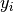 是相应的真实值，则  上的正确预测的分数被定义为


其中  是 [indicator function（指示函数）](https://en.wikipedia.org/wiki/Indicator_function).

```py
>>> import numpy as np
>>> from sklearn.metrics import accuracy_score
>>> y_pred = [0, 2, 1, 3]
>>> y_true = [0, 1, 2, 3]
>>> accuracy_score(y_true, y_pred)
0.5
>>> accuracy_score(y_true, y_pred, normalize=False)
2

```

In the multilabel case with binary label indicators（在具有二分标签指示符的多标签情况下）:

```py
>>> accuracy_score(np.array([[0, 1], [1, 1]]), np.ones((2, 2)))
0.5

```

> **示例**:
>*   参阅 [Test with permutations the significance of a classification score](https://scikit-learn.org/stable/auto_examples/feature_selection/plot_permutation_test_for_classification.html#sphx-glr-auto-examples-feature-selection-plot-permutation-test-for-classification-py) 例如使用数据集排列的 accuracy score （精度分数）。

### 3.3.2.3. Balanced accuracy score
此`balanced_accuracy_score`函数计算 balanced accuracy, 它可以避免在不平衡数据集上作出夸大的性能估计。它是每个类的召回分数的宏观平均，或者，等价地，原始准确度，其中每个样本根据其真实类的样本占比率加权。因此，对均衡数据集，该函数的得分与准确率得分是相等的。

在二分类情况下, `balanced accuracy` 等价于[sensitivity](https://en.wikipedia.org/wiki/Sensitivity_and_specificity)(true positive rate)和 [specificity](https://en.wikipedia.org/wiki/Sensitivity_and_specificity)(真负率:true negative rate)的算术平均值, 或者ROC曲线下具有二元预测值的面积，而不是分数。

如果分类器在两个类上都表现的一样好，该函数就会退化为传统的准确率(即正确预测数量除以总的预测数量).

作为对比, 如果传统的准确率(conventional accuracy)比较好，仅仅是因为分类器利用了一个不均衡测试集，此时`balanced_accuracy`将会近似地掉到

得分的范围是0到1, 或者当设置参数`adjusted`=True 时，得分被缩放到从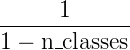到1,包括边界的,随机条件下得分为0.

如果y<sub>i</sub>是第i个样本的真值，并且w<sub>i</sub>是对应的样本权重，然后我们调整样本权重到:


其中`1(x)`是[Indicator_function](https://en.wikipedia.org/wiki/Indicator_function),给定样本中，如果是第i个样本的真值,则`balanced_accuracy`表示为：


当设置参数`adjusted`=True时,`balanced_accuracy`反映的相对增加,在二分类情况下，这也被称为[ Youden’s J statistic](https://en.wikipedia.org/wiki/Youden%27s_J_statistic)或者informedness

>**注意**:这里的multiclass定义似乎是二进制分类中使用的度量的最合理的扩展，尽管在文献中没有达成一定的共识:
>* 我们定义:来自[Mosley2013], [Kelleher2015]和[Guyon2015], [Guyon2015]调整后的版本,以确保随机预测得分为0,完美的预测得分为1 .
>* 如[Mosley2013]所述:计算每个类的精度与召回量之间的最小值。然后将这些值平均到类的总数上，以获得平衡的精度。
>* 如[Urbanowicz2015]所述:计算每个类的敏感性和特异性的平均值，然后在总类数上取平均值。

> **参考资料**:
>* [Guyon2015]	(1, 2) I. Guyon, K. Bennett, G. Cawley, H.J. Escalante, S. Escalera, T.K. Ho, N. Macià, B. Ray, M. Saeed, A.R. Statnikov, E. Viegas, [Design of the 2015 ChaLearn AutoML Challenge](https://ieeexplore.ieee.org/document/7280767), IJCNN 2015.
>* [Mosley2013]	(1, 2) L. Mosley, [A balanced approach to the multi-class imbalance problem](https://lib.dr.iastate.edu/etd/13537/), IJCV 2010.
>* [Kelleher2015]	John. D. Kelleher, Brian Mac Namee, Aoife D’Arcy, [Fundamentals of Machine Learning for Predictive Data Analytics: Algorithms, Worked Examples, and Case Studies](https://mitpress.mit.edu/books/fundamentals-machine-learning-predictive-data-analytics), 2015.
>* [Urbanowicz2015]	Urbanowicz R.J., Moore, J.H. [ExSTraCS 2.0: description and evaluation of a scalable learning classifier system](https://doi.org/10.1007/s12065-015-0128-8), Evol. Intel. (2015) 8: 89.


### 3.3.2.4. Cohen’s kappa


函数 [`cohen_kappa_score`](https://scikit-learn.org/stable/modules/generated/sklearn.metrics.cohen_kappa_score.html#sklearn.metrics.cohen_kappa_score "sklearn.metrics.cohen_kappa_score") 计算 [Cohen’s kappa](https://en.wikipedia.org/wiki/Cohen%27s_kappa) statistic（统计）。 这个 measure （措施）旨在比较不同人工标注者的标签，而不是 classifier （分类器）与 ground truth （真实数据）。

kappa score （参阅 docstring ）是 -1 和 1 之间的数字。 .8 以上的 scores 通常被认为是很好的 agreement （协议）; 0 或者 更低表示没有 agreement （实际上是 random labels （随机标签））。

Kappa scores 可以计算 binary or multiclass （二分或者多分类）问题，但不能用于 multilabel problems （多标签问题）（除了手动计算 per-label score （每个标签分数）），而不是两个以上的 annotators （注释器）。

```py
>>> from sklearn.metrics import cohen_kappa_score
>>> y_true = [2, 0, 2, 2, 0, 1]
>>> y_pred = [0, 0, 2, 2, 0, 2]
>>> cohen_kappa_score(y_true, y_pred)
0.4285714285714286

```

### 3.3.2.5. 混淆矩阵

[`confusion_matrix`](https://scikit-learn.org/stable/modules/generated/sklearn.metrics.confusion_matrix.html#sklearn.metrics.confusion_matrix "sklearn.metrics.confusion_matrix") 函数通过计算 [confusion matrix（混淆矩阵）](https://en.wikipedia.org/wiki/Confusion_matrix) 来 evaluates classification accuracy （评估分类的准确性）。

根据定义，confusion matrix （混淆矩阵）中的 entry（条目） ，是实际上在 group  中的 observations （观察数），但预测在 group  中。这里是一个示例:

```py
>>> from sklearn.metrics import confusion_matrix
>>> y_true = [2, 0, 2, 2, 0, 1]
>>> y_pred = [0, 0, 2, 2, 0, 2]
>>> confusion_matrix(y_true, y_pred)
array([[2, 0, 0],
 [0, 0, 1],
 [1, 0, 2]])

```

这是一个这样的 confusion matrix （混淆矩阵）的可视化表示 （这个数字来自于 [Confusion matrix](https://scikit-learn.org/stable/auto_examples/model_selection/plot_confusion_matrix.html#sphx-glr-auto-examples-model-selection-plot-confusion-matrix-py)）:

[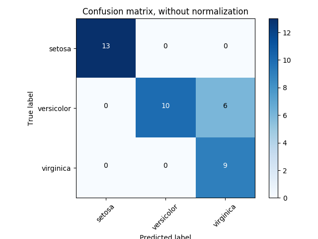](https://scikit-learn.org/stable/auto_examples/model_selection/plot_confusion_matrix.html)

对于 binary problems （二分类问题），我们可以得到 true negatives（真 negatives）, false positives（假 positives）, false negatives（假 negatives） 和 true positives（真 positives） 的数量如下:

```py
>>> y_true = [0, 0, 0, 1, 1, 1, 1, 1]
>>> y_pred = [0, 1, 0, 1, 0, 1, 0, 1]
>>> tn, fp, fn, tp = confusion_matrix(y_true, y_pred).ravel()
>>> tn, fp, fn, tp
(2, 1, 2, 3)

```

> **示例**:
>*   参阅 [Confusion matrix](https://scikit-learn.org/stable/auto_examples/model_selection/plot_confusion_matrix.html#sphx-glr-auto-examples-model-selection-plot-confusion-matrix-py) 例如使用 confusion matrix （混淆矩阵）来评估 classifier （分类器）的输出质量。
>*   参阅 [Recognizing hand-written digits](https://scikit-learn.org/stable/auto_examples/classification/plot_digits_classification.html#sphx-glr-auto-examples-classification-plot-digits-classification-py) 例如使用 confusion matrix （混淆矩阵）来分类手写数字。
>*   参阅 [Classification of text documents using sparse features](https://scikit-learn.org/stable/auto_examples/text/document_classification_20newsgroups.html#sphx-glr-auto-examples-text-document-classification-20newsgroups-py) 例如使用 confusion matrix （混淆矩阵）对文本文档进行分类。

### 3.3.2.6. 分类报告

[`classification_report`](https://scikit-learn.org/stable/modules/generated/sklearn.metrics.classification_report.html#sklearn.metrics.classification_report "sklearn.metrics.classification_report") 函数构建一个显示 main classification metrics （主分类指标）的文本报告。这是一个小例子，其中包含自定义的 `target_names` 和 inferred labels （推断标签）:

```py
>>> from sklearn.metrics import classification_report
>>> y_true = [0, 1, 2, 2, 0]
>>> y_pred = [0, 0, 2, 1, 0]
>>> target_names = ['class 0', 'class 1', 'class 2']
>>> print(classification_report(y_true, y_pred, target_names=target_names))
              precision    recall  f1-score   support

     class 0       0.67      1.00      0.80         2
     class 1       0.00      0.00      0.00         1
     class 2       1.00      0.50      0.67         2

    accuracy                           0.60         5
   macro avg       0.56      0.50      0.49         5
weighted avg       0.67      0.60      0.59         5
```

> **示例**:
>*   参阅 [Recognizing hand-written digits](https://scikit-learn.org/stable/auto_examples/classification/plot_digits_classification.html#sphx-glr-auto-examples-classification-plot-digits-classification-py) 作为手写数字的分类报告的使用示例。
>*   参阅 [Classification of text documents using sparse features](https://scikit-learn.org/stable/auto_examples/text/document_classification_20newsgroups.html#sphx-glr-auto-examples-text-document-classification-20newsgroups-py) 作为文本文档的分类报告使用的示例。
>*   参阅 [Parameter estimation using grid search with cross-validation](https://scikit-learn.org/stable/auto_examples/model_selection/plot_grid_search_digits.html#sphx-glr-auto-examples-model-selection-plot-grid-search-digits-py) 例如使用 grid search with nested cross-validation （嵌套交叉验证进行网格搜索）的分类报告。

### 3.3.2.7. 汉明损失

[`hamming_loss`](https://scikit-learn.org/stable/modules/generated/sklearn.metrics.hamming_loss.html#sklearn.metrics.hamming_loss "sklearn.metrics.hamming_loss") 计算两组样本之间的 average Hamming loss （平均汉明损失）或者 [Hamming distance（汉明距离）](https://en.wikipedia.org/wiki/Hamming_distance) 。

如果  是给定样本的第  个标签的预测值，则  是相应的真实值，而  是 classes or labels （类或者标签）的数量，则两个样本之间的 Hamming loss （汉明损失）  定义为:


其中  是 [indicator function（指标函数）](https://en.wikipedia.org/wiki/Indicator_function).

```py
>>> from sklearn.metrics import hamming_loss
>>> y_pred = [1, 2, 3, 4]
>>> y_true = [2, 2, 3, 4]
>>> hamming_loss(y_true, y_pred)
0.25

```

在具有 binary label indicators （二分标签指示符）的 multilabel （多标签）情况下:

```py
>>> hamming_loss(np.array([[0, 1], [1, 1]]), np.zeros((2, 2)))
0.75

```

>**注意**
>
>在 multiclass classification （多类分类）中， Hamming loss （汉明损失）对应于 `y_true` 和 `y_pred` 之间的 Hamming distance（汉明距离），它类似于 [零一损失](#zero-one-loss) 函数。然而， zero-one loss penalizes （0-1损失惩罚）不严格匹配真实集合的预测集，Hamming loss （汉明损失）惩罚 individual labels （独立标签）。因此，Hamming loss（汉明损失）高于 zero-one loss（0-1 损失），总是在 0 和 1 之间，包括 0 和 1;预测真正的标签的正确的 subset or superset （子集或超集）将给出 0 和 1 之间的 Hamming loss（汉明损失）。


### 3.3.2.8. 精准，召回和 F-measures

直观地来理解，[precision](https://en.wikipedia.org/wiki/Precision_and_recall#Precision) 是 the ability of the classifier not to label as positive a sample that is negative （classifier （分类器）的标签不能被标记为正的样本为负的能力），并且 [recall](https://en.wikipedia.org/wiki/Precision_and_recall#Recall) 是 classifier （分类器）查找所有 positive samples （正样本）的能力。

[F-measure](https://en.wikipedia.org/wiki/F1_score) (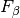 和  measures) 可以解释为 precision （精度）和 recall （召回）的 weighted harmonic mean （加权调和平均值）。  measure 值达到其最佳值 1 ，其最差分数为 0 。与 ,  和  是等价的， recall （召回）和 precision （精度）同样重要。

[`precision_recall_curve`](https://scikit-learn.org/stable/modules/generated/sklearn.metrics.precision_recall_curve.html#sklearn.metrics.precision_recall_curve "sklearn.metrics.precision_recall_curve") 通过改变 decision threshold （决策阈值）从 ground truth label （被标记的真实数据标签） 和 score given by the classifier （分类器给出的分数）计算 precision-recall curve （精确召回曲线）。

[`average_precision_score`](https://scikit-learn.org/stable/modules/generated/sklearn.metrics.average_precision_score.html#sklearn.metrics.average_precision_score "sklearn.metrics.average_precision_score") 函数根据 prediction scores （预测分数）计算出 average precision (AP)（平均精度）。该分数对应于 precision-recall curve （精确召回曲线）下的面积。该值在 0 和 1 之间，并且越高越好。通过 random predictions （随机预测）， AP 是 fraction of positive samples （正样本的分数）。


其中P<sub>n</sub>和R<sub>n</sub>是第n个阈值处的precision和recall。对于随机预测，AP是正样本的比例。

参考文献 [Manning2008] 和 [Everingham2010] 提出了AP的两种可替代变体对precision-recall曲线进行内插。 当前，函数`average_precision_score`还没有实现任何具备内插的变体版本。 参考文献 [Davis2006] 和 [Flach2015] 描述了为什么precision-recall曲线上的点的线性内插提供了一个过于乐观(overly-optimistic)的分类器性能度量。 在函数`auc`中使用梯形规则(trapezoidal rule)计算曲线下面积的时候，这个线性内插(linear interpolation)会被使用。

几个函数可以让您实现 analyze the precision （分析精度），recall（召回） 和 F-measures 得分:

|调用|功能|
|---|---|
| [`average_precision_score`](https://scikit-learn.org/stable/modules/generated/sklearn.metrics.average_precision_score.html#sklearn.metrics.average_precision_score "sklearn.metrics.average_precision_score")(y_true, y_score[, …]) | Compute average precision (AP) from prediction scores |
| [`f1_score`](https://scikit-learn.org/stable/modules/generated/sklearn.metrics.f1_score.html#sklearn.metrics.f1_score "sklearn.metrics.f1_score")(y_true, y_pred[, labels, …]) | Compute the F1 score, also known as balanced F-score or F-measure |
| [`fbeta_score`](https://scikit-learn.org/stable/modules/generated/sklearn.metrics.fbeta_score.html#sklearn.metrics.fbeta_score "sklearn.metrics.fbeta_score")(y_true, y_pred, beta[, labels, …]) | Compute the F-beta score |
| [`precision_recall_curve`](https://scikit-learn.org/stable/modules/generated/sklearn.metrics.precision_recall_curve.html#sklearn.metrics.precision_recall_curve "sklearn.metrics.precision_recall_curve")(y_true, probas_pred) | Compute precision-recall pairs for different probability thresholds |
| [`precision_recall_fscore_support`](https://scikit-learn.org/stable/modules/generated/sklearn.metrics.precision_recall_fscore_support.html#sklearn.metrics.precision_recall_fscore_support "sklearn.metrics.precision_recall_fscore_support")(y_true, y_pred) | Compute precision, recall, F-measure and support for each class |
| [`precision_score`](https://scikit-learn.org/stable/modules/generated/sklearn.metrics.precision_score.html#sklearn.metrics.precision_score "sklearn.metrics.precision_score")(y_true, y_pred[, labels, …]) | Compute the precision |
| [`recall_score`](https://scikit-learn.org/stable/modules/generated/sklearn.metrics.recall_score.html#sklearn.metrics.recall_score "sklearn.metrics.recall_score")(y_true, y_pred[, labels, …]) | Compute the recall |

请注意，[`precision_recall_curve`](https://scikit-learn.org/stable/modules/generated/sklearn.metrics.precision_recall_curve.html#sklearn.metrics.precision_recall_curve "sklearn.metrics.precision_recall_curve") 函数仅限于 binary case （二分情况）。 [`average_precision_score`](https://scikit-learn.org/stable/modules/generated/sklearn.metrics.average_precision_score.html#sklearn.metrics.average_precision_score "sklearn.metrics.average_precision_score") 函数只适用于 binary classification and multilabel indicator format （二分类和多标签指示器格式）。

> **示例**:
>*   参阅 [Classification of text documents using sparse features](https://scikit-learn.org/stable/auto_examples/text/document_classification_20newsgroups.html#sphx-glr-auto-examples-text-document-classification-20newsgroups-py) 例如 [`f1_score`](https://scikit-learn.org/stable/modules/generated/sklearn.metrics.f1_score.html#sklearn.metrics.f1_score "sklearn.metrics.f1_score") 用于分类文本文档的用法。
>*   参阅 [Parameter estimation using grid search with cross-validation](https://scikit-learn.org/stable/auto_examples/model_selection/plot_grid_search_digits.html#sphx-glr-auto-examples-model-selection-plot-grid-search-digits-py) 例如 [`precision_score`](https://scikit-learn.org/stable/modules/generated/sklearn.metrics.precision_score.html#sklearn.metrics.precision_score "sklearn.metrics.precision_score") 和 [`recall_score`](https://scikit-learn.org/stable/modules/generated/sklearn.metrics.recall_score.html#sklearn.metrics.recall_score "sklearn.metrics.recall_score") 用于 using grid search with nested cross-validation （使用嵌套交叉验证的网格搜索）来估计参数。
>*   参阅 [Precision-Recall](https://scikit-learn.org/stable/auto_examples/model_selection/plot_precision_recall.html#sphx-glr-auto-examples-model-selection-plot-precision-recall-py) 例如 [`precision_recall_curve`](https://scikit-learn.org/stable/modules/generated/sklearn.metrics.precision_recall_curve.html#sklearn.metrics.precision_recall_curve "sklearn.metrics.precision_recall_curve") 用于 evaluate classifier output quality（评估分类器输出质量）。

> **参考资料**
>* [Manning2008]	C.D. Manning, P. Raghavan, H. Schütze, [Introduction to Information Retrieval](https://nlp.stanford.edu/IR-book/html/htmledition/evaluation-of-ranked-retrieval-results-1.html), 2008.
>* [Everingham2010]	M. Everingham, L. Van Gool, C.K.I. Williams, J. Winn, A. Zisserman, [The Pascal Visual Object Classes (VOC) Challenge](http://citeseerx.ist.psu.edu/viewdoc/download?doi=10.1.1.157.5766&rep=rep1&type=pdf), IJCV 2010.
>* [Davis2006]	J. Davis, M. Goadrich, [The Relationship Between Precision-Recall and ROC Curves](http://www.machinelearning.org/proceedings/icml2006/030_The_Relationship_Bet.pdf), ICML 2006.
>* [Flach2015]	P.A. Flach, M. Kull, [Precision-Recall-Gain Curves: PR Analysis Done Right](https://papers.nips.cc/paper/5867-precision-recall-gain-curves-pr-analysis-done-right.pdf), NIPS 2015.

#### 3.3.2.8.1. 二分类

在二分类任务中，术语 ‘’positive（正）’’ 和 ‘’negative（负）’’ 是指 classifier’s prediction （分类器的预测），术语 ‘’true（真）’’ 和 ‘’false（假）’’ 是指该预测是否对应于 external judgment （外部判断）（有时被称为 ‘’observation（观测值）’‘）。给出这些定义，我们可以指定下表:

||Actual class (observation)|Actual class (observation)|
|---|---|---|
| Predicted class (expectation) | tp (true positive) Correct result | fp (false positive) Unexpected result |
| Predicted class (expectation) | fn (false negative) Missing result | tn (true negative) Correct absence of result |

在这种情况下，我们可以定义 precision（精度）, recall（召回） 和 F-measure 的概念:

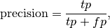


以下是 binary classification （二分类）中的一些小例子:

```py
>>> from sklearn import metrics
>>> y_pred = [0, 1, 0, 0]
>>> y_true = [0, 1, 0, 1]
>>> metrics.precision_score(y_true, y_pred)
1.0
>>> metrics.recall_score(y_true, y_pred)
0.5
>>> metrics.f1_score(y_true, y_pred)  
0.66...
>>> metrics.fbeta_score(y_true, y_pred, beta=0.5)  
0.83...
>>> metrics.fbeta_score(y_true, y_pred, beta=1)  
0.66...
>>> metrics.fbeta_score(y_true, y_pred, beta=2)
0.55...
>>> metrics.precision_recall_fscore_support(y_true, y_pred, beta=0.5)  
(array([0.66..., 1.        ]), array([1. , 0.5]), array([0.71..., 0.83...]), array([2, 2]))


>>> import numpy as np
>>> from sklearn.metrics import precision_recall_curve
>>> from sklearn.metrics import average_precision_score
>>> y_true = np.array([0, 0, 1, 1])
>>> y_scores = np.array([0.1, 0.4, 0.35, 0.8])
>>> precision, recall, threshold = precision_recall_curve(y_true, y_scores)
>>> precision  
array([0.66..., 0.5       , 1.        , 1.        ])
>>> recall
array([1. , 0.5, 0.5, 0. ])
>>> threshold
array([0.35, 0.4 , 0.8 ])
>>> average_precision_score(y_true, y_scores)  
0.83...
```

#### 3.3.2.8.2. 多类和多标签分类

在 multiclass and multilabel classification task（多类和多标签分类任务）中，precision（精度）, recall（召回）, and F-measures 的概念可以独立地应用于每个标签。 有以下几种方法 combine results across labels （将结果跨越标签组合），由 `average` 参数指定为 [`average_precision_score`](https://scikit-learn.org/stable/modules/generated/sklearn.metrics.average_precision_score.html#sklearn.metrics.average_precision_score "sklearn.metrics.average_precision_score") （仅用于 multilabel）， [`f1_score`](https://scikit-learn.org/stable/modules/generated/sklearn.metrics.f1_score.html#sklearn.metrics.f1_score "sklearn.metrics.f1_score"), [`fbeta_score`](https://scikit-learn.org/stable/modules/generated/sklearn.metrics.fbeta_score.html#sklearn.metrics.fbeta_score "sklearn.metrics.fbeta_score"), [`precision_recall_fscore_support`](https://scikit-learn.org/stable/modules/generated/sklearn.metrics.precision_recall_fscore_support.html#sklearn.metrics.precision_recall_fscore_support "sklearn.metrics.precision_recall_fscore_support"), [`precision_score`](https://scikit-learn.org/stable/modules/generated/sklearn.metrics.precision_score.html#sklearn.metrics.precision_score "sklearn.metrics.precision_score") 和 [`recall_score`](https://scikit-learn.org/stable/modules/generated/sklearn.metrics.recall_score.html#sklearn.metrics.recall_score "sklearn.metrics.recall_score") 函数，如上 [above](#3321-从二分到多分类和-multilabel) 所述。请注意，对于在包含所有标签的多类设置中进行 “micro”-averaging （”微”平均），将产生相等的 precision（精度）， recall（召回）和  ，而 “weighted（加权）” averaging（平均）可能会产生 precision（精度）和 recall（召回）之间的 F-score 。

为了使这一点更加明确，请考虑以下 notation （符号）:

*   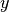 _predicted（预测）_  对
*   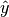 _true（真）_  对
*    labels 集合
*    samples 集合
*   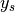  的子集与样本 , 即 
*     的子集与 label 
*   类似的,  和 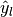 是  的子集
*   
*   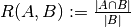 (Conventions （公约）在处理  有所不同; 这个实现使用 , 与  类似.)
*   

然后将 metrics （指标）定义为:

| `average` | Precision | Recall | F_beta |
| --- | --- | --- | --- |
| `"micro"` | 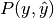 |  |  |
| `"samples"` | 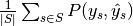 |  |  |
| `"macro"` |  |  |  |
| `"weighted"` |  |  |  |
| `None` |  |  |  |

```py
>>> from sklearn import metrics
>>> y_true = [0, 1, 2, 0, 1, 2]
>>> y_pred = [0, 2, 1, 0, 0, 1]
>>> metrics.precision_score(y_true, y_pred, average='macro')  
0.22...
>>> metrics.recall_score(y_true, y_pred, average='micro')
...
0.33...
>>> metrics.f1_score(y_true, y_pred, average='weighted')  
0.26...
>>> metrics.fbeta_score(y_true, y_pred, average='macro', beta=0.5)  
0.23...
>>> metrics.precision_recall_fscore_support(y_true, y_pred, beta=0.5, average=None)
...
(array([0.66..., 0.        , 0.        ]), array([1., 0., 0.]), array([0.71..., 0.        , 0.        ]), array([2, 2, 2]...))
```

For multiclass classification with a “negative class”, it is possible to exclude some labels:

```py
>>> metrics.recall_score(y_true, y_pred, labels=[1, 2], average='micro')
... # excluding 0, no labels were correctly recalled
0.0

```

Similarly, labels not present in the data sample may be accounted for in macro-averaging.

```py
>>> metrics.precision_score(y_true, y_pred, labels=[0, 1, 2, 3], average='macro')
...
0.166...

```

### 3.3.2.9. Jaccard 相似系数 score

[`jaccard_similarity_score`](https://scikit-learn.org/stable/modules/generated/sklearn.metrics.jaccard_similarity_score.html#sklearn.metrics.jaccard_similarity_score "sklearn.metrics.jaccard_similarity_score") 函数计算 pairs of label sets （标签组对）之间的 [Jaccard similarity coefficients](https://en.wikipedia.org/wiki/Jaccard_index) 也称作 Jaccard index 的平均值（默认）或总和。

将第  个样本的 Jaccard similarity coefficient 与 被标注过的真实数据的标签集  和 predicted label set （预测标签集）: 定义为


`jaccard_score`就像`precision_recall_fscore_support`中的设定方法，本身应用于二分类，并通过使用从二分类扩展到多标记和多类（见[从二分到多分类和multilabel](#3321-从二分到多分类和-multilabel)）。

二分类时：
```py
>>> import numpy as np
>>> from sklearn.metrics import jaccard_score
>>> y_true = np.array([[0, 1, 1],
...                    [1, 1, 0]])
>>> y_pred = np.array([[1, 1, 1],
...                    [1, 0, 0]])
>>> jaccard_score(y_true[0], y_pred[0])  
0.6666...
```

在具有二分类标签指示符的多标签案例中：
```py
>>> jaccard_score(y_true, y_pred, average='samples')  
0.5833...
>>> jaccard_score(y_true, y_pred, average='macro')  
0.6666...
>>> jaccard_score(y_true, y_pred, average=None)
array([0.5, 0.5, 1. ])
```

将多类问题二进制化并像对应的多标签问题一样处理：
```py
>>> y_pred = [0, 2, 1, 2]
>>> y_true = [0, 1, 2, 2]
>>> jaccard_score(y_true, y_pred, average=None)
...
array([1. , 0. , 0.33...])
>>> jaccard_score(y_true, y_pred, average='macro')
0.44...
>>> jaccard_score(y_true, y_pred, average='micro')
0.33...
```

### 3.3.2.10. Hinge loss

[`hinge_loss`](https://scikit-learn.org/stable/modules/generated/sklearn.metrics.hinge_loss.html#sklearn.metrics.hinge_loss "sklearn.metrics.hinge_loss") 函数使用 [hinge loss](https://en.wikipedia.org/wiki/Hinge_loss) 计算模型和数据之间的 average distance （平均距离），这是一种只考虑 prediction errors （预测误差）的 one-sided metric （单向指标）。（Hinge loss 用于最大边界分类器，如支持向量机）

如果标签用 +1 和 -1 编码，则 : 是真实值，并且  是由 `decision_function` 输出的 predicted decisions （预测决策），则 hinge loss 定义为:

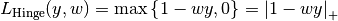

如果有两个以上的标签， [`hinge_loss`](https://scikit-learn.org/stable/modules/generated/sklearn.metrics.hinge_loss.html#sklearn.metrics.hinge_loss "sklearn.metrics.hinge_loss") 由于 Crammer & Singer 而使用了 multiclass variant （多类型变体）。 [Here](http://jmlr.csail.mit.edu/papers/volume2/crammer01a/crammer01a.pdf) 是描述它的论文。

如果 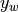 是真实标签的 predicted decision （预测决策），并且 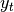 是所有其他标签的预测决策的最大值，其中预测决策由 decision function （决策函数）输出，则 multiclass hinge loss 定义如下:


这里是一个小例子，演示了在 binary class （二类）问题中使用了具有 svm classifier （svm 的分类器）的 [`hinge_loss`](https://scikit-learn.org/stable/modules/generated/sklearn.metrics.hinge_loss.html#sklearn.metrics.hinge_loss "sklearn.metrics.hinge_loss") 函数:

```py
>>> from sklearn import svm
>>> from sklearn.metrics import hinge_loss
>>> X = [[0], [1]]
>>> y = [-1, 1]
>>> est = svm.LinearSVC(random_state=0)
>>> est.fit(X, y)  
LinearSVC(C=1.0, class_weight=None, dual=True, fit_intercept=True,
     intercept_scaling=1, loss='squared_hinge', max_iter=1000,
     multi_class='ovr', penalty='l2', random_state=0, tol=0.0001,
     verbose=0)
>>> pred_decision = est.decision_function([[-2], [3], [0.5]])
>>> pred_decision  
array([-2.18...,  2.36...,  0.09...])
>>> hinge_loss([-1, 1, 1], pred_decision)  
0.3...

```

这里是一个示例，演示了在 multiclass problem （多类问题）中使用了具有 svm 分类器的 [`hinge_loss`](https://scikit-learn.org/stable/modules/generated/sklearn.metrics.hinge_loss.html#sklearn.metrics.hinge_loss "sklearn.metrics.hinge_loss") 函数:

```py
>>> X = np.array([[0], [1], [2], [3]])
>>> Y = np.array([0, 1, 2, 3])
>>> labels = np.array([0, 1, 2, 3])
>>> est = svm.LinearSVC()
>>> est.fit(X, Y)  
LinearSVC(C=1.0, class_weight=None, dual=True, fit_intercept=True,
     intercept_scaling=1, loss='squared_hinge', max_iter=1000,
     multi_class='ovr', penalty='l2', random_state=None, tol=0.0001,
     verbose=0)
>>> pred_decision = est.decision_function([[-1], [2], [3]])
>>> y_true = [0, 2, 3]
>>> hinge_loss(y_true, pred_decision, labels)  
0.56...

```

### 3.3.2.11. Log 损失

Log loss，又被称为 logistic regression loss（logistic 回归损失）或者 cross-entropy loss（交叉熵损失） 定义在 probability estimates （概率估计）。它通常用于 (multinomial) logistic regression （（多项式）logistic 回归）和 neural networks （神经网络）以及 expectation-maximization （期望最大化）的一些变体中，并且可用于评估分类器的 probability outputs （概率输出）（`predict_proba`）而不是其 discrete predictions （离散预测）。

对于具有真实标签  的 binary classification （二分类）和 probability estimate （概率估计） , 每个样本的 log loss 是给定的分类器的 negative log-likelihood 真正的标签:

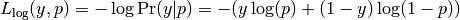

这扩展到 multiclass case （多类案例）如下。 让一组样本的真实标签被编码为 1-of-K binary indicator matrix 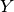, 即 如果样本  具有取自一组  个标签的标签  ，则  。令  为 matrix of probability estimates （概率估计矩阵）， 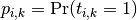 。那么整套的 log loss 就是

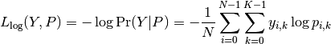

为了看这这里如何 generalizes （推广）上面给出的 binary log loss （二分 log loss），请注意，在 binary case （二分情况下）， 和  ，因此扩展  的 inner sum （内部和），给出 binary log loss （二分 log loss）。

[`log_loss`](https://scikit-learn.org/stable/modules/generated/sklearn.metrics.log_loss.html#sklearn.metrics.log_loss "sklearn.metrics.log_loss") 函数计算出一个 a list of ground-truth labels （已标注的真实数据的标签的列表）和一个 probability matrix （概率矩阵） 的 log loss，由 estimator （估计器）的 `predict_proba` 方法返回。

```py
>>> from sklearn.metrics import log_loss
>>> y_true = [0, 0, 1, 1]
>>> y_pred = [[.9, .1], [.8, .2], [.3, .7], [.01, .99]]
>>> log_loss(y_true, y_pred)    
0.1738...

```

`y_pred` 中的第一个 `[.9, .1]` 表示第一个样本具有标签 0 的 90% 概率。log loss 是非负数。

### 3.3.2.12. 马修斯相关系数

[`matthews_corrcoef`](https://scikit-learn.org/stable/modules/generated/sklearn.metrics.matthews_corrcoef.html#sklearn.metrics.matthews_corrcoef "sklearn.metrics.matthews_corrcoef") 函数用于计算 binary classes （二分类）的 [Matthew’s correlation coefficient (MCC)](https://en.wikipedia.org/wiki/Matthews_correlation_coefficient) 引用自 Wikipedia:

> “Matthews correlation coefficient（马修斯相关系数）用于机器学习，作为 binary (two-class) classifications （二分类）分类质量的度量。它考虑到 true and false positives and negatives （真和假的 positives 和 negatives），通常被认为是可以使用的 balanced measure（平衡措施），即使 classes are of very different sizes （类别大小不同）。MCC 本质上是 -1 和 +1 之间的相关系数值。系数 +1 表示完美预测，0 表示平均随机预测， -1 表示反向预测。statistic （统计量）也称为 phi coefficient （phi）系数。”

在 binary (two-class) （二分类）情况下，, ,  和  分别是 true positives, true negatives, false positives 和 false negatives 的数量，MCC 定义为


在 multiclass case （多类的情况）下， Matthews correlation coefficient（马修斯相关系数） 可以根据  classes （类）的 [`confusion_matrix`](https://scikit-learn.org/stable/modules/generated/sklearn.metrics.confusion_matrix.html#sklearn.metrics.confusion_matrix "sklearn.metrics.confusion_matrix")  定义 [defined](http://rk.kvl.dk/introduction/index.html) 。为了简化定义，考虑以下中间变量:

*    真正发生了  类的次数,
*     类被预测的次数,
*    正确预测的样本总数,
*    样本总数.

然后 multiclass MCC 定义为:


当有两个以上的标签时， MCC 的值将不再在 -1 和 +1 之间。相反，根据已经标注的真实数据的数量和分布情况，最小值将介于 -1 和 0 之间。最大值始终为 +1 。

这是一个小例子，说明了使用 [`matthews_corrcoef`](https://scikit-learn.org/stable/modules/generated/sklearn.metrics.matthews_corrcoef.html#sklearn.metrics.matthews_corrcoef "sklearn.metrics.matthews_corrcoef") 函数:

```py
>>> from sklearn.metrics import matthews_corrcoef
>>> y_true = [+1, +1, +1, -1]
>>> y_pred = [+1, -1, +1, +1]
>>> matthews_corrcoef(y_true, y_pred)  
-0.33...

```
### 3.3.2.13. 多标记混淆矩阵

`multilabel_confusion_matrix`函数计算分类（默认）或样本（`samplewise` = True时）的多标记混淆矩阵，以评估分类的准确性。`multilabel_confusion_matrix`也将多类数据视为多标记数据，因为这是一种常用于评估二元分类指标（如精度，召回等）的多类问题的转换。

在计算分类多标记混淆矩阵C时 ，类的真阴性计数i是C<sub>i,0,0</sub>，假阴性是C<sub>i,1,0</sub>，真阳性是C<sub>i,1,1</sub>，虚警率是C<sub>i,0,1</sub>

以下示例演示了使用[多标签指标矩阵输入](https://scikit-learn.org/stable/glossary.html#term-multilabel-indicator-matrix)的`multilabel_confusion_matrix`函数 ：
```py
>>> import numpy as np
>>> from sklearn.metrics import multilabel_confusion_matrix
>>> y_true = np.array([[1, 0, 1],
...                    [0, 1, 0]])
>>> y_pred = np.array([[1, 0, 0],
...                    [0, 1, 1]])
>>> multilabel_confusion_matrix(y_true, y_pred)
array([[[1, 0],
        [0, 1]],

       [[1, 0],
        [0, 1]],

       [[0, 1],
        [1, 0]]])
```

或者可以为每个样本的标签构建一个混淆矩阵：
```py
>>> multilabel_confusion_matrix(y_true, y_pred, samplewise=True)
array([[[1, 0],
        [1, 1]],

       [[1, 1],
        [0, 1]]])
```

这是一个演示如何使用[多类](https://scikit-learn.org/stable/glossary.html#term-multiclass)输入`multilabel_confusion_matrix`函数的示例 ：
```py
>>> y_true = ["cat", "ant", "cat", "cat", "ant", "bird"]
>>> y_pred = ["ant", "ant", "cat", "cat", "ant", "cat"]
>>> multilabel_confusion_matrix(y_true, y_pred,
...                             labels=["ant", "bird", "cat"])
array([[[3, 1],
        [0, 2]],

       [[5, 0],
        [1, 0]],

       [[2, 1],
        [1, 2]]])
```
以下是一些示例，演示了使用`multilabel_confusion_matrix`函数计算多标记指标矩阵输入问题中每个类的recall（或灵敏度），specificity,fall out和miss rate。

计算每个类的[recall](https://en.wikipedia.org/wiki/Sensitivity_and_specificity)（也称为真阳性率或sensitivity）：
```py
>>> y_true = np.array([[0, 0, 1],
...                    [0, 1, 0],
...                    [1, 1, 0]])
>>> y_pred = np.array([[0, 1, 0],
...                    [0, 0, 1],
...                    [1, 1, 0]])
>>> mcm = multilabel_confusion_matrix(y_true, y_pred)
>>> tn = mcm[:, 0, 0]
>>> tp = mcm[:, 1, 1]
>>> fn = mcm[:, 1, 0]
>>> fp = mcm[:, 0, 1]
>>> tp / (tp + fn)
array([1. , 0.5, 0. ])
```
计算每个类的[specificity](https://en.wikipedia.org/wiki/Sensitivity_and_specificity)
```py
>>> tn / (tn + fp)
array([1. , 0. , 0.5])
```
计算每个类的[fall out](https://en.wikipedia.org/wiki/False_positive_rate)
```py
>>> fp / (fp + tn)
array([0. , 1. , 0.5])
```
计算每个类的[miss rate](https://en.wikipedia.org/wiki/False_positives_and_false_negatives)
```py
>>> fn / (fn + tp)
array([0. , 0.5, 1. ])
```

### 3.3.2.14. Receiver operating characteristic (ROC)

函数 [`roc_curve`](https://scikit-learn.org/stable/modules/generated/sklearn.metrics.roc_curve.html#sklearn.metrics.roc_curve "sklearn.metrics.roc_curve") 计算 [receiver operating characteristic curve, or ROC curve](https://en.wikipedia.org/wiki/Receiver_operating_characteristic). 引用 Wikipedia :

> “A receiver operating characteristic (ROC), 或者简单的 ROC 曲线，是一个图形图，说明了 binary classifier （二分分类器）系统的性能，因为 discrimination threshold （鉴别阈值）是变化的。它是通过在不同的阈值设置下，从 true positives out of the positives (TPR = true positive 比例) 与 false positives out of the negatives (FPR = false positive 比例) 绘制 true positive 的比例来创建的。 TPR 也称为 sensitivity（灵敏度），FPR 是减去 specificity（特异性） 或 true negative 比例。”

该函数需要真正的 binar value （二分值）和 target scores（目标分数），这可以是 positive class 的 probability estimates （概率估计），confidence values（置信度值）或 binary decisions（二分决策）。 这是一个如何使用 [`roc_curve`](https://scikit-learn.org/stable/modules/generated/sklearn.metrics.roc_curve.html#sklearn.metrics.roc_curve "sklearn.metrics.roc_curve") 函数的小例子:

```py
>>> import numpy as np
>>> from sklearn.metrics import roc_curve
>>> y = np.array([1, 1, 2, 2])
>>> scores = np.array([0.1, 0.4, 0.35, 0.8])
>>> fpr, tpr, thresholds = roc_curve(y, scores, pos_label=2)
>>> fpr
array([0. , 0. , 0.5, 0.5, 1. ])
>>> tpr
array([0. , 0.5, 0.5, 1. , 1. ])
>>> thresholds
array([1.8 , 0.8 , 0.4 , 0.35, 0.1 ])

```

该图显示了这样的 ROC 曲线的示例:

[](https://scikit-learn.org/stable/auto_examples/model_selection/plot_roc.html)

[`roc_auc_score`](https://scikit-learn.org/stable/modules/generated/sklearn.metrics.roc_auc_score.html#sklearn.metrics.roc_auc_score "sklearn.metrics.roc_auc_score") 函数计算 receiver operating characteristic (ROC) 曲线下的面积，也由 AUC 和 AUROC 表示。通过计算 roc 曲线下的面积，曲线信息总结为一个数字。 有关更多的信息，请参阅 [Wikipedia article on AUC](https://en.wikipedia.org/wiki/Receiver_operating_characteristic#Area_under_the_curve) .

```py
>>> import numpy as np
>>> from sklearn.metrics import roc_auc_score
>>> y_true = np.array([0, 0, 1, 1])
>>> y_scores = np.array([0.1, 0.4, 0.35, 0.8])
>>> roc_auc_score(y_true, y_scores)
0.75
```

在 multi-label classification （多标签分类）中， [`roc_auc_score`](https://scikit-learn.org/stable/modules/generated/sklearn.metrics.roc_auc_score.html#sklearn.metrics.roc_auc_score "sklearn.metrics.roc_auc_score") 函数通过在标签上进行平均来扩展 [above](#average) .

与诸如 subset accuracy （子集精确度），Hamming loss（汉明损失）或 F1 score 的 metrics（指标）相比， ROC 不需要优化每个标签的阈值。[`roc_auc_score`](https://scikit-learn.org/stable/modules/generated/sklearn.metrics.roc_auc_score.html#sklearn.metrics.roc_auc_score "sklearn.metrics.roc_auc_score") 函数也可以用于 multi-class classification （多类分类），如果预测的输出被 binarized （二分化）。

在那些高虚警率(false positive rate)不被容忍的情况下，roc_auc_score 函数的参数 max_fpr 可被用来把ROC曲线累加到一个给定的限制。

[](https://scikit-learn.org/stable/auto_examples/model_selection/plot_roc.html)

> **示例**:
>*   参阅 [Receiver Operating Characteristic (ROC)](https://scikit-learn.org/stable/auto_examples/model_selection/plot_roc.html#sphx-glr-auto-examples-model-selection-plot-roc-py) 例如使用 ROC 来评估分类器输出的质量。
>*   参阅 [Receiver Operating Characteristic (ROC) with cross validation](https://scikit-learn.org/stable/auto_examples/model_selection/plot_roc_crossval.html#sphx-glr-auto-examples-model-selection-plot-roc-crossval-py) 例如使用 ROC 来评估分类器输出质量，使用 cross-validation （交叉验证）。
>*   参阅 [Species distribution modeling](https://scikit-learn.org/stable/auto_examples/applications/plot_species_distribution_modeling.html#sphx-glr-auto-examples-applications-plot-species-distribution-modeling-py) 例如使用 ROC 来 model species distribution 模拟物种分布。

### 3.3.2.15. 零一损失

[`zero_one_loss`](https://scikit-learn.org/stable/modules/generated/sklearn.metrics.zero_one_loss.html#sklearn.metrics.zero_one_loss "sklearn.metrics.zero_one_loss") 函数通过  计算 0-1 classification loss () 的 sum （和）或 average （平均值）。默认情况下，函数在样本上 normalizes （标准化）。要获得  的总和，将 `normalize` 设置为 `False`。

在 multilabel classification （多标签分类）中，如果零标签与标签严格匹配，则 [`zero_one_loss`](https://scikit-learn.org/stable/modules/generated/sklearn.metrics.zero_one_loss.html#sklearn.metrics.zero_one_loss "sklearn.metrics.zero_one_loss") 将一个子集作为一个子集，如果有任何错误，则为零。默认情况下，函数返回不完全预测子集的百分比。为了得到这样的子集的计数，将 `normalize` 设置为 `False` 。

如果  是第  个样本的预测值， 是相应的真实值，则 0-1 loss  定义为:


其中  是 [indicator function](https://en.wikipedia.org/wiki/Indicator_function).

```py
>>> from sklearn.metrics import zero_one_loss
>>> y_pred = [1, 2, 3, 4]
>>> y_true = [2, 2, 3, 4]
>>> zero_one_loss(y_true, y_pred)
0.25
>>> zero_one_loss(y_true, y_pred, normalize=False)
1

```

在具有 binary label indicators （二分标签指示符）的 multilabel （多标签）情况下，第一个标签集 [0,1] 有错误:

```py
>>> zero_one_loss(np.array([[0, 1], [1, 1]]), np.ones((2, 2)))
0.5

>>> zero_one_loss(np.array([[0, 1], [1, 1]]), np.ones((2, 2)),  normalize=False)
1

```

> **示例**:
>*   参阅 [Recursive feature elimination with cross-validation](https://scikit-learn.org/stable/auto_examples/feature_selection/plot_rfe_with_cross_validation.html#sphx-glr-auto-examples-feature-selection-plot-rfe-with-cross-validation-py) 例如 zero one loss 使用以通过 cross-validation （交叉验证）执行递归特征消除。

### 3.3.2.16. Brier 分数损失

[`brier_score_loss`](https://scikit-learn.org/stable/modules/generated/sklearn.metrics.brier_score_loss.html#sklearn.metrics.brier_score_loss "sklearn.metrics.brier_score_loss") 函数计算二进制类的 [Brier 分数](https://en.wikipedia.org/wiki/Brier_score) 。引用维基百科：

> “Brier 分数是一个特有的分数函数，用于衡量概率预测的准确性。它适用于预测必须将概率分配给一组相互排斥的离散结果的任务。”

该函数返回的是 实际结果与可能结果 的预测概率之间均方差的得分。 实际结果必须为1或0（真或假），而实际结果的预测概率可以是0到1之间的值。

Brier 分数损失也在0到1之间，分数越低（均方差越小），预测越准确。它可以被认为是对一组概率预测的 “校准” 的度量。


其中:  是预测的总数，  是实际结果 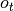 的预测概率。

这是一个使用这个函数的小例子:

```py
>>> import numpy as np
>>> from sklearn.metrics import brier_score_loss
>>> y_true = np.array([0, 1, 1, 0])
>>> y_true_categorical = np.array(["spam", "ham", "ham", "spam"])
>>> y_prob = np.array([0.1, 0.9, 0.8, 0.4])
>>> y_pred = np.array([0, 1, 1, 0])
>>> brier_score_loss(y_true, y_prob)
0.055
>>> brier_score_loss(y_true, 1-y_prob, pos_label=0)
0.055
>>> brier_score_loss(y_true_categorical, y_prob, pos_label="ham")
0.055
>>> brier_score_loss(y_true, y_prob > 0.5)
0.0

```

> **示例**:
>*   请参阅分类器的概率校准 [Probability calibration of classifiers](https://scikit-learn.org/stable/auto_examples/calibration/plot_calibration.html#sphx-glr-auto-examples-calibration-plot-calibration-py) ，通过 Brier 分数损失使用示例 来执行分类器的概率校准。

> **参考资料**:
>* G.Brier, [以概率表示的预测验证](http://docs.lib.noaa.gov/rescue/mwr/078/mwr-078-01-0001.pdf) , 月度天气评估78.1（1950）

## 3.3.3. 多标签排名指标

在多分类学习中，每个样本可以具有与其相关联的任何数量的真实标签。目标是给予高分，更好地评价真实标签。

### 3.3.3.1. 覆盖误差

[`coverage_error`](https://scikit-learn.org/stable/modules/generated/sklearn.metrics.coverage_error.html#sklearn.metrics.coverage_error "sklearn.metrics.coverage_error") 函数计算必须包含在最终预测中的标签的平均数，以便预测所有真正的标签。 如果您想知道有多少 top 评分标签，您必须通过平均来预测，而不会丢失任何真正的标签，这很有用。 因此，此指标的最佳价值是真正标签的平均数量。

>**注意**
>
>我们的实现的得分比 Tsoumakas 等人在2010年的提出的计算方式大1。这扩展了它来处理一个具有0个真实标签实例的退化情况的能力。

正式地，给定真实标签  的二进制指示矩阵和与每个标签  相关联的分数，覆盖范围被定义为


与  。给定等级定义，通过给出将被分配给所有绑定值的最大等级， `y_scores` 中的关系会被破坏。

这是一个使用这个函数的小例子:

```py
>>> import numpy as np
>>> from sklearn.metrics import coverage_error
>>> y_true = np.array([[1, 0, 0], [0, 0, 1]])
>>> y_score = np.array([[0.75, 0.5, 1], [1, 0.2, 0.1]])
>>> coverage_error(y_true, y_score)
2.5

```

### 3.3.3.2. 标签排名平均精度

[`label_ranking_average_precision_score`](https://scikit-learn.org/stable/modules/generated/sklearn.metrics.label_ranking_average_precision_score.html#sklearn.metrics.label_ranking_average_precision_score "sklearn.metrics.label_ranking_average_precision_score") 函数实现标签排名平均精度（LRAP）。 该度量值与 [`average_precision_score`](https://scikit-learn.org/stable/modules/generated/sklearn.metrics.average_precision_score.html#sklearn.metrics.average_precision_score "sklearn.metrics.average_precision_score") 函数相关联，但是基于标签排名的概念，而不是精确度和召回。

标签排名平均精度（LRAP）是分配给每个样本的每个真实标签的平均值，真实对总标签与较低分数的比率。 如果能够为每个样本相关标签提供更好的排名，这个指标就会产生更好的分数。 获得的得分总是严格大于0，最佳值为1。如果每个样本只有一个相关标签，则标签排名平均精度等于 [平均倒数等级](https://en.wikipedia.org/wiki/Mean_reciprocal_rank) 。

正式地，给定真实标签  的二进制指示矩阵和与每个标签  相关联的得分，平均精度被定义为


与 ，  和  是集合的 l0 范数或基数。

这是一个使用这个函数的小例子:

```py
>>> import numpy as np
>>> from sklearn.metrics import label_ranking_average_precision_score
>>> y_true = np.array([[1, 0, 0], [0, 0, 1]])
>>> y_score = np.array([[0.75, 0.5, 1], [1, 0.2, 0.1]])
>>> label_ranking_average_precision_score(y_true, y_score)
0.416...

```

### 3.3.3.3. 排序损失

[`label_ranking_loss`](https://scikit-learn.org/stable/modules/generated/sklearn.metrics.label_ranking_loss.html#sklearn.metrics.label_ranking_loss "sklearn.metrics.label_ranking_loss") 函数计算在样本上平均排序错误的标签对数量的排序损失，即真实标签的分数低于假标签，由虚假和真实标签的倒数加权。最低可实现的排名损失为零。

正式地，给定真相标签  的二进制指示矩阵和与每个标签  相关联的得分，排序损失被定义为


其中  是  范数或集合的基数。

这是一个使用这个函数的小例子:

```py
>>> import numpy as np
>>> from sklearn.metrics import label_ranking_loss
>>> y_true = np.array([[1, 0, 0], [0, 0, 1]])
>>> y_score = np.array([[0.75, 0.5, 1], [1, 0.2, 0.1]])
>>> label_ranking_loss(y_true, y_score)
0.75...
>>> # With the following prediction, we have perfect and minimal loss
>>> y_score = np.array([[1.0, 0.1, 0.2], [0.1, 0.2, 0.9]])
>>> label_ranking_loss(y_true, y_score)
0.0

```

> **参考资料**:
>*   Tsoumakas, G., Katakis, I., & Vlahavas, I. (2010). 挖掘多标签数据。在数据挖掘和知识发现手册（第667-685页）。美国 Springer.

## 3.3.4. 回归指标

该 [`sklearn.metrics`](classes.html#module-sklearn.metrics "sklearn.metrics") 模块实现了一些 loss, score 以及 utility 函数以测量 regression（回归）的性能. 其中一些已经被加强以处理多个输出的场景: [`mean_squared_error`](https://scikit-learn.org/stable/modules/generated/sklearn.metrics.mean_squared_error.html#sklearn.metrics.mean_squared_error "sklearn.metrics.mean_squared_error"), [`mean_absolute_error`](https://scikit-learn.org/stable/modules/generated/sklearn.metrics.mean_absolute_error.html#sklearn.metrics.mean_absolute_error "sklearn.metrics.mean_absolute_error"), [`explained_variance_score`](https://scikit-learn.org/stable/modules/generated/sklearn.metrics.explained_variance_score.html#sklearn.metrics.explained_variance_score "sklearn.metrics.explained_variance_score") 和 [`r2_score`](https://scikit-learn.org/stable/modules/generated/sklearn.metrics.r2_score.html#sklearn.metrics.r2_score "sklearn.metrics.r2_score").

这些函数有 `multioutput` 这样一个 keyword（关键的）参数, 它指定每一个目标的 score（得分）或 loss（损失）的平均值的方式. 默认是 `'uniform_average'`, 其指定了输出时一致的权重均值. 如果一个 `ndarray` 的 shape `(n_outputs,)` 被传递, 则其中的 entries（条目）将被解释为权重，并返回相应的加权平均值. 如果 `multioutput` 指定了 `'raw_values'` , 则所有未改变的部分 score（得分）或 loss（损失）将以 `(n_outputs,)` 形式的数组返回.

该 [`r2_score`](https://scikit-learn.org/stable/modules/generated/sklearn.metrics.r2_score.html#sklearn.metrics.r2_score "sklearn.metrics.r2_score") 和 [`explained_variance_score`](https://scikit-learn.org/stable/modules/generated/sklearn.metrics.explained_variance_score.html#sklearn.metrics.explained_variance_score "sklearn.metrics.explained_variance_score") 函数接受一个额外的值 `'variance_weighted'` 用于 `multioutput` 参数. 该选项通过相应目标变量的方差使得每个单独的 score 进行加权. 该设置量化了全局捕获的未缩放方差. 如果目标变量的大小不一样, 则该 score 更好地解释了较高的方差变量. `multioutput='variance_weighted'` 是 [`r2_score`](https://scikit-learn.org/stable/modules/generated/sklearn.metrics.r2_score.html#sklearn.metrics.r2_score "sklearn.metrics.r2_score") 的默认值以向后兼容. 以后该值会被改成 `uniform_average`.

### 3.3.4.1. 解释方差得分

该 [`explained_variance_score`](https://scikit-learn.org/stable/modules/generated/sklearn.metrics.explained_variance_score.html#sklearn.metrics.explained_variance_score "sklearn.metrics.explained_variance_score") 函数计算了 [explained variance regression score（解释的方差回归得分）](https://en.wikipedia.org/wiki/Explained_variation).

如果  是预估的目标输出,  是相应（正确的）目标输出, 并且 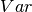 is [方差](https://en.wikipedia.org/wiki/Variance), 标准差的平方, 那么解释的方差预估如下:


最好的得分是 1.0, 值越低越差.

下面是一下有关 [`explained_variance_score`](https://scikit-learn.org/stable/modules/generated/sklearn.metrics.explained_variance_score.html#sklearn.metrics.explained_variance_score "sklearn.metrics.explained_variance_score") 函数使用的一些例子:

```py
>>> from sklearn.metrics import explained_variance_score
>>> y_true = [3, -0.5, 2, 7]
>>> y_pred = [2.5, 0.0, 2, 8]
>>> explained_variance_score(y_true, y_pred)  
0.957...
>>> y_true = [[0.5, 1], [-1, 1], [7, -6]]
>>> y_pred = [[0, 2], [-1, 2], [8, -5]]
>>> explained_variance_score(y_true, y_pred, multioutput='raw_values')
...
array([ 0.967...,  1.        ])
>>> explained_variance_score(y_true, y_pred, multioutput=[0.3, 0.7])
...
0.990...

```
### 3.3.4.2. 最大误差
`max_error`函数计算最大残差，该度量捕获预测值和真实值之间的最坏情况误差。在完全拟合的单输出回归模型中，训练集上的`max_error`将为0，尽管在现实世界中这是极不可能的，但是这个度量显示了模型在拟合时的误差程度。

如果  是 -th 样本的预测值, 并且  是对应的真实值，则将最大误差定义为


以下是`max_error`函数的一个例子：
```py
>>> from sklearn.metrics import max_error
>>> y_true = [3, 2, 7, 1]
>>> y_pred = [9, 2, 7, 1]
>>> max_error(y_true, y_pred)
6
```
`max_error`不支持多输出

### 3.3.4.3. 平均绝对误差

该 [`mean_absolute_error`](https://scikit-learn.org/stable/modules/generated/sklearn.metrics.mean_absolute_error.html#sklearn.metrics.mean_absolute_error "sklearn.metrics.mean_absolute_error") 函数计算了 [平均绝对误差](https://en.wikipedia.org/wiki/Mean_absolute_error), 一个对应绝对误差损失预期值或者 -norm 损失的风险度量.

如果  是 -th 样本的预测值, 并且  是对应的真实值, 则平均绝对误差 (MAE) 预估的  定义如下


下面是一个有关 [`mean_absolute_error`](https://scikit-learn.org/stable/modules/generated/sklearn.metrics.mean_absolute_error.html#sklearn.metrics.mean_absolute_error "sklearn.metrics.mean_absolute_error") 函数用法的小例子:

```py
>>> from sklearn.metrics import mean_absolute_error
>>> y_true = [3, -0.5, 2, 7]
>>> y_pred = [2.5, 0.0, 2, 8]
>>> mean_absolute_error(y_true, y_pred)
0.5
>>> y_true = [[0.5, 1], [-1, 1], [7, -6]]
>>> y_pred = [[0, 2], [-1, 2], [8, -5]]
>>> mean_absolute_error(y_true, y_pred)
0.75
>>> mean_absolute_error(y_true, y_pred, multioutput='raw_values')
array([ 0.5,  1. ])
>>> mean_absolute_error(y_true, y_pred, multioutput=[0.3, 0.7])
...
0.849...

```

### 3.3.4.4. 均方误差

该 [`mean_squared_error`](https://scikit-learn.org/stable/modules/generated/sklearn.metrics.mean_squared_error.html#sklearn.metrics.mean_squared_error "sklearn.metrics.mean_squared_error") 函数计算了 [均方误差](https://en.wikipedia.org/wiki/Mean_squared_error), 一个对应于平方（二次）误差或损失的预期值的风险度量.

如果  是 -th 样本的预测值, 并且  是对应的真实值, 则均方误差（MSE）预估的  定义如下


下面是一个有关 [`mean_squared_error`](https://scikit-learn.org/stable/modules/generated/sklearn.metrics.mean_squared_error.html#sklearn.metrics.mean_squared_error "sklearn.metrics.mean_squared_error") 函数用法的小例子:

```py
>>> from sklearn.metrics import mean_squared_error
>>> y_true = [3, -0.5, 2, 7]
>>> y_pred = [2.5, 0.0, 2, 8]
>>> mean_squared_error(y_true, y_pred)
0.375
>>> y_true = [[0.5, 1], [-1, 1], [7, -6]]
>>> y_pred = [[0, 2], [-1, 2], [8, -5]]
>>> mean_squared_error(y_true, y_pred)  
0.7083...

```

> **示例**
>*   点击 [Gradient Boosting regression](https://scikit-learn.org/stable/auto_examples/ensemble/plot_gradient_boosting_regression.html#sphx-glr-auto-examples-ensemble-plot-gradient-boosting-regression-py) 查看均方误差用于梯度上升（gradient boosting）回归的使用例子。

### 3.3.4.5. 均方误差对数

该 [`mean_squared_log_error`](https://scikit-learn.org/stable/modules/generated/sklearn.metrics.mean_squared_log_error.html#sklearn.metrics.mean_squared_log_error "sklearn.metrics.mean_squared_log_error") 函数计算了一个对应平方对数（二次）误差或损失的预估值风险度量.

如果  是 -th 样本的预测值, 并且  是对应的真实值, 则均方误差对数（MSLE）预估的  定义如下


其中  表示 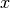 的自然对数. 当目标具有指数增长的趋势时, 该指标最适合使用, 例如人口数量, 跨年度商品的平均销售额等. 请注意, 该指标会对低于预测的估计值进行估计.

下面是一个有关 [`mean_squared_log_error`](https://scikit-learn.org/stable/modules/generated/sklearn.metrics.mean_squared_log_error.html#sklearn.metrics.mean_squared_log_error "sklearn.metrics.mean_squared_log_error") 函数用法的小例子:

```py
>>> from sklearn.metrics import mean_squared_log_error
>>> y_true = [3, 5, 2.5, 7]
>>> y_pred = [2.5, 5, 4, 8]
>>> mean_squared_log_error(y_true, y_pred)  
0.039...
>>> y_true = [[0.5, 1], [1, 2], [7, 6]]
>>> y_pred = [[0.5, 2], [1, 2.5], [8, 8]]
>>> mean_squared_log_error(y_true, y_pred)  
0.044...

```
### 3.3.4.6. 中位绝对误差

该 [`median_absolute_error`](https://scikit-learn.org/stable/modules/generated/sklearn.metrics.median_absolute_error.html#sklearn.metrics.median_absolute_error "sklearn.metrics.median_absolute_error") 函数尤其有趣, 因为它的离群值很强. 通过取目标和预测之间的所有绝对差值的中值来计算损失.

如果  是 -th 样本的预测值, 并且  是对应的真实值, 则中位绝对误差（MedAE）预估的  定义如下


该 [`median_absolute_error`](https://scikit-learn.org/stable/modules/generated/sklearn.metrics.median_absolute_error.html#sklearn.metrics.median_absolute_error "sklearn.metrics.median_absolute_error") 函数不支持多输出.

下面是一个有关 [`median_absolute_error`](https://scikit-learn.org/stable/modules/generated/sklearn.metrics.median_absolute_error.html#sklearn.metrics.median_absolute_error "sklearn.metrics.median_absolute_error") 函数用法的小例子:

```py
>>> from sklearn.metrics import median_absolute_error
>>> y_true = [3, -0.5, 2, 7]
>>> y_pred = [2.5, 0.0, 2, 8]
>>> median_absolute_error(y_true, y_pred)
0.5

```

### 3.3.4.7. R² score, 可决系数

该 [`r2_score`](https://scikit-learn.org/stable/modules/generated/sklearn.metrics.r2_score.html#sklearn.metrics.r2_score "sklearn.metrics.r2_score") 函数计算了 computes R², 即 [可决系数](https://en.wikipedia.org/wiki/Coefficient_of_determination). 它提供了将来样本如何可能被模型预测的估量. 最佳分数为 1.0, 可以为负数（因为模型可能会更糟）. 总是预测 y 的预期值，不考虑输入特征的常数模型将得到 R^2 得分为 0.0.

如果  是 -th 样本的预测值, 并且  是对应的真实值, 则 R² 得分预估的  定义如下


其中 .

下面是一个有关 [`r2_score`](https://scikit-learn.org/stable/modules/generated/sklearn.metrics.r2_score.html#sklearn.metrics.r2_score "sklearn.metrics.r2_score") 函数用法的小例子:

```py
>>> from sklearn.metrics import r2_score
>>> y_true = [3, -0.5, 2, 7]
>>> y_pred = [2.5, 0.0, 2, 8]
>>> r2_score(y_true, y_pred)  
0.948...
>>> y_true = [[0.5, 1], [-1, 1], [7, -6]]
>>> y_pred = [[0, 2], [-1, 2], [8, -5]]
>>> r2_score(y_true, y_pred, multioutput='variance_weighted')
...
0.938...
>>> y_true = [[0.5, 1], [-1, 1], [7, -6]]
>>> y_pred = [[0, 2], [-1, 2], [8, -5]]
>>> r2_score(y_true, y_pred, multioutput='uniform_average')
...
0.936...
>>> r2_score(y_true, y_pred, multioutput='raw_values')
...
array([ 0.965...,  0.908...])
>>> r2_score(y_true, y_pred, multioutput=[0.3, 0.7])
...
0.925...

```

> **示例**:
>*   点击 [Lasso and Elastic Net for Sparse Signals](https://scikit-learn.org/stable/auto_examples/linear_model/plot_lasso_and_elasticnet.html#sphx-glr-auto-examples-linear-model-plot-lasso-and-elasticnet-py) 查看关于R²用于评估在Lasso and Elastic Net on sparse signals上的使用.

## 3.3.5. 聚类指标

该 [`sklearn.metrics`](classes.html#module-sklearn.metrics "sklearn.metrics") 模块实现了一些 loss, score 和 utility 函数. 更多信息请参阅 [聚类性能度量](clustering.html#clustering-evaluation) 部分, 例如聚类, 以及用于二分聚类的 [Biclustering 评测](biclustering.html#biclustering-evaluation).

## 3.3.6. 虚拟估计

在进行监督学习的过程中，简单的 sanity check（理性检查）包括将人的估计与简单的经验法则进行比较. [`DummyClassifier`](https://scikit-learn.org/stable/modules/generated/sklearn.dummy.DummyClassifier.html#sklearn.dummy.DummyClassifier "sklearn.dummy.DummyClassifier") 实现了几种简单的分类策略:

*   `stratified` 通过在训练集类分布方面来生成随机预测.
*   `most_frequent` 总是预测训练集中最常见的标签.
*   `prior` 总是给出能够最大化类先验概率的预测 (类似于 most_frequent) 并且 predict_proba 返回类先验概率.
*   `uniform` 随机产生预测.
*   `constant`总是预测用户提供的常量标签.当 positive class（正类）较少时,这种方法的主要动机是 F1-scoring.

请注意, 这些所有的策略, `predict` 方法彻底的忽略了输入数据!

为了说明 [`DummyClassifier`](https://scikit-learn.org/stable/modules/generated/sklearn.dummy.DummyClassifier.html#sklearn.dummy.DummyClassifier "sklearn.dummy.DummyClassifier"), 首先让我们创建一个不平衡数据集．

```py
>>> from sklearn.datasets import load_iris
>>> from sklearn.model_selection import train_test_split
>>> iris = load_iris()
>>> X, y = iris.data, iris.target
>>> y[y != 1] = -1
>>> X_train, X_test, y_train, y_test = train_test_split(X, y, random_state=0)

```

接下来, 让我们比较一下 `SVC` 和 `most_frequent` 的准确性.

```py
>>> from sklearn.dummy import DummyClassifier
>>> from sklearn.svm import SVC
>>> clf = SVC(kernel='linear', C=1).fit(X_train, y_train)
>>> clf.score(X_test, y_test)
0.63...
>>> clf = DummyClassifier(strategy='most_frequent',random_state=0)
>>> clf.fit(X_train, y_train)
DummyClassifier(constant=None, random_state=0, strategy='most_frequent')
>>> clf.score(X_test, y_test)  
0.57...

```

我们看到 `SVC` 没有比一个 dummy classifier（虚拟分类器）好很多. 现在, 让我们来更改一下 kernel:

```py
>>> clf = SVC(gamma='scale', kernel='rbf', C=1).fit(X_train, y_train)
>>> clf.score(X_test, y_test)  
0.94...

```

我们注意到准确率提升到将近 100%. 建议采用交叉验证策略, 以更好地估计精度, 如果不是太耗 CPU 的话. 更多信息请参阅 [交叉验证：评估估算器的表现](dos/30) 部分. 此外，如果要优化参数空间，强烈建议您使用适当的方法; 更多详情请参阅 [调整估计器的超参数](dos/31) 部分.

通常来说，当分类器的准确度太接近随机情况时，这可能意味着出现了一些问题: 特征没有帮助, 超参数没有正确调整, class 不平衡造成分类器有问题等…

[`DummyRegressor`](https://scikit-learn.org/stable/modules/generated/sklearn.dummy.DummyRegressor.html#sklearn.dummy.DummyRegressor "sklearn.dummy.DummyRegressor") 还实现了四个简单的经验法则来进行回归:

*   `mean` 总是预测训练目标的平均值.
*   `median` 总是预测训练目标的中位数.
*   `quantile` 总是预测用户提供的训练目标的 quantile（分位数）.
*   `constant` 总是预测由用户提供的常数值.

在以上所有的策略中, `predict` 方法完全忽略了输入数据.
