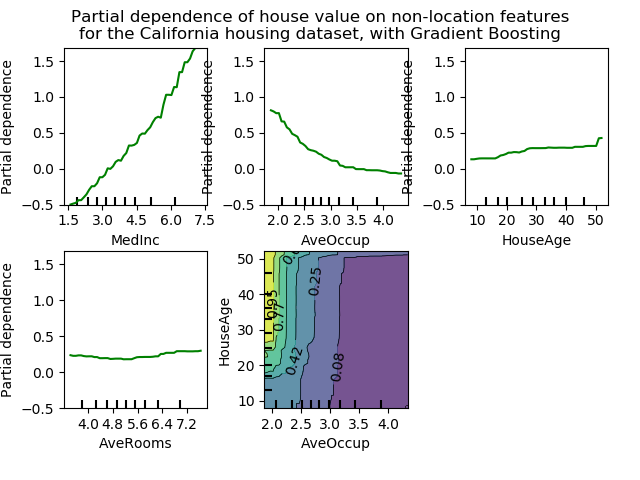

# 4.1. 部分依赖图

校验者:
        待核验
翻译者:
        [@Loopy](https://github.com/loopyme)

部分依赖图(以下简称PDP)显示了目标响应[1]和一组“目标”特征之间的依赖关系，并边缘化所有其他特征（“补充”特征）的值。直观地，我们可以将部分依赖关系解释为预期目标响应作为“目标”特征的函数。

由于人类感知的限制，目标特征集的大小必须很小（通常是一个或两个），因此目标特征通常需要从最重要的特征中选择。

下图展示了使用[GradientBoostingRegressor](https://scikit-learn.org/stable/modules/generated/sklearn.ensemble.GradientBoostingRegressor.html#sklearn.ensemble.GradientBoostingRegressor)实现的，加利福尼亚州住房数据集的四个单向和一个双向PDP：

[](https://scikit-learn.org/stable/auto_examples/inspection/plot_partial_dependence.html)

单向PDP告诉我们目标响应和目标特征(如线性、非线性)之间的相互作用。上图左上方的图表显示了一个地区的收入中位数对房价中位数的影响;我们可以清楚地看到它们之间的线性关系。注意，PDP假设目标特征独立于补体特征，而这一假设在实践中经常被推翻。

具有两个目标特征的PDP显示了这两个特征之间的相互作用。例如，上图中的双变量PDP显示了房价中值与房屋年龄和每户平均居住者的联合值之间的关系。我们可以清楚地看到这两个特征之间的相互作用:对于平均入住率大于2的情况，房价几乎与房屋的年龄无关，而对于数值小于2的情况，则与年龄有很强的依赖关系。

[`sklearn.inspection`](https://scikit-learn.org/stable/modules/classes.html#module-sklearn.inspection)提供了一个方便的函数[`plot_partial_dependency`](https://scikit-learn.org/stable/modules/generated/sklearn.inspection.plot_partial_dependence.html#sklearn.inspection.plot_partial_dependence)来创建单向和双向PDP。在下面的例子中，我们展示了如何创建一个局部依赖图的网格:两个用于特征0和1的单向PDP，以及两个特征之间的双向PDP:
```py
>>> from sklearn.datasets import make_hastie_10_2
>>> from sklearn.ensemble import GradientBoostingClassifier
>>> from sklearn.inspection import plot_partial_dependence

>>> X, y = make_hastie_10_2(random_state=0)
>>> clf = GradientBoostingClassifier(n_estimators=100, learning_rate=1.0,
...     max_depth=1, random_state=0).fit(X, y)
>>> features = [0, 1, (0, 1)]
>>> plot_partial_dependence(clf, X, features)
```

您可以使用`plt.gcf()`和`plt.gca()`访问新创建的figure和axis对象。

对于多类分类，需要通过`target`参数设置类标签，来创建PDPs:
```py
>>> from sklearn.datasets import load_iris
>>> iris = load_iris()
>>> mc_clf = GradientBoostingClassifier(n_estimators=10,
...     max_depth=1).fit(iris.data, iris.target)
>>> features = [3, 2, (3, 2)]
>>> plot_partial_dependence(mc_clf, X, features, target=0)
```
在多输出回归中，可以使用相同的参数`target`指定目标。

如果需要局部依赖函数的原始值而不是图，可以使用[`sklearn.inspection.partial_dependence`](https://scikit-learn.org/stable/modules/generated/sklearn.inspection.partial_dependence.html#sklearn.inspection.partial_dependence):

``` py
>>> from sklearn.inspection import partial_dependence

>>> pdp, axes = partial_dependence(clf, X, [0])
>>> pdp  
array([[ 2.466...,  2.466..., ...
>>> axes  
[array([-1.624..., -1.592..., ...
```

求局部依赖关系的值直接由`x`生成。对于双向局部依赖关系，则生成值的二维网格。由[`sklearn.inspection.partial_dependency`](https://scikit-learn.org/stable/modules/generated/sklearn.inspection.partial_dependence.html#sklearn.inspection.partial_dependence)返回的`values`字段会给出每个目标特征在网格中使用的实际值。它们也对应于图的轴线。

对于网格中“目标”特征的每个值，部分依赖函数需要将估计值对“补充”特征的所有可能值的预测边缘化。使用'brute'方法，可以通过用网格中的每个目标特征值替换X中的，并计算平均预测值来完成。

在决策树中，不需要参考训练数据('recursion'方法)就可以有效地评估这一点。对每个网格点执行加权树遍历:如果一个分割节点包含“目标”特征，则跟踪相应的左或右分支，否则同时跟踪两个分支，每个分支由输入该分支的训练样本的比例进行加权。最后，用所有访问叶的加权平均给出了部分依赖关系。注意，使用'recursion'方法时，`X`只用于生成网格，而不是计算平均预测。平均预测总是根据决策树训练的数据来计算的。

>**脚注**
>
>[1]　对于分类问题，目标响应可以是类的概率（二元分类的正类）或决策函数。

>**示例**
>* [Partial Dependence Plots](https://scikit-learn.org/stable/auto_examples/inspection/plot_partial_dependence.html#sphx-glr-auto-examples-inspection-plot-partial-dependence-py)

>**参考文献**
>* [HTF2009]	T. Hastie, R. Tibshirani and J. Friedman, [The Elements of Statistical Learning](https://web.stanford.edu/~hastie/ElemStatLearn//), Second Edition, Section 10.13.2, Springer, 2009.
>* [Mol2019]	C. Molnar, [Interpretable Machine Learning](https://christophm.github.io/interpretable-ml-book/), Section 5.1, 2019.
