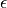
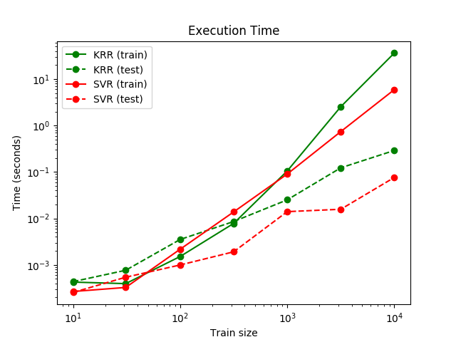

# 1.3. 内核岭回归

校验者:
        [@不吃曲奇的趣多多](https://github.com/apachecn/scikit-learn-doc-zh)
        [@Loopy](https://github.com/loopyme)
        [@qinhanmin2014](https://github.com/qinhanmin2014)
翻译者:
        [@Counting stars](https://github.com/apachecn/scikit-learn-doc-zh)

内核岭回归(Kernel ridge regression-KRR）[1] 由使用内核方法的[岭回归](/docs/2#112-岭回归)（使用 l2 正则化的最小二乘法）所组成。因此，它所拟合到的在空间中不同的线性函数是由不同的内核和数据所导致的。对于非线性的内核，它与原始空间中的非线性函数相对应。

由 [`KernelRidge`](https://scikit-learn.org/stable/modules/generated/sklearn.kernel_ridge.KernelRidge.html) 学习的模型的形式与支持向量回归( [`SVR`](https://scikit-learn.org/stable/modules/generated/sklearn.svm.SVR.html) 是一样的。但是他们使用不同的损失函数：内核岭回归（KRR）使用 squared error loss （平方误差损失函数）而 support vector regression （支持向量回归）（SVR）使用 -insensitive loss ( ε-不敏感损失 )，两者都使用 l2 regularization （l2 正则化）。与[`SVR`](https://scikit-learn.org/stable/modules/generated/sklearn.svm.SVR.html) 相反，拟合 [`KernelRidge`](https://scikit-learn.org/stable/modules/generated/sklearn.kernel_ridge.KernelRidge.html) 可以以 closed-form （封闭形式）完成，对于中型数据集通常更快。另一方面，学习的模型是非稀疏的，因此比 SVR 慢。在预测时间内，SVR 拟合的是ε>0的稀疏模型。

下图比较了人造数据集上的 [`KernelRidge`](https://scikit-learn.org/stable/modules/generated/sklearn.kernel_ridge.KernelRidge.html) 和 [`SVR`](https://scikit-learn.org/stable/modules/generated/sklearn.svm.SVR.html)的区别，它由一个正弦目标函数和每五个数据点产生一个强噪声组成。图中分别绘制了由 [`KernelRidge`](https://scikit-learn.org/stable/modules/generated/sklearn.kernel_ridge.KernelRidge.html) 和 [`SVR`](https://scikit-learn.org/stable/modules/generated/sklearn.svm.SVR.html)学习到的回归曲线。两者都使用网格搜索优化了 RBF 内核的 complexity/regularization （复杂性/正则化）和 bandwidth （带宽）。它们的 learned functions （学习函数）非常相似;但是，拟合 [`KernelRidge`](https://scikit-learn.org/stable/modules/generated/sklearn.kernel_ridge.KernelRidge.html) 大约比拟合 [`SVR`](https://scikit-learn.org/stable/modules/generated/sklearn.svm.SVR.html)快七倍（都使用 grid-search ( 网格搜索 ) ）。然而，由于 SVR 只学习了一个稀疏模型，所以 SVR 预测 10 万个目标值比使用 KernelRidge 快三倍以上。SVR 只使用了大约1/3的数据点做为支撑向量。

下图显示不同大小训练集的 [`KernelRidge`](https://scikit-learn.org/stable/modules/generated/sklearn.kernel_ridge.KernelRidge.html) 和 [`SVR`](https://scikit-learn.org/stable/modules/generated/sklearn.svm.SVR.html)的 fitting （拟合）和 prediction （预测）时间。 对于中型训练集（小于 1000 个样本），拟合 [`KernelRidge`](https://scikit-learn.org/stable/modules/generated/sklearn.kernel_ridge.KernelRidge.html) 比 [`SVR`](https://scikit-learn.org/stable/modules/generated/sklearn.svm.SVR.html)快; 然而，对于更大的训练集 [`SVR`](https://scikit-learn.org/stable/modules/generated/sklearn.svm.SVR.html)通常更好。 关于预测时间，由于学习的稀疏解， [`SVR`](https://scikit-learn.org/stable/modules/generated/sklearn.svm.SVR.html) 对于所有不同大小的训练集都比 [`KernelRidge`](https://scikit-learn.org/stable/modules/generated/sklearn.kernel_ridge.KernelRidge.html) 快。 注意，稀疏度和预测时间取决于 [`SVR`](https://scikit-learn.org/stable/modules/generated/sklearn.svm.SVR.html)的参数  和  ;  将对应于密集模型。

> 示例:
>
>* [内核岭回归与SVR的对比](https://scikit-learn.org/stable/auto_examples/plot_kernel_ridge_regression.html)

> 参考:
>* [1] “Machine Learning: A Probabilistic Perspective” Murphy, K. P. - chapter 14.4.3, pp. 492-493, The MIT Press, 2012
