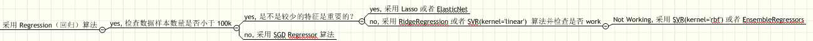
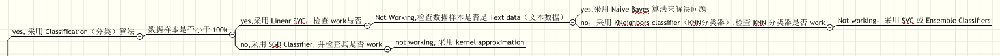
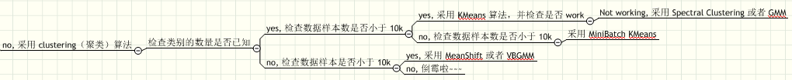
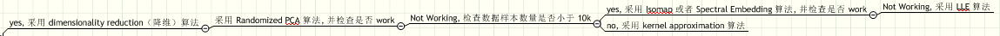

# Sklearn 快速入门教程

## Regression 回归

大致浏览一下回归: 

> 考虑下面 == 如果样本的数据量 >= 100k

### [SGD Refressor（随机梯度下降）](http://sklearn.apachecn.org/cn/0.19.0/modules/sgd.html)

> 考虑下面 == 如果样本的数据量 < 100k 并且 少数特征是重要

### [Lasso](http://sklearn.apachecn.org/cn/0.19.0/modules/linear_model.html) 或 [ElasticNet](http://sklearn.apachecn.org/cn/0.19.0/modules/linear_model.html#elastic-net)

[Lasso 和 ElasticNet 项目案例](http://sklearn.apachecn.org/cn/0.19.0/auto_examples/linear_model/plot_lasso_and_elasticnet.html#sphx-glr-auto-examples-linear-model-plot-lasso-and-elasticnet-py)

> 考虑下面 == 如果样本的数据量 < 100k 并且 少数特征是不重要

### [ridge-regression](http://sklearn.apachecn.org/cn/0.19.0/modules/linear_model.html#ridge-regression) 或 [SVR(kernel='linear')](http://sklearn.apachecn.org/cn/0.19.0/modules/svm.html#regression)

[ridge-regression 项目案例](http://sklearn.apachecn.org/cn/0.19.0/auto_examples/linear_model/plot_ridge_path.html#sphx-glr-auto-examples-linear-model-plot-ridge-path-py)

[SVR(kernel='linear') 项目案例](http://sklearn.apachecn.org/cn/0.19.0/auto_examples/svm/plot_svm_regression.html#sphx-glr-auto-examples-svm-plot-svm-regression-py)

> 考虑下面 == 如果无效

### [EnsembleRegressors](http://sklearn.apachecn.org/cn/0.19.0/modules/ensemble.html) 或 [SVR(kernel='rbf')](http://sklearn.apachecn.org/cn/0.19.0/modules/svm.html#regression)

[EnsembleRegressors-RandomForestRegressor 项目案例](http://scikit-learn.org/stable/auto_examples/plot_missing_values.html#sphx-glr-auto-examples-plot-missing-values-py)

[EnsembleRegressors-AdaBoostRegressor 项目案例](http://scikit-learn.org/stable/auto_examples/ensemble/plot_adaboost_regression.html#sphx-glr-auto-examples-ensemble-plot-adaboost-regression-py)

[SVR(kernel='rbf') 项目案例](http://sklearn.apachecn.org/cn/0.19.0/auto_examples/svm/plot_svm_regression.html#sphx-glr-auto-examples-svm-plot-svm-regression-py)

## Classification 分类

大致浏览一下分类: 

> 判断 数据样本条数是否小于 100k， yes 的话，采用 Linear SVC

* [SVM 中 Linear SVC 的项目案例](http://sklearn.apachecn.org/cn/0.19.0/auto_examples/svm/plot_iris.html)

> 如果上面的 Linear SVC 模型不 work

**那么继续判断 样本数据是否是文本数据**

* 如果 yes，采用朴素贝叶斯模型
[Naive Bayes 的项目案例](http://sklearn.apachecn.org/cn/0.19.0/auto_examples/classification/plot_classifier_comparison.html#sphx-glr-auto-examples-classification-plot-classifier-comparison-py)

* 如果 no，采用 k-近邻分类算法
[KNeighbors Classifier 的项目案例](http://sklearn.apachecn.org/cn/0.19.0/auto_examples/neighbors/plot_classification.html#sphx-glr-auto-examples-neighbors-plot-classification-py) 和 [Nearest Neighbors regression 项目案例](http://sklearn.apachecn.org/cn/0.19.0/auto_examples/neighbors/plot_regression.html#sphx-glr-auto-examples-neighbors-plot-regression-py)

> 如果 k-近邻算法不 work ,采用 SVC 或者 Ensemble Classifiers 算法

* [SVC 的项目案例](http://sklearn.apachecn.org/cn/0.19.0/auto_examples/svm/plot_separating_hyperplane_unbalanced.html)

* Ensemblle Classifiers 的项目案例分为了两部分来弄 [随机森林：面部补全](http://sklearn.apachecn.org/cn/0.19.0/auto_examples/plot_multioutput_face_completion.html#sphx-glr-auto-examples-plot-multioutput-face-completion-py) 和 [使用 AdaBoost 的决策树回归](http://sklearn.apachecn.org/cn/0.19.0/auto_examples/ensemble/plot_adaboost_regression.html#sphx-glr-auto-examples-ensemble-plot-adaboost-regression-py)

> 回到最初的问题上，数据样本条数是否小于 100k, no 的话，采用 SGD Classifier 算法（随机梯度下降）

* [SGD Classifier 的项目案例](http://sklearn.apachecn.org/cn/0.19.0/auto_examples/linear_model/plot_sgd_separating_hyperplane.html)

> 如果 SGD 不 work 的话，采用 kernel approximation 

* [kernel approximation 的项目案例](http://sklearn.apachecn.org/cn/0.19.0/auto_examples/plot_kernel_approximation.html)

## Clustering 聚类

大致浏览一下聚类：

## Dimensionality Reduction 降维

大致浏览一下降维：

### [Randomized PCA](http://sklearn.apachecn.org/cn/0.19.0/modules/decomposition.html#principal-component-analysis-pca)

[Randomized PCA 项目案例](http://sklearn.apachecn.org/cn/0.19.0/auto_examples/decomposition/plot_pca_vs_lda.html#sphx-glr-auto-examples-decomposition-plot-pca-vs-lda-py)

> 考虑下面 == 无效 并且 如果样本的数据量 < 10k

### [Isomap](http://sklearn.apachecn.org/cn/0.19.0/modules/manifold.html#isomap) 或 [Spectral Embedding](http://sklearn.apachecn.org/cn/0.19.0/modules/manifold.html#spectral-embedding)

> 考虑下面 == 无效 并且 如果样本的数据量 >= 10k

### [Kernel Approximation](http://sklearn.apachecn.org/cn/0.19.0/modules/kernel_approximation.html)

> 考虑下面 == 无效 并且 无效

### [LLE](http://sklearn.apachecn.org/cn/0.19.0/modules/manifold.html#locally-linear-embedding)

