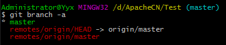

# 使用 Git 分支进行迭代翻译

## 缘由
我们在文档 [VSCode Windows 平台入门使用指南](help/vscode-windows-usage.md) ，介绍了 `VSCode` 与 `github` 一起搭配的简易使用的方法，不了解的可以点击查看。
但是在 scikit-learn 项目翻译的时候，我们考虑到了版本迭代的问题，需要用到 `Git` 以及 `Github` 的分支功能。所以我们这里，将 `Git` 的 branch（分支）使用介绍一下。

## 介绍

分支就是科幻电影里面的平行宇宙，当你正在电脑前努力学习 Git 的时候，另一个你正在另一个平行宇宙里努力学习 SVN。

如果两个平行宇宙互不干扰，那对现在的你也没啥影响。不过，在某个时间点，两个平行宇宙合并了，结果，你既学会了 Git 又学会了 SVN ！如下图所示:

上图中，学习Git中 和 学习SVN 中，就相当于两个分支。

## 分支在实际中有什么用呢？
假设你准备开发一个新功能，但是需要两周才能完成，第一周你写了50%的代码，如果立刻提交，由于代码还没写完，不完整的代码库会导致别人不能干活了。如果等代码全部写完再一次提交，又存在丢失每天进度的巨大风险。

现在有了分支，就不用怕了。你创建了一个属于你自己的分支，别人看不到，还继续在原来的分支上正常工作，而你在自己的分支上干活，想提交就提交，直到开发完毕后，再一次性合并到原来的分支上，这样，既安全，又不影响别人工作。

## 进行 Git 分支管理

1. 参考 [VSCode Windows 平台入门使用指南](help/vscode-windows-usage.md) 文档，将 `ApacheCN/scikit-learn-doc-zh` 库 `fork` 到自己的仓库，如下图:

fork 完成后，在自己的 profile 处可以查看到如下的样子:

2. 同样，参考 [VSCode Windows 平台入门使用指南](help/vscode-windows-usage.md) 文档，将 `XXXX(你的github名称)/scikit-learn-doc-zh` clone 到本地，进行开发。

3. 在 git 命令行中查看当前分支以及其对应远程的分支。对应的命令如下:  

使用 `git branch -a` 命令查看本地库中的所有分支，如下图所示:  

这个图就是表示，我在 `Test` 这个库中的 **所有分支**， 分支前有 `*` 标志的表示当前分支，也就是对应上图中的绿色分支。紧接着的，下方的 `remotes/origin/HEAD -> origin/master` ，其中的 `HEAD` 同样也是表示当前远程库指向的分支，与有 `*` 标识是一个意思，后边的箭头表示这个分支对应的当前的分支，也就是说，
