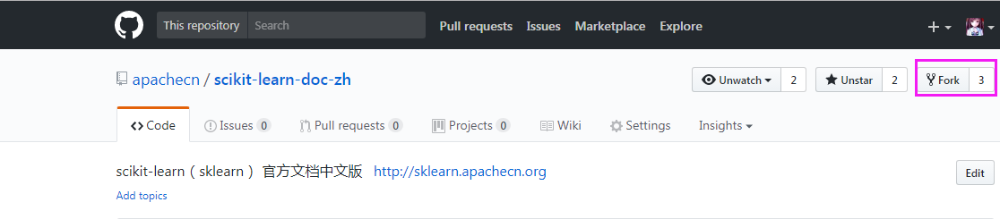
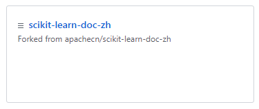
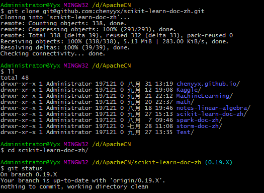
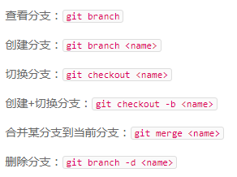
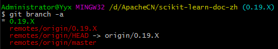
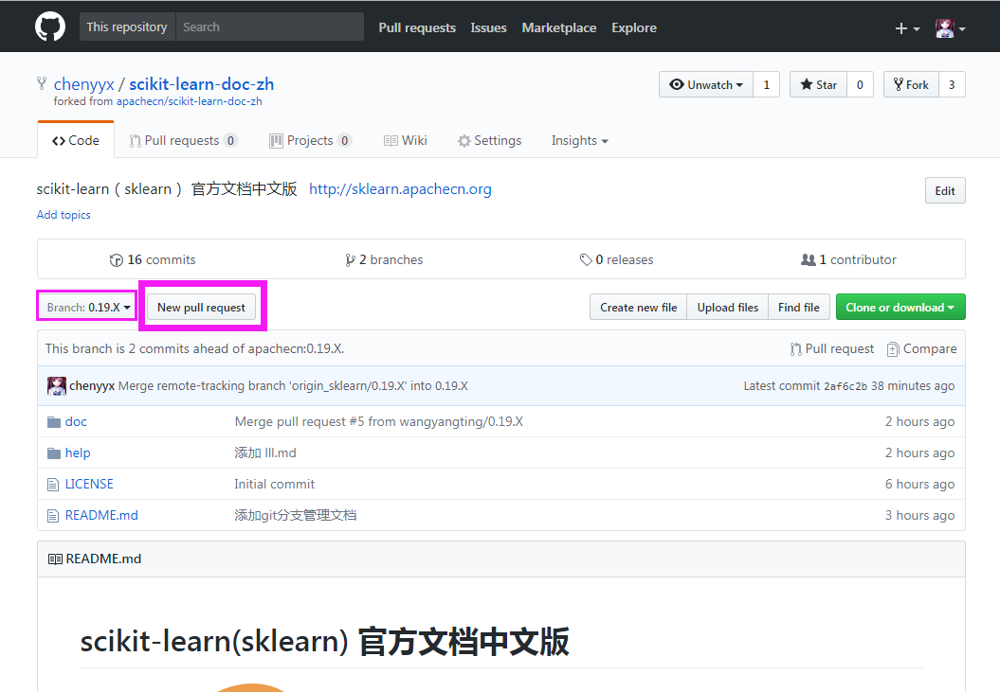

# 使用 Git 分支进行迭代翻译

## 缘由
我们在文档 [VSCode Windows 平台入门使用指南](help/vscode-windows-usage.md) ，介绍了 `VSCode` 与 `github` 一起搭配的简易使用的方法，不了解的可以点击查看。
但是在 scikit-learn 项目翻译的时候，我们考虑到了版本迭代的问题，需要用到 `Git` 以及 `Github` 的分支功能。所以我们这里，将 `Git` 的 branch（分支）使用介绍一下。

## 介绍

分支就是科幻电影里面的平行宇宙，当你正在电脑前努力学习 Git 的时候，另一个你正在另一个平行宇宙里努力学习 SVN。

如果两个平行宇宙互不干扰，那对现在的你也没啥影响。不过，在某个时间点，两个平行宇宙合并了，结果，你既学会了 Git 又学会了 SVN ！如下图所示:

上图中，学习Git中 和 学习SVN 中，就相当于两个分支。

## 分支在实际中有什么用呢？
假设你准备开发一个新功能，但是需要两周才能完成，第一周你写了50%的代码，如果立刻提交，由于代码还没写完，不完整的代码库会导致别人不能干活了。如果等代码全部写完再一次提交，又存在丢失每天进度的巨大风险。

现在有了分支，就不用怕了。你创建了一个属于你自己的分支，别人看不到，还继续在原来的分支上正常工作，而你在自己的分支上干活，想提交就提交，直到开发完毕后，再一次性合并到原来的分支上，这样，既安全，又不影响别人工作。

## 进行 Git 分支管理

1. 参考 [VSCode Windows 平台入门使用指南](help/vscode-windows-usage.md) 文档，将 `ApacheCN/scikit-learn-doc-zh` 库 `fork` 到自己的仓库，如下图:

fork 完成后，在自己的 profile 处可以查看到如下的样子:

2. 同样，参考 [VSCode Windows 平台入门使用指南](help/vscode-windows-usage.md) 文档，将 `XXXX(你的github名称)/scikit-learn-doc-zh` clone 到本地，进行开发。如下图所示，我自己的github 的名称叫 chenyyx ，所以是下面的样子:

3. 在 git 命令行中查看当前分支以及其对应远程的分支。对应的命令如下:  

使用 `git branch -a` 命令查看本地库中的所有分支，如下图所示:

这里可以看到，你 cd 进来的时候，这里就已经是 0.19.X 分支了，这是因为我们已经在 `ApacheCN/scikit-learn-doc-zh` 这个远程库设置了默认分支为 0.19.X ，所以就不用你自己再进行添加分支并映射本地分支与远程分支的关系了，我们都帮你处理好咯~~~

如果你 cd 进入这个文件夹的时候，显示的当前分支不是 0.19.X 而是 master 分支，你也不用担心，只需要切换分支就好，使用这个命令（前提是你的当前分支是master分支）: `git checkout 0.19.X` 就可以切换到 0.19.X 分支上了。

4. 在这个本地的 **0.19.X 分支上** 就可以进行你的翻译工作了，**切记，一定要在 0.19.X 分支上进行翻译，不要在 master 分支上翻译**。还有一点，你大可不必担心下面这个事情: 如果我在 0.19.X 分支上修改了文件，再 push 的时候，会不会上传到 master 分支上？ 答案是不会的！这里的映射关系都已经设置好了，也就是说，本地的 0.19.X 分支 push 的时候，是 push 到 `XXXX(你的github名称)/scikit-learn-doc-zh` （也就是你 fork 的库，你自己的库）的 0.19.X 分支上。而本地的 master 分支 push 的时候，是 push 到 `XXXX(你的github名称)/scikit-learn-doc-zh` （也就是你 fork 的库，你自己的库）的 master 分支上。这些都是一一对应好的。

5. 经过你勤奋的努力，翻译终于完成了，现在就需要提交一个 `pull request` 了。在你自己的 github 的 profile 中找到 `scikit-learn-doc-zh` 库，然后点击 `New pull request` 按钮。如下图（这时候要确定一下，提交 pull request 的分支是不是 0.19.X 分支）: 

然后，添加一些必要的翻译说明，比如说，“翻译完成了 tutorial.rst” ，然后提交就 OK 了。就等着负责人来合并即可，如果他没有及时合并，你还可以催他啊，是不是~~~

