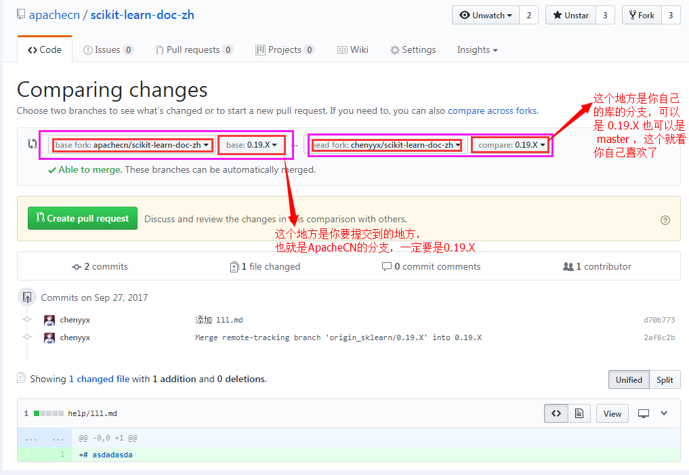

# 使用 Git 分支进行迭代翻译

## 介绍

分支就是科幻电影里面的平行宇宙，当你正在电脑前努力学习 Git 的时候，另一个你正在另一个平行宇宙里努力学习 SVN。

如果两个平行宇宙互不干扰，那对现在的你也没啥影响。不过，在某个时间点，两个平行宇宙合并了，结果，你既学会了 Git 又学会了 SVN ！如下图所示:


上图中，学习Git中 和 学习SVN 中，就相当于两个分支。

## 参考步骤

1. 参考 [VSCode Windows 平台入门使用指南](vscode-windows-usage.md) 文档，将 `ApacheCN/scikit-learn-doc-zh` 库 `fork` 到自己的仓库。

2. 将 fork 的库，使用 git clone 命令克隆到本地。

3. 使用 `git checkout 0.19.X` 命令将本地的当前分支切换到 **0.19.X 分支上**。

4. 在这个本地的 **0.19.X 分支上** 就可以进行你的翻译工作了，**切记，一定要在 0.19.X 分支上进行翻译，不要在 master 分支上翻译**。

5. 翻译完成，创建 `pull request` 了。在你自己的 github 的 profile 中找到 `scikit-learn-doc-zh` 库，然后点击 `New pull request` 按钮。如下图（这时候要确定一下，提交 pull request 的分支是不是 0.19.X 分支）: 

 

然后点击 `Create pull request` 即可。

## 具体步骤

1. fork `apachecn/scikit-learn-doc-zh` 该repo 到你的 repo 中去。
2. git clone 你自己的 repo ，注意我的 repo 是 chenyyx :  
```shell
git clone https://github.com/chenyyx/scikit-learn-doc-zh.git
```
3. 切换分支到 0.19.X 分支:
```shell
cd scikit-learn-doc-zh
git checkout 0.19.X
```
4. 翻译自己负责的文档章节
5. 推送到你自己的 repo 中：
```shell
git push
```
6. 在你的 github 的 repo 页面中，提一个 pull request ，可参考下图：  
 

7. 等待 ApacheCN 审核合并


## 等待 apachecn 审核

然后，添加一些必要的翻译说明，比如说，“翻译完成了 tutorial.rst” ，然后提交就 OK 了。就等着负责人来合并即可，如果他没有及时合并，你还可以催他啊，是不是~~~

最后, 等待 [ApacheCN](https://github.com/apachecn) 审核就好, 谢谢！~~~

欢迎一起补充完善该文档，谢谢！~~~~


