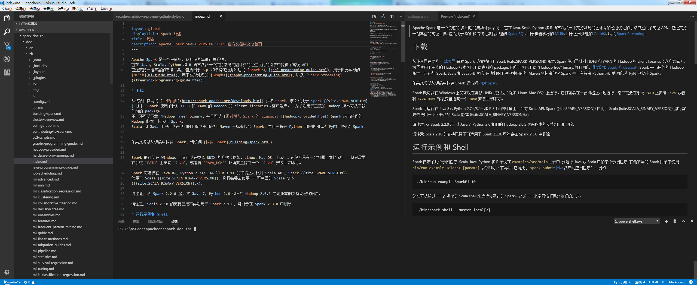
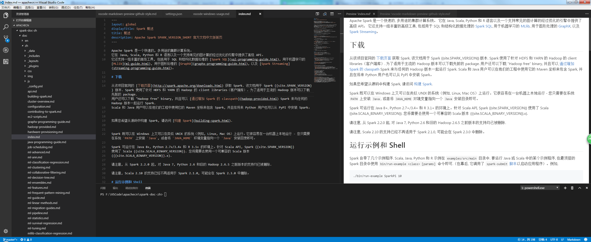
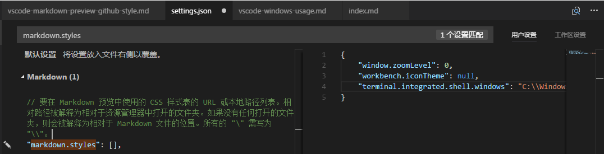
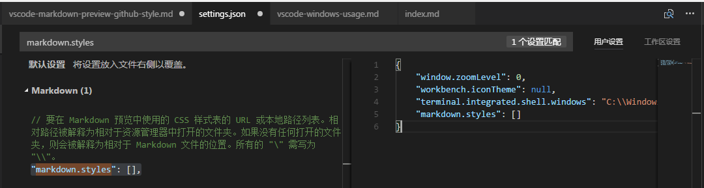

# VSCode（Visual Studio Code）修改 markdown 的预览风格为 github 的风格

## 介绍
预览 markdown 时, vscode 用的是默认的预览风格, 所以想切换为 github 的预览风格, 这样看着更舒服.

## Markdown 预览默认风格为黑色的
如下图所示: 

## Markdown 预览为 github 风格
如下图所示: 

## 修改配置 Markdown 预览为 github 风格
* 下载 css 文件: [https://github.com/raycon/vscode-markdown-css/blob/master/markdown-github.css](https://github.com/raycon/vscode-markdown-css/blob/master/markdown-github.css) 保存到本地.
* `文件` --> `首选项` --> `设置`
* 搜索设置: markdown.styles
* 找到 `"markdown.styles": [],` 这一行, 如下图所示: 
* 点击左边的 `编辑` --> `复制到设置`, 如下图所示: 
* 编辑设置, 请看下面的 [参考设置](#参考设置), 只要编辑 `markdown.styles` 就好.
* Ctrl + S 保存, 无需重启即可生效, 最终效果如上面的 `Markdown 预览为 github 风格` 所示:
* 预览效果, 不只是背景颜色变白了 ...

## 参考设置
    {
        "window.zoomLevel": 0,
        "workbench.iconTheme": null,
        "markdown.styles": [
            "file:///D:/Program Files (x86)/Microsoft VS Code/extend/markdown/markdown-github.css"
        ],
        "terminal.integrated.shell.windows": "C:\\Windows\\Sysnative\\WindowsPowerShell\\v1.0\\powershell.exe"
    }