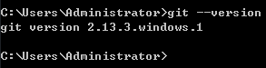
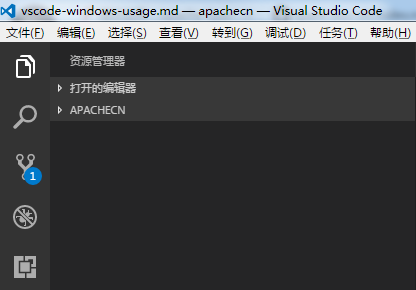
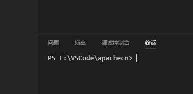
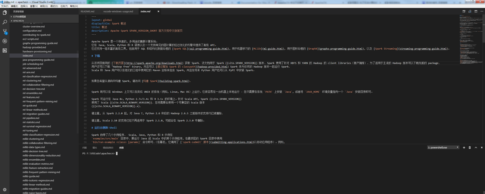
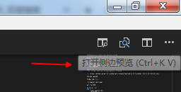
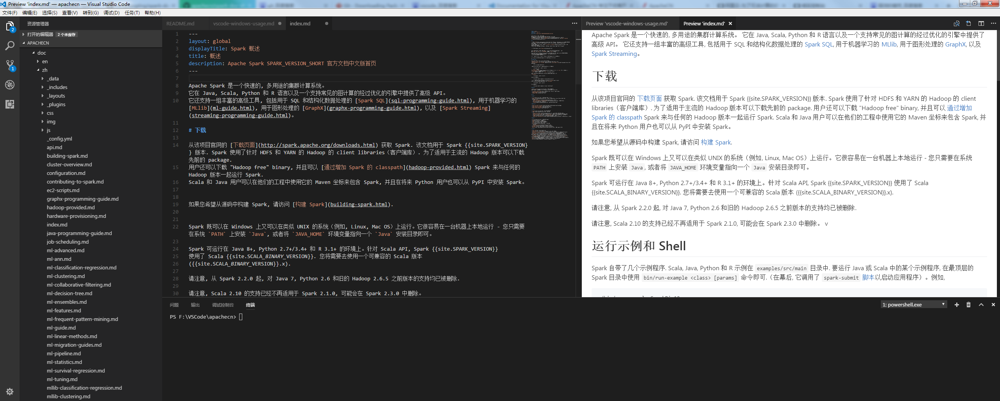
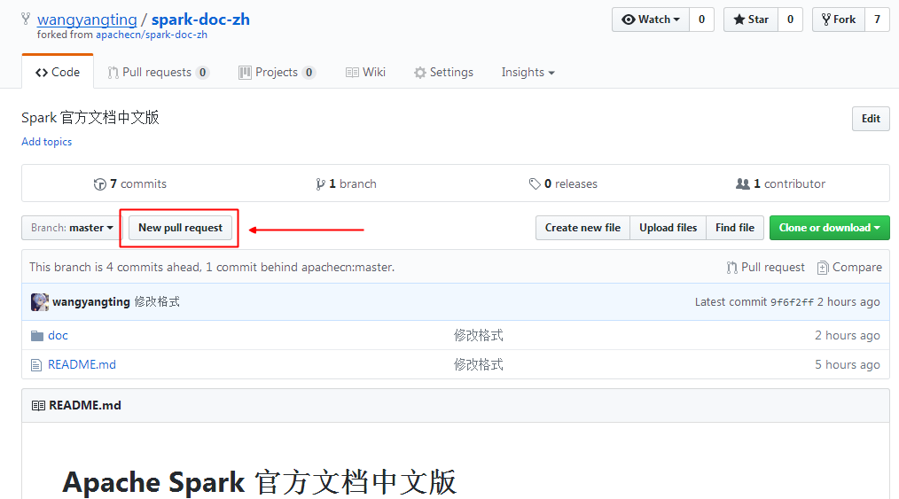
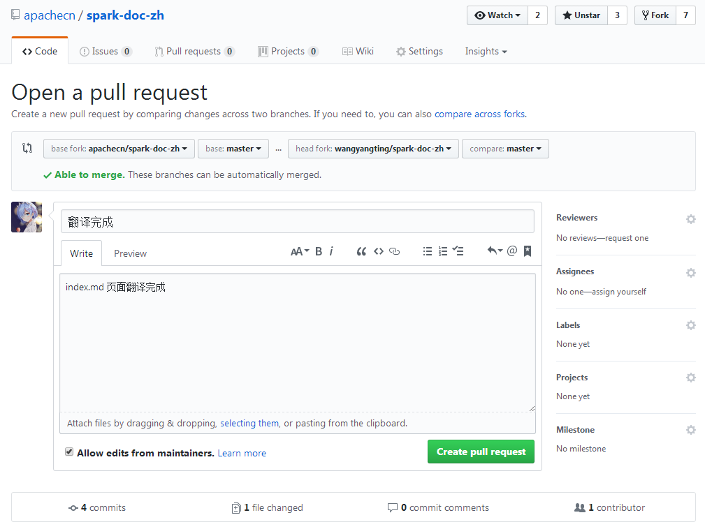

# VSCode（Visual Studio Code）Windows 平台入门使用指南

## VSCode 介绍
Visual Studio Code (简称 VS Code / VSC) 是一款免费开源的现代化轻量级代码编辑器，支持几乎所有主流的开发语言的语法高亮、智能代码补全、自定义热键、括号匹配、代码片段、代码对比 Diff、GIT 等特性，支持插件扩展，并针对网页开发和云端应用开发做了优化。软件跨平台支持 Win、Mac 以及 Linux，运行流畅，可谓是微软的良心之作……
    

## VSCode 优点
    * 轻量级

## 使用场景
    * markdown 实时预览修改
    * github 代码的拉取提交
    * 需要一点点 markdown，git，github 的知识，随意 google 下即可。

## VSCode 安装
下载地址: <https://code.visualstudio.com/Download>
傻瓜式操作, 一路下一步就好了。

## Git 安装
下载地址: <https://git-scm.com/download/win> 选择合适的版本。

例如, <https://github.com/git-for-windows/git/releases/download/v2.13.3.windows.1/Git-2.13.3-64-bit.exe>

傻瓜式操作, 一路下一步就好了。

然后开启一个 cmd 中断, 如图 : 

git 算是成功安装了。

## VSCode 入门指南
### 基础
    * 新建一个 apachecn 文件夹
    * 启动 VSCode
    * 文件 --> 打开文件夹 --> 选择 apachecn 文件夹 --> 选择文件夹
界面如下图所示:

### 终端操作
打开命令行终端: ctrl + ` 或者 查看(V) --> 集成终端(I), 如下图所示: 

初始化 git 配置
    
    git config --global user.name "username"    # 你的用户名
    git config --global user.email "email"    # 你的邮箱
    git config --global core.autocrlf  false    # linux 平台换行为 lf，window 平台换行为 crlf，禁止 window 平台自动转换换行为 crlf

初始化 git 仓库

    git init

克隆你的 github 仓库, 比如我这里是（首先 fork apachecn 的仓库）

    git clone https://github.com/wangyangting/spark-doc-zh.git
    cd spark-doc-zh

添加远程 apachecn 下的仓库, 为了同步 apachecn 上最新的文档

    git remote add origin_apachecn_spark-doc-zh https://github.com/apachecn/spark-doc-zh.git

### vscode 编辑器操作
双击编辑 xxx.md markdown 文件, 例如, index.md, 如下图:

默认情况下是没有打开预览的, 这时候我们只需要打开右侧的预览就好, 如下图:

最终效果如下图: 

那么, 现在就可以实时的预览修改了。
至此, markdown 是实时编辑预览已经搞定, 还差提交代码的部分就 OK 了。

## git pull push 
### 拉取最新代码
    cd spark-doc-zh
    git pull origin_apachecn_spark-doc-zh master

### 提交代码到自己的仓库, 假设我刚刚修改的是 index.md 文件
    git add index.md
    git commit -m "翻译完成"
    git push origin master    # 这里应该会提示要你自己 github 的账号密码

### 提交自己 github 账号仓库下的代码到 apachecn 仓库中去, 如下图: 

#### New pull request

#### Create pull request

  

然后点击 `Create pull request` 即可

#### 等待 apachecn 审核
最后, 等待 [ApacheCN](https://github.com/apachecn) 审核就好, 谢谢！~~~

欢迎一起补充完善该文档，谢谢！~~~~
